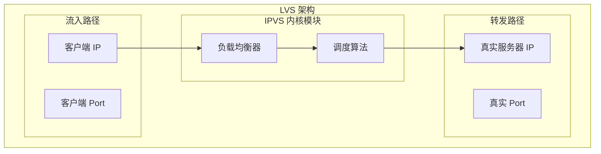
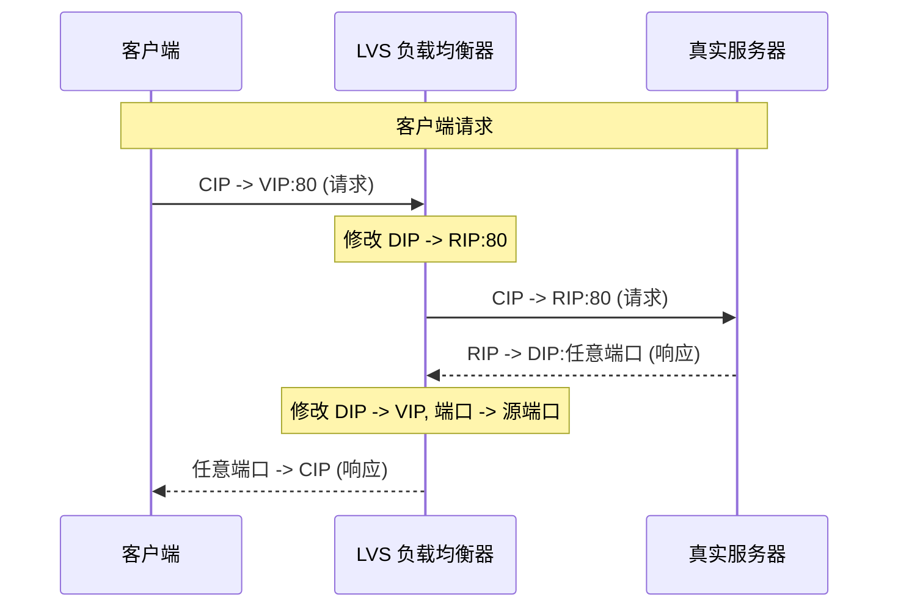
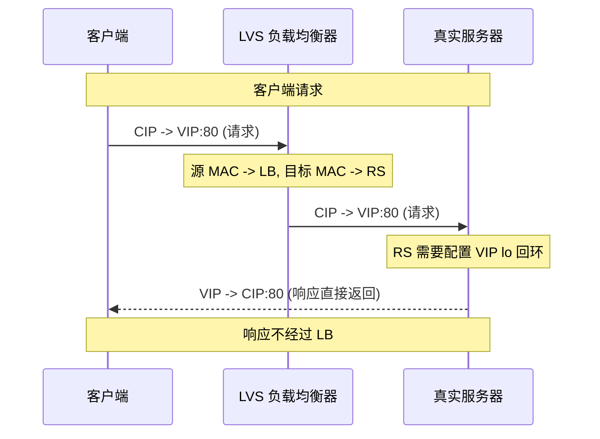
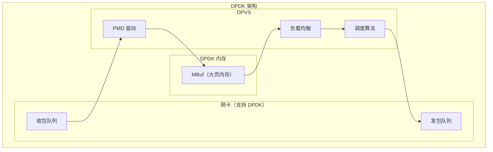

# 四层负载均衡（LVS/DPVS）

四层负载均衡工作在 TCP/UDP 层，仅解析 IP + 端口信息，然后根据负载均衡算法将请求转发到后端节点。相比七层负载均衡，四层负载均衡的性能极高，单实例可达百万级 CPS，是互联网入口流量的首选方案。

## LVS 概述

LVS（Linux Virtual Server）是 Linux 内核层面的负载均衡解决方案，由章文嵩博士于 1998 年开发，是国内互联网最广泛使用的四层负载均衡技术。



LVS 的核心是 **IPVS 内核模块**，它工作在内核空间，性能极高：
- **请求转发**：在内核层面完成，不经过用户态
- **连接管理**：维护 TCP 连接状态
- **算法调度**：执行负载均衡算法

## LVS 三种转发模式

LVS 支持三种转发模式，每种模式有不同的适用场景：

| 模式 | 全称 | 原理 | 适用场景 |
| --- | --- | --- | --- |
| NAT | Network Address Translation | 修改请求/响应 IP 地址 | 通用场景 |
| DR | Direct Routing | 修改 MAC 地址 | 性能要求高 |
| IP Tunnel | IP Tunneling | IP 隧道封装 | 跨网段部署 |

### NAT 模式

NAT 模式通过**修改 IP 地址**实现负载均衡：



**特点**：
- 负载均衡器需要处理进出两个方向
- 出口带宽可能成为瓶颈
- 配置简单，适合内网场景

```bash
# NAT 模式配置示例
ipvsadm -A -t 192.168.1.100:80 -s rr    # 添加虚拟服务（轮询）
ipvsadm -a -t 192.168.1.100:80 -r 10.0.1.1:80 -m   # 添加真实服务器（NAT 模式）
ipvsadm -a -t 192.168.1.100:80 -r 10.0.1.2:80 -m
```

### DR 模式（Direct Routing）

DR 模式通过**修改 MAC 地址**实现负载均衡，请求经过负载均衡器，响应直接由真实服务器返回：



**特点**：
- 响应不经过负载均衡器，性能极高
- 负载均衡器无出口带宽瓶颈
- 真实服务器需要配置 VIP（虚拟 IP）

```bash
# DR 模式配置示例
# LVS 服务器
ipvsadm -A -t 192.168.1.100:80 -s rr
ipvsadm -a -t 192.168.1.100:80 -r 10.0.1.1:80 -g   # -g 表示 DR 模式

# 真实服务器配置（需要绑定 VIP 到 lo）
ifconfig lo:0 192.168.1.100 netmask 255.255.255.255
```

### IP Tunnel 模式

IP Tunnel 模式通过 **IP 隧道封装**实现跨网段负载均衡：

```mermaid
flowchart LR
    subgraph Client["客户端网络"]
        C["客户端"]
    end

    subgraph LB["LVS 网络"]
        LB["LVS 负载均衡器"]
    end

    subgraph RS["真实服务器网络"]
        RS1["RS1"]
        RS2["RS2"]
    end

    C -->|"请求"| LB
    LB -->|"隧道封装"| RS1
    LB -->|"隧道封装"| RS2
    RS1 -->|"隧道解封"| C
    RS2 -->|"隧道解封"| C
```

**特点**：
- 适合跨网段部署（不同机房）
- 性能比 NAT 稍低，但高于 DR
- 需要隧道协议支持

## 三种模式对比

| 维度 | NAT | DR | IP Tunnel |
| --- | --- | --- | --- |
| IP 修改 | IP + Port | MAC | IP 隧道封装 |
| 响应路径 | 经过 LB | 直接返回客户端 | 直接返回客户端 |
| 性能 | 中 | 高 | 中高 |
| 网络要求 | 同网段 | 同网段 | 可跨网段 |
| 配置复杂度 | 低 | 中 | 高 |
| 适用场景 | 内网、测试环境 | 高性能 Web 服务 | 多机房部署 |

## LVS 调度算法

LVS 支持多种调度算法：

### 轮询（RR）

```bash
ipvsadm -A -t 192.168.1.100:80 -s rr   # 轮询
```

每个请求依次分发到不同的服务器，适合服务器性能一致的场景。

### 加权轮询（WRR）

```bash
ipvsadm -A -t 192.168.1.100:80 -s wrr
ipvsadm -a -t 192.168.1.100:80 -r 10.0.1.1:80 -w 3
ipvsadm -a -t 192.168.1.100:80 -r 10.0.1.2:80 -w 1
```

节点 1 每 3 次请求被选中一次，节点 2 每 1 次请求被选中一次。

### 最小连接数（LC）

```bash
ipvsadm -A -t 192.168.1.100:80 -s lc
```

选择当前连接数最少的服务器，适合长连接场景。

### 加权最小连接数（WLC）

```bash
ipvsadm -A -t 192.168.1.100:80 -s wlc
```

考虑服务器权重和当前连接数，公式：

```
选择 (活动连接数 * 256 + 非活动连接数) / 权重 最小的服务器
```

## DPVS：高性能负载均衡

DPVS（DPDK Virtual Package Switch）是基于 DPDK 实现的高性能负载均衡器，相比传统 LVS 有显著性能提升：

| 指标 | LVS | DPVS |
| --- | --- | --- |
| 转发模式 | 内核态 | 用户态 + DPDK |
| 包处理 | 内核网络栈 | DPDK 无锁环形队列 |
| CPS | 10~50 万 | 100~500 万 |
| 内存 | 内核内存 | 用户态大页内存 |
| CPU 利用率 | 较高 | 较低 |



DPVS 的核心优势：
- **DPDK**：绕过内核网络栈，直接操作网卡
- **大页内存**：减少 TLB miss，提高缓存命中率
- **无锁队列**：多核间通信无锁化

## 四层负载均衡的特点

### 优点

| 优点 | 说明 |
| --- | --- |
| 性能极高 | 单实例可达百万级 CPS |
| 延迟低 | 纯内核转发，无协议解析开销 |
| 稳定可靠 | 内核级实现，经过多年生产验证 |
| 抗 DDoS | 可以抵御 SYN Flood 等网络攻击 |

### 缺点

| 缺点 | 说明 |
| --- | --- |
| 功能单一 | 无法感知应用层信息 |
| 不支持路径路由 | 只能做端口级别转发 |
| 配置复杂 | NAT/DR/IP Tunnel 模式配置各异 |
| 健康检查简单 | 只支持 TCP 端口检测 |

## 生产环境配置示例

```bash
# 完整的 LVS DR 模式配置脚本
#!/bin/bash

# VIP（虚拟 IP）
VIP="192.168.1.100"
VIP_MASK="255.255.255.255"
VIP_IF="eth0"

# RS 列表
RS1="10.0.1.1"
RS2="10.0.1.2"
RS_PORT="80"
RS_WEIGHT1="3"
RS_WEIGHT2="1"

# 清理旧配置
ipvsadm -C

# 添加虚拟服务（加权轮询）
ipvsadm -A -t ${VIP}:${RS_PORT} -s wrr -p 60

# 添加真实服务器（DR 模式）
ipvsadm -a -t ${VIP}:${RS_PORT} -r ${RS1}:${RS_PORT} -g -w ${RS_WEIGHT1}
ipvsadm -a -t ${VIP}:${RS_PORT} -r ${RS2}:${RS_PORT} -g -w ${RS_WEIGHT2}

# 开启路由转发
echo 1 > /proc/sys/net/ipv4/ip_forward

# 配置 VIP
ifconfig ${VIP_IF}:0 ${VIP} netmask ${VIP_MASK} broadcast ${VIP} up
route add -host ${VIP} dev ${VIP_IF}:0

# 查看配置
ipvsadm -L -n
```

## 总结

四层负载均衡是互联网入口流量的核心组件，LVS 是最成熟的实现：

- **NAT 模式**：修改 IP 地址，配置简单，适合内网
- **DR 模式**：修改 MAC，响应直连，性能最高
- **IP Tunnel 模式**：IP 隧道封装，支持跨网段

LVS 的调度算法：
- **轮询/加权轮询**：静态分配，简单可靠
- **最小连接数/加权最小连接数**：动态感知负载

DPVS 是基于 DPDK 的高性能方案，适合超大流量场景。

下一节我们将介绍七层负载均衡——Nginx 和 HAProxy。
