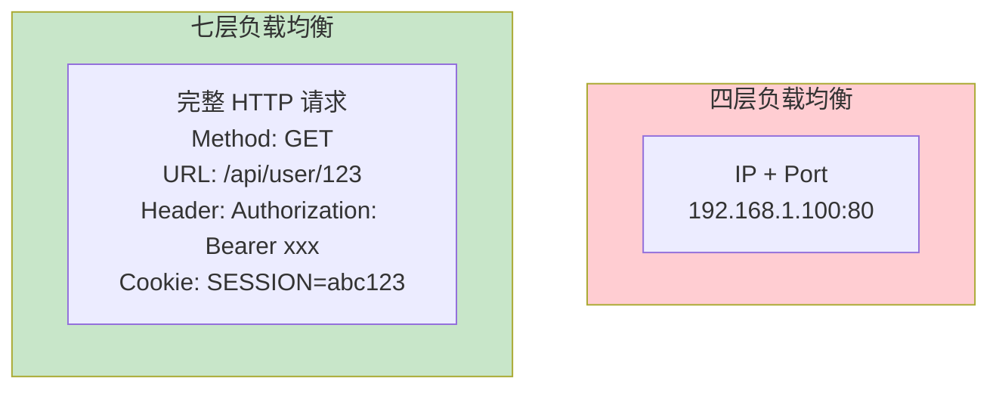
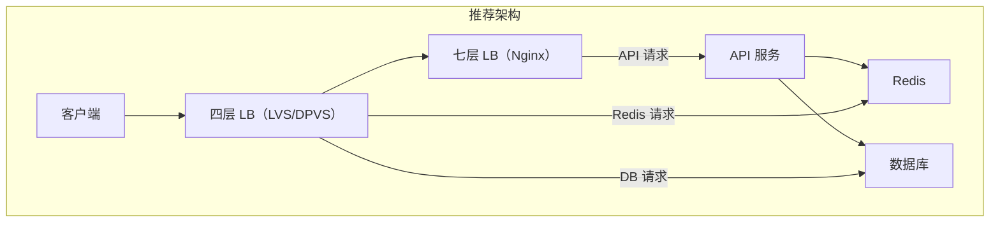

# 七层负载均衡（Nginx/HAProxy）

七层负载均衡工作在应用层（HTTP/HTTPS），能够解析完整的 HTTP 请求，并根据 URL、Header、Cookie 等信息做精细化路由。相比四层负载均衡，七层负载均衡的性能稍低，但功能更丰富，是微服务网关和 Web 服务的首选。

## 七层负载均衡的核心能力

四层负载均衡只能看到 IP + 端口，七层负载均衡能看到完整的 HTTP 请求：



七层负载均衡能做的事情：
- **路径路由**：根据 URL 路径分发到不同后端
- **Header 改写**：添加、删除、修改请求头
- **Cookie 处理**：会话保持、Cookie 注入
- **SSL 终结**：HTTPS 证书管理、加解密
- **限流熔断**：基于请求特征的限流
- **认证授权**：JWT 验证、IP 黑名单

## Nginx 负载均衡

Nginx 是最流行的七层负载均衡器，以高性能和高稳定性著称。

### upstream 配置

```nginx
upstream backend {
    # 轮询（默认）
    server 10.0.1.1:8080;
    server 10.0.1.2:8080;
    server 10.0.1.3:8080;

    # 加权轮询
    server 10.0.1.1:8080 weight=3;
    server 10.0.1.2:8080 weight=2;
    server 10.0.1.3:8080 weight=1;

    # 备份服务器
    server 10.0.1.4:8080 backup;

    # 不可用服务器
    server 10.0.1.5:8080 down;
}

server {
    listen 80;
    server_name example.com;

    location / {
        proxy_pass http://backend;
        proxy_set_header Host $host;
        proxy_set_header X-Real-IP $remote_addr;
        proxy_set_header X-Forwarded-For $proxy_add_x_forwarded_for;
    }
}
```

### 负载均衡算法

```nginx
upstream backend {
    # 轮询（默认）
    server 10.0.1.1:8080;
    server 10.0.1.2:8080;

    # IP Hash（会话保持）
    ip_hash;

    # 最少连接
    least_conn;
}
```

```nginx
upstream backend {
    # 一致性哈希（使用 URI 作为哈希 key）
    hash $request_uri consistent;

    server 10.0.1.1:8080;
    server 10.0.1.2:8080;
}
```

### 路径路由

```nginx
server {
    listen 80;
    server_name api.example.com;

    # API 服务
    location /api/user/ {
        proxy_pass http://user-service;
        proxy_set_header Host $host;
    }

    location /api/product/ {
        proxy_pass http://product-service;
        proxy_set_header Host $host;
    }

    # 静态资源
    location /static/ {
        proxy_pass http://static-service;
        expires 30d;
        add_header Cache-Control "public";
    }

    # 默认降级
    location / {
        proxy_pass http://default-service;
    }
}
```

### 健康检查

```nginx
upstream backend {
    server 10.0.1.1:8080 max_fails=3 fail_timeout=30s;
    server 10.0.1.2:8080 max_fails=3 fail_timeout=30s;

    # 被动健康检查：连续失败 3 次，30 秒内不参与调度
}
```

Nginx 不支持主动健康检查（商业版除外），生产环境通常配合 Consul/Nginx Plus 实现主动探活。

## HAProxy 负载均衡

HAProxy 是另一个高性能的七层负载均衡器，以功能丰富著称：

### 基础配置

```shell
global
    log stdout local0
    maxconn 4096
    user haproxy
    group haproxy

defaults
    log global
    mode http
    option httplog
    option dontlognull
    timeout connect 5000ms
    timeout client 50000ms
    timeout server 50000ms

frontend http_front
    bind *:80
    mode http

    # ACL 定义
    acl is_api path_beg /api/
    acl is_static path_beg /static/ /css/ /js/

    # 路由规则
    use_backend api_backend if is_api
    use_backend static_backend if is_static
    default_backend default_backend

backend api_backend
    mode http
    balance roundrobin
    option httpchk GET /health
    server api1 10.0.1.1:8080 check inter 2000 rise 2 fall 3
    server api2 10.0.1.2:8080 check inter 2000 rise 2 fall 3

backend static_backend
    mode http
    balance roundrobin
    server static1 10.0.1.3:8080
    server static2 10.0.1.4:8080

backend default_backend
    mode http
    balance roundrobin
    server default1 10.0.1.5:8080
```

### ACL 配置

HAProxy 的 ACL 功能非常强大：

```shell
# 基于路径
acl url_admin path_beg /admin/
acl url_api path_reg ^/api/v[0-9]+/

# 基于 Header
acl is_mobile req.hdr(User-Agent) -i mobile
acl has_token req.hdr(Authorization) -m found

# 基于 Cookie
acl has_session cook(SESSIONID) -m found

# 基于 IP
acl allow_ip src 10.0.0.0/8
acl deny_ip src 192.168.1.0/24

# 使用 ACL
http-request deny if deny_ip
http-request set-header X-User-ID %[cook(session_id)] if has_session
```

### 会话保持

```shell
backend api_backend
    mode http
    balance roundrobin

    # 基于 Cookie 的会话保持
    cookie SERVERID insert indirect nocache

    # 或基于 IP Hash
    # balance source

    server api1 10.0.1.1:8080 check cookie s1
    server api2 10.0.1.2:8080 check cookie s2
```

## Nginx vs HAProxy

| 维度 | Nginx | HAProxy |
| --- | --- | --- |
| 性能 | 高（单实例 10 万 CPS） | 极高（单实例 20 万 CPS） |
| 功能 | 丰富（Web 服务器、缓存、限流） | 专注（负载均衡、ACL） |
| 配置 | 简洁 | 复杂但灵活 |
| 健康检查 | 被动（商业版支持主动） | 支持主动健康检查 |
| 协议支持 | HTTP/S、WebSocket | HTTP/S、TCP、UDP |
| 热加载 | 支持 | 支持 |
| 社区 | 活跃（开源版 + 商业版） | 活跃 |

**选择建议**：
- 需要 Web 服务器功能（静态资源、缓存）选 Nginx
- 追求极致负载均衡性能选 HAProxy
- 需要复杂 ACL 选 HAProxy

## 七层 vs 四层：性能与功能权衡

| 维度 | 四层负载均衡 | 七层负载均衡 |
| --- | --- | --- |
| 性能 | 极高（百万级 CPS） | 较高（十万级 CPS） |
| 功能 | 基础分发 | 路径路由、Header 改写、SSL 终结 |
| 延迟 | 极低 | 低 |
| CPU 开销 | 低 | 中等 |
| 内存占用 | 低 | 较高 |
| 适用场景 | 数据库、Redis、极致性能 | Web API、微服务网关 |



**最佳实践**：四层做入口流量分发，七层做细粒度路由。四层负责高性能转发，七层负责业务路由。

## 总结

七层负载均衡（Nginx/HAProxy）工作在 HTTP 层，提供丰富的路由和流量控制能力：

**Nginx**：
- Web 服务器 + 负载均衡一体化
- 配置简洁，社区活跃
- 支持路径路由、Header 改写、缓存

**HAProxy**：
- 专注负载均衡，性能极高
- ACL 功能强大
- 支持主动健康检查

七层负载均衡的选择取决于业务需求：
- 需要静态资源服务选 Nginx
- 追求极致性能选 HAProxy
- 需要复杂路由选 HAProxy

下一节我们将讲解具体的负载均衡算法——轮询与加权轮询。
