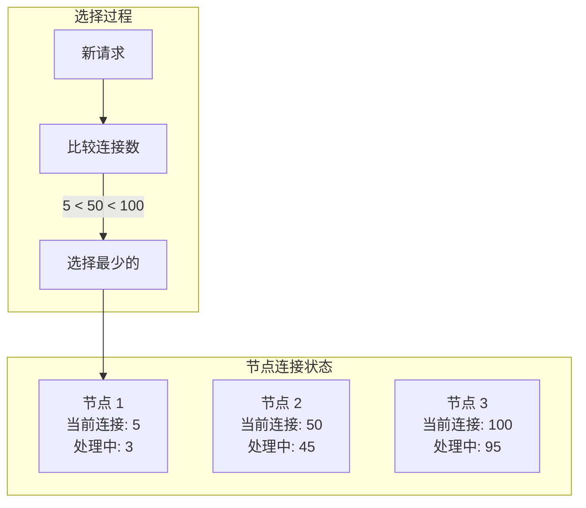

# 最小连接数与加权最小连接数

轮询算法是静态的，不考虑节点的实际负载状态。但在实际场景中，每个请求的处理时长不同，长连接和短连接的处理能力也不同。最小连接数算法（Least Connections）通过感知节点的实时连接数，动态选择负载最轻的节点。

## 为什么需要动态算法

静态算法的局限：

```
场景：3 台节点，处理能力相同

请求分布：
- 节点 1：处理简单查询，平均 10ms
- 节点 2：处理复杂查询，平均 500ms
- 节点 3：处理文件上传，平均 5000ms

轮询结果：
- 节点 1：负载 10%，处理迅速
- 节点 2：负载 5000%，积压严重
- 节点 3：负载 50000%，几乎不可用
```

最小连接数算法解决了这个问题：选择**当前连接数最少**的节点。

## 最小连接数算法原理



## 算法实现

### 基础实现

```java
public class LeastConnectionsLoadBalancer {

    private final List<Server> servers;
    private final AtomicInteger nextIndex = new AtomicInteger(0);

    @Data
    @AllArgsConstructor
    private static class Server {
        String host;
        AtomicInteger activeConnections;
    }

    public LeastConnectionsLoadBalancer(List<String> hosts) {
        this.servers = hosts.stream()
            .map(host -> new Server(host, new AtomicInteger(0)))
            .collect(Collectors.toList());
    }

    public String select() {
        if (servers.isEmpty()) {
            throw new IllegalStateException("No servers available");
        }

        Server selected = null;
        int minConnections = Integer.MAX_VALUE;

        // 选择连接数最少的节点
        for (Server server : servers) {
            int connections = server.getActiveConnections().get();
            if (connections < minConnections) {
                minConnections = connections;
                selected = server;
            }
        }

        // 增加连接数
        assert selected != null;
        selected.getActiveConnections().incrementAndGet();

        return selected.getHost();
    }

    // 请求完成后调用，释放连接
    public void release(String host) {
        servers.stream()
            .filter(s -> s.getHost().equals(host))
            .findFirst()
            .ifPresent(s -> s.getActiveConnections().decrementAndGet());
    }
}
```

### 带权重实现

```java
public class WeightedLeastConnectionsLoadBalancer {

    private final List<WeightedServer> servers;

    @Data
    @AllArgsConstructor
    private static class WeightedServer {
        String host;
        int weight;
        AtomicInteger activeConnections;

        // 计算负载值：连接数 / 权重
        double getLoadValue() {
            return (double) activeConnections.get() / weight;
        }
    }

    public WeightedLeastConnectionsLoadBalancer(List<WeightedServer> servers) {
        this.servers = new ArrayList<>(servers);
    }

    public String select() {
        if (servers.isEmpty()) {
            throw new IllegalStateException("No servers available");
        }

        WeightedServer selected = null;
        double minLoad = Double.MAX_VALUE;

        for (WeightedServer server : servers) {
            double load = server.getLoadValue();
            if (load < minLoad) {
                minLoad = load;
                selected = server;
            }
        }

        assert selected != null;
        selected.getActiveConnections().incrementAndGet();

        return selected.getHost();
    }
}
```

## 算法公式

最小连接数算法的核心是**选择负载最轻的节点**：

### 简单最小连接数

```
选择：activeConnections 最小的节点
```

### 加权最小连接数（WLC）

```
选择：(activeConnections + 1) / weight 最小的节点

或者：

负载值 = activeConnections / weight
选择：负载值最小的节点
```

### 实际示例

```
节点配置：
- 节点 1：weight=3, active=6
- 节点 2：weight=1, active=3
- 节点 3：weight=2, active=4

负载值计算：
- 节点 1：6 / 3 = 2.0
- 节点 2：3 / 1 = 3.0
- 节点 3：4 / 2 = 2.0

选择：负载值最小的节点 → 节点 1 或 节点 3（二选一）
```

## 配置示例

### HAProxy 配置

```shell
backend api_backend
    mode http
    balance leastconn

    # 加权最小连接数
    # server api1 10.0.1.1:8080 weight 3 check
    # server api2 10.0.1.2:8080 weight 1 check

    server api1 10.0.1.1:8080 check inter 2000 rise 2 fall 3
    server api2 10.0.1.2:8080 check inter 2000 rise 2 fall 3
```

### Nginx Plus 配置（商业版）

```nginx
upstream backend {
    least_conn;

    server 10.0.1.1:8080 weight=3;
    server 10.0.1.2:8080 weight=1;
}
```

## 适用场景

### 适合最小连接数的场景

| 场景 | 原因 |
| --- | --- |
| 长连接（WebSocket） | 连接建立成本高，需要保持连接 |
| 请求处理时间差异大 | 不同请求耗时不同 |
| 异构集群 | 节点性能不同 |
| 批处理任务 | 任务执行时间不固定 |

### 不适合最小连接数的场景

| 场景 | 原因 |
| --- | --- |
| 短连接 + 请求耗时相同 | 轮询效果一样 |
| 高并发短请求 | 连接数变化快，采样不准 |
| 请求需要会话保持 | 需要同一请求打到同一节点 |

## 算法对比

| 算法 | 特点 | 适用场景 |
| --- | --- | --- |
| 轮询（RR） | 静态，不感知负载 | 节点性能一致，请求耗时相同 |
| 加权轮询（WRR） | 静态，按权重分配 | 异构集群 |
| 最小连接数（LC） | 动态，感知连接数 | 长连接，请求耗时差异大 |
| 加权最小连接数（WLC） | 动态，结合权重 | 异构集群 + 长连接 |

## 常见问题

### 问题一：连接数采集延迟

```
问题：连接数是实时变化的，选择时刻的连接数可能已过时

场景：
- 时刻 T1：选择节点 1，连接数=5
- 时刻 T2：节点 1 实际连接数=50（已有 45 个请求完成）

结果：实际负载分配不均
```

**解决**：多次采样取平均，或使用加权更重视历史数据。

### 问题二：连接数突然变化

```
问题：批量请求同时到达，连接数瞬间变化

场景：
- 请求 1~100 同时到达
- 选择时刻：节点 1 连接数=0，被选中 50 次
- 实际：节点 1 瞬间承担 50 个请求
```

**解决**：使用令牌桶限流，避免突发流量。

### 问题三：权重设置不当

```
问题：权重与实际性能不匹配

场景：
- 节点 1：weight=3, 实际性能=1x
- 节点 2：weight=1, 实际性能=3x

结果：高权重节点实际负载更重
```

**解决**：根据实际压测结果调整权重。

## 生产环境最佳实践

### 配合健康检查

```shell
backend api_backend
    mode http
    balance leastconn

    # 健康检查 + 权重
    server api1 10.0.1.1:8080 weight 3 check inter 2000 rise 2 fall 3
    server api2 10.0.1.2:8080 weight 2 check inter 2000 rise 2 fall 3
    server api3 10.0.1.3:8080 weight 1 check inter 2000 rise 2 fall 3
```

### 监控连接数

```bash
# 查看 HAProxy 后端连接数
show stat
```

```bash
# 查看 Nginx Plus upstream 状态（需要 stub_status）
curl http://localhost:8080/status
```

## 总结

最小连接数算法是动态负载均衡的代表，它解决了静态算法无法感知节点负载的问题：

- **最小连接数（LC）**：选择当前连接数最少的节点，适合长连接场景
- **加权最小连接数（WLC）**：结合权重，选择 (连接数/权重) 最小的节点

最小连接数算法的适用场景：
- 长连接（WebSocket、gRPC）
- 请求处理时间差异大
- 异构集群

选择算法时，需要综合考虑：
- 节点性能是否一致
- 请求处理时间是否相同
- 是否需要会话保持

下一节我们将讲解哈希算法——IP Hash 和一致性哈希。
