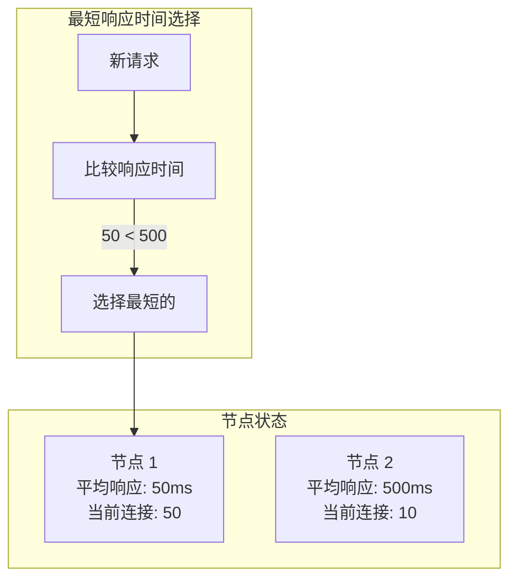

# 最短响应时间算法

最短响应时间算法（Least Response Time）是最「智能」的动态负载均衡算法，它选择**响应时间最短**的节点，让用户获得最快的体验。本节讲解这一算法的原理、实现和挑战。

## 为什么需要最短响应时间算法

轮询和最小连接数算法都有局限：

| 算法 | 选优依据 | 局限 |
| --- | --- | --- |
| 轮询 | 无依据 | 不考虑节点性能和处理速度 |
| 最小连接数 | 连接数 | 不考虑单个请求的处理时长 |

**问题场景**：

```
节点配置相同，但实际处理能力不同：

节点 1：8 核 CPU，处理请求快，当前连接 50
节点 2：2 核 CPU，处理请求慢，当前连接 10

最小连接数算法：选择节点 2（10 < 50）
结果：慢节点被选中，用户体验更差
```

最短响应时间算法解决了这个问题：选择**实际响应最快**的节点。

## 算法原理



### 算法公式

```
选择：avgRT = Σ(response_time) / count 最小的节点

或者考虑连接数：

选择：(avgRT + Σ(wait_time)) / weight 最小的节点

其中 wait_time = avgRT × active_connections
```

## 实现方式

### 基本实现

```java
public class LeastResponseTimeLoadBalancer {

    private final List<Server> servers;
    private final ScheduledExecutorService scheduler = Executors.newSingleThreadScheduledExecutor();

    @Data
    @AllArgsConstructor
    private static class Server {
        String host;
        AtomicLong totalResponseTime = new AtomicLong(0);  // 总响应时间（纳秒）
        AtomicLong requestCount = new AtomicLong(0);     // 请求计数
        AtomicLong activeConnections = new AtomicLong(0); // 当前连接数
        double weight = 1.0;

        double getAverageResponseTime() {
            long count = requestCount.get();
            if (count == 0) return 0;
            return totalResponseTime.get() / (double) count;
        }

        double getLoadScore() {
            // 综合考虑响应时间和连接数
            double avgRT = getAverageResponseTime();
            double waitTime = avgRT * activeConnections.get() / 1000_000; // 转换为毫秒
            return (avgRT + waitTime) / weight;
        }
    }

    public LeastResponseTimeLoadBalancer(List<String> hosts) {
        this.servers = hosts.stream()
            .map(h -> new Server(h))
            .collect(Collectors.toList());

        // 定期衰减历史数据
        scheduler.scheduleAtFixedRate(this::decayStats, 1, 1, TimeUnit.MINUTES);
    }

    public String select() {
        if (servers.isEmpty()) {
            throw new IllegalStateException("No servers available");
        }

        Server selected = null;
        double minScore = Double.MAX_VALUE;

        for (Server server : servers) {
            double score = server.getLoadScore();
            if (score < minScore) {
                minScore = score;
                selected = server;
            }
        }

        assert selected != null;
        selected.getActiveConnections().incrementAndGet();

        return selected.getHost();
    }

    public void recordResponse(String host, long responseTimeNanos) {
        servers.stream()
            .filter(s -> s.getHost().equals(host))
            .findFirst()
            .ifPresent(s -> {
                s.getTotalResponseTime().addAndGet(responseTimeNanos);
                s.getRequestCount().incrementAndGet();
                s.getActiveConnections().decrementAndGet();
            });
    }

    private void decayStats() {
        // 衰减历史数据，避免旧数据影响
        for (Server server : servers) {
            server.getTotalResponseTime().updateAndGet(v -> (long) (v * 0.9));
            server.getRequestCount().updateAndGet(v -> (long) (v * 0.9));
        }
    }
}
```

### 带权重的实现

```java
public class WeightedLeastResponseTimeLoadBalancer {

    private final List<WeightedServer> servers;

    @Data
    @AllArgsConstructor
    private static class WeightedServer {
        String host;
        int weight;
        AtomicLong totalResponseTime = new AtomicLong(0);
        AtomicLong requestCount = new AtomicLong(0);

        double getWeightedResponseTime() {
            long count = requestCount.get();
            if (count == 0) return 0;
            // 加权平均响应时间
            return (totalResponseTime.get() / (double) count) / weight;
        }
    }

    public WeightedLeastResponseTimeLoadBalancer(List<WeightedServer> servers) {
        this.servers = new ArrayList<>(servers);
    }

    public String select() {
        WeightedServer selected = null;
        double minScore = Double.MAX_VALUE;

        for (WeightedServer server : servers) {
            double score = server.getWeightedResponseTime();
            if (score < minScore) {
                minScore = score;
                selected = server;
            }
        }

        return selected != null ? selected.getHost() : null;
    }
}
```

## 数据采集机制

最短响应时间算法的关键是如何采集和计算响应时间：

### 方式一：滑动窗口

```java
public class SlidingWindowResponseTimeCollector {

    // 使用滑动窗口记录响应时间
    private final Map<String, LinkedBlockingQueue<Long>> windows = new ConcurrentHashMap<>();
    private final int windowSize = 60;  // 60 秒窗口

    public void record(String host, long responseTimeMs) {
        windows.computeIfAbsent(host, k -> new LinkedBlockingQueue<>(windowSize))
            .offer(responseTimeMs);
    }

    public double getAverageResponseTime(String host) {
        LinkedBlockingQueue<Long> window = windows.get(host);
        if (window == null || window.isEmpty()) {
            return 0;
        }

        long sum = 0;
        for (Long rt : window) {
            sum += rt;
        }
        return (double) sum / window.size();
    }
}
```

### 方式二：指数加权移动平均

```java
public class EWMAResponseTimeCollector {

    private final Map<String, Double> ewma = new ConcurrentHashMap<>();
    private final double alpha = 0.3;  // 平滑系数，越大越重视最近数据

    public void record(String host, long responseTimeMs) {
        ewma.compute(host, (k, v) -> {
            if (v == null) return (double) responseTimeMs;
            return alpha * responseTimeMs + (1 - alpha) * v;
        });
    }

    public double getEWMA(String host) {
        return ewma.getOrDefault(host, 0.0);
    }
}
```

## 适用场景

### 适合的场景

| 场景 | 说明 |
| --- | --- |
| 对延迟敏感 | 用户体验直接依赖响应时间 |
| 请求处理时间差异大 | 混合了快慢请求 |
| 异构集群 | 节点性能差异明显 |
| 微服务架构 | 服务间调用的负载均衡 |

### 不适合的场景

| 场景 | 说明 |
| --- | --- |
| 响应时间不稳定 | 网络抖动导致采样不准 |
| 请求量大 | 计算开销可能抵消收益 |
| 短连接 | 响应时间采样不足 |

## 算法对比

| 算法 | 选择依据 | 复杂度 | 准确性 | 适用场景 |
| --- | --- | --- | --- | --- |
| 轮询 | 无 | 低 | 低 | 节点性能一致 |
| 最小连接数 | 连接数 | 中 | 中 | 长连接 |
| 最短响应时间 | 响应时间 | 高 | 高 | 对延迟敏感 |
| 一致性哈希 | 哈希值 | 中 | 高 | 会话保持 |

## 常见问题

### 问题一：响应时间采样不足

```
问题：新节点或低流量节点响应时间采样不足

场景：
- 新节点刚上线，请求少
- 响应时间计算基于少量样本，不准确

结果：新节点可能被过度选中
```

**解决**：
1. 初始化时设置基准响应时间
2. 设置最小采样数要求
3. 使用指数加权移动平均

### 问题二：响应时间波动

```
问题：网络抖动、GC 暂停导致响应时间波动

场景：
- 单次请求响应时间从 10ms 飙升到 1000ms
- 影响了平均响应时间计算

结果：节点被错误地标记为「慢」
```

**解决**：
1. 使用中位数或百分位数代替平均值
2. 设置异常值过滤
3. 使用超时机制剔除慢节点

### 问题三：计算开销

```
问题：实时计算需要维护大量状态

场景：
- 1000 个节点
- 每个节点每秒 10000 请求
- 需要维护大量统计数据

结果：计算开销可能抵消负载均衡的收益
```

**解决**：
1. 减少采样频率
2. 使用近似算法
3. 分层计算

## 生产环境配置

### HAProxy 最短响应时间配置

```haproxy
backend api_backend
    mode http
    balance leasttime Content-Length  # 基于响应时间

    # 配置超时和重试
    timeout server 30s
    http-check expect status 200

    server api1 10.0.1.1:8080 check inter 1000 fall 2 rise 1
    server api2 10.0.1.2:8080 check inter 1000 fall 2 rise 1
```

### 自适应负载均衡

```java
public class AdaptiveLoadBalancer {

    // 根据负载自动切换算法
    public String select(LoadMetrics metrics) {
        if (metrics.getAverageLoad() < 0.5) {
            // 低负载：使用轮询
            return roundRobinSelect();
        } else if (metrics.getAverageLoad() < 0.8) {
            // 中负载：使用最小连接数
            return leastConnectionsSelect();
        } else {
            // 高负载：使用最短响应时间
            return leastResponseTimeSelect();
        }
    }
}
```

## 总结

最短响应时间算法是最「智能」的负载均衡算法：

- **原理**：选择平均响应时间最短的节点
- **优势**：考虑实际处理能力，用户体验好
- **挑战**：采样不足、波动、计算开销

适用场景：
- 对延迟敏感的业务（搜索、推荐）
- 异构集群（节点性能差异大）
- 请求处理时间差异大的场景

算法选择建议：
- 追求简单 → 轮询
- 长连接场景 → 最小连接数
- 对延迟敏感 → 最短响应时间

下一节我们将讲解地理位置负载均衡（GSLB）。
