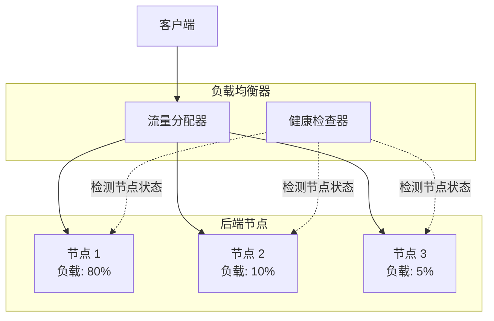
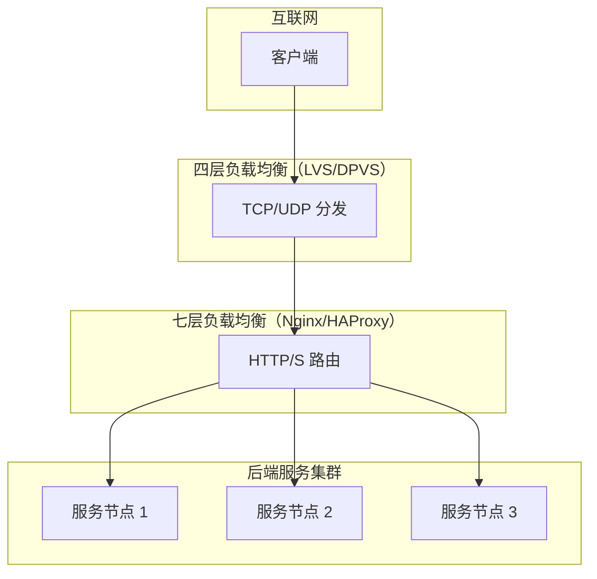

# 负载均衡概述

凌晨 2 点，电商大促刚刚结束，运维群里突然炸了：某台后端服务器 CPU 被打满到 100%，接口响应时间从正常的 50ms 飙升到 5 秒，而其他两台服务器却悠闲地 idle 着。你紧急登录负载均衡器查看，发现问题根源是一个「看起来很合理」的配置——加权轮询权重设置为 `4:2:1`，但实际处理能力比例却是 `1:1:1`。更糟糕的是，由于会话保持策略，这台被"照顾"的机器上还堆满了长连接，GC 压力剧增，雪球越滚越大。

这个场景折射出负载均衡领域最典型的两类问题：**流量分配策略选择不当**与**会话保持机制的双刃剑效应**。很多人以为负载均衡只是一个「把请求分到多台机器」的工具，但实际上，从算法选型、协议选择、健康检查到会话管理，每个环节都有深坑。

本节从负载均衡的基础概念出发，帮助你建立完整的知识体系。

## 什么是负载均衡

负载均衡的核心目标很简单：**将进入系统的请求合理分配到多个后端节点**，使每台节点的负载保持在合理范围内，同时最大化系统整体吞吐能力。

但「合理分配」这四个字背后，涉及到流量分配算法、健康检查机制、会话管理策略等一系列复杂设计。一个配置失误，可能导致集群整体能力打个对折；一个策略不当，可能引发雪崩式的连锁故障。



## 负载均衡的三层模型

负载均衡按工作层级可分为三层：

| 层级 | 位置 | 职责 | 典型技术 |
| --- | --- | --- | --- |
| 网络层 | 传输层 | 基于 IP/端口的流量分发 | LVS、DPVS、F5 |
| 应用层 | HTTP/S 协议层 | 基于 URL/Header 的智能路由 | Nginx、HAProxy、Envoy |
| 数据层 | 数据库/缓存层 | 数据分片与请求路由 | ShardingSphere、MySQL Proxy |



三层模型的选择取决于业务场景：追求极致性能选四层，需要精细路由选七层，数据分片则需要在应用层或数据层处理。

## 四层 vs 七层负载均衡

这两者的本质区别在于**协议解析深度**与**转发性能**的权衡。

| 维度 | 四层负载均衡 | 七层负载均衡 |
| --- | --- | --- |
| 工作位置 | TCP/UDP 层 | HTTP/HTTPS 层 |
| 协议解析 | 仅解析 IP + 端口 | 解析 URL、Header、Cookie |
| 转发方式 | 基于连接的代理 | 重新建立连接 |
| 性能 | 极高（单实例百万级 CPS） | 较高（单实例十万级 CPS） |
| 功能 | 基础分发 | 路径路由、重写、限流、认证 |
| 适用场景 | 数据库、Redis、高并发短连接 | Web API、微服务网关 |

**选择依据**：如果只需要把请求均匀分到后端节点，选四层；如果需要根据请求内容做路由选择，选七层。两者也可以组合使用——四层做入口流量分发，七层做细粒度路由。

## 负载均衡算法分类

负载均衡算法是本模块的核心内容。从流量分配策略来看，算法可分为三大类：

### 静态算法

静态算法不考虑节点实时负载状态，仅根据预设规则分配流量。优点是实现简单、行为可预测，缺点是无法应对节点性能差异和实时负载波动。

| 算法 | 描述 | 适用场景 |
| --- | --- | --- |
| 轮询（Round Robin） | 依次分发请求，循环往复 | 节点性能一致 |
| 加权轮询（Weighted Round Robin） | 按权重比例分发 | 节点性能不一致 |
| 随机（Random） | 随机选择节点 | 负载波动小、节点数量多 |
| 加权随机（Weighted Random） | 按权重随机选择 | 节点性能不一致 |

### 动态算法

动态算法会采集节点实时状态（连接数、响应时间等），选择当前负载最轻的节点。优点是能更好利用集群整体能力，缺点是实现复杂、状态采集有延迟。

| 算法 | 描述 | 适用场景 |
| --- | --- | --- |
| 最小连接数（Least Connections） | 选择当前连接数最少的节点 | 长连接场景 |
| 加权最小连接数（WLC） | 结合连接数与权重 | 异构集群 |
| 最短响应时间（Least Response Time） | 选择响应时间最短的节点 | 对延迟敏感的业务 |

### 哈希算法

哈希算法将某些特征（客户端 IP、请求参数等）映射到特定节点，保证相同特征的请求始终路由到同一节点。这对有状态服务至关重要。

| 算法 | 描述 | 适用场景 |
| --- | --- | --- |
| 源 IP Hash | 基于客户端 IP 哈希 | 无 Cookie 的简单会话保持 |
| 一致性哈希 | 环结构 + 虚拟节点 | 缓存集群、分布式哈希表 |

## 为什么需要负载均衡

### 问题一：单点故障

没有负载均衡时，单台服务器宕机意味着服务完全不可用：

```mermaid
flowchart LR
    Client["客户端"] --> S["单一服务器"]
    S -.x|"宕机"| Down["不可用"]
```

### 问题二：性能瓶颈

单台服务器的处理能力有限，无法应对流量高峰：

```
单台服务器能力：
- CPU：16 核 @ 3.0GHz
- 内存：64GB
- 最大并发连接：10000

实际需求：
- QPS：50000
- 并发连接：20000

结论：单台服务器无法支撑，需要多台
```

### 负载均衡的价值

```mermaid
flowchart TB
    subgraph WithLB["有负载均衡"]
        Client["客户端"] --> LB["负载均衡器"]
        LB --> S1["节点 1"]
        LB --> S2["节点 2"]
        LB --> S3["节点 3"]

        S1 -.x|"宕机"| LB
        S2 -.x|"宕机"| LB
        S3 -.x|"宕机"| LB

        Note["仍有 N-1 台节点提供服务"]
    end
```

负载均衡解决了三个核心问题：
1. **消除单点故障**：多台节点互为备份
2. **提升整体吞吐**：水平扩展处理能力
3. **流量灵活调度**：按需调整流量分配

## 负载均衡器部署位置

负载均衡器可以部署在不同的位置，承担不同的职责：

| 位置 | 职责 | 典型场景 |
| --- | --- | --- |
| 客户端侧 | 客户端负载均衡 | Ribbon、Spring Cloud LB |
| 网关侧 | API 网关 | Kong、Nginx、Zuul |
| 网络入口 | DNS + 四层 LB | 云厂商 SLB |
| 数据层 | 数据库读写分离 | MySQL Proxy |

## 常见认知误区

| 误区 | 真相 |
| --- | --- |
| 负载均衡就是轮询 | 轮询只是最基础的算法，还有加权、最小连接、一致性哈希等 |
| 四层一定比七层快 | LVS 确实比 Nginx 快，但对大多数业务 Nginx 已经足够快 |
| 加了负载均衡就不会有问题 | 配置不当的负载均衡反而可能引发雪崩 |
| 会话保持可以不用管 | 会话保持会破坏负载均衡的均匀性，引发流量倾斜 |
| 健康检查不重要 | 健康检查配置不当可能导致请求打到故障节点 |

## 总结

负载均衡是分布式系统的核心基础设施，它的核心目标是**将请求合理分配到多个后端节点**。

按层级分类：
- **四层负载均衡**：基于 TCP/UDP，极高性能，适合基础分发
- **七层负载均衡**：基于 HTTP/S，功能丰富，适合精细路由

按算法分类：
- **静态算法**：轮询、加权轮询、随机
- **动态算法**：最小连接、最短响应时间
- **哈希算法**：IP Hash、一致性哈希

下一节我们将深入讲解四层负载均衡的核心技术——LVS。
