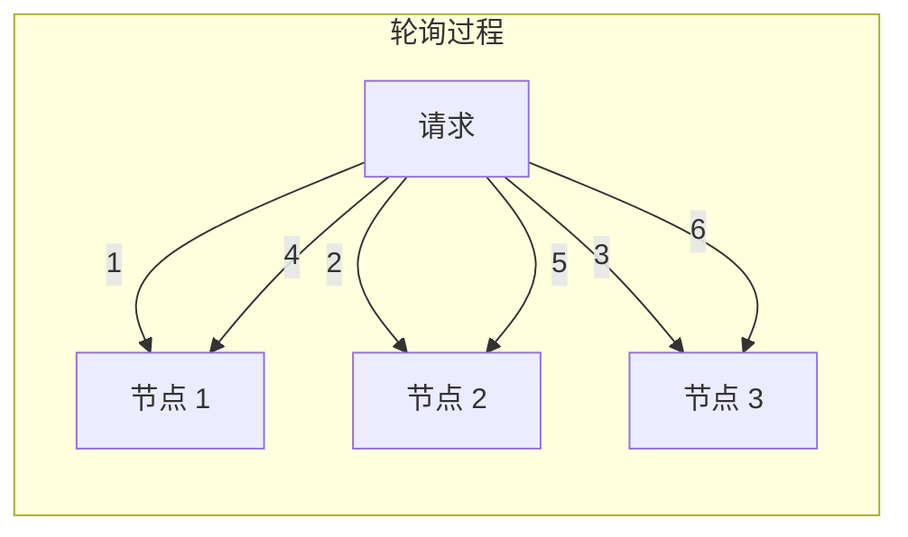
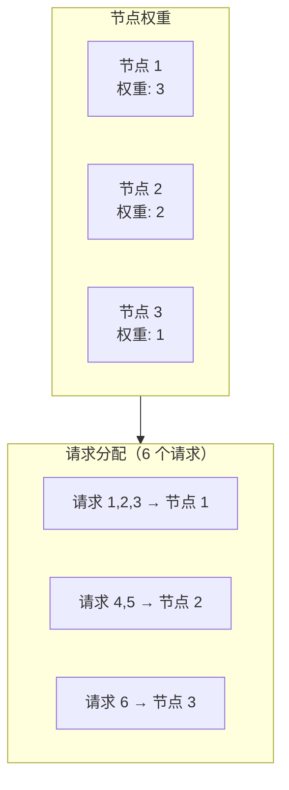

# 轮询与加权轮询算法

轮询（Round Robin）是负载均衡中最简单、最常用的算法。本节深入讲解普通轮询、加权轮询，以及 Nginx 实现的高阶版本——平滑加权轮询。

## 普通轮询算法

### 原理

轮询算法的核心思想是**依次遍历后端节点**，每个请求分配到下一个节点：



### 实现

```java
public class RoundRobinLoadBalancer {

    private final List<String> servers;
    private final AtomicInteger nextIndex = new AtomicInteger(0);

    public RoundRobinLoadBalancer(List<String> servers) {
        this.servers = new ArrayList<>(servers);
    }

    public String select() {
        if (servers.isEmpty()) {
            throw new IllegalStateException("No servers available");
        }

        // 取模确保循环
        int index = nextIndex.getAndIncrement() % servers.size();
        return servers.get(index);
    }
}
```

### 特点

| 优点 | 缺点 |
| --- | --- |
| 实现简单 | 无法感知节点性能差异 |
| 行为可预测 | 无法感知节点实时负载 |
| 无状态 | 不适合异构集群 |

## 加权轮询算法

### 原理

加权轮询根据节点的**权重**分配请求，高权重节点获得更多请求：



### 实现

```java
public class WeightedRoundRobinLoadBalancer {

    private final List<Server> servers;

    @Data
    @AllArgsConstructor
    private static class Server {
        String host;
        int weight;
        int currentWeight;  // 当前有效权重
    }

    public WeightedRoundRobinLoadBalancer(List<Server> servers) {
        this.servers = new ArrayList<>(servers);
    }

    public String select() {
        if (servers.isEmpty()) {
            throw new IllegalStateException("No servers available");
        }

        // 计算总权重
        int totalWeight = servers.stream()
            .mapToInt(Server::getWeight)
            .sum();

        // 选择节点
        int index = -1;
        int maxCurrentWeight = Integer.MIN_VALUE;

        for (int i = 0; i < servers.size(); i++) {
            Server server = servers.get(i);

            // 增加当前权重
            server.setCurrentWeight(server.getCurrentWeight() + server.getWeight());

            // 选出当前权重最大的
            if (server.getCurrentWeight() > maxCurrentWeight) {
                maxCurrentWeight = server.getCurrentWeight();
                index = i;
            }
        }

        // 扣除选中的节点的当前权重
        servers.get(index).setCurrentWeight(
            servers.get(index).getCurrentWeight() - totalWeight
        );

        return servers.get(index).getHost();
    }
}
```

### 加权轮询配置

```nginx
upstream backend {
    server 10.0.1.1:8080 weight=3;  # 节点 1 权重 3
    server 10.0.1.2:8080 weight=2;  # 节点 2 权重 2
    server 10.0.1.3:8080 weight=1;  # 节点 3 权重 1
}
```

### 权重设置依据

| 场景 | 权重设置依据 |
| --- | --- |
| CPU 性能差异 | 8 核 : 4 核 : 2 核 → 权重 4:2:1 |
| 内存差异 | 64GB : 32GB : 16GB → 权重 4:2:1 |
| 业务容量 | 高配 : 中配 : 低配 → 权重 3:2:1 |
| 机器数量 | 3 台 : 2 台 : 1 台（相同配置）→ 权重 3:2:1 |

## 平滑加权轮询算法

### 问题：普通加权轮询不「平滑」

普通加权轮询会导致**请求集中**的问题：

```
假设权重：节点1=5, 节点2=1

理想分配：|-----|-----|-----|-----|-----|
          |  1  |  2  |  3  |  4  |  5  |
          |节点1|节点1|节点1|节点1|节点1|

问题：前 5 个请求都打到节点 1，然后才是节点 2
```

### Nginx 的平滑加权轮询

Nginx 实现了**平滑加权轮询**，将请求均匀分布：

```
Nginx 平滑加权轮询分配：

权重：节点1=5, 节点2=1

分配序列：1, 1, 1, 2, 1, 1, 1, 2, 1, 1, 1, 2, ...
（节点 1 每 5 个请求中出现 4 次，节点 2 每 5 个请求中出现 1 次）
```

### 平滑加权轮询实现

```java
public class SmoothWeightedRoundRobin {

    private final List<WeightedServer> servers;

    @Data
    @AllArgsConstructor
    private static class WeightedServer {
        String host;
        int weight;
        int currentWeight;  // 动态权重
    }

    public SmoothWeightedRoundRobin(List<WeightedServer> servers) {
        this.servers = servers.stream()
            .map(s -> new WeightedServer(s.getHost(), s.getWeight(), s.getWeight()))
            .collect(Collectors.toList());
    }

    public String select() {
        if (servers.isEmpty()) {
            throw new IllegalStateException("No servers available");
        }

        // 找出当前权重最大的节点
        WeightedServer selected = null;
        int maxWeight = Integer.MIN_VALUE;
        int totalWeight = 0;

        for (WeightedServer server : servers) {
            // 累加权重到当前权重
            server.setCurrentWeight(server.getCurrentWeight() + server.getWeight());
            totalWeight += server.getWeight();

            if (server.getCurrentWeight() > maxWeight) {
                maxWeight = server.getCurrentWeight();
                selected = server;
            }
        }

        // 扣除总权重
        assert selected != null;
        selected.setCurrentWeight(selected.getCurrentWeight() - totalWeight);

        return selected.getHost();
    }
}
```

### 执行过程示例

```
初始：节点1(weight=5, cur=5), 节点2(weight=1, cur=1)

请求 1：
  节点1: cur=5+5=10
  节点2: cur=1+1=2
  选择：节点1 (cur=10)
  扣除：节点1 cur=10-6=4
  结果：节点1

请求 2：
  节点1: cur=4+5=9
  节点2: cur=2+1=3
  选择：节点1 (cur=9)
  扣除：节点1 cur=9-6=3
  结果：节点1

请求 3：
  节点1: cur=3+5=8
  节点2: cur=3+1=4
  选择：节点1 (cur=8)
  扣除：节点1 cur=8-6=2
  结果：节点1

请求 4：
  节点1: cur=2+5=7
  节点2: cur=4+1=5
  选择：节点1 (cur=7)
  扣除：节点1 cur=7-6=1
  结果：节点1

请求 5：
  节点1: cur=1+5=6
  节点2: cur=5+1=6
  选择：节点1 (cur=6)  # 平局时选择权重大的
  扣除：节点1 cur=6-6=0
  结果：节点1

请求 6：
  节点1: cur=0+5=5
  节点2: cur=6+1=7
  选择：节点2 (cur=7)
  扣除：节点2 cur=7-6=1
  结果：节点2

分配序列：1,1,1,1,1,2,1,1,1,1,1,2,1,1,1,1,1,2,...
```

## 算法对比

| 算法 | 特点 | 适用场景 |
| --- | --- | --- |
| 轮询（RR） | 简单均匀 | 节点性能一致 |
| 加权轮询（WRR） | 按权重分配 | 异构集群 |
| 平滑加权轮询 | 均匀分布 | 异构集群 + 流量平滑 |

## 常见问题

### 问题一：权重配置与实际不符

```
配置：weight=4:2:1
实际：节点1 性能是节点2 的 2 倍，节点2 是节点3 的 2 倍

结果：流量分配合理

配置：weight=4:2:1
实际：3 台机器配置完全相同

结果：节点1 被打满，其他节点空闲
```

**解决**：根据实际性能测试结果设置权重，或使用动态算法。

### 问题二：节点上线后流量激增

```
场景：新节点加入，权重设置为 3

结果：新节点瞬间收到大量请求，可能再次宕机
```

**解决**：新节点权重从 1 开始，逐步增加。

### 问题三：权重为 0

```
配置：weight=0

结果：该节点不参与调度（但可以接受请求）
```

**使用场景**：临时下线节点，保留配置但不参与调度。

## 总结

轮询算法是最基础的负载均衡算法：

- **普通轮询**：依次分发，实现简单，但不感知节点性能差异
- **加权轮询**：按权重分配，适合异构集群
- **平滑加权轮询**：Nginx 的实现，将请求均匀分布，避免流量突刺

轮询算法的选择依据：
- 节点性能一致 → 普通轮询
- 节点性能不同 → 加权轮询
- 需要流量平滑 → 平滑加权轮询

下一节我们将讲解动态算法——最小连接数和加权最小连接数。
