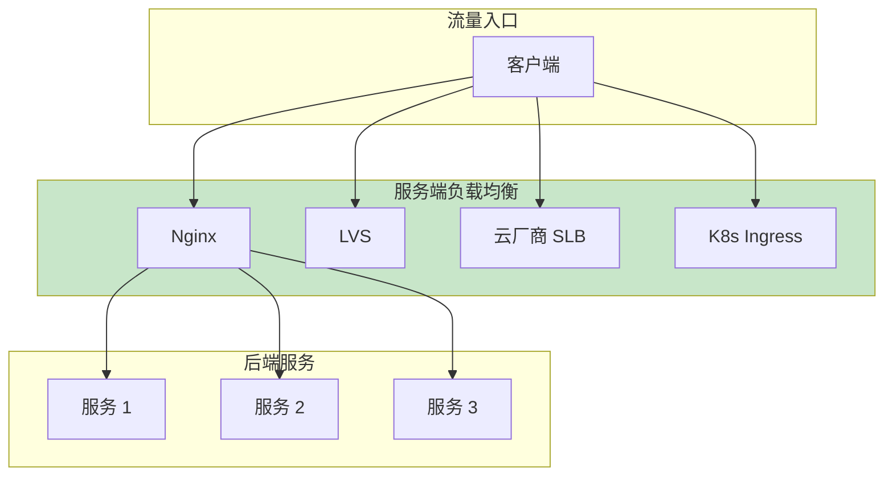

# 服务端负载均衡

服务端负载均衡是**集中式**的流量入口，由负载均衡器统一管理流量分发。相比客户端负载均衡，服务端负载均衡更简单、更容易管理，是互联网入口流量的标准方案。

## 服务端负载均衡架构



## Nginx 负载均衡配置

### 基础配置

```nginx
http {
    upstream backend {
        server 10.0.1.1:8080;
        server 10.0.1.2:8080;
        server 10.0.1.3:8080;
    }

    server {
        listen 80;
        server_name example.com;

        location / {
            proxy_pass http://backend;
            proxy_set_header Host $host;
            proxy_set_header X-Real-IP $remote_addr;
            proxy_set_header X-Forwarded-For $proxy_add_x_forwarded_for;
            proxy_set_header X-Forwarded-Proto $scheme;
        }
    }
}
```

### 带权重的配置

```nginx
upstream backend {
    # 加权轮询
    server 10.0.1.1:8080 weight=3;
    server 10.0.1.2:8080 weight=2;
    server 10.0.1.3:8080 weight=1;

    # 备份服务器
    server 10.0.1.4:8080 backup;

    # 不可用服务器
    server 10.0.1.5:8080 down;
}
```

### 健康检查

```nginx
upstream backend {
    # 被动健康检查
    server 10.0.1.1:8080 max_fails=3 fail_timeout=30s;
    server 10.0.1.2:8080 max_fails=3 fail_timeout=30s;
}

server {
    location / {
        proxy_pass http://backend;

        # 主动健康检查（Nginx Plus 或第三方模块）
        health_check uri=/health interval=5s fails=2 passes=2;
    }
}
```

### 多层 Nginx

```nginx
# 外层 Nginx（入口）
stream {
    upstream backend_tcp {
        server 10.0.0.1:80;
        server 10.0.0.2:80;
    }

    server {
        listen 80;
        proxy_pass backend_tcp;
    }
}

# 内层 Nginx（API 网关）
http {
    upstream api_backend {
        server 10.0.1.1:8080;
        server 10.0.1.2:8080;
    }

    upstream static_backend {
        server 10.0.2.1:80;
        server 10.0.2.2:80;
    }

    server {
        listen 80;

        location /api/ {
            proxy_pass http://api_backend;
        }

        location /static/ {
            proxy_pass http://static_backend;
        }
    }
}
```

## Kubernetes Ingress

Ingress 是 K8s 的七层负载均衡资源：

### 基础配置

```yaml
apiVersion: networking.k8s.io/v1
kind: Ingress
metadata:
  name: my-ingress
  annotations:
    nginx.ingress.kubernetes.io/rewrite-target: /
spec:
  ingressClassName: nginx
  rules:
    - host: api.example.com
      http:
        paths:
          - path: /user
            pathType: Prefix
            backend:
              service:
                name: user-service
                port:
                  number: 80
          - path: /product
            pathType: Prefix
            backend:
              service:
                name: product-service
                port:
                  number: 80
```

### 带权重的配置

```yaml
apiVersion: networking.k8s.io/v1
kind: Ingress
metadata:
  name: canary-ingress
  annotations:
    nginx.ingress.kubernetes.io/canary: "true"
    nginx.ingress.kubernetes.io/canary-weight: "30"  # 30% 流量到新版本
spec:
  ingressClassName: nginx
  rules:
    - host: api.example.com
      http:
        paths:
          - path: /
            pathType: Prefix
            backend:
              service:
                name: user-service-v2
                port:
                  number: 80
```

### 多服务配置

```yaml
apiVersion: networking.k8s.io/v1
kind: Ingress
metadata:
  name: multi-service-ingress
  annotations:
    nginx.ingress.kubernetes.io/proxy-body-size: "50m"
    nginx.ingress.kubernetes.io/proxy-read-timeout: "300"
spec:
  ingressClassName: nginx
  rules:
    - host: api.example.com
      http:
        paths:
          - path: /api/users
            pathType: Exact
            backend:
              service:
                name: user-api
                port:
                  number: 8080
          - path: /api/orders
            pathType: Exact
            backend:
              service:
                name: order-api
                port:
                  number: 8080
          - path: /
            pathType: Prefix
            backend:
              service:
                name: default-backend
                port:
                  number: 8080
```

## 云厂商 SLB

### AWS ALB 配置

```yaml
# Terraform 配置
resource "aws_lb" "main" {
  name               = "main-alb"
  internal           = false
  load_balancer_type = "application"
  security_groups    = [aws_security_group.alb.id]
  subnets           = aws_subnet.public[*].id
}

resource "aws_lb_target_group" "api" {
  name     = "api-tg"
  port     = 80
  protocol = "HTTP"
  vpc_id   = aws_vpc.main.id

  health_check {
    enabled             = true
    healthy_threshold   = 2
    interval            = 30
    matcher             = "200"
    path                = "/health"
    port                = "traffic-port"
    protocol            = "HTTP"
    timeout             = 5
    unhealthy_threshold = 2
  }
}

resource "aws_lb_listener" "api" {
  load_balancer_arn = aws_lb.main.arn
  port              = "80"
  protocol          = "HTTP"

  default_action {
    type             = "forward"
    target_group_arn = aws_lb_target_group.api.arn
  }
}

resource "aws_lb_target_group_attachment" "api" {
  target_group_arn = aws_lb_target_group.api.arn
  target_id        = aws_instance.api1.id
  port             = 80
}
```

### 阿里云 SLB 配置

```yaml
# 阿里云 CLB（传统型负载均衡）
apiVersion: v1
kind: Service
metadata:
  name: nginx-service
  annotations:
    service.beta.kubernetes.io/alibaba-cloud-loadbalancer-spec: "slb.s2.small"
    service.beta.kubernetes.io/alibaba-cloud-loadbalancer-master-zoneid: "cn-beijing-a"
    service.beta.kubernetes.io/alibaba-cloud-loadbalancer-slave-zoneid: "cn-beijing-b"
spec:
  type: LoadBalancer
  selector:
    app: nginx
  ports:
    - port: 80
      targetPort: 80
  sessionAffinity: ClientIP
  sessionAffinityConfig:
    clientIP:
      timeoutSeconds: 3600
```

## 服务端负载均衡配置对比

| 维度 | Nginx | K8s Ingress | 云厂商 SLB |
| --- | --- | --- | --- |
| 部署位置 | 自建机房 | K8s 集群 | 云平台 |
| 弹性扩展 | 需手动/脚本 | HPA 自动 | 按需扩展 |
| SSL 终结 | 支持 | 支持 | 支持 |
| 七层路由 | 支持 | 支持 | 支持 |
| 成本 | 服务器成本 | Pod 成本 | 按量付费 |
| 运维 | 自行维护 | K8s 托管 | 云平台托管 |

## 生产环境最佳实践

### Nginx 生产配置

```nginx
worker_processes auto;
worker_rlimit_nofile 65535;

events {
    worker_connections 65535;
    use epoll;
    multi_accept on;
}

http {
    # 基础配置
    sendfile on;
    tcp_nopush on;
    tcp_nodelay on;
    keepalive_timeout 65;
    types_hash_max_size 2048;

    # Gzip 压缩
    gzip on;
    gzip_vary on;
    gzip_proxied any;
    gzip_comp_level 6;
    gzip_types text/plain text/css text/xml application/json application/javascript;

    # 上游配置
    upstream backend {
        zone upstream_backend 64k;

        server 10.0.1.1:8080 weight=3 max_fails=3 fail_timeout=30s;
        server 10.0.1.2:8080 weight=3 max_fails=3 fail_timeout=30s;
        server 10.0.1.3:8080 weight=2 max_fails=3 fail_timeout=30s;

        keepalive 32;
    }

    server {
        listen 80;
        server_name example.com;

        # 日志格式
        log_format main '$remote_addr - $remote_user [$time_local] "$request" '
                        '$status $body_bytes_sent "$http_referer" '
                        '"$http_user_agent" "$http_x_forwarded_for" '
                        'rt=$request_time uct=$upstream_connect_time '
                        'uht=$upstream_header_time urt=$upstream_response_time';

        access_log /var/log/nginx/access.log main;

        location / {
            proxy_pass http://backend;
            proxy_http_version 1.1;
            proxy_set_header Host $host;
            proxy_set_header X-Real-IP $remote_addr;
            proxy_set_header X-Forwarded-For $proxy_add_x_forwarded_for;
            proxy_set_header X-Forwarded-Proto $scheme;

            proxy_connect_timeout 5s;
            proxy_read_timeout 60s;
            proxy_send_timeout 5s;

            proxy_buffering on;
            proxy_buffer_size 4k;
            proxy_buffers 8 4k;
        }

        location /health {
            access_log off;
            return 200 'OK';
        }
    }
}
```

## 总结

服务端负载均衡是集中式的流量入口：

**Nginx**：
- 自建机房首选
- 丰富的七层路由能力
- 配置灵活

**K8s Ingress**：
- K8s 集群入口
- 与服务网格集成
- 支持金丝雀发布

**云厂商 SLB**：
- 云平台托管
- 按需扩展
- 高可用保障

服务端负载均衡的选择建议：
- 自建机房 → Nginx
- K8s 环境 → Ingress
- 不想运维 → 云厂商 SLB

下一节我们将讲解健康检查机制。
