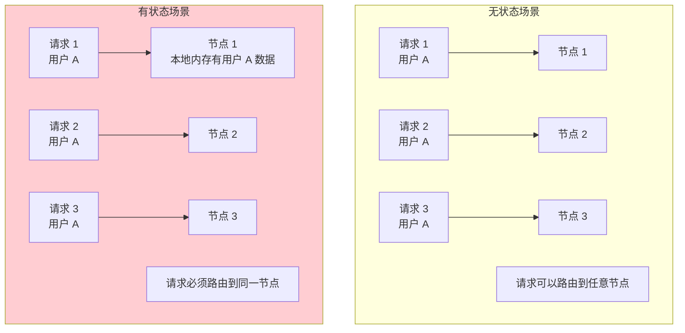
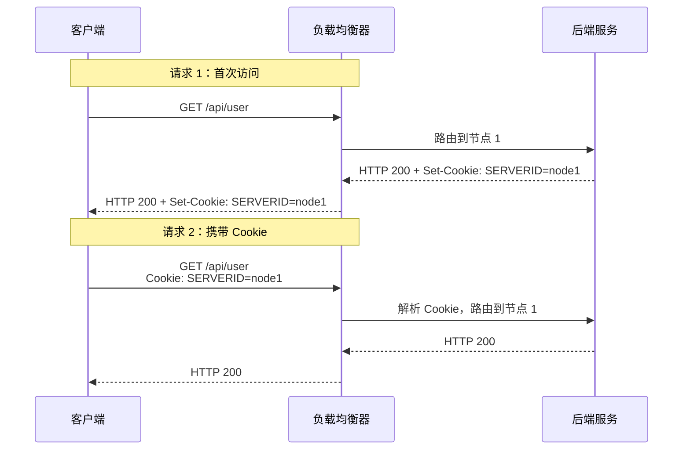
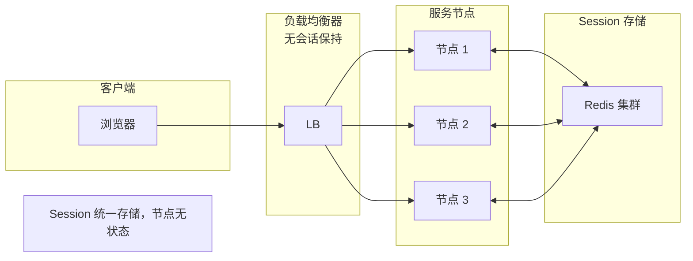

# 会话保持（Sticky Session）

无状态设计是分布式系统的最佳实践，但现实中总有例外。某些场景下，同一用户的请求必须路由到同一节点——这就是会话保持（Sticky Session）的需求。本节讲解三种实现方式和它们的 trade-off。

## 什么时候需要会话保持



**需要会话保持的场景**：
- 本地内存存储 Session（未使用分布式 Session）
- WebSocket 长连接
- 服务器端缓存（每个节点独立）
- 某些协议的连接状态

## 三种实现方式

| 方式 | 原理 | 优点 | 缺点 |
| --- | --- | --- | --- |
| Cookie 重写 | 在 Cookie 中写入节点标识 | 简单，客户端无需改造 | Cookie 暴露节点信息 |
| Session 亲和性 | 负载均衡器维护会话表 | 可追溯 | 增加内存开销 |
| 分布式 Session | Session 统一存储（Redis） | 节点无关 | 增加网络延迟 |

## Cookie 重写

### 原理



### Nginx 配置

```nginx
upstream backend {
    ip_hash;  # 基于 IP Hash 的会话保持

    server 10.0.1.1:8080;
    server 10.0.1.2:8080;
}

# 或者基于 Cookie
upstream backend {
    server 10.0.1.1:8080;
    server 10.0.1.2:8080;
}

server {
    listen 80;

    # Cookie 标记
    split_clients "${remote_addr}%10" $sticky_route {
        0       node1;
        1       node1;
        2       node1;
        3       node1;
        4       node2;
        5       node2;
        6       node2;
        7       node2;
        8       node3;
        9       node3;
        *       node1;
    }

    location / {
        proxy_pass http://backend;
        # 使用 $sticky_route 进行路由
    }
}
```

### HAProxy 配置

```shell
backend api_backend
    mode http
    balance roundrobin

    # 基于 Cookie 的会话保持
    cookie SERVERID insert indirect nocache

    server api1 10.0.1.1:8080 check cookie s1
    server api2 10.0.1.2:8080 check cookie s2
    server api3 10.0.1.3:8080 check cookie s3
```

### 实际请求示例

```http
# 请求 1：首次访问
GET /api/user HTTP/1.1
Host: api.example.com

HTTP/1.1 200 OK
Set-Cookie: SERVERID=node1; Path=/; HttpOnly

# 请求 2：携带 Cookie
GET /api/user HTTP/1.1
Host: api.example.com
Cookie: SERVERID=node1

HTTP/1.1 200 OK
```

## Session 亲和性

### 原理

负载均衡器维护一张会话表，记录用户与节点的映射：

```
会话表：
| 用户标识 | 节点 |
|---------|------|
| 192.168.1.100 | 节点 1 |
| 192.168.1.101 | 节点 2 |
| 192.168.1.102 | 节点 1 |
```

### 实现

```java
public class SessionAffinityLoadBalancer {

    private final ConcurrentHashMap<String, String> sessionTable = new ConcurrentHashMap<>();
    private final ConcurrentHashMap<String, Long> sessionExpiry = new ConcurrentHashMap<>();
    private final List<String> servers;
    private final Duration sessionTimeout = Duration.ofMinutes(30);

    public String select(String clientId) {
        // 检查是否有已有会话
        String server = sessionTable.get(clientId);

        if (server != null) {
            // 检查会话是否过期
            Long expiry = sessionExpiry.get(clientId);
            if (expiry != null && System.currentTimeMillis() < expiry) {
                // 刷新过期时间
                sessionExpiry.put(clientId, System.currentTimeMillis() + sessionTimeout.toMillis());
                return server;
            } else {
                // 会话过期，移除
                sessionTable.remove(clientId);
                sessionExpiry.remove(clientId);
            }
        }

        // 选择新服务器
        server = selectByRoundRobin();
        sessionTable.put(clientId, server);
        sessionExpiry.put(clientId, System.currentTimeMillis() + sessionTimeout.toMillis());

        return server;
    }
}
```

### LVS 会话保持

```bash
# LVS 会话保持配置（持久连接）
ipvsadm -A -t 192.168.1.100:80 -s rr -p 1800
# -p 1800：1800 秒内同一 IP 路由到同一服务器
```

## 分布式 Session

### 原理



### Spring Session + Redis

```java
@Configuration
@EnableRedisHttpSession(maxInactiveIntervalInSeconds = 1800)
public class SessionConfig {

    @Bean
    public LettuceConnectionFactory connectionFactory() {
        RedisStandaloneConfiguration config = new RedisStandaloneConfiguration();
        config.setHostName("redis.example.com");
        config.setPort(6379);
        return new LettuceConnectionFactory(config);
    }
}
```

```java
// 使用分布式 Session
@RestController
public class UserController {

    @GetMapping("/user")
    public String getUser(HttpSession session) {
        // 从 Redis 获取 Session
        String userId = (String) session.getAttribute("userId");
        String username = (String) session.getAttribute("username");

        return "User: " + username;
    }

    @PostMapping("/login")
    public String login(HttpSession session) {
        // 写入 Redis Session
        session.setAttribute("userId", "12345");
        session.setAttribute("username", "张三");

        return "Login success";
    }
}
```

### Session 序列化配置

```yaml
# application.yml
spring:
  session:
    store-type: redis
    redis:
      namespace: app:session
      flush-mode: on_save
      save-mode: always
  data:
    redis:
      host: redis.example.com
      port: 6379
      timeout: 2000ms
```

## 三种方案对比

| 维度 | Cookie 重写 | Session 亲和性 | 分布式 Session |
| --- | --- | --- | --- |
| 实现复杂度 | 低 | 中 | 中 |
| 内存开销 | 无 | 中（会话表） | 无 |
| 延迟 | 无 | 无 | +1~2ms |
| 可扩展性 | 差（节点信息在 Cookie） | 差（需要刷新会话表） | 好（节点无关） |
| 可靠性 | 高（Cookie 在客户端） | 中（LB 故障丢失） | 高（Redis 多副本） |
| 适用场景 | 简单会话保持 | 内部服务 | 微服务架构 |

## 会话保持的代价

会话保持虽然解决了有状态问题，但也带来了挑战：

### 问题一：流量不均匀

```
场景：某些用户请求量特别大

结果：
- 这些用户所在的节点负载特别高
- 其他节点相对空闲
- 整体利用率下降
```

### 问题二：扩展困难

```
场景：需要扩容一个节点

问题：
- 新节点没有会话
- 旧节点会话还在

解决：
1. 会话迁移（复杂）
2. 强制所有会话过期（用户体验差）
3. 使用分布式 Session
```

### 问题三：故障影响大

```
场景：某个节点故障

问题：
- 该节点上的所有会话丢失
- 用户需要重新登录

解决：
1. Session 备份
2. 快速故障切换
3. 使用分布式 Session
```

## 生产环境最佳实践

### 方案一：分布式 Session（推荐）

```java
@Configuration
@EnableRedisHttpSession(maxInactiveIntervalInSeconds = 3600)
public class RedisSessionConfig {
    @Bean
    public RedisSerializer<Object> springSessionDefaultRedisSerializer() {
        return new GenericJackson2JsonRedisSerializer();
    }
}
```

### 方案二：Cookie + 分布式 Session

```nginx
# Nginx 配置：优先使用 Cookie，会话数据存在 Redis
upstream backend {
    server 10.0.1.1:8080;
    server 10.0.1.2:8080;
}

server {
    listen 80;
    server_name api.example.com;

    # 简单路由
    location / {
        proxy_pass http://backend;
    }
}
```

### 方案三：Redis Session + JWT

```java
// 使用 JWT 替代 Session
@Service
public class AuthService {

    public String createToken(User user) {
        Map<String, Object> claims = new HashMap<>();
        claims.put("userId", user.getId());
        claims.put("username", user.getUsername());

        return Jwts.builder()
            .claims(claims)
            .issuedAt(new Date())
            .expiration(new Date(System.currentTimeMillis() + 3600000))
            .signWith(key)
            .compact();
    }
}
```

## 总结

会话保持解决的是「同一用户的请求路由到同一节点」的需求：

**Cookie 重写**：
- 在响应 Cookie 中写入节点标识
- 简单，但节点信息暴露
- 适合简单场景

**Session 亲和性**：
- 负载均衡器维护会话表
- 可追溯，但增加内存开销
- 适合内部服务

**分布式 Session**：
- Session 统一存储到 Redis
- 节点无关，可扩展性好
- **推荐方案**

会话保持的 trade-off：
- 破坏负载均衡的均匀性
- 影响扩展性
- **优先考虑无状态设计**

下一节我们将讲解全局负载均衡与灾备。
