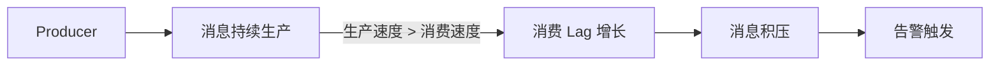
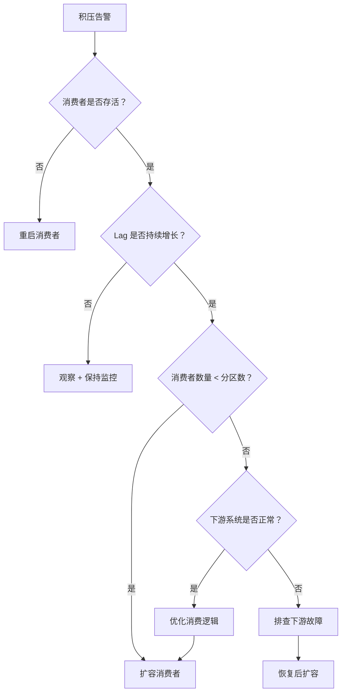

# 消息积压处理策略

早上九点，运营同事发现用户下单后迟迟收不到发货通知。查监控发现，消息队列的消费延迟从平时的几百毫秒飙到了十几分钟。再看消费者日志，全部在等待数据库连接。双十一的噩梦，似乎又要重演了。

消息积压，是消息队列运维中最常见的故障之一。

## 消息积压的原因

消息积压的本质是**生产速度 > 消费速度**。具体原因通常有以下几类：

### 消费者宕机或异常

消费者进程崩溃、OOM、连接池耗尽……任何导致消费者停止消费的因素，都会造成积压。

### 消费者处理能力不足

代码逻辑问题导致单条消息处理时间过长，或者消费者数量本身就不足以支撑当前的吞吐量。

### 流量突增

营销活动、大促、热点事件带来的瞬时流量，往往是平时的几十上百倍，消费能力跟不上就会积压。

### 下游系统故障

消费者依赖的数据库、外部服务响应变慢甚至超时，导致消费 RT 暴增，吞吐量骤降。



## 积压监控：消费 Lag

**消费 Lag** 是衡量消息积压的核心指标，表示「还有多少消息未被消费」。Lag 越大，积压越严重。

### Kafka 消费 Lag 监控

```java
// 计算消费 Lag
public long calculateLag(String consumerGroup, String topic, int partitionId) {
    // 获取分区最新消息的 offset
    long latestOffset = kafkaAdmin.getEndOffsets(topic, partitionId).get(partitionId);
    
    // 获取消费者提交的 offset
    OffsetAndMetadata committed = consumer.committed(
        new TopicPartition(topic, partitionId)
    );
    long committedOffset = committed != null ? committed.offset() : 0;
    
    // Lag = 最新消息 offset - 已提交 offset
    return latestOffset - committedOffset;
}
```

### 告警阈值设置

```
正常: Lag < 1000
关注: 1000 <= Lag < 10000
告警: Lag >= 10000
```

> **经验之谈**：告警阈值应该根据业务容忍度设置。如果业务可以接受 5 分钟延迟，阈值可以设大一些；如果要求实时，阈值应该设得很小甚至接近零。

## 紧急处理措施

消息已经积压了，如何快速处理？

### 扩容消费者

最直接的办法是增加消费者数量。注意：Kafka 的并行度由分区数决定，消费者数量不能超过分区数。

```
分区数: 6
当前消费者: 3
最大可扩容: 6
```

```java
// 动态调整消费者并发数（Spring Kafka 示例）
@KafkaListener(topics = "orders", concurrency = "6")
public void handleOrder(ConsumerRecord<String, String> record) {
    // 每个并发实例处理一个分区
}
```

### 跳过积压消息

如果积压太久，或者部分消息已经过期，可以考虑跳过：

```java
// 跳过旧消息，从最新位置开始消费（谨慎使用！）
consumer.seekToEnd(topicPartition);

// 或者跳过到指定时间戳
consumer.seekToTimestamp(topicPartition, targetTimestamp);
```

> **警告**：跳过消息会丢失数据。只适用于消息本身已经无效（如过期的优惠券发放）或明确知道后果的场景。

### 临时停写

如果积压无法消化，紧急情况下可以暂停上游生产，给消费者喘息的时间。这会损失部分消息，需要评估是否可以接受。

## 预防措施

### 消费者隔离

按业务重要性分级，核心业务和边缘业务使用不同的消费者组。核心业务积压时，优先保障；边缘业务可以降级处理。

### 限流保护

消费者端配置限流，避免瞬时流量冲垮下游系统：

```java
RateLimiter limiter = RateLimiter.create(1000); // 每秒最多处理 1000 条

@KafkaListener(topics = "orders")
public void handleOrder(ConsumerRecord<String, String> record) {
    limiter.acquire();  // 限流
    processOrder(record);
}
```

### 消费能力评估

上线前评估消费能力，确保消费者数量与分区数匹配：

| 分区数 | 单消费者处理能力 | 所需消费者数 |
|---|---|---|
| 12 | 1000 msg/s | 12 |
| 12 | 500 msg/s | 24 |
| 6 | 2000 msg/s | 6 |

### 监控告警

完善的监控体系是预防积压的关键：

```java
// 关键监控指标
// 1. 消费 Lag（已消费 offset 与生产 offset 的差值）
// 2. 消费吞吐量（msg/s）
// 3. 消费延迟（消息产生到被消费的时间）
// 4. 消费者心跳健康状态
```

## 处理决策流程

当收到消息积压告警时，按以下顺序排查和决策：



消息积压是故障，也是改进的机会。每次积压后复盘，分析根因：是流量预估不足、消费逻辑效率低、还是系统容量不够？从根本上解决问题，才能避免下一次积压。
