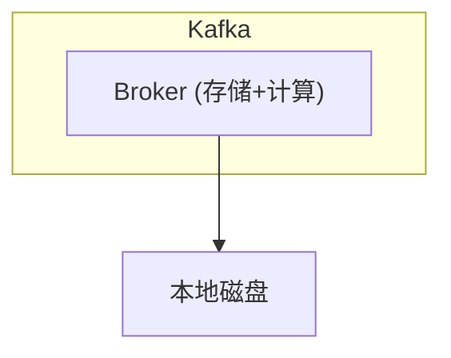
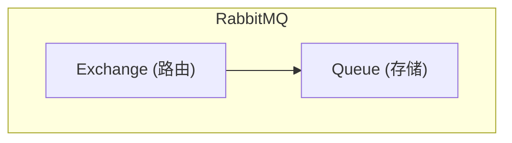
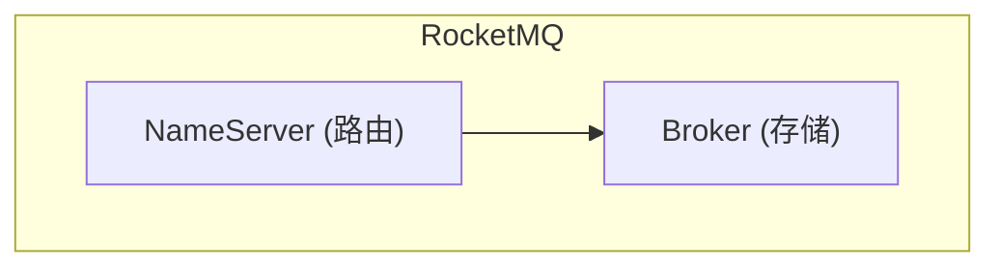
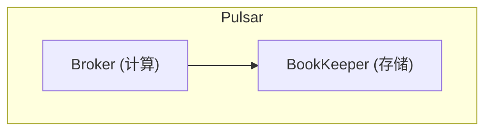

# 消息队列选型对比矩阵

Kafka vs RabbitMQ vs RocketMQ vs Pulsar —— 四个消息队列，各有特点，到底该选哪个？

这是一个没有标准答案的问题，但有一个系统化的决策方法。

## 功能特性对比

| 特性 | Kafka | RabbitMQ | RocketMQ | Pulsar |
|---|---|---|---|---|
| **吞吐量** | 百万级 QPS | 万级 QPS | 十万级 QPS | 十万级 QPS |
| **消息延迟** | 毫秒级 | 毫秒级 | 毫秒级 | 毫秒级 |
| **消息持久化** | 磁盘顺序写 | 内存+磁盘 | 磁盘 | BookKeeper |
| **事务消息** | Kafka 事务 | 无 | 原生支持 | 无（需事务 API） |
| **延时消息** | 无（需插件） | 插件支持 | 18 个级别 | 原生支持 |
| **消息回溯** | 支持 | 不支持 | 支持 | 支持 |
| **多租户** | 无 | 虚拟主机 | 多租户 | 原生多租户 |
| **顺序消息** | 单分区有序 | 队列内有序 | 支持 | 支持 |
| **消息重试** | 无（需业务） | 死信队列 | 死信队列 | 死信队列 |

## 架构设计对比

### Kafka：日志流派



- 存储计算耦合，Broker 持有数据
- 顺序写 + 零拷贝实现极致性能
- 生态成熟，社区活跃

### RabbitMQ：路由流派



- 灵活的路由规则（Direct/Fanout/Topic/Headers）
- 适合复杂的路由场景
- Erlang 实现，并发性能一般

### RocketMQ：事务流派



- 原生事务消息，适合分布式事务
- 延时消息能力
- 阿里系生态，Java 友好

### Pulsar：分离流派



- 存储计算分离，Broker 无状态
- 原生分层存储和多租户
- 相对年轻，生态正在完善

## 选型决策树

```
业务场景评估
     │
     ▼
是否需要事务消息？ ──是──▶ RocketMQ
     │
     否
     │
     ▼
吞吐量要求？ ──百万级──▶ Kafka
     │
     十万级或以下
     │
     ▼
是否需要复杂路由？ ──是──▶ RabbitMQ
     │
     否
     │
     ▼
是否需要分层存储/多租户？ ──是──▶ Pulsar
     │
     否
     │
     ▼
Kafka / RocketMQ（根据团队熟悉度）
```

## 场景化推荐

### 场景一：日志采集与大数据管道

**推荐：Kafka**

- 超高吞吐量满足日志量
- 消息回溯支持重处理
- Flink、Spark 等生态完善
- Kafka Connect 生态丰富

### 场景二：电商订单异步处理

**推荐：RocketMQ / Kafka**

- RocketMQ 的事务消息适合「下单 + 扣库存」场景
- Kafka 需要自己实现事务补偿
- 都需要消费端幂等支持

### 场景三：系统间异步解耦

**推荐：RabbitMQ / RocketMQ**

- 路由规则丰富
- 死信队列完善
- 运维相对简单

### 场景四：金融级可靠消息

**推荐：Kafka（配置优化）/ RocketMQ**

- Kafka 需要配置 `acks=all` + 副本数 >= 3
- RocketMQ 的事务消息提供更强保证
- 需要业务层配合实现端到端可靠性

### 场景五：多租户 SaaS 平台

**推荐：Pulsar**

- 原生多租户隔离
- 分层存储降低冷数据成本
- 配额管理完善

## 常见误区

### 误区一：吞吐量越高越好

Kafka 的百万级 QPS 是极限值，日常业务很少需要。如果系统 QPS 只有几千，选 Kafka 的意义不大，反而增加了运维复杂度。

### 误区二：功能越多越好

RabbitMQ 功能丰富，但吞吐量是四者中最低的。如果系统追求高性能，复杂的路由功能可能是多余的。

### 误区三：选型一次定终身

消息队列可以迁移，但成本很高。建议先用简单方案快速验证业务，等业务稳定后再根据实际需求优化。

> **决策建议**：没有最好的消息队列，只有最适合当前业务场景的选择。选型时优先考虑「业务真正需要什么」，而不是「哪个技术最流行」。

## 团队因素

技术选型不能脱离团队实际情况：

| 团队情况 | 推荐 |
|---|---|
| 团队熟悉 Java | RocketMQ / Kafka |
| 团队熟悉 Python/Go | Kafka / RabbitMQ |
| 有专职运维 | 都可以 |
| 小团队无人专门运维 | RabbitMQ（简单）/ 云消息服务 |
| 需要快速上线 | 云消息服务（AWS SQS/MSK） |

最终，技术选型是业务需求、技术能力、团队状况的综合权衡。在满足业务需求的前提下，选择团队最熟悉、成本最低的方案。
