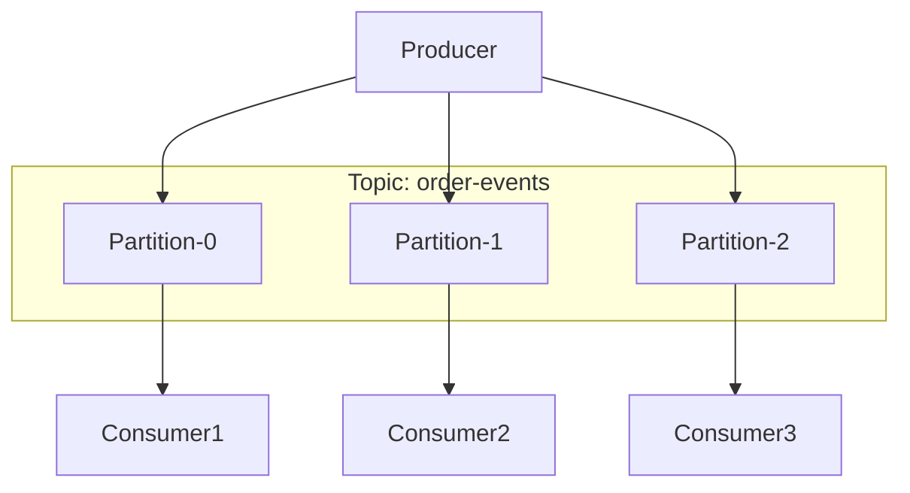
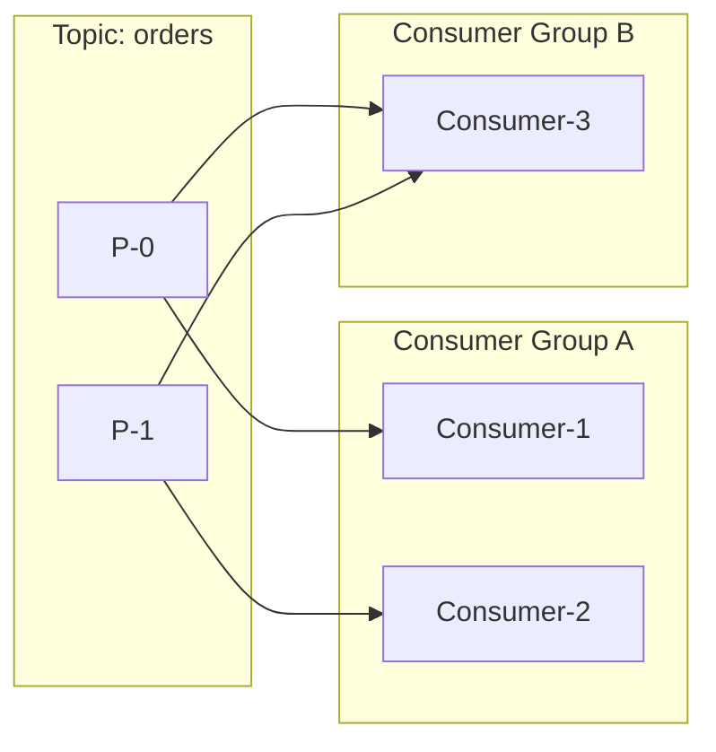

# 消息队列核心概念

凌晨三点，线上报警突然响起：「消息队列消费延迟超过 5 分钟」。你排查发现消费者一切正常，问题出在消息本身——有一条消息体积异常大，导致后续消息全部阻塞。这种场景每一个用过消息队列的工程师都应该遇到过，而问题的根源，往往在于对消息队列核心概念的理解不够深入。

## Topic 与 Partition

消息队列中的 **Topic（主题）** 是消息的逻辑分类容器，生产者将消息发送到特定 Topic，消费者从 Topic 订阅消息。一个 Topic 可以包含多个 **Partition（分区）**，每个 Partition 都是一个有序的、不可变的消息序列。



分区是 Kafka 实现并行处理和水平扩展的基础。每个分区在物理上对应一个独立的目录，消息按照追加顺序写入。这种设计带来两个重要特性：

**并行消费**：多个消费者可以分别处理不同分区的消息，实现真正的并行消费。分区数决定了最大并行度，分区数越多，潜在吞吐量越高。

**顺序保证范围**：分区内的消息严格有序，但跨分区不保证顺序。如果需要全局顺序，只能使用单分区——这会牺牲并行度，是一个典型的设计权衡。

## 消息持久化：磁盘顺序写

消息队列的持久化不是简单地把消息写入磁盘，而是利用了**顺序写**的特性来实现高性能。

机械硬盘的随机写速度通常只有顺序写的千分之一甚至万分之一。消息队列将数据追加到文件末尾（Append-Only），写入速度可以媲美内存写入。现代 SSD 在顺序写场景下同样能发挥最佳性能。

```
# 顺序写示意：数据追加到文件末尾
File: messages.log
[msg1][msg2][msg3][msg4]...  ← 写入指针始终在末尾
```

消息持久化的另一个关键点是**页缓存（Page Cache）**。操作系统将磁盘数据缓存到内存中，写入操作首先写入页缓存，然后由后台线程刷盘。这意味着即使消息没有立即落盘，只要页缓存没有崩溃，消息就不会丢失。

> **经验之谈**：如果使用 Kafka 且对可靠性要求极高，建议配置 `fsync`策略。但频繁 fsync 会严重影响性能，通常选择每批消息同步一次或使用副本机制保证可靠性。

## 消息偏移量（Offset）

每条消息在分区中都有一个唯一的序号，称为 **Offset（偏移量）**。Offset 是一个不断增长的 64 位整数，从 0 开始。生产者每发送一条消息，Offset 加一。

```
Partition-0:
Offset:  0    1    2    3    4    5    6    7    8    9
         [msg1][msg2][msg3][msg4][msg5][msg6][msg7][msg8][msg9][msg10]
```

Offset 是消息定位的基础。通过 `Topic + Partition + Offset` 三元组，可以精确定位任何一条消息。这个设计使得消息消费具备很好的可追溯性——如果某条消息处理失败，我们可以精确记录「哪条消息在哪个位置失败了」。

## 消费者组与位移管理

**Consumer Group（消费者组）** 是 Kafka 特有的概念。同一个消费者组内的消费者共同消费一个 Topic 的消息，每条消息只会被组内一个消费者处理。不同消费者组相互独立，各自维护自己的消费位置。



消费者位移管理（Offset Management）是消息队列中最容易出问题的环节之一。消费者的消费进度由 `committed offset` 表示，标记着「已经成功处理到哪条消息」。

常见的位移管理策略有两种：

**自动提交**：消费者周期性自动提交 offset。优点是简单，缺点是可能丢失消息（刚处理完还没提交就崩溃）或重复消费（提交了但处理失败）。

**手动提交**：消费者在确认消息处理成功后手动提交 offset。这种方式更精确，但需要开发者自行处理提交时机和失败重试。

```java
// 手动提交 Offset 示例
while (running) {
    ConsumerRecords<String, String> records = consumer.poll(Duration.ofMillis(100));
    for (ConsumerRecord<String, String> record : records) {
        processMessage(record);
    }
    // 手动提交已经处理完的消息
    consumer.commitSync();
}
```

> **生产警示**：手动提交时，最佳实践是先处理消息，失败则不提交并重试；成功后才提交。如果处理成功但提交失败，下次重平衡后会重复消费这条消息，业务代码必须具备幂等性。

## 核心概念总结

| 概念 | 作用 | 关键特性 |
|---|---|---|
| Topic | 消息分类容器 | 逻辑结构，可包含多个分区 |
| Partition | 并行处理单元 | 有序、不可变、分布式存储 |
| Offset | 消息唯一标识 | 定位消息、追踪消费进度 |
| Consumer Group | 消费者逻辑分组 | 组内互斥、组间共享、灵活扩展 |

理解这些核心概念是掌握消息队列的基础。后续我们将深入探讨消息顺序、可靠性保证、消费者组重平衡等高级主题。
