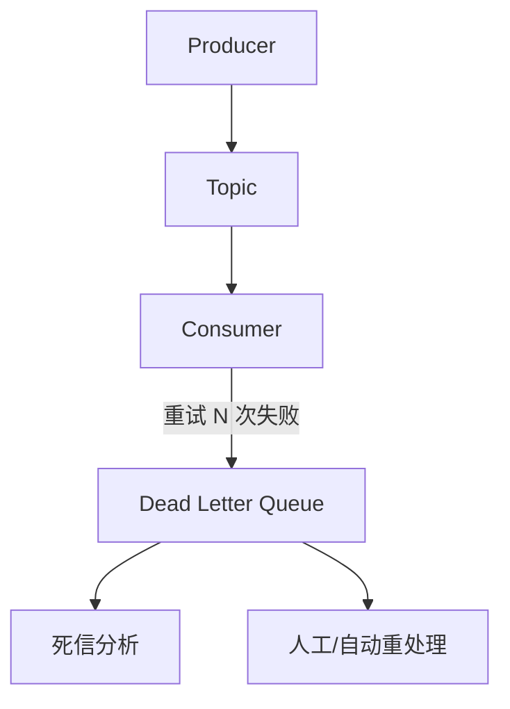

# 死信队列与重试队列

消息处理失败后直接丢弃，看起来简单，但线上遇到故障时你会后悔——根本不知道哪些消息失败了，更别说分析和重处理了。

一个设计良好的消息处理系统，必须有**死信队列（Dead Letter Queue, DLQ）**和**重试队列**的配合。

## 什么是死信队列

死信队列是存放**无法正常消费的消息**的队列。当消息满足以下条件时，会被转入死信队列：

- 消费失败，且超过最大重试次数
- 消息格式错误，消费者无法解析
- 消息过了 TTL 过期时间
- 队列达到最大长度，被丢弃的消息



死信队列的价值在于：**消息不丢失、可追溯、可重处理**。没有死信队列，消息失败就像石沉大海，故障排查无从下手。

## 消息重试机制

消息处理失败后，简单的做法是立即重试。但立即重试往往不起作用——如果是因为数据库连接池耗尽导致的失败，立即重试只会加剧问题。

### 延迟重试

失败后等待一段时间再重试，给系统恢复的时间：

```java
public void consume(Message msg) {
    try {
        processMessage(msg);
    } catch (TemporaryException e) {
        // 临时性错误，延迟重试
        scheduleRetry(msg, 5, TimeUnit.SECONDS);
    } catch (PermanentException e) {
        // 永久性错误，直接进入死信队列
        sendToDLQ(msg, "PERMANENT_ERROR");
    }
}
```

### 指数退避重试

每次重试间隔时间指数增长，避免频繁重试造成系统压力：

```
重试 1: 1 秒
重试 2: 2 秒
重试 3: 4 秒
重试 4: 8 秒
...
重试 N: min(initialDelay * 2^N, maxDelay)
```

```java
public void scheduleRetry(Message msg, int attempt) {
    long delay = calculateBackoff(attempt);
    executor.schedule(() -> {
        retry(msg, attempt + 1);
    }, delay, TimeUnit.MILLISECONDS);
}

private long calculateBackoff(int attempt) {
    return Math.min(INITIAL_DELAY * (1L << attempt), MAX_DELAY);
}
```

### 最大重试次数与死信触发

超过最大重试次数后，消息应该进入死信队列，而不是无限重试：

```java
private static final int MAX_RETRY = 5;

public void retry(Message msg, int attempt) {
    if (attempt > MAX_RETRY) {
        log.warn("超过最大重试次数，发送到死信队列", msg);
        sendToDLQ(msg, "MAX_RETRY_EXCEEDED");
        return;
    }
    
    try {
        processMessage(msg);
    } catch (Exception e) {
        scheduleRetry(msg, attempt + 1);
    }
}
```

## 死信处理策略

消息进入死信队列后，需要有后续处理机制。

### 策略一：人工处理

死信消息由运维人员或业务人员人工分析、处理。适用于小流量、对数据敏感的业务。

需要提供死信队列的监控告警和查询能力：

```java
// 死信消息告警
public void monitorDLQ() {
    long dlqSize = kafkaConsumer.endOffsets(
        Collections.singletonList(dlqTopicPartition)
    ).get(dlqTopicPartition);
    
    if (dlqSize > DLQ_THRESHOLD) {
        sendAlert("死信队列积压超过阈值: " + dlqSize);
    }
}
```

### 策略二：自动重试

对于可恢复的错误，死信队列中的消息可以被重新放回主队列重试。需要注意防止消息堆积和雪崩。

```java
public void reprocessFromDLQ() {
    // 从死信队列消费
    ConsumerRecords<String, String> records = dlqConsumer.poll(Duration.ofSeconds(1));
    
    for (ConsumerRecord<String, String> record : records) {
        Message msg = parseMessage(record);
        
        // 检查是否已过人工处理时间
        if (shouldReprocess(msg)) {
            // 重新放回主队列
            producer.send(mainTopic, msg.getKey(), msg.getValue());
            log.info("消息已重新投递: {}", msg.getId());
        }
    }
}
```

### 策略三：降级处理

某些消息失败不影响核心流程，可以降级记录，后续补偿处理：

```java
public void consume(Message msg) {
    try {
        processMessage(msg);
    } catch (Exception e) {
        // 降级：记录到降级表，不阻塞主流程
        saveToFallbackTable(msg);
        log.warn("消息处理降级，记录到降级表", msg);
    }
}
```

## RabbitMQ 死信交换机

RabbitMQ 通过**死信交换机（Dead Letter Exchange, DLX）**实现死信队列功能。


### 配置死信交换机

```java
// 创建带死信交换机的队列
Map<String, Object> args = new HashMap<>();
args.put("x-dead-letter-exchange", "dlx.exchange");
args.put("x-dead-letter-routing-key", "dlq.routing.key");
args.put("x-message-ttl", 60000);  // 消息 TTL

Queue queue = new Queue("main.queue", true, false, false, args);

// 创建死信队列
Queue dlq = new Queue("dlq.queue", true);
Exchange dlx = new DirectExchange("dlx.exchange");
Binding binding = BindingBuilder.bind(dlq).to(dlx).with("dlq.routing.key");
```

### 拒绝消息触发死信

```java
@RabbitListener(queues = "main.queue")
public void handleMessage(Message msg, Channel channel, 
                         @Header(AmqpHeaders.DELIVERY_TAG) long tag) {
    try {
        processMessage(msg);
        channel.basicAck(tag, false);  // 确认消息
    } catch (Exception e) {
        // 拒绝消息，触发死信
        channel.basicNack(tag, false, false);
    }
}
```

> **配置警示**：RabbitMQ 中，消息被拒绝后不会自动重试。如果需要重试，需要配合延迟插件或额外的中转队列实现。原生 RabbitMQ 没有「重试 N 次后再死信」的机制，需要业务层自己实现。

## 生产实践建议

| 场景 | 推荐策略 |
|---|---|
| 临时性故障（网络抖动、数据库慢） | 指数退避重试 + 延迟队列 |
| 永久性故障（格式错误、业务校验失败） | 直接进入死信队列 |
| 核心业务消息 | 告警 + 人工处理 + 幂等重试 |
| 非核心消息 | 自动降级 + 定时补偿 |

死信队列不是万能药，关键还是减少消息失败。从源头提升消息质量，才是治本之策。
