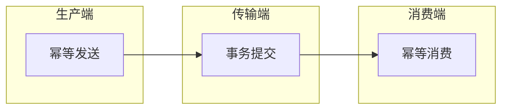
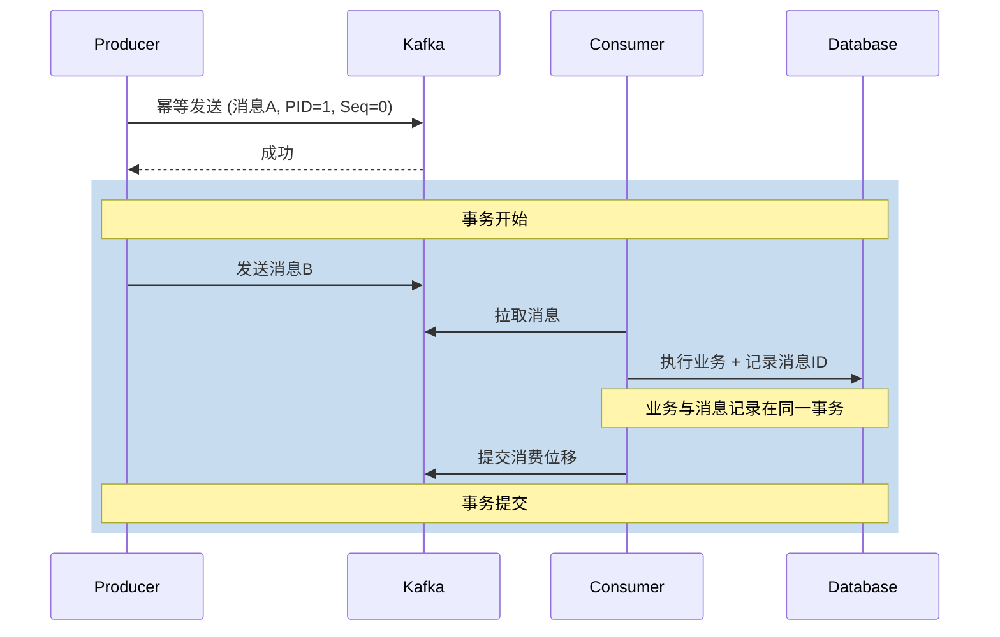

# Exactly-Once 语义实现

用户下单后，支付系统收到了两次扣款请求。原因是支付系统收到消息后处理成功，但确认消息时网络抖动导致确认失败，消息被重新投递。

这个问题困扰了无数工程师：消息队列的「恰好一次」到底能不能实现？

## Exactly-Once 的三要素

Exactly-Once 语义（恰好一次）意味着：每条消息要么被处理一次，要么不被处理，但绝不能重复处理或丢失。

实现 Exactly-Once 需要解决三个环节的问题：



**生产端幂等**：防止生产者重复发送消息。

**传输端事务**：确保消息提交和业务提交原子性。

**消费端幂等**：确保重复消费不会产生副作用。

## 幂等生产者

Kafka 从 0.11 版本开始支持幂等生产者，每个生产者有一个唯一 ID（ProducerEpoch），每个批次有一个序号（Sequence Number）。Broker 会根据这两个值去重。

```java
// 开启幂等生产者
Properties props = new Properties();
props.put("enable.idempotence", true);
props.put("acks", "all");
props.put("retries", Integer.MAX_VALUE);

KafkaProducer<String, String> producer = new KafkaProducer<>(props);
```

### 幂等生产者的工作原理

```
生产者发送消息:
  消息 A (PID=1, Seq=0) → Broker
  消息 A (PID=1, Seq=0) → Broker (重复，Seq=0 已处理，拒绝)
  
生产者重启后:
  消息 B (PID=1, Seq=1) → Broker
  消息 C (PID=1, Seq=2) → Broker
```

Broker 维护每个 PID 的最大已处理 Seq，当收到 Seq <= maxSeq 的消息时，直接丢弃。

> **限制**：幂等生产者只能保证单生产者内的幂等，不同生产者之间无法去重。如果需要跨生产者去重，需要在消息中携带全局唯一 ID。

## Kafka 事务

Kafka 事务解决了「消息提交」与「业务提交」的原子性问题。

### 场景问题

没有事务时可能出现：

```
1. 消息发送成功
2. 业务提交失败
结果：消息被消费，但业务未执行
```

有事务时：

```
1. BEGIN TRANSACTION
2. 发送消息到 Kafka
3. 提交业务（写入数据库）
4. COMMIT TRANSACTION（Kafka 提交 + 业务提交同时成功或失败）
```

### 事务 API

```java
// 事务生产者
KafkaProducer<String, String> producer = new KafkaProducer<>(props);

producer.initTransactions();
producer.beginTransaction();

try {
    producer.send(record1);
    producer.send(record2);
    
    // 提交业务
    orderService.createOrder(...);
    
    producer.commitTransaction();
} catch (Exception e) {
    producer.abortTransaction();  // 回滚 Kafka 消息
    throw e;
}
```

### Exactly-Once Connector

Kafka Connect 的 Exactly-Once 支持（EOS = Exactly-Once Semantics）是流批一体的重要能力：

```properties
# Kafka Connect 配置
offset.storage.topic=connect-offsets
transaction.topic=config.storage.topic
enable.idempotence=true
```

EOS 确保数据从源系统到 Kafka、从 Kafka 到目标系统的端到端一致性。

## 消费端幂等处理

消息队列无法保证消费端幂等，需要业务代码自己实现。

### 唯一键去重

利用数据库唯一索引或 Redis 唯一键实现幂等：

```java
@KafkaListener(topics = "orders")
public void handleOrder(ConsumerRecord<String, Order> record) {
    Order order = record.value();
    
    // 尝试插入数据库，利用唯一索引去重
    try {
        orderMapper.insert(order);
    } catch (DuplicateKeyException e) {
        // 重复消息，忽略
        log.info("重复订单，忽略: {}", order.getId());
        return;
    }
    
    // 业务处理
    processOrder(order);
}
```

### Redis 分布式锁

```java
@KafkaListener(topics = "orders")
public void handleOrder(ConsumerRecord<String, Order> record) {
    String key = "process:" + record.key();
    
    // 尝试获取锁
    Boolean acquired = redis.setnx(key, "1", 30, TimeUnit.SECONDS);
    if (!acquired) {
        log.info("订单正在处理中: {}", record.key());
        return;
    }
    
    try {
        processOrder(record.value());
    } finally {
        redis.del(key);
    }
}
```

### 消息表记录

```java
@KafkaListener(topics = "orders")
public void handleOrder(ConsumerRecord<String, Order> record) {
    String messageId = record.key();  // 业务消息 ID
    
    // 检查是否已处理
    if (messageLogService.isProcessed(messageId)) {
        return;
    }
    
    // 标记为处理中（防止并发处理）
    if (!messageLogService.tryMarkProcessing(messageId)) {
        return;
    }
    
    try {
        processOrder(record.value());
        messageLogService.markCompleted(messageId);
    } catch (Exception e) {
        messageLogService.markFailed(messageId);
        throw e;
    }
}
```

## 端到端 Exactly-Once 实现方案

综合以上技术，一个完整的 Exactly-Once 实现方案：



关键点：

1. **生产者幂等**：Kafka 自身保证
2. **事务原子性**：Kafka 事务 + 业务事务联动
3. **消费幂等**：业务层实现（数据库唯一索引/Redis/消息表）

> **实现成本**：Exactly-Once 是有代价的。幂等生产者有额外的内存开销；Kafka 事务会显著降低吞吐量；消费端幂等需要额外的存储和查询。选择 Exactly-Once 之前，评估业务是否真的需要这个保证。

## 不同场景的推荐方案

| 场景 | 推荐方案 | 说明 |
|---|---|---|
| 支付/金融交易 | Exactly-Once | 必须保证，不允许重复扣款 |
| 订单处理 | At Least Once + 幂等 | 重复订单无害，幂等处理即可 |
| 数据同步 | Exactly-Once | 不允许数据重复或丢失 |
| 日志采集 | At Most Once | 允许丢失，不允许重复 |
