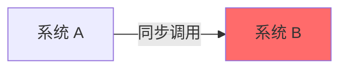
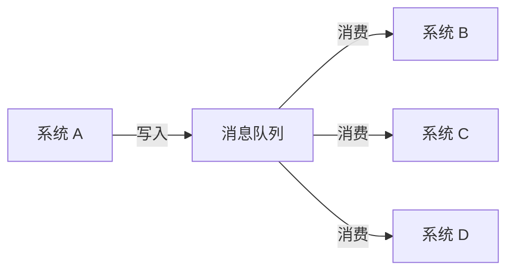
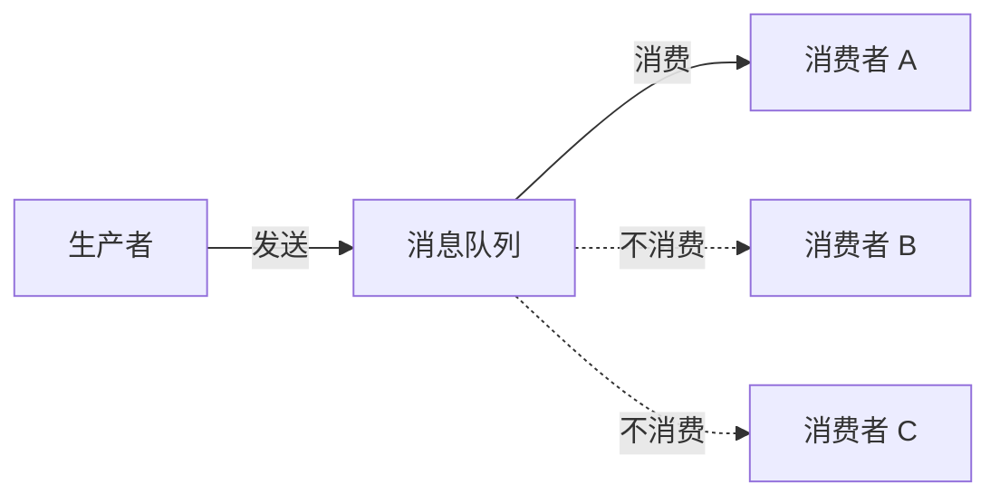
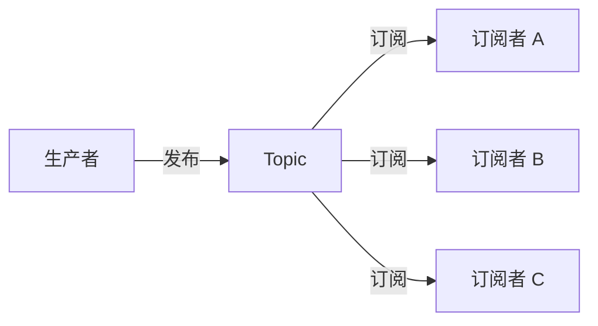
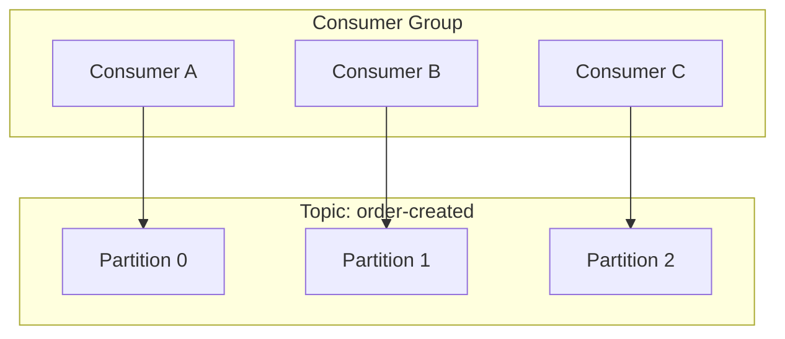
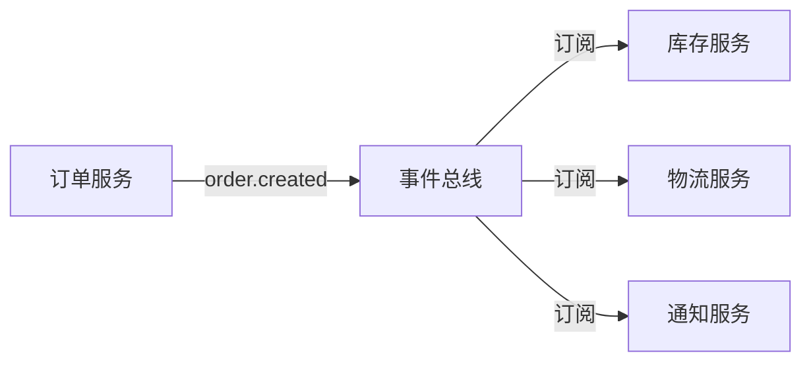
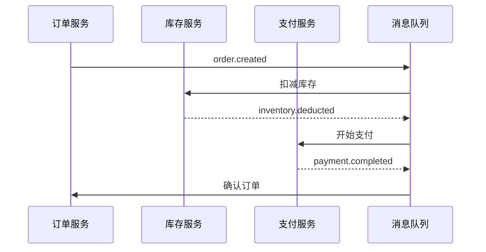
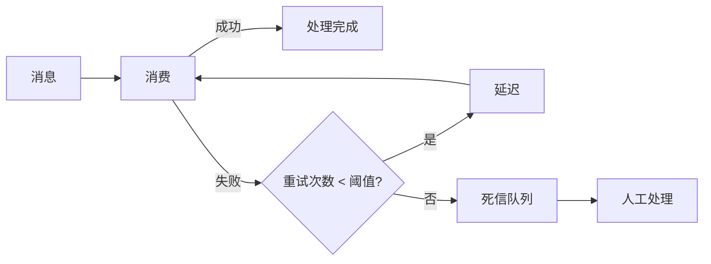
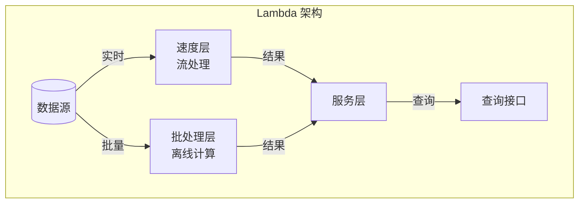
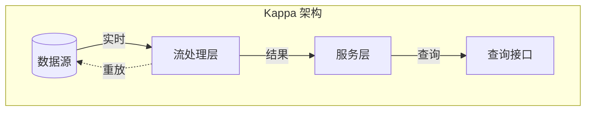

# 消息与流系统

凌晨 3 点，大促结束后的第一个小时。订单系统监控大屏突然亮起红色告警——消息队列消费延迟持续攀升，积压消息从几千条瞬间飙升到几十万条。运营同学发现用户下单后迟迟收不到发货通知，客服电话被打爆。

这不是 Kafka 的问题，也不是 RabbitMQ 的问题。这是你在设计阶段就埋下的隐患：消费者处理速度跟不上生产速度、没有做好消息积压的应急预案、重试机制配置不当导致消息死循环。

**消息队列远比你想象的复杂。** 它不只是把消息从 A 发到 B 那么简单。分区策略决定了消费并行度、顺序保证限制了你的架构选择、Exactly Once 语义背后是一整套事务机制、消息积压时的降级方案决定了系统能否在流量洪峰中存活。

很多人以为引入消息队列就能解决所有异步问题。但真正线上跑过消息队列的工程师都知道，真正的挑战在于：消息丢了怎么办、消息重复了怎么办、消费顺序乱了怎么办、消息积压了怎么办。这些问题不会在开发环境出现，只会在凌晨 3 点的生产环境中给你「惊喜」。

本章将从消息队列的核心原理出发，剖析 Kafka、Pulsar、RabbitMQ、RocketMQ 等主流消息引擎的设计权衡，带你建立完整的消息系统知识体系。

## 消息队列的核心价值

消息队列解决的是分布式系统中最核心的问题：**如何让多个独立组件高效协作，同时保持系统的稳定性**。

### 解耦：生产者与消费者的松耦合

没有消息队列时，系统 A 调用系统 B，A 必须知道 B 在哪里、什么时候能响应、B 挂了怎么办。这是一种强耦合——B 的任何变化（升级、迁移、故障）都可能影响 A。

引入消息队列后，系统 A 只管把消息扔进队列，不需要关心谁在消费、不需要等待响应、不需要处理下游的失败。系统 B 可以随时上线、升级、扩容，对系统 A 完全透明。

### 削峰：应对流量洪峰

秒杀场景下，1 秒内可能涌入 10 万下单请求。如果每个请求都直接落库，数据库瞬间被打爆。但如果把这 10 万请求先写入消息队列，消费者按自己的能力逐步处理——每秒 1000 条——系统就能平稳度过流量高峰。

消息队列在这里充当了**缓冲池**的角色：生产端可以疯狂写入，消费端按自己的节奏慢慢消费。削峰的本质是用**延迟换稳定**。

### 异步：非核心流程的异步化

用户下单后，需要发送短信通知、扣减库存、更新搜索索引、记录日志。如果这些操作都同步执行，用户下单接口的延迟会非常高。但如果把这些操作都异步化——下单成功后，往消息队列扔一条消息就返回，通知、库存、索引等操作由各自的消费者异步处理——接口延迟从 500ms 降低到 50ms。

异步化的代价是引入了延迟链路。短信可能 30 秒后才发出去，搜索索引可能 1 分钟后才更新。如果业务对延迟敏感，异步化就不是好的选择。

### 缓冲：速度不匹配时的缓冲区

生产者的速度与消费者的速度往往不同。数据库每秒能写入 1000 条，但上游每秒能产生 2000 条请求。如果没有缓冲，数据库会被打爆；有了消息队列，多的 1000 条先存在队列里，等数据库腾出手来再处理。

缓冲机制让快慢组件可以共存，是系统弹性的重要来源。

## 消息队列的两种模型

消息队列根据消息的分发模式，可以分为两种核心模型：点对点模型和发布订阅模型。

### 点对点模型（Point-to-Point）

点对点模型中，每条消息只会被一个消费者消费。生产者将消息发送到队列，队列负责把消息分发给其中一个消费者。消费者消费完消息后，消息从队列中消失。

典型场景：任务队列、订单处理流水线、日志收集。

### 发布订阅模型（Pub/Sub）

发布订阅模型中，每条消息会被所有订阅该主题的消费者消费。生产者将消息发布到主题（Topic），所有订阅该主题的消费者都会收到消息的副本。

典型场景：系统间的事件通知、数据同步到多个下游、日志广播。

### 模型对比

| 维度 | 点对点模型 | 发布订阅模型 |
| --- | --- | --- |
| 消息分发 | 每条消息只被一个消费者消费 | 每条消息被所有订阅者消费 |
| 消费者关系 | 竞争消费（多个消费者竞争一条消息） | 广播消费（多个消费者各自收到完整消息） |
| 适用场景 | 任务分发、异步处理 | 事件通知、数据同步 |
| 顺序保证 | 相对容易保证（单消费者） | 需要额外设计（多消费者并行） |
| 典型代表 | RabbitMQ Queue、Kafka Topic（单分区） | Kafka Topic（多消费者组）、RabbitMQ Exchange |

两种模型并非互斥。很多消息队列同时支持两种模式：Kafka 通过消费者组实现点对点，通过多消费者组实现发布订阅；RabbitMQ 通过 Exchange 类型控制消息分发行为。

## 核心概念详解

### Topic、Queue、Partition、Consumer Group

**Topic（主题）** 是消息的逻辑容器，生产者向 Topic 发送消息，消费者从 Topic 消费消息。在 Kafka 中，Topic 是消息存储和分发的基本单位。

**Partition（分区）** 是 Topic 的物理分片。一个 Topic 可以分为多个 Partition，每个 Partition 是一个有序的、不可变的消息序列。分区是 Kafka 实现并行消费的基础——一个分区只能被一个消费者组内的一个消费者消费。

**Consumer Group（消费者组）** 是一组共同消费同一个 Topic 的消费者实例。同一个消费者组内的消费者共同分担分区，每个分区只会被组内一个消费者消费。不同消费者组之间相互独立，每个组都能消费到完整的消息。

### 消息顺序保证

**单分区有序**：在一个分区内，消息按照写入顺序排列，消费时严格按照顺序进行。如果业务需要严格的消息顺序，必须使用单分区，或者在应用层做序列化和反序列化。

**全局有序**：跨分区的全局有序几乎不可能实现，因为不同分区的写入时机不同。如果业务对顺序敏感，通常的做法是：

1. 使用单分区（牺牲吞吐量）
2. 在消息体内添加序列号，消费者按序列号排序处理
3. 使用分桶键（Sharding Key），相同键的消息保证在同一分区内有序

| 场景 | 推荐方案 | 说明 |
| --- | --- | --- |
| 严格顺序（如订单状态流转） | 单分区 + 单消费者 | 吞吐量受限，但保证强顺序 |
| 相对顺序（如同用户操作有序） | 分桶键保证同用户消息在同一分区 | 兼顾吞吐和顺序 |
| 无顺序要求 | 多分区并行消费 | 最大吞吐量 |

### 消息可靠性

消息可靠性决定了系统对消息丢失和重复的容忍程度。

**At Most Once（最多一次）**：消息可能丢失，但绝不会重复消费。实现方式：生产者发送后不等待确认，消费者异步消费不保存偏移量。适用于对重复敏感的场景（如扣款），但数据可能丢失。

**At Least Once（至少一次）**：消息绝不丢失，但可能重复消费。实现方式：生产者等待 Broker 确认，消费者处理完后保存偏移量。适用于大多数场景（如订单创建），需要消费者做好幂等处理。

**Exactly Once（恰好一次）**：消息既不丢失也不重复。实现方式：Kafka 的事务机制或幂等生产者 + 消费者幂等。代价是性能开销较大。适用于金融级场景。

| 语义 | 消息丢失 | 消息重复 | 性能 | 适用场景 |
| --- | --- | --- | --- | --- |
| At Most Once | 可能 | 不会 | 高 | 统计类、数据丢失可接受 |
| At Least Once | 不会 | 可能 | 中 | 大多数业务场景 |
| Exactly Once | 不会 | 不会 | 低 | 金融支付、数据同步 |

### 消息持久化

消息持久化是可靠性保障的最后一道防线。主流消息队列都会将消息写入磁盘，区别在于写入策略和性能优化。

**顺序写入**：Kafka 的高性能秘密在于顺序写。磁盘顺序写入的速度可以接近内存速度（甚至在某些场景下更快），因为避免了大量的随机 I/O。Kafka 利用操作系统的 Page Cache 机制，写入时先到内存，再由操作系统异步刷盘。

**副本机制**：为了防止单机故障导致消息丢失，Kafka 支持分区副本（Replica）。每个分区有多个副本，分布在不同的 Broker 上。当主副本所在机器宕机时，Follower 副本可以自动切换为主副本，继续提供服务。

## 主流消息队列对比

### Kafka：日志场景的王者

Kafka 最初是 LinkedIn 内部用于处理日志的系统，后来开源并成为大数据领域的事实标准。它的设计哲学是：**高吞吐、低延迟、持久化**。

Kafka 的核心优势：

- **超高吞吐**：单机可达百万级 QPS，通过顺序写入和零拷贝技术实现
- **低延迟**：P99 延迟可控制在毫秒级
- **强持久化**：消息落盘后可配置保留时间，支持消息回溯
- **生态完善**：与 Flink、Spark 等流处理框架天然集成

Kafka 的局限：

- 不支持事务消息（Kafka Streams 支持端到端 Exactly Once）
- 不支持延迟消息和死信队列（需要额外实现）
- 主题分区数固定，增加分区需要迁移

**适用场景**：日志收集、实时流处理、数据管道、大规模消息系统。

### Pulsar：云原生的下一代消息引擎

Pulsar 是 Yahoo（现 Verizon Media）开源的分布式消息队列，核心卖点是**计算存储分离**和**多租户**。

Pulsar 的核心优势：

- **计算存储分离**：Broker 无状态，扩展性更强，故障恢复更快
- **跨地域复制**：原生支持跨数据中心复制
- **多租户**：内置多租户模型，适合公有云服务
- **BookKeeper 存储**：使用 Apache BookKeeper 实现高可用存储

Pulsar 的局限：

- 生态不如 Kafka 完善
- 社区相对较小，文档和第三方集成较少
- BookKeeper 的 I/O 路径更复杂

**适用场景**：公有云消息服务、多租户 SaaS、跨地域消息同步。

### RabbitMQ：灵活路由的代表

RabbitMQ 基于 AMQP 协议，主打**灵活的路由**和**丰富的交换机类型**。

RabbitMQ 的核心优势：

- **灵活的路由**：通过 Exchange + Binding + Routing Key 实现复杂的路由逻辑
- **丰富的消息模式**：支持点对点、发布订阅、路由、主题等
- **轻量**：部署简单，资源消耗低
- **管理界面**：提供完善的 Web 管理界面

RabbitMQ 的局限：

- 吞吐量相对较低（万级 QPS）
- 不支持消息回溯
- 集群模式不如 Kafka 成熟

**适用场景**：中小型系统、复杂路由场景、快速原型开发。

### RocketMQ：事务消息的专家

RocketMQ 是阿里巴巴开源的分布式消息中间件，在阿里内部支撑了多年的双十一流量。

RocketMQ 的核心优势：

- **事务消息**：原生支持半消息和事务回查，是分布式事务的可靠基础设施
- **顺序消息**：通过单队列单消费者模式保证严格顺序
- **延迟消息**：支持任意精度的延迟级别
- **死信队列**：消息消费失败后可进入死信队列，便于排查和人工处理

RocketMQ 的局限：

- 社区相对较小
- 与 Kafka 相比，生态集成较少

**适用场景**：电商交易系统、需要事务消息的场景、金融级可靠性要求。

### 选型矩阵

| 维度 | Kafka | Pulsar | RabbitMQ | RocketMQ |
| --- | --- | --- | --- | --- |
| **吞吐量** | 百万级 QPS | 十万级 QPS | 万级 QPS | 十万级 QPS |
| **延迟** | 毫秒级 | 毫秒级 | 毫秒~秒级 | 毫秒级 |
| **消息可靠性** | At Least Once | At Least Once | At Least Once | Exactly Once（事务消息） |
| **消息回溯** | 支持 | 支持 | 不支持 | 不支持 |
| **事务消息** | 不支持 | 不支持 | 支持（需手动实现） | 原生支持 |
| **延迟消息** | 不支持 | 支持 | 支持（插件） | 支持 |
| **死信队列** | 不支持 | 支持 | 支持 | 支持 |
| **单分区顺序** | 支持 | 支持 | 支持 | 支持 |
| **全局顺序** | 不支持 | 不支持 | 支持 | 支持 |
| **生态** | 非常完善 | 较完善 | 完善 | 一般 |
| **学习曲线** | 中等 | 较高 | 较低 | 中等 |

> **选型建议**：日志收集、实时流处理选 Kafka；需要事务消息、订单系统选 RocketMQ；需要跨地域复制、多租户选 Pulsar；中小型系统、快速开发选 RabbitMQ。

## 消息队列在微服务中的应用

### 异步事件驱动架构

微服务架构中，服务间通信有两种方式：同步调用和异步消息。同步调用简单直接，但耦合严重；异步消息解耦能力强，但链路追踪复杂。

事件驱动架构（EDA）将业务行为抽象为事件，服务之间通过事件通信而非直接调用。当订单创建时，发布 `order.created` 事件，下游的库存服务、物流服务、通知服务各自订阅并响应。

事件驱动的优势是**松耦合**：订单服务不需要知道谁在订阅、订阅了做什么、会不会失败。但劣势也很明显：**数据一致性更难保证**——订单创建成功了，库存扣减可能失败；最终一致性需要额外的补偿机制。

### Saga 分布式事务

Saga 模式是分布式事务的一种解决方案，将一个大事务拆分为多个本地事务，每个本地事务执行后发布一个事件，触发下一个本地事务。如果某一步失败，则执行补偿事务（逆向操作）。

Saga 模式有两种实现方式：

- **编排式（Choreography）**：各服务通过事件链式调用，缺点是服务间循环依赖
- **编排器式（Orchestration）**：引入中心化的 Saga 编排器，缺点是编排器成为单点

### 数据同步与 CDC

变更数据捕获（CDC）是数据库变更同步到消息队列的常用方案。通过监听数据库的 Binlog 或 WAL，将变更事件实时发布到消息队列，下游消费这些事件进行数据同步。

CDC 的典型应用场景：

- **数据库到 Elasticsearch**：MySQL 数据实时同步到 ES 用于搜索
- **数据库到数据仓库**：业务库数据实时同步到数仓进行分析
- **微服务数据共享**：不同微服务通过 CDC 共享数据

## 消息队列的挑战

### 消息积压处理

消息积压是最常见的生产问题。积压原因通常有两类：**消费者处理能力不足** 或 **生产速度突然增大**。

处理积压的第一步是定位原因。如果消费者 CPU、内存正常但处理慢，说明消费者是瓶颈；如果消费者负载很高但消息还在堆积，说明生产端在冲刺。

**快速止血方案**：

1. **扩容消费者**：增加消费者实例，分担处理压力（注意分区数限制）
2. **降低消费逻辑复杂度**：先快速消费，复杂逻辑异步处理
3. **跳过无法消费的消息**：先消费，跳过死循环的消息，避免阻塞
4. **临时提高消费速率**：调整消费线程池参数

**根因治理**：

1. 评估消费者处理能力，确保消费速度 `>=` 生产速度的 1.2 倍
2. 设置消息积压告警，提前发现风险
3. 设计消息 TTL 和死信队列，避免无效消息占用资源

### 顺序消息的消费者设计

保证消息顺序的核心原则是：**相同键的消息必须路由到同一个分区，同一个分区的消息必须由同一个消费者处理**。

实现顺序消息的常见问题：

**问题一：重试破坏顺序**。消费者处理消息失败后重试，可能导致后续正常消息先被处理。解决方案：重试时不阻塞后续消息，但标记当前消息为「处理中」，重试成功后更新状态。

**问题二：多消费者并发处理**。单分区多消费者时，并发可能导致乱序。解决方案：单分区单消费者，或者在消费者端做本地顺序保证（如按用户 ID 做本地队列）。

**问题三：消费者扩容时重平衡**。消费者组发生变化时，分区会重新分配，可能导致消息乱序。解决方案：使用独占消费者（Exclusive Consumer）或消费者粘性（Sticky Assignment）。

### 死信队列与消息重试

消息消费失败后如果直接丢弃，问题根源就永远无法排查；如果无限重试，可能导致消息死循环。死信队列（Dead Letter Queue, DLQ）是处理这类问题的标准方案。

**死信队列的触发条件**：

- 消息消费失败，重试次数超过上限
- 消息格式异常，无法解析
- 消息 TTL 到期

**消息重试策略**：

- **立即重试**：适合瞬时故障（网络抖动），重试间隔 0~几秒
- **延迟重试**：适合临时性故障（依赖服务不可用），重试间隔 10s、30s、1min 递增
- **定时重试**：适合需要人工介入的场景，进入死信队列等待处理

## 流处理与批处理

### Lambda 架构

Lambda 架构将数据处理分为两层：**批处理层**（Batch Layer）提供完整但可能稍旧的数据视图，**速度层**（Speed Layer）提供实时但可能不完整的数据视图。两层的结果在**服务层**（Serving Layer）合并，供查询使用。

Lambda 的优势是同时保证实时性和准确性；劣势是需要维护两套代码，开发和运维成本高。

### Kappa 架构

Kappa 架构是 Lambda 的简化版，只保留流处理层，放弃批处理层。通过消息回溯能力，用流处理引擎处理历史数据的重新计算。

Kappa 的优势是简化架构，只需要维护一套代码；劣势是流处理引擎需要支持消息回溯和状态重算。

**什么时候选 Lambda vs Kappa**：

- 数据量不大、延迟要求高：选 Kappa
- 数据量大、计算复杂、准确性要求极高：选 Lambda
- 团队能力有限、运维资源充足：选 Lambda（有成熟的大数据生态支持）

## 本章导读

消息队列是分布式系统的核心基础设施，其复杂性远超「发送和接收消息」这么简单。本章将深入探讨以下内容：

| 章节 | 核心内容 |
| --- | --- |
| [消息模型与消费模式](#) | 深入理解点对点与发布订阅模型的底层实现 |
| [Kafka 实战](#) | 从集群部署到生产调优的全链路指南 |
| [消息可靠性保障](#) | At Least Once、Exactly Once 的实现机制 |
| [消息顺序与分区分桶](#) | 业务场景下的顺序保证方案 |
| [消息积压与故障处理](#) | 生产环境常见问题的排查与解决 |
| [死信队列与消息重试](#) | 失败消息的处理策略与最佳实践 |
| [流处理框架对比](#) | Flink、Spark Streaming、Storm 的选型分析 |

每一篇文章都会从真实故障场景出发，分析问题根因，讲解设计原理，最终给出可落地的解决方案。

> **延伸思考**：消息队列解决了异步问题，但它带来的消息丢失、重复消费、顺序错乱等问题，反而可能比原来的同步调用更棘手。在引入消息队列之前，你是否评估过「不用消息队列」的代价？有时候，简单的同步调用反而是最可靠的方案。
