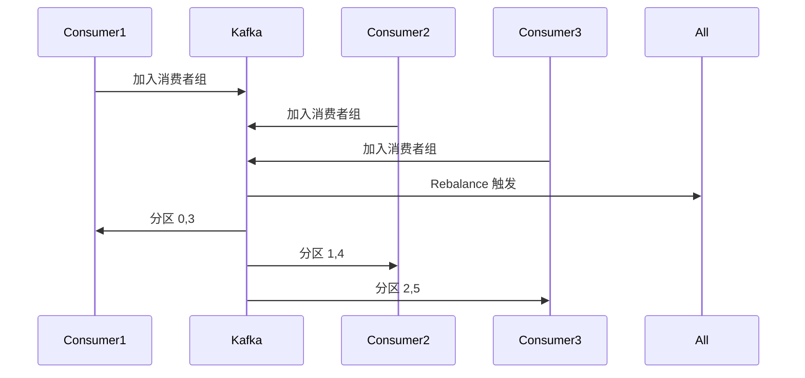
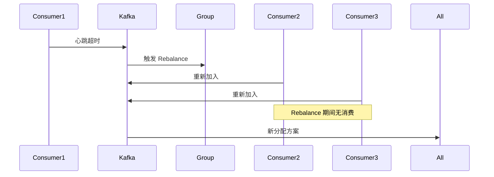
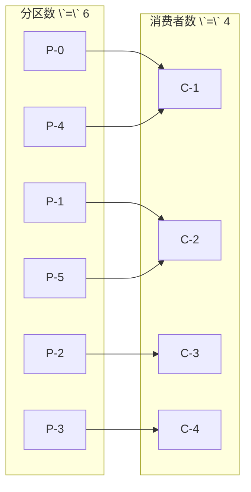

# Kafka 分区与消费者组

一个 Topic 有 6 个分区，配置了 6 个消费者，看起来并行度拉满了。但上线后发现，两个消费者在拼命干活，其他四个在空转——问题出在哪？

分区分配策略，是 Kafka 消费者组中最容易踩坑的话题。

## 分区分配策略

当消费者组内有多个消费者时，需要决定「哪个消费者消费哪个分区」。Kafka 提供了三种分配策略。

### Range 策略

按 Topic 分区，一个 Topic 一个 Topic 地分配。

```
Topic-A 有 3 个分区，Topic-B 有 3 个分区，2 个消费者

消费者-1: Topic-A (0,1), Topic-B (0,1)
消费者-2: Topic-A (2),   Topic-B (2)
```

如果分区数不能被消费者数整除，前几个消费者会多分到分区。

### RoundRobin 策略

将所有 Topic 的分区混合在一起，轮询分配。

```
Topic-A 有 3 个分区，Topic-B 有 3 个分区，2 个消费者

消费者-1: Topic-A (0), Topic-A (2), Topic-B (1)
消费者-2: Topic-A (1), Topic-B (0), Topic-B (2)
```

RoundRobin 策略更均衡，但如果消费者订阅不同 Topic，可能出现分配不均。

### StickyAssignor 策略

在 RoundRobin 基础上，增加「粘性」——尽量保持原有的分配关系不变，只在必要时重新分配。

```java
// 配置分配策略
props.put("partition.assignment.strategy", 
    "org.apache.kafka.clients.consumer.StickyAssignor");
```

StickyAssignor 可以减少 Rebalance 时的分区漂移，降低消息处理中断的时间。

## 消费者组 Rebalance

消费者组的分区分配不是一成不变的。当消费者数量变化、订阅变化、或消费者心跳超时时会触发 **Rebalance**，重新分配分区。



### Rebalance 触发条件

- 消费者加入或离开消费者组
- 消费者心跳超时，被踢出组
- 消费者订阅的 Topic 发生变化
- 分区数量变化（Topic 扩缩容）

### Rebalance 过程

```
JoinGroup → SyncGroup → Fetch → ...
```

1. **JoinGroup**：所有消费者向 Group Coordinator 发送加入请求，Coordinator 等待所有消费者加入
2. **SyncGroup**：Coordinator 将分配方案同步给所有消费者
3. **Fetch**：消费者开始从分配的分区拉取消息

## Rebalance 的代价

Rebalance 虽然保证了分配的均衡，但代价也不小：

**消费中断**：Rebalance 期间，消费者无法消费消息。如果 Rebalance 频繁，会严重影响吞吐量。

**重复消费**：Rebalance 前正在处理的消息，处理完成后 offset 未提交，会被新消费者重新消费。

**通知风暴**：消费者感知到变化后，会立即加入/离开组，如果处理不当，可能引发连环 Rebalance。



## Rebalance 优化

### 合理配置心跳参数

```java
props.put("session.timeout.ms", 30000);      // 消费者与 Coordinator 的心跳超时
props.put("heartbeat.interval.ms", 10000);   // 心跳间隔
props.put("max.poll.interval.ms", 300000);   // 最大 poll 间隔（处理时间）
```

`session.timeout.ms` 设置过短会导致误判（网络抖动时消费者被踢出），设置过长会延迟 Rebalance 响应。

### 控制处理时间

每次 poll 的消息数量和处理时间会影响 Rebalance 频率：

```java
// 如果单条消息处理时间很长，考虑减少每次拉取的数量
props.put("max.poll.records", 100);  // 每次最多拉取 100 条

// 或者增大最大 poll 间隔
props.put("max.poll.interval.ms", 600000);  // 10 分钟内必须 poll 一次
```

### 使用静态成员

消费者重启后，如果使用相同的 `group.instance.id`，会保留原有的分区分配，不会触发 Rebalance：

```java
props.put("group.instance.id", "consumer-001");  // 消费者实例 ID
```

### 避免连环 Rebalance

消费者启动时，如果多个消费者同时加入，可能触发连环 Rebalance。建议错峰启动消费者，或者使用 `delay.group.initial.ms` 配置错开加入时间：

```java
props.put("delay.group.initial.ms", 1000);  // 初始加入延迟 1 秒
```

## 分区数与消费者数的关系

Kafka 的并行度由分区数和消费者数共同决定，遵循木桶原理。



**核心规则**：

- 消费者数 `<=` 分区数：每个消费者至少消费一个分区
- 消费者数 `>` 分区数：多余的消费者空闲
- 消费者数 `=` 分区数：理想状态，每个消费者独享分区

> **规划建议**：分区数应该在 Topic 创建时就规划好，因为增加分区数会打破原有的分配关系（如果有状态消费，迁移成本很高）。建议按预估吞吐量的 1/100~1/50 来设置分区数，例如预期 10000 msg/s，单消费者处理能力 500 msg/s，则分区数设置为 20~30。

## 监控与调优

```java
// 获取消费者组的状态
kafka-consumer-groups.sh --bootstrap-server kafka:9092 \
    --group my-consumer-group \
    --describe
```

输出示例：

```
GROUP           TOPIC      PARTITION  CURRENT-OFFSET  LOG-END-OFFSET  LAG   CONSUMER
my-consumer     orders     0          5000             5200            200   consumer-1
my-consumer     orders     1          4800             4800            0    consumer-2
my-consumer     orders     2          5100             5100            0    consumer-1
```

LAG 列是核心监控指标，LAG 持续增长说明消费能力不足，需要扩容消费者或优化消费逻辑。
