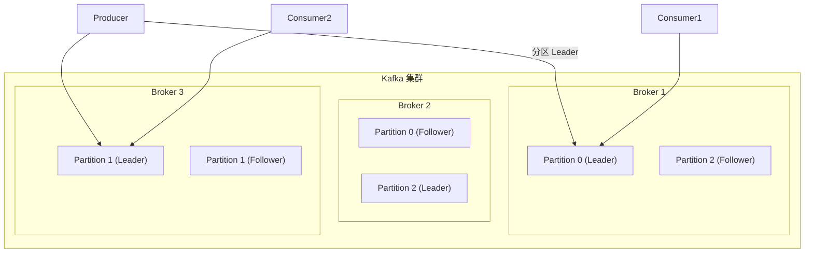
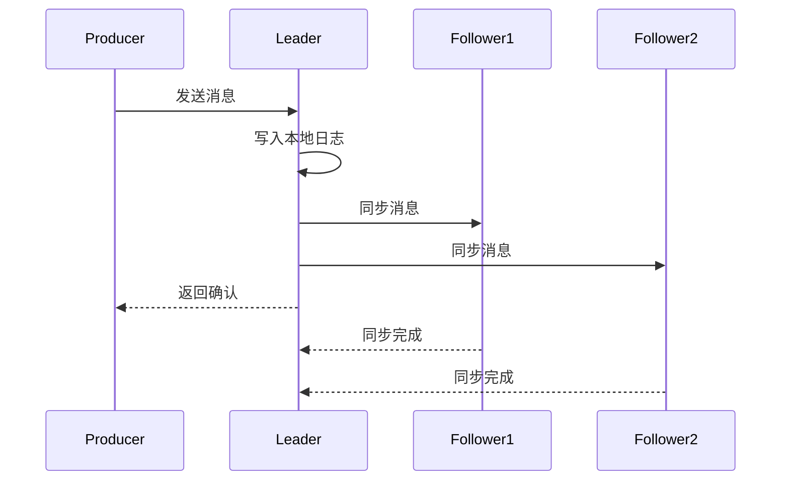

# Kafka 架构深度解析

LinkedIn 日均处理万亿级消息，却能保持毫秒级延迟。支撑这个规模的，正是 Kafka 独特的架构设计。理解 Kafka 的架构，是掌握现代分布式消息队列的必修课。

## Kafka 整体架构

Kafka 是一个分布式流平台，采用分区副本和顺序写的设计，实现了高吞吐、高可靠和水平扩展的统一。



### 核心组件

**Broker**：Kafka 服务实例，一个 Kafka 集群由多个 Broker 组成。每个 Broker 存储一部分分区，Broker 之间相互独立。

**Producer**：消息生产者，将消息发送到指定 Topic 的分区。

**Consumer**：消息消费者，从分区读取消息并处理。

**Topic**：消息的逻辑分类容器，每个 Topic 包含若干分区。

**Partition**：分区的物理存储单元，每个分区可以有多个副本，分布在不同 Broker 上。

## Topic 与分区分布

一个 Topic 可以有多个分区，分区分布在不同的 Broker 上，实现数据分片和并行处理。

```
Topic: orders (6 partitions, replication-factor: 3)

Broker-1: Partition-0 (Leader), Partition-3 (Follower), Partition-5 (Follower)
Broker-2: Partition-1 (Follower), Partition-4 (Leader), Partition-0 (Follower)
Broker-3: Partition-2 (Leader), Partition-5 (Leader), Partition-1 (Follower)
```

### 分区副本机制

每个分区有多个副本（由 `replication-factor` 配置），其中一个是 Leader 副本，负责处理读写请求；其他是 Follower 副本，异步从 Leader 同步数据。



Leader 故障时，Kafka Controller 会从 ISR（In-Sync Replicas，同步副本集合）中选举新的 Leader。ISR 是与 Leader 保持同步的副本集合，只有在 ISR 中的副本才有资格被选为 Leader。

## 日志存储结构

Kafka 的消息存储在分区的日志文件中，每个分区对应一个目录，目录下包含多个日志段（Segment）。

```
kafka-logs/
└── orders-0/
    ├── 00000000000000000000.log      # 日志数据文件
    ├── 00000000000000000000.index    # 偏移量索引文件
    ├── 00000000000000000000.timeindex # 时间戳索引文件
    ├── 00000000000000012345.log      # 新的日志段
    ├── 00000000000000012345.index
    └── leader-epoch-checkpoint        # Leader Epoch 文件
```

### 日志段（Segment）

每个日志段包含一个数据文件（`.log`）和两个索引文件（`.index` 和 `.timeindex`）：

- **`.log`**：存储实际消息，追加写入
- **`.index`**：偏移量索引，按 offset 定位消息位置
- **`.timeindex`**：时间戳索引，按时间戳查找消息

### 日志清理策略

Kafka 支持两种日志清理策略：

**删除策略（Delete）**：按时间或大小删除旧日志段

```properties
log.retention.hours=168        # 保留 7 天
log.retention.bytes=-1         # 不限制大小（按时间清理）
log.cleanup.policy=delete       # 删除策略
```

**压缩策略（Compact）**：对相同 Key 的消息保留最新一条

```properties
log.cleanup.policy=compact     # 压缩策略
log.cleaner.min.compaction.lag.ms=3600000  # 消息至少保留 1 小时
```

压缩策略适用于需要保留最新状态的消息，如数据库变更日志（Changelog）。

## 高性能原理

Kafka 能够实现百万级 QPS，核心在于三个技术：顺序写、零拷贝、页缓存。

### 顺序写

消息追加写入日志文件末尾，利用磁盘顺序写的特性，吞吐量可以媲美内存写入。

```
# 顺序写：写入指针始终在末尾
[msg1][msg2][msg3][msg4][msg5]...
                      ↑
                  写入指针
```

随机写的吞吐量约为 100~200 MB/s，而顺序写可以达到 500~600 MB/s，差距可达数倍。

### 零拷贝

传统数据读取需要 4 次拷贝、4 次上下文切换：

```
磁盘 → 内核缓冲区 → 用户缓冲区 → Socket 缓冲区 → 网卡
```

Kafka 使用 Linux 的 `sendfile` 系统调用，实现零拷贝：

```
磁盘 → 内核缓冲区 → 网卡
       （直接传递，避免用户态）
```

减少内存拷贝和上下文切换，可将性能提升 2~3 倍。

### 页缓存（Page Cache）

操作系统将磁盘数据缓存到内存中。写入数据先写入页缓存，后台异步刷盘；读取数据时优先从页缓存读取。

```
写入路径: 应用 → 页缓存 → 磁盘（异步）
读取路径: 应用 ← 页缓存 ← 磁盘（缓存命中）
```

Kafka 的顺序读写模式完美匹配页缓存的工作方式，大部分读取都发生在缓存中，极大提升了性能。

> **配置建议**：如果 Kafka 与其他应用共享机器，页缓存可能被挤占。建议 Kafka 独占机器或使用容器隔离，确保页缓存稳定。

## Controller 与集群管理

Kafka 集群中有一个 Broker 被选举为 Controller，负责管理整个集群的元数据和副本状态。

**Controller 的职责**：

- 监听 Broker 上下线事件
- 为分区选举新的 Leader
- 管理分区副本的分配和状态
- 处理 Topic 创建、删除等元数据变更


Controller 使用 Zookeeper（早期）或 KRaft（新版）实现选举和高可用，确保集群管理的可靠性。

## 生产配置建议

```properties
# Broker 配置
num.network.threads=8           # 网络线程数
num.io.threads=16              # I/O 线程数
socket.send.buffer.bytes=102400 # Socket 发送缓冲区
socket.receive.buffer.bytes=102400
num.partitions=12               # 默认分区数（可根据吞吐量调整）
default.replication.factor=3   # 默认副本数

# Topic 配置
min.insync.replicas=2           # ISR 最小副本数
retention.ms=604800000          # 保留 7 天
```

理解 Kafka 架构，不是为了记住这些组件叫什么，而是理解为什么这样设计。顺序写和零拷贝是对磁盘和网络特性的极致利用；分区和副本是对可靠性与性能的权衡；Controller 是分布式协调的简化实现。这些设计思想，在其他分布式系统中同样可以看到。
