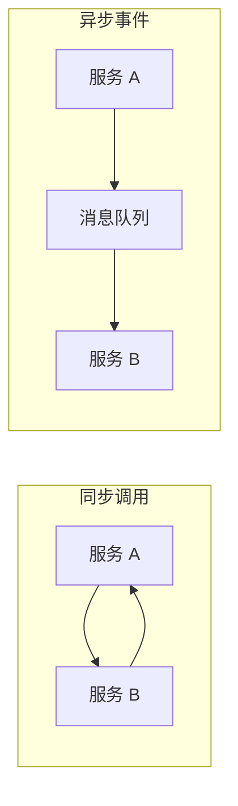
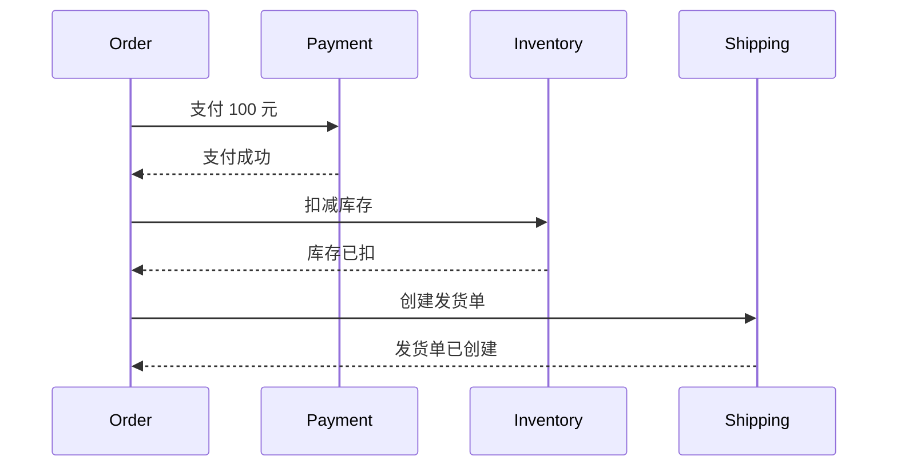
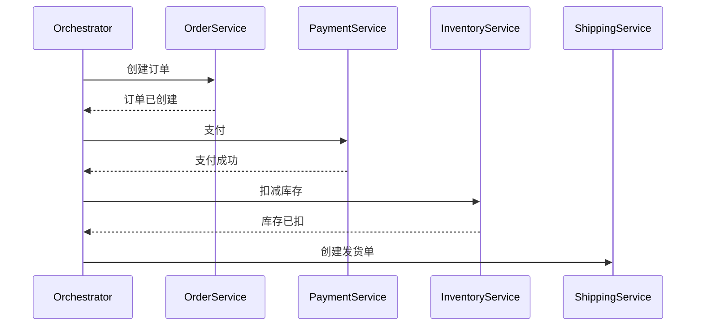
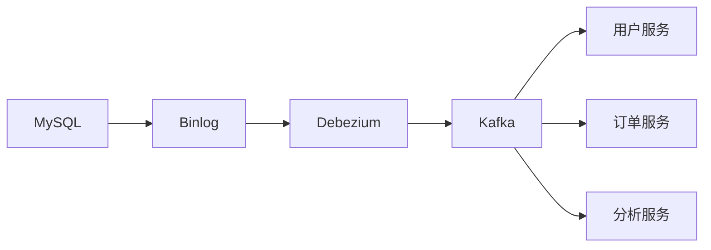

# 消息队列在微服务中的应用

微服务架构下，服务之间如何通信？同步 HTTP 调用简单直接，但耦合紧、容错差。异步消息通信则实现了真正的松耦合——服务 A 只需要知道自己「发出了什么事件」，不需要知道谁在处理。

## 异步事件驱动

传统的同步调用：服务 A 调用服务 B，必须等待 B 返回才能继续。服务 B 挂了，A 也跟着失败。

事件驱动架构：用消息队列解耦。服务 A 发布事件，服务 B 订阅处理。A 不需要知道 B 的存在，通信变成了单向的「通知」。



### 事件驱动的好处

**松耦合**：服务之间不直接依赖，通过事件间接通信。

**独立演进**：服务可以独立开发、部署、扩展。

**容错性强**：消息队列提供缓冲，短暂的服务不可用不会导致消息丢失。

**可扩展**：新增消费者不影响现有服务。

### 事件驱动的问题

**最终一致性**：服务之间不再强一致，需要接受最终一致。

**调试困难**：跨服务的调用链路不直观，问题排查更复杂。

**事务边界**：跨服务的一致性需要 Saga 等模式来保证。

## Saga 分布式事务

微服务架构下，每个服务有独立的数据库，本地事务无法覆盖跨服务操作。Saga 模式用「补偿」代替「回滚」，用一系列本地事务实现分布式事务。

### Saga 的两种编排方式

**编排式 Saga（Choreography）**：各服务通过事件相互通信，没有中央协调者。



**编排式 Saga 的补偿**：

```
支付成功 → 库存扣减失败 → 补偿：退款
支付成功 → 库存扣减成功 → 发货失败 → 补偿：库存回滚 + 退款
```

**编排式 Saga 问题**：服务间循环依赖风险，事务边界不清晰。

**编排式 Saga（Orchestration）**：中央协调者（Saga Orchestrator）管理整个事务流程。



### Saga 实现示例

```java
// Saga 编排器
public class OrderSagaOrchestrator {
    
    @Autowired
    private OrderService orderService;
    @Autowired
    private PaymentService paymentService;
    @Autowired
    private InventoryService inventoryService;
    
    public void executeOrderSaga(OrderRequest request) {
        try {
            // Step 1: 创建订单
            Order order = orderService.createOrder(request);
            
            // Step 2: 支付
            PaymentResult payment = paymentService.pay(order);
            
            // Step 3: 扣减库存
            inventoryService.reserve(order);
            
            // Step 4: 完成订单
            orderService.confirm(order);
            
        } catch (PaymentException e) {
            // 补偿：取消订单
            orderService.cancel(order);
        } catch (InventoryException e) {
            // 补偿：退款
            paymentService.refund(order.getId());
            orderService.cancel(order);
        }
    }
}
```

### Saga vs 2PC

| 特性 | Saga | 2PC |
|---|---|---|
| 协调方式 | 异步补偿 | 同步阻塞 |
| 协调者单点 | 无（Saga 模式） | 有 |
| 性能影响 | 低 | 高 |
| 数据一致性 | 最终一致 | 强一致 |
| 适用场景 | 长事务 | 短事务 |
| 补偿复杂度 | 高 | 无需补偿 |

## 数据同步与 CDC

微服务提倡「数据库 per 服务」，但有些场景需要跨服务共享数据。CDC（Change Data Capture，变更数据捕获）提供了一种优雅的解决方案。

### CDC 工作原理

```
数据库 → Binlog/Redo Log → CDC 工具 → 消息队列 → 下游服务
```

CDC 工具监听数据库变更日志，将变更事件发布到消息队列，下游服务消费后更新自己的数据副本。



### Debezium 示例

```java
// Debezium 配置
public class DebeziumConfig {
    
    @Bean
    public io.debezium.config.Configuration debeziumConfig() {
        return io.debezium.config.Configuration.create()
            .with("name", "mysql-connector")
            .with("connector.class", "io.debezium.connector.mysql.MySqlConnector")
            .with("database.hostname", "mysql")
            .with("database.port", 3306)
            .with("database.user", "debezium")
            .with("database.password", "password")
            .with("database.server.id", 184054)
            .with("database.include.list", "mydb")
            .with("table.include.list", "mydb.orders")
            .with("topic.prefix", "dbz")
            .build();
    }
}
```

### CDC 的价值

- **低延迟**：直接读取 binlog，延迟可控制在毫秒级
- **无损捕获**：不依赖业务代码，数据库变更一定被捕获
- **异构同步**：同一个变更事件可以同时发给多个下游

## 最终一致性保障

事件驱动架构下，系统处于「最终一致」状态。如何保障最终一致性？

### 原则一：事件幂等

消费者必须能处理重复事件。

```java
@KafkaListener(topics = "order-events")
public void handleOrderEvent(ConsumerRecord<String, OrderEvent> record) {
    OrderEvent event = record.value();
    
    // 业务层幂等处理
    if (orderService.isProcessed(event.getId())) {
        return;
    }
    
    orderService.processEvent(event);
}
```

### 原则二：补偿机制

定义好补偿事件（Compensating Event），当正向操作失败时执行补偿。

```
下单成功 → 支付失败 → 发送「订单取消」事件 → 各服务回滚
```

### 原则三：状态机流转

用状态机约束事件的合法流转，防止非法事件导致状态错乱。

```java
// 订单状态机
public enum OrderStatus {
    CREATED,       // 订单创建
    PAID,          // 已支付
    INVENTORY_RESERVED,  // 库存已预留
    SHIPPED,       // 已发货
    COMPLETED,     // 已完成
    CANCELLED      // 已取消
}

// 合法的状态流转
public boolean canTransition(OrderStatus from, OrderStatus to) {
    return switch (from) {
        case CREATED -> to == PAID || to == CANCELLED;
        case PAID -> to == INVENTORY_RESERVED || to == CANCELLED;
        case INVENTORY_RESERVED -> to == SHIPPED || to == CANCELLED;
        case SHIPPED -> to == COMPLETED;
        default -> false;
    };
}
```

### 原则四：超时检测

定期检测超时未完成的事务，主动补偿。

```java
@Scheduled(fixedRate = 60000)
public void checkTimeoutOrders() {
    List<Order> timeoutOrders = orderService.findTimeoutOrders();
    
    for (Order order : timeoutOrders) {
        // 发送超时补偿事件
        eventPublisher.publish(new OrderTimeoutEvent(order.getId()));
    }
}
```

> **经验之谈**：事件驱动架构的核心挑战不是技术，而是组织。上下游服务由不同团队维护，事件的契约（Schema）一旦发布就难以变更。在发布事件之前，花时间设计好事件格式，考虑好未来可能的扩展。
