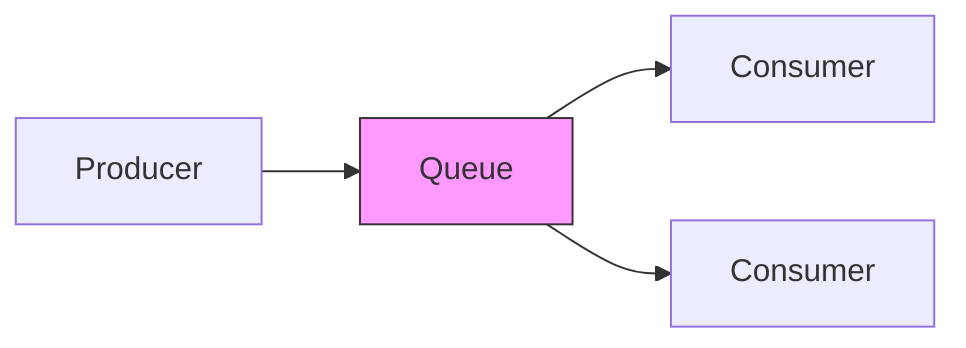
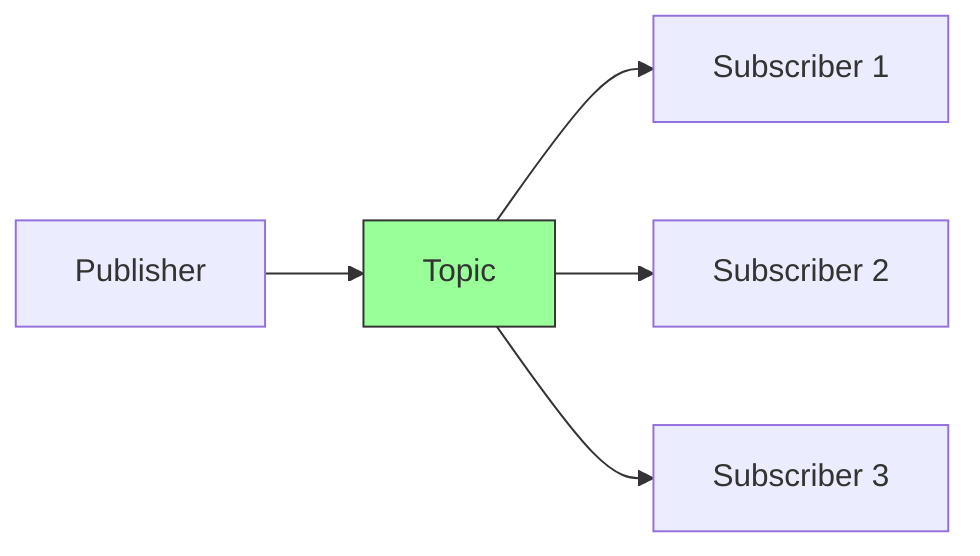
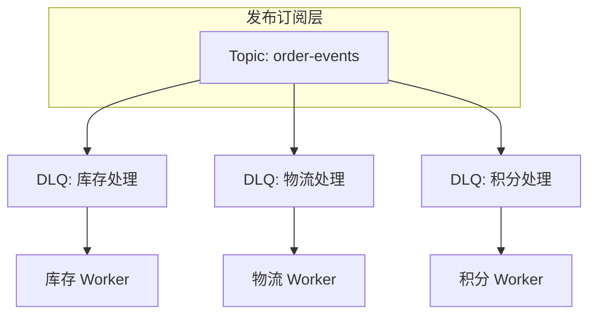

# 点对点 vs 发布订阅模型

一个用户下单后，需要通知库存系统扣减库存、通知物流系统准备发货、通知积分系统增加积分、通知营销系统检查优惠券。如果用同步调用，库存系统慢了，整个下单流程都要等待。这种场景，正是消息队列价值最直观的体现。

但不同的业务场景，需要不同的消息投递模型。理解点对点和发布订阅的区别，是选型消息队列的第一步。

## 点对点模型（Point-to-Point）

点对点模型中，消息被发送到**队列（Queue）**，每条消息只能被一个消费者消费。生产者发送消息后，队列负责存储和投递；消费者从队列取出消息并处理，处理完成后确认消息。

点对点模型的核心特征是「**一条消息、一个消费者**」。即使队列有多个消费者，消息也只会被其中一个处理，其他消费者不会看到这条消息。

**典型应用场景**：

- 任务队列：把耗时的任务扔进队列，多个 Worker 竞争消费
- 订单处理：每个订单只需被处理一次
- 邮件发送：每封邮件只发送一次

## 发布订阅模型（Publish-Subscribe）

发布订阅模型中，消息被发送到**主题（Topic）**，每个订阅者（Subscriber）都能收到消息的全部副本。发布者和订阅者之间是松耦合的，发布者不知道也不关心谁在订阅。

发布订阅模型的核心特征是「**一条消息、所有订阅者**」。每条消息都会被复制多分，发送给所有订阅者。

**典型应用场景**：

- 事件通知：用户注册后通知多个下游系统
- 数据同步：数据库变更同步到多个存储
- 广播配置更新：配置变更推送到所有服务实例

## 对比表格

| 特性 | 点对点模型 | 发布订阅模型 |
|---|---|---|
| 消息去向 | 一对一 | 一对多 |
| 消费者关系 | 互斥竞争 | 独立接收 |
| 消息生命周期 | 被消费后删除 | 可保留、可重播 |
| 典型代表 | RabbitMQ Queue | Kafka Topic / Redis Pub/Sub |
| 消费模式 | 拉取（Pull）或推送（Push） | 通常是推送（Push） |
| 消息状态 | 即时消费 | 可积累、可回溯 |

## 选型建议

选择哪种模型，取决于业务的核心诉求。

**选择点对点模型**：

- 消息只需要被处理一次，不允许重复处理
- 任务是独立的、可以并行处理的工作单元
- 需要多个 Worker 竞争消费，实现负载均衡
- 典型的任务分发、异步处理场景

**选择发布订阅模型**：

- 一个事件需要触发多个下游处理
- 下游系统是独立演进的，不知道也不关心对方
- 需要消息重播能力，从某个时间点重新消费
- 典型的数据同步、事件驱动场景

## 混合使用场景

实际业务中，点对点和发布订阅往往不是非此即彼的关系，而是组合使用。

例如，使用发布订阅实现一对多通知，但针对每个下游使用独立的消费队列来实现负载均衡和失败重试。这种「Topic + Queue」的组合模式，是生产环境中非常常见的架构。

> **经验之谈**：如果不确定该用哪种模型，先问自己一个问题：「这条消息的处理结果是独立的还是聚合的？」如果是独立的（如订单处理），考虑点对点；如果是聚合的（如事件总线），考虑发布订阅。
