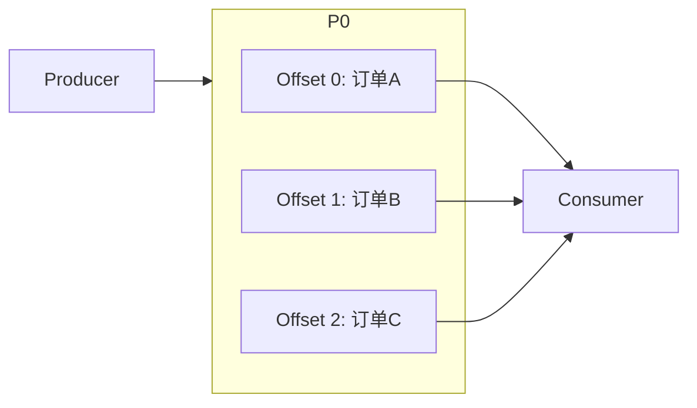
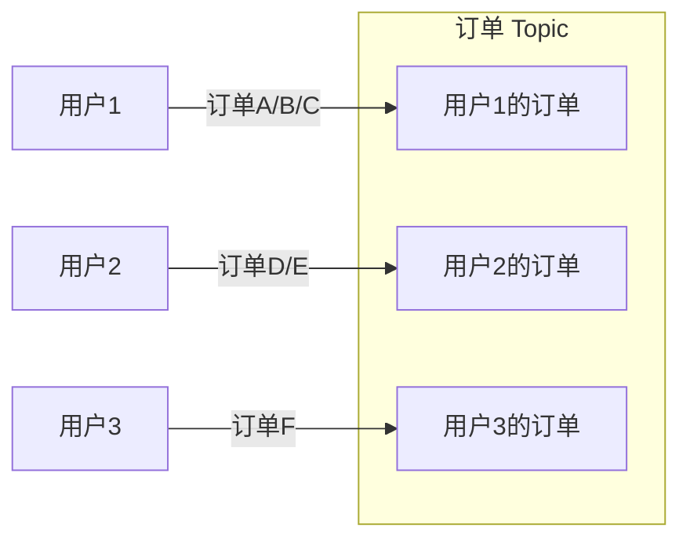

# 消息顺序保证

一个用户连续下了三个订单：订单 A（商品甲）、订单 B（商品乙）、订单 C（商品丙）。发货系统按照 A → B → C 的顺序发出，但用户收到货物的顺序却是 C → A → B。用户一脸困惑：明明按顺序下单，为什么先买的东西最后才到？

这个问题背后，是消息队列中最容易踩坑的话题——**消息顺序**。

## 单分区顺序保证

在单个分区（Partition）内，消息严格按照写入顺序存储和消费。这是因为每个分区本质上是一个**追加写的日志文件**（Append-Only Log），消息按照 Offset 顺序排列。



只要所有消息都发送到同一个分区，消费者就会按照 A → B → C 的顺序处理。这是 Kafka 保证消息顺序的核心机制。

## 全局顺序的代价

但全局顺序（所有消息严格有序）是一个**昂贵的奢望**。原因在于：

**并行度受限**：单分区意味着所有消息串行处理，无法利用多核 CPU 和多机集群的并行能力。如果业务本身需要高吞吐，全局顺序就是瓶颈。

**容错性差**：单分区下，如果某个 Broker 宕机，整个 Topic 就不可用了。Kafka 通过多副本机制提高可靠性，但 leader 副本仍然是单点。

**扩展性差**：分区数决定了并行消费的最大数量。单分区意味着最多只能有一个消费者，无法水平扩展。

> **核心权衡**：消息有序性 vs 系统吞吐量和可用性。这是一个必须根据业务场景做出的设计决策。

## 保证有序的方法

根据业务对有序性的要求不同，有几种实现方法。

### 方法一：单分区 + 单消费者

最简单粗暴的方式。整个 Topic 只有一个分区、一个消费者，所有消息严格有序。

```
Topic (1 Partition) → Consumer (1 Instance)
```

适用场景：对顺序要求极高的场景，如金融交易、库存扣减。代价是完全丧失并行能力。

### 方法二：按业务 Key 路由

将需要保证顺序的消息路由到同一个分区，其他消息不受影响。这是生产环境中最常用的方案。

```java
// 按用户 ID 路由，保证同一用户的操作有序
public int partition(String key, int numPartitions) {
    // 相同的 key 映射到相同的分区
    return Math.abs(key.hashCode()) % numPartitions;
}
```

例如，订单消息按用户 ID 路由，同一用户的所有订单都会进入同一个分区，不同用户之间互不影响。这样既保证了业务意义上的顺序，又保留了并行能力。



### 方法三：时间戳窗口

对于需要**因果顺序**而非严格顺序的场景，可以用时间戳窗口来实现近似的有序。

```
窗口内有序，窗口间相对无序
[0-1s] → [1s-2s] → [2s-3s]
```

例如，统计每分钟的交易量，允许一分钟内的消息乱序，只要保证分钟级别的聚合正确即可。

## Kafka 顺序保证机制

Kafka 对消息顺序的保证，体现在以下几个方面：

**生产者端**：通过 `max.in.flight.requests.per.connection = 1` 配置，可以确保在收到确认前不发送下一条消息，实现严格顺序发送。但这会严重影响吞吐量。

**Broker 端**：每个分区内消息严格有序，但分区之间无序。通过合理设计分区策略，可以实现业务层面的有序。

**消费者端**：消费者按照消息在分区中的顺序消费。手动提交 offset 时，必须按顺序提交，否则可能导致消息被跳过。

```java
// 错误：跨分区并行处理，无法保证全局顺序
@KafkaListener(topics = "orders", concurrency = "3")
public void handleOrder(ConsumerRecord<String, Order> record) {
    // 不同分区并行执行
}

// 正确：按分区维度处理，同一分区内有序
@KafkaListener(topics = "orders")
public void handleOrder(ConsumerRecord<String, Order> record) {
    // 单分区处理，有序
}
```

> **生产警示**：如果并发度（concurrency）配置大于分区数，会有消费者空转浪费资源。最佳实践是让消费者数等于分区数，或者消费者数是分区数的整数倍。

## 常见误区

**误区一：Kafka 消息是全局有序的**

Kafka 只保证单个分区内有序，不是全局有序。如果需要全局顺序，必须使用单分区，但这通常是架构设计有问题。

**误区二：消息乱序是因为队列本身不可靠**

大多数乱序问题根因在生产者端：没有正确设置分区 key，或者多线程并发发送导致写入顺序不确定。

**误区三：消费端乱序一定是消费顺序问题**

有时候乱序是业务逻辑问题：比如扣款消息先到、订单确认消息后到，但业务没有正确处理「订单未确认就扣款」的情况。这种情况需要业务层面保证幂等，而不是依赖消息队列。
