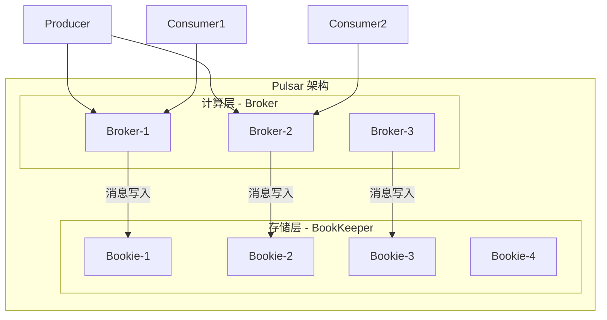
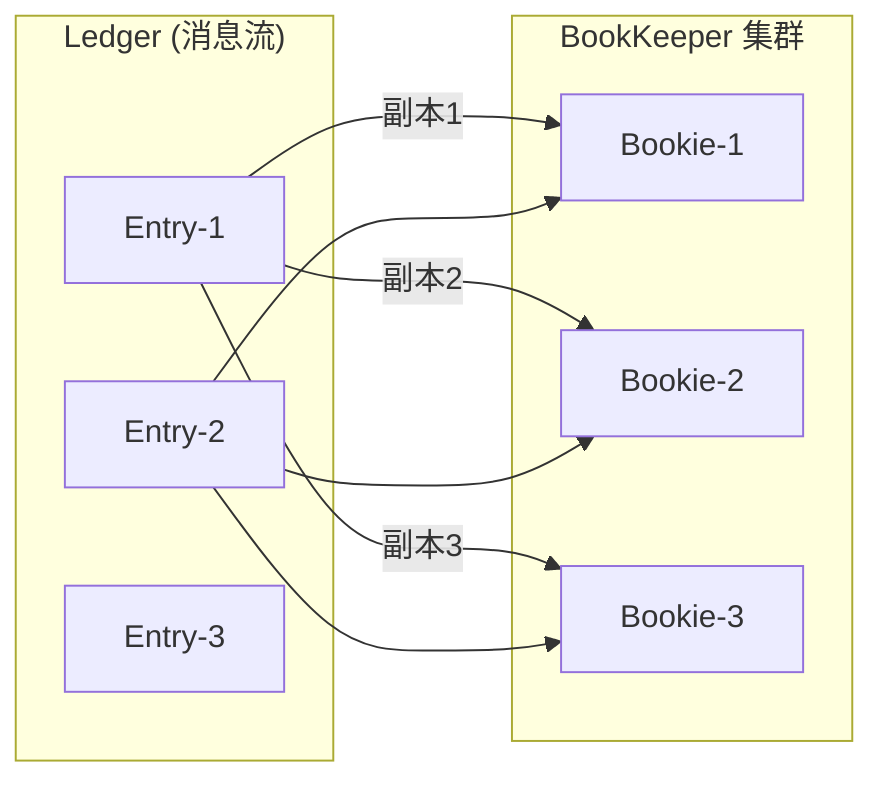
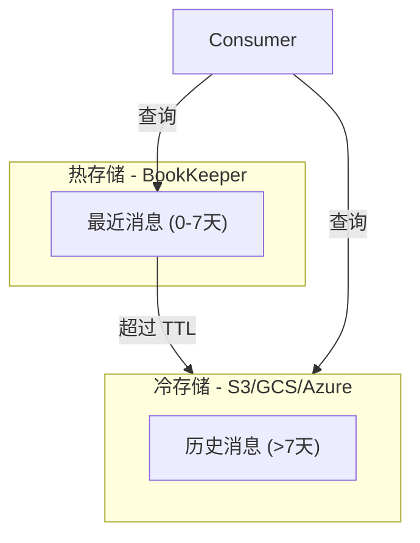
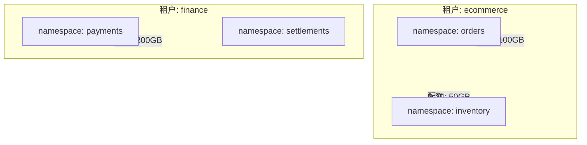

# Pulsar 架构深度解析

Kafka 称霸流处理领域多年，但 Yahoo 团队在 2016 年推出了 Pulsar，提出了一个灵魂拷问：消息系统的存储层和计算层，真的应该绑定在一起吗？

这个问题的答案，催生了一个与 Kafka 完全不同架构的消息系统。

## Pulsar 与 Kafka 的核心差异

Kafka 采用存储计算耦合架构：Broker 既负责服务请求（计算），又负责存储数据。好处是简单直接，坏处是扩展受限——如果要扩容存储容量，必须同时扩容计算能力。

Pulsar 采用**存储计算分离**架构：



**Broker 无状态**：Broker 只处理读写请求，不存储数据。Broker 挂了，流量切到其他 Broker，没有任何数据迁移。

**数据在 BookKeeper**：消息实际存储在 Apache BookKeeper 的存储节点（Bookie）上，多副本、强一致。

## BookKeeper 存储层

Apache BookKeeper 是一个专门为实时工作负载设计的分布式日志存储系统，Pulsar 使用它作为底层存储。

### BookKeeper 核心概念

**Ledger**：逻辑日志，由多个 Entry 组成，类似 Kafka 的分区，但更底层。

**Entry**：日志条目，包含消息数据。

**Fragment**：Ledger 在 Bookie 上的分片，一个 Ledger 可以跨多个 Bookie 存储。



### BookKeeper 的优势

**强一致**：BookKeeper 使用 Quorum 写入机制（类似 Raft），写入需要多数派确认，保证数据不丢失。

**均匀分布**：数据自动打散到多个 Bookie，避免热点，单 Bookie 故障不影响整体。

**独立扩展**：存储容量不足时，增加 Bookie 即可；计算能力不足时，增加 Broker 即可。两者独立扩缩容。

## Tiered Storage：冷热分离

Kafka 的数据存储在本地磁盘，数据量大到一定程度后，存储成本急剧上升。Pulsar 的 Tiered Storage（分层存储）解决了这个问题。



冷热分离的工作流程：

1. 消息写入 BookKeeper（热存储）
2. 配置 TTL（如 7 天）后，旧数据异步上传到 S3/HDFS（冷存储）
3. 消费历史消息时，自动从冷存储读取，对消费者透明

```properties
# 配置分层存储
managedLedgerOffloadDriver=aws-s3
s3ManagedLedgerOffloadBucket=pulsar-offload
s3ManagedLedgerOffloadRegion=us-east-1
managedLedgerOffloadThresholdInBytes=100000000  # 超过 100MB 自动卸载
```

## 多租户架构

Pulsar 原生支持多租户，每个租户可以有自己的属性、配额、隔离策略。



### 命名空间（Namespace）

租户下有命名空间，命名空间下是 Topic。命名空间是配置管理的基本单元：

```bash
# 创建租户
bin/pulsar-admin tenants create ecommerce --allowed-clusters cluster1

# 创建命名空间
bin/pulsar-admin namespaces create ecommerce/orders

# 配置消息 TTL（7 天）
bin/pulsar-admin namespaces set-retention ecommerce/orders \
    --retentionTime 7d --retentionSize 100G
```

## Producer 与 Consumer

Pulsar 的 Producer 和 Consumer 相比 Kafka 略有不同。

### Producer

```java
PulsarClient client = PulsarClient.builder()
    .serviceUrl("pulsar://broker:6650")
    .build();

Producer<String> producer = client.newProducer()
    .topic("persistent://ecommerce/orders/new-orders")
    .create();

producer.send("Order created: Order-123");
```

### Consumer

```java
Consumer<String> consumer = client.newConsumer()
    .topic("persistent://ecommerce/orders/new-orders")
    .subscriptionName("fulfillment-service")
    .subscribe();

while (true) {
    Message<String> msg = consumer.receive();
    try {
        processOrder(msg.getValue());
        consumer.acknowledge(msg);  // 手动确认
    } catch (Exception e) {
        consumer.negativeAcknowledge(msg);  // 失败重试
    }
}
```

## Pulsar 与 Kafka 对比

| 特性 | Pulsar | Kafka |
|---|---|---|
| 架构 | 存储计算分离 | 存储计算耦合 |
| Broker 状态 | 无状态 | 有状态（持有数据） |
| 分区复制 | BookKeeper Quorum | ISR 复制 |
| 分层存储 | 原生支持 | 需要额外配置 |
| 多租户 | 原生支持 | 需要额外配置 |
| 延迟队列 | 原生支持 | 需插件实现 |
| 生态 | 相对较小 | 生态成熟 |

## 选型建议

**选择 Pulsar**：

- 需要多租户隔离的 SaaS 平台
- 需要冷热数据分离的场景
- 需要快速故障恢复（Broker 无状态）
- 需要原生延迟队列功能

**选择 Kafka**：

- 已有 Kafka 技术栈和运维经验
- 需要最大的生态和社区支持
- 对延迟有极致要求（直接读写磁盘更简单）
- 团队更熟悉 Kafka 的运维模式

> **经验之谈**：Pulsar 的学习曲线比 Kafka 陡峭，运维复杂度也更高。如果团队规模小、业务简单，Kafka 足够用；如果规模大、需要多租户，Pulsar 的架构优势会更明显。
