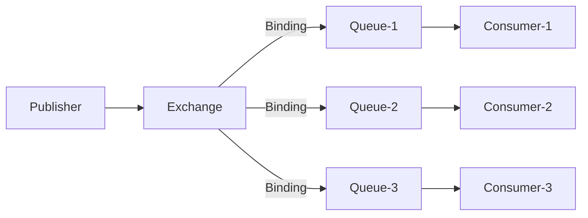
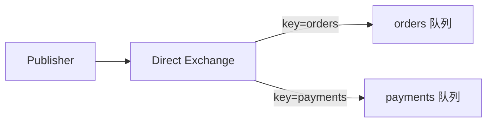
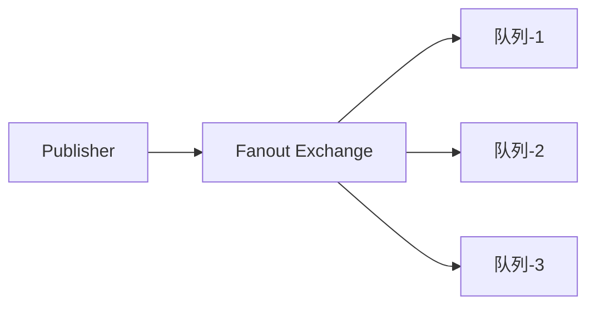
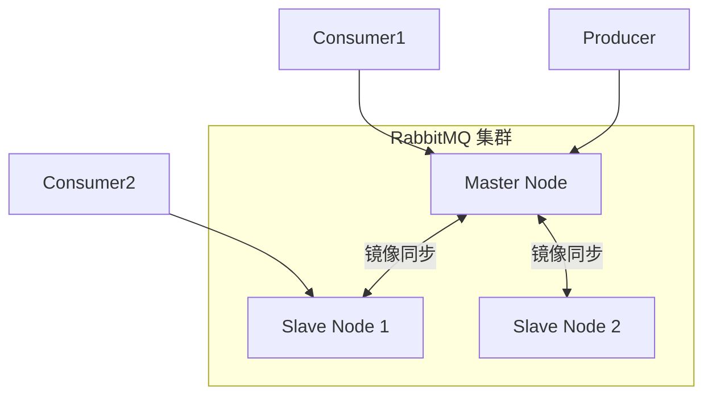

# RabbitMQ 架构深度解析

与 Kafka 面向高吞吐日志场景不同，RabbitMQ 诞生于企业应用集成领域，更关注消息路由的灵活性。它的核心问题不是「如何快速传输消息」，而是「如何精确地把消息送到正确的消费者手中」。

## AMQP 协议基础

RabbitMQ 基于 **AMQP（Advanced Message Queuing Protocol）** 协议，这是一个功能丰富的消息队列协议。

AMQP 的核心模型包含四个组件：

- **Publisher（生产者）**：发送消息
- **Exchange（交换机）**：路由消息
- **Queue（队列）**：存储消息
- **Consumer（消费者）**：接收消息



消息从 Publisher 到 Consumer 的路径：**Publisher → Exchange → Binding → Queue → Consumer**。

## 交换机类型

交换机是 RabbitMQ 最核心的组件，决定了消息如何路由到队列。

### Direct 交换机

精确匹配 routing key，消息被发送到 binding key 完全匹配的队列。



```java
// 创建 Direct 交换机
channel.exchangeDeclare("direct.exchange", BuiltinExchangeType.DIRECT);

// 绑定队列
channel.queueBind("orders.queue", "direct.exchange", "orders");

// 发送消息
channel.basicPublish("direct.exchange", "orders", 
    MessageProperties.PERSISTENT_TEXT_PLAIN, 
    message.getBytes());
```

### Fanout 交换机

忽略 routing key，将消息广播到所有绑定的队列。



适用于「一个事件需要多个消费者独立处理」的场景，如系统通知。

### Topic 交换机

支持通配符匹配 routing key：

- `*` 匹配一个单词
- `#` 匹配零个或多个单词

```java
// routing key: order.created
channel.queueBind("orders.queue", "topic.exchange", "order.*");      // 匹配 order.created
channel.queueBind("all-orders.queue", "topic.exchange", "order.#"); // 匹配 order.created, order.updated, ...
```

### Headers 交换机

根据消息头部的属性进行匹配，性能较低但灵活性高。

```java
Map<String, Object> headers = new HashMap<>();
headers.put("format", "pdf");
headers.put("type", "report");

channel.queueBind("pdf-reports.queue", "headers.exchange", headers);
```

## 消息确认机制

RabbitMQ 提供两种消息确认模式：

### 自动确认（Auto Ack）

消息投递后立即确认，不关心消费者是否处理成功。

```java
channel.basicConsume("queue.name", true, // autoAck = true
    new DefaultConsumer(channel) {
        @Override
        public void handleDelivery(String consumerTag,
                                   Envelope envelope,
                                   AMQP.BasicProperties properties,
                                   byte[] body) {
            // 消息自动确认，即使这里抛异常
        }
    });
```

### 手动确认（Manual Ack）

消费者显式确认消息，处理成功才确认，失败可以拒绝或重试。

```java
channel.basicConsume("queue.name", false, // autoAck = false
    new DefaultConsumer(channel) {
        @Override
        public void handleDelivery(String consumerTag,
                                   Envelope envelope,
                                   AMQP.BasicProperties properties,
                                   byte[] body) {
            try {
                processMessage(body);
                channel.basicAck(envelope.getDeliveryTag(), false); // 确认
            } catch (Exception e) {
                // 处理失败，拒绝消息，可以选择是否重入队列
                channel.basicNack(envelope.getDeliveryTag(), 
                    false, true); // requeue = true
            }
        }
    });
```

### 确认参数说明

```java
channel.basicAck(deliveryTag, false);     // 确认单条
channel.basicAck(deliveryTag, true);      // 确认多条（包括之前的消息）
channel.basicNack(deliveryTag, false, true); // 拒绝，重入队列
channel.basicNack(deliveryTag, false, false); // 拒绝，丢弃消息
```

## 镜像队列与高可用

RabbitMQ 默认将队列存储在单个节点上，节点故障会导致队列不可用。**镜像队列（Mirrored Queue）** 通过将队列复制到多个节点实现高可用。



### 配置镜像队列策略

```bash
# 将所有队列设为镜像队列，同步到所有节点
rabbitmqctl set_policy ha-all "^" '{"ha-mode":"all"}'
```

### 镜像队列的局限

- 写入需要同步到所有镜像，延迟增加
- 主节点故障时，需要选举新主节点，有短暂不可用
- 不适合跨数据中心复制（延迟太高）

> **生产建议**：RabbitMQ 集群模式提供的是「高可用」而非「高吞吐」。如果需要跨地域复制或极高吞吐量，考虑使用 Federation/Shovel 插件或切换到 Kafka。

## 虚拟主机（Virtual Host）

RabbitMQ 支持多租户隔离，通过虚拟主机（Virtual Host）实现资源隔离。

```java
// 连接到特定的虚拟主机
ConnectionFactory factory = new ConnectionFactory();
factory.setVirtualHost("tenant-a");
Connection conn = factory.newConnection();
```

每个虚拟主机有独立的用户、权限、交换机和队列，互不干扰。

## 内存 vs 磁盘节点

RabbitMQ 节点可以选择将消息存储在内存还是磁盘：

- **内存节点**：消息存储在内存，宕机丢失（但持久化消息会写入磁盘）
- **磁盘节点**：消息持久化到磁盘，可靠性更高

生产环境建议使用磁盘节点，并配置 `queue_master_locator` 策略决定队列主节点的分布方式。
