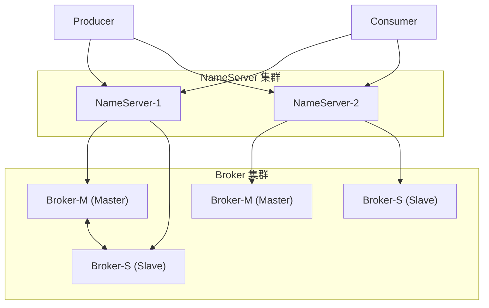
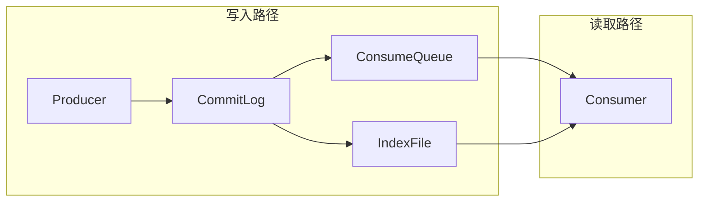
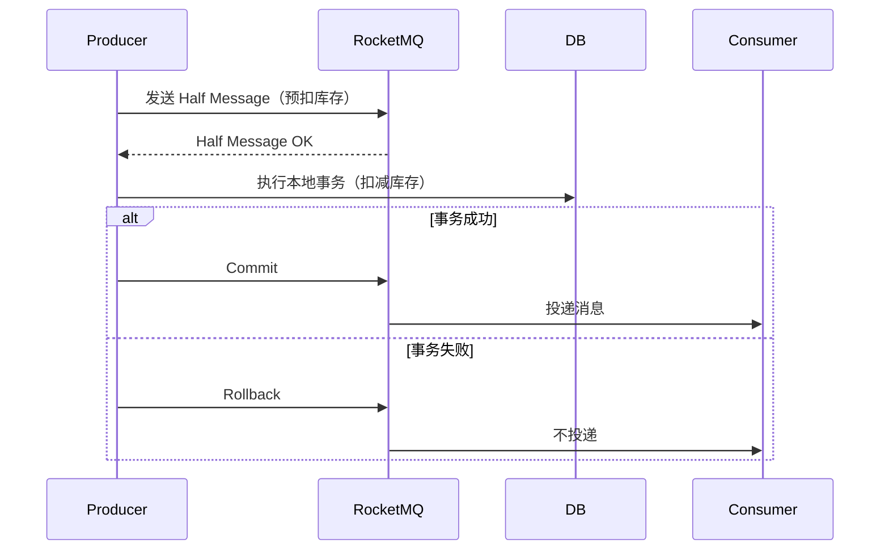
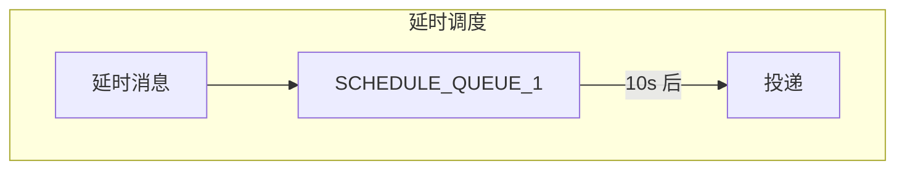

# RocketMQ 架构深度解析

阿里巴巴双十一的万亿级消息处理量，背后是 RocketMQ 在支撑。作为中国开源的消息队列代表，RocketMQ 在事务消息、延时消息等场景上有独特的优势。

## RocketMQ 整体架构

RocketMQ 采用主从架构，核心组件包括 NameServer、Broker、Producer 和 Consumer。



### NameServer：轻量级路由服务

NameServer 是 RocketMQ 的协调中心，提供 Topic 路由信息和 Broker 心跳管理。

**设计哲学**：去中心化、无状态。相比 ZooKeeper 的强一致性协议，NameServer 的 CAP 取舍更偏向可用性——任何 NameServer 节点都可以提供完整路由信息。

```java
// Producer 从 NameServer 获取 Broker 地址
NamesrvConfig namesrvConfig = new NamesrvConfig();
NettyServerConfig nettyServerConfig = new NettyServerConfig();
nettyServerConfig.setListenPort(9876);
NamesrvController namesrvController = 
    new NamesrvController(namesrvConfig, nettyServerConfig);
```

### Broker：高可用消息存储

Broker 负责消息存储、推送、拉取。每个 Broker 有 Master 和 Slave：

- **Master Broker**：处理读写请求
- **Slave Broker**：从 Master 同步数据，提供读负载均衡和故障转移

## 消息存储

RocketMQ 的消息存储设计兼顾可靠性和性能。



### CommitLog：消息主体存储

所有消息顺序写入 CommitLog 文件，这是 RocketMQ 性能高的关键——所有写操作都是顺序追加。

### ConsumeQueue：消息消费队列

Consumer 订阅的是 ConsumeQueue，而不是直接读 CommitLog。ConsumeQueue 存储消息在 CommitLog 中的物理偏移量。

### IndexFile：消息索引

支持按消息 key 或时间戳查询消息，索引文件存储 key 到 CommitLog 偏移量的映射。

## 事务消息

RocketMQ 最特色的功能之一是**事务消息**，解决了分布式事务中的「本地事务成功但消息发送失败」问题。

### 两阶段提交



### 事务消息实现

```java
// 定义事务监听器
TransactionListener transactionListener = new TransactionListener() {
    @Override
    public LocalTransactionState executeLocalTransaction(Message msg, Object arg) {
        // 执行本地事务
        boolean success = orderService.createOrder(msg);
        return success ? LocalTransactionState.COMMIT_MESSAGE 
                       : LocalTransactionState.ROLLBACK_MESSAGE;
    }
    
    @Override
    public LocalTransactionState checkLocalTransaction(MessageExt msg) {
        // 事务状态回查
        return orderService.checkOrderStatus(msg.getTransactionId());
    }
};

TransactionMQProducer producer = new TransactionMQProducer("producer-group");
producer.setTransactionListener(transactionListener);
producer.start();

// 发送事务消息
Message msg = new Message("order-topic", "order", 
    "order-123".getBytes());
SendResult result = producer.sendMessageInTransaction(msg, null);
```

### 事务消息的适用场景

- 库存扣减后必须发送消息
- 支付成功后必须记录流水
- 任何「本地事务 + 消息通知」的场景

> **使用前提**：消费方必须支持幂等消费。因为事务消息可能投递多次（回查时发现本地事务成功但未提交）。

## 延时消息

RocketMQ 原生支持延时消息，可以指定消息在多久后投递。

### 延时级别

RocketMQ 的延时消息是通过延时队列实现的，只支持固定的时间级别：

```java
// 设置延时等级（1s, 5s, 10s, 30s, 1m, 2m, ...）
message.setDelayTimeLevel(3);  // 10 秒后投递
```

### 延时消息原理



延时消息存入对应的 SCHEDULE_QUEUE，到期后重新发布到原来的 Topic。

> **注意**：RocketMQ 开源版本的延时消息只支持预设级别，不支持任意时间。阿里云商业版支持任意时间延时。

## RocketMQ vs Kafka

| 特性 | RocketMQ | Kafka |
|---|---|---|
| 事务消息 | 原生支持 | 需要事务 API |
| 延时消息 | 原生支持 | 需插件 |
| 顺序消息 | 支持 | 支持 |
| 延迟级别 | 18 个预设级别 | 任意时间 |
| 消费模式 | 拉取 + 推送 | 拉取 |
| 吞吐量 | 10 万级 QPS | 百万级 QPS |
| 消息积压 | 支持 | 支持 |

## 选型建议

**选择 RocketMQ**：

- 需要原生事务消息功能
- 需要延时消息（特别是固定级别延时）
- 业务场景在中国，对阿里系产品更熟悉
- 团队有 Java 技术栈背景

**选择 Kafka**：

- 超高吞吐量场景（百万级 QPS）
- 日志采集、数据管道场景
- 需要长时间消息回溯
- 社区生态和生态工具更重要
