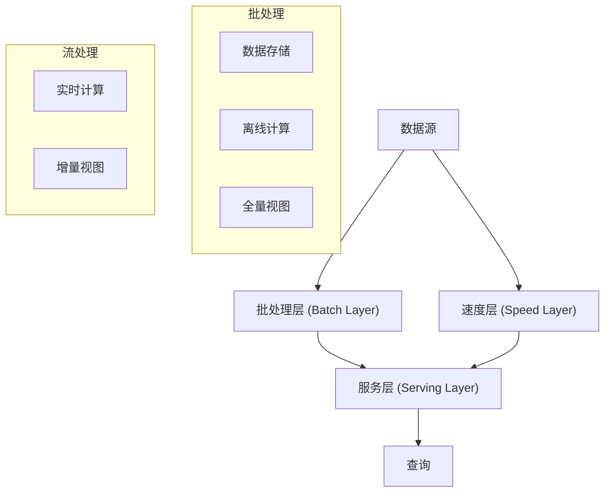
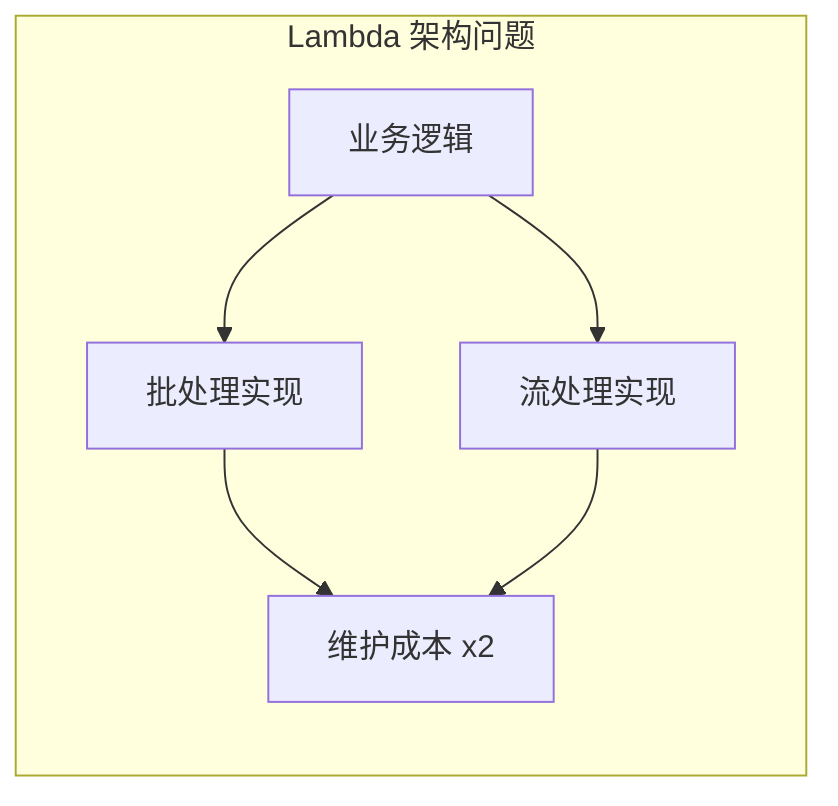
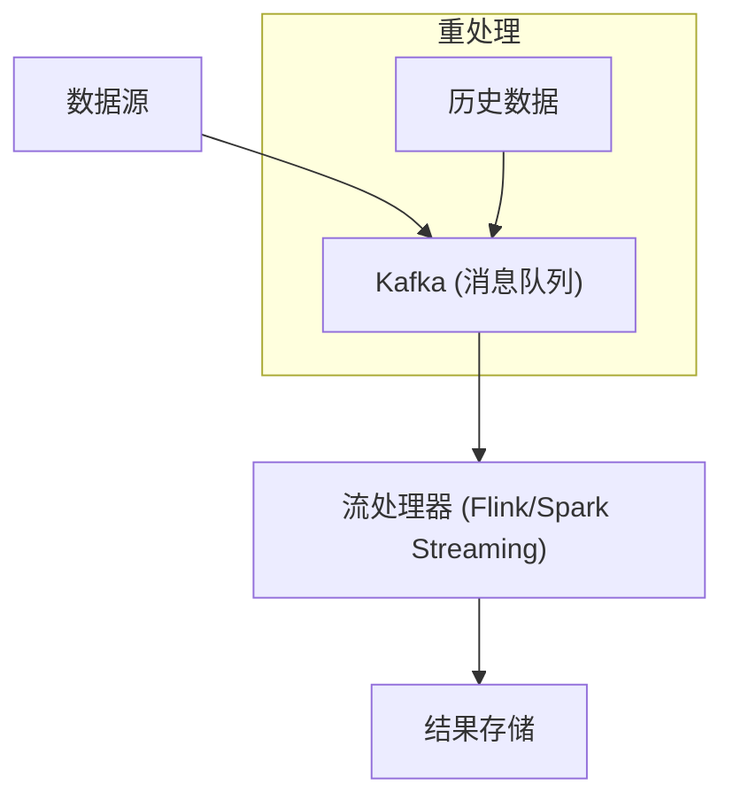
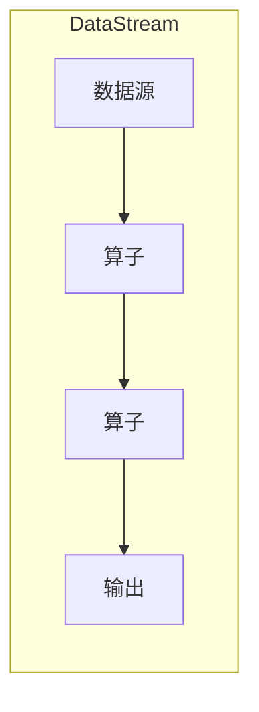

# 流处理 vs 批处理

双十一的战报大屏，实时展示成交额、订单量、库存变化——这些数据是怎么算出来的？传统的批处理架构需要等一天才能出报表，但业务要求秒级响应。

流处理与批处理的博弈，催生了两个经典架构：Lambda 和 Kappa。

## 批处理与流处理的本质区别

**批处理（Batch Processing）**：积累一批数据后统一处理。强调的是「正确性」，可以等待数据到齐后再计算。

**流处理（Stream Processing）**：数据到达后立即处理。强调的是「实时性」，数据来一条处理一条，不需要等待。

```
批处理: [A][B][C][D][E] → 等待 → 统一处理 → 结果
         ↓  ↓  ↓  ↓  ↓
流处理: [A] → 处理 → [B] → 处理 → [C] → 处理 → ...
```

## Lambda 架构

Lambda 架构试图融合批处理和流处理的优点，用两套系统分别处理实时和离线数据。



### Lambda 的工作原理

**批处理层**：处理全量历史数据，计算最终结果（Batch View）。这个层可以接受较长的处理时间，比如每天跑一次。

**速度层**：处理最近的数据，计算增量结果（Realtime View）。这个层追求低延迟，数据来了就计算。

**服务层**：合并批处理层和速度层的结果，返回给用户。对于历史数据，用批处理结果；对于最近的数据，用流处理结果。

### Lambda 的问题

Lambda 架构有三个显著问题：

**维护两套代码**：同一个业务逻辑，需要写两套实现——批处理版本和流处理版本。两套代码要保持一致，维护成本极高。

**结果合并复杂**：批处理和流处理的结果合并逻辑往往不简单，需要处理数据边界、时间戳对齐等问题。

**资源开销大**：同时运行批处理和流处理两套系统，硬件资源开销是双倍的。



## Kappa 架构

Kappa 架构用流处理统一了批处理，核心思想是：**把批处理看作流处理的一个特例**。



### Kappa 的实现

Kappa 的核心是**消息重放**：如果需要重新计算，只需要从 Kafka 回溯到最早的 offset，重新消费即可。

```java
// Flink 从头消费 Kafka
env.fromSource(
    KafkaSource.builder()
        .setBootstrapServers("kafka:9092")
        .setGroupId("flink-consumer")
        .setTopics("source-topic")
        .setStartingOffsets(OffsetsInitializer.earliest())
        .build(),
    WatermarkStrategy.noWatermarks(),
    "Kafka Source"
);
```

### Kappa 的条件

Kappa 架构不是银弹，它要求：

- 消息系统能够重放历史数据（Kafka 支持）
- 数据有明确的处理顺序（时间戳或序号）
- 业务逻辑可以增量计算（新数据到来时更新结果）

## Apache Flink

无论选择 Lambda 还是 Kappa，流处理框架都是核心。Apache Flink 是当前最流行的流处理框架。

### Flink 核心概念



**DataStream**：Flink 的核心抽象，代表无界数据流。

**Operator**：算子，对数据流进行转换（map、filter、window、join 等）。

**Window**：窗口，将无限流切分为有限批次。常见窗口：滚动窗口（Tumbling）、滑动窗口（Sliding）、会话窗口（Session）。

### Flink 示例

```java
DataStream<String> input = env.socketTextStream("localhost", 9999);

input
    .flatMap(new Tokenizer())
    .keyBy(value -> value.f0)           // 按 word 分组
    .window(TumblingEventTimeWindows.of(Time.seconds(5)))
    .sum(1)                              // 求和
    .print();
```

### Flink 的优势

- **精确一次（Exactly-Once）语义**：端到端一致性保证
- **强大的 Window API**：支持滑动、会话等多种窗口
- **Event Time 处理**：基于数据本身的时间戳，而非系统时间
- **乱序处理**：Watermark + 迟到数据处理机制

## 选型建议

### 选择 Lambda 架构

- 数据量极大，批处理层需要分布式计算框架
- 批处理和流处理的业务逻辑差异很大
- 对历史数据的准确性要求极高

### 选择 Kappa 架构

- 业务逻辑可以统一
- 团队熟悉流处理框架
- 数据量中等，不需要分布式批处理

### 选择纯批处理

- 不需要实时数据
- 对数据准确性要求高于时效性
- 团队没有流处理经验

> **经验之谈**：很多「实时」需求其实没有想象中那么实时。仔细评估业务对延迟的真正要求，可能是 1 分钟也可能是 1 小时。过度追求实时会增加系统复杂度和成本。

## 架构演进建议

```
第一阶段：小流量验证
  ↓
纯批处理 → 快速验证业务

第二阶段：流量增长
  ↓
批处理 + 简单轮询 → 异步队列 + 定时任务

第三阶段：实时需求
  ↓
Lambda 架构 → 批处理保准确，流处理保实时

第四阶段：统一化
  ↓
Kappa 架构 → 流处理统一，简化维护
```

架构演进是一个渐进过程。不要在第一阶段就引入 Flink + Kafka 的全套流处理架构，除非业务确实需要。简单方案先跑通，再根据实际需求演进。
