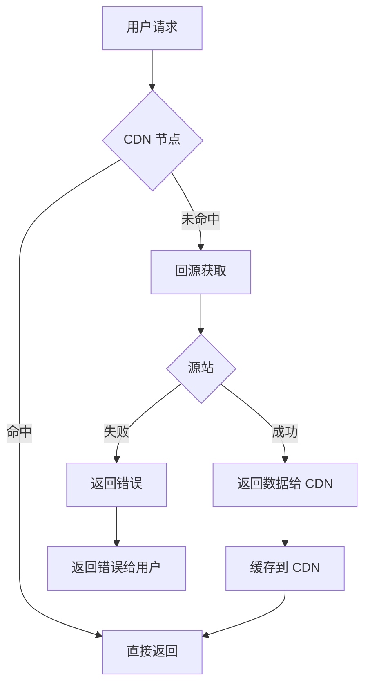
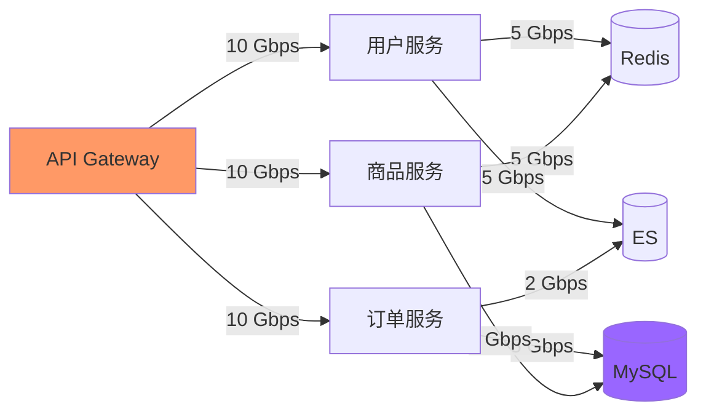
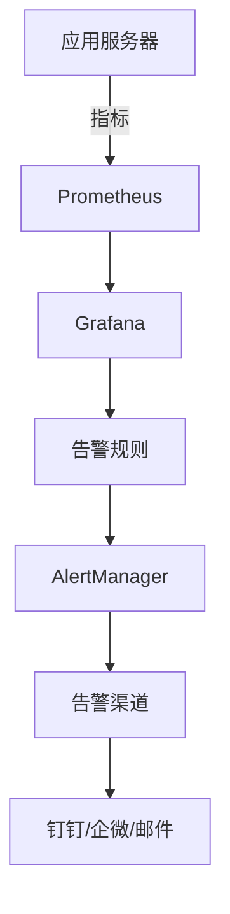

# 带宽与网络规划

凌晨高峰时段，用户开始反馈视频播放卡顿。监控显示服务器 CPU、内存、磁盘都正常，但接口延迟从 50ms 飙升到 500ms。

问题出在网络上：千兆网卡的带宽被打满了。

网络带宽是系统设计中经常被忽视的瓶颈。当 CPU、内存、磁盘都优化到极限后，最后倒下往往是网卡。

## 带宽基础概念

### 带宽 vs 吞吐量

| 概念 | 说明 | 常见单位 |
| --- | --- | --- |
| 带宽 | 网络最大传输能力 | Mbps、Gbps |
| 吞吐量 | 实际数据传输速率 | MB/s、GB/s |
| 带宽利用率 | 实际吞吐量 / 带宽 | 百分比 |

```
换算关系：
1 Gbps = 125 MB/s
10 Gbps = 1.25 GB/s

实际可用带宽（考虑协议开销）：
- TCP：带宽 × 0.9
- HTTP：带宽 × 0.85
```

### 入带宽 vs 出带宽

| 方向 | 说明 | 常见场景 |
| --- | --- | --- |
| 入带宽（下行） | 数据流入服务器 | 用户上传文件、API 调用 |
| 出带宽（上行） | 数据流出服务器 | 网页访问、视频播放、API 响应 |

大多数业务场景，出带宽压力远大于入带宽（用户下载 > 上传）。

## 带宽需求估算

### 基础公式

```
带宽需求（Mbps）= QPS × 平均请求大小（bytes）× 8 ÷ 1000 ÷ 压缩比
```

### 计算示例：Web 服务

```
场景：电商商品详情页

参数：
- 峰值 QPS：50000
- 平均页面大小：100 KB（HTML + CSS + JS + 图片引用）
- 图片等静态资源走 CDN，动态请求仅 HTML（约 10 KB）

动态请求带宽：
= 50000 × 10 KB × 8 ÷ 1000
= 50000 × 80 Kbps
= 4 Gbps

静态资源带宽（走 CDN）：
- 假设 CDN 命中率 90%，只有 10% 回源
- CDN 回源带宽 = 4 Gbps × 10% = 400 Mbps

结论：服务端需要至少 5 Gbps 的网络带宽
```

### 计算示例：视频服务

```
场景：短视频平台

参数：
- 同时在线用户：100 万
- 视频码率：2 Mbps（1080p）
- CDN 命中率：85%

CDN 带宽需求：
= 100 万 × 2 Mbps × 15%（回源量）
= 300 万 Mbps = 3 Tbps

原始带宽（无 CDN）：
= 100 万 × 2 Mbps = 2 Pbps（不可行！）

结论：必须使用 CDN，否则源站带宽成本无法承受
```

### 计算示例：API 服务

```java
// 带宽计算工具类
public class BandwidthCalculator {

    /**
     * 计算 API 服务的带宽需求
     * @param peakQPS 峰值 QPS
     * @param avgRequestSizeBytes 平均请求大小（字节）
     * @param avgResponseSizeBytes 平均响应大小（字节）
     * @param compressionRatio 压缩比（通常 0.3~0.7）
     * @return 需要的带宽（Mbps）
     */
    public static double calculateAPIBandwidth(
            long peakQPS,
            long avgRequestSizeBytes,
            long avgResponseSizeBytes,
            double compressionRatio) {

        // 总数据传输量 = (请求 + 响应) × QPS
        long totalBytesPerSecond = (avgRequestSizeBytes + avgResponseSizeBytes) * peakQPS;

        // 转换为 Mbps，并考虑压缩
        double bandwidthMbps = (totalBytesPerSecond * 8.0) / (1000 * 1000) / compressionRatio;

        return bandwidthMbps;
    }

    public static void main(String[] args) {
        // 示例：搜索服务
        long peakQPS = 100000; // 10 万 QPS
        long requestSize = 500; // 请求 500 字节
        long responseSize = 5000; // 响应 5 KB（JSON）
        double compression = 0.5; // gzip 压缩

        double bandwidth = calculateAPIBandwidth(
            peakQPS, requestSize, responseSize, compression);

        System.out.printf("搜索服务峰值带宽需求: %.2f Mbps%n", bandwidth);
        System.out.printf("折算为网卡: %.2f Gbps%n", bandwidth / 1000);

        // 如果使用 10 Gbps 网卡
        double utilization = bandwidth / 10000; // 10 Gbps = 10000 Mbps
        System.out.printf("带宽利用率: %.2f%%%n", utilization * 100);
    }
}
```

## CDN 规划

### CDN 的核心价值

CDN（Content Delivery Network）解决的是**带宽成本**和**访问延迟**两个问题：

```
无 CDN：
用户 → 源站（承受所有带宽压力）
延迟 = 用户到源站的 RTT + 传输时间

有 CDN：
用户 → CDN 节点（分担带宽压力）
延迟 = 用户到 CDN 的 RTT + CDN 到源站的传输时间（仅缓存未命中时）
```

### CDN 缓存策略设计



| 资源类型 | 缓存策略 | TTL |
| --- | --- | --- |
| 静态图片 | 长期缓存 | 7~30 天 |
| CSS/JS | 版本化缓存 | 1 年（更新后改 URL） |
| HTML 页面 | 短期缓存 | 5~15 分钟 |
| API 动态数据 | 不缓存/短期 | 0~5 分钟 |
| 用户个性化内容 | 不缓存 | - |

### CDN 命中率优化

```
CDN 命中率 = CDN 命中请求 ÷ 总请求

命中率影响因素：
1. 缓存 key 设计：能否区分不同内容？
2. TTL 设置：缓存时间够长吗？
3. 预热策略：新内容上线前是否预热到 CDN？
4. 流量分布：热点内容是否足够集中？
```

```
示例：提升 CDN 命中率

问题：电商商品详情页 CDN 命中率只有 60%

分析：
- 商品 ID 不同，每个商品都是独立的缓存 key
- 但 80% 的流量集中在 20% 的热门商品

优化方案：
1. 热门商品提前预热到 CDN 边缘节点
2. 商品页面静态部分（图片、价格区间）单独缓存
3. 用户个性化信息通过客户端 JS 动态加载

优化后命中率：85%
```

## 内网带宽规划

### 内网 vs 公网

| 维度 | 内网 | 公网 |
| --- | --- | --- |
| 带宽 | 通常 10~100 Gbps | 通常 1~10 Gbps |
| 成本 | 相对便宜 | 较贵（按流量计费） |
| 延迟 | 低（同一机房 < 1ms） | 取决于距离 |
| 用途 | 服务间通信、数据同步 | 用户访问、外部集成 |

### 服务间通信带宽



```
内网带宽计算示例：

场景：订单服务调用链

调用链路：
API Gateway → 订单服务 → 用户服务（验证用户）
API Gateway → 订单服务 → 商品服务（检查库存）
API Gateway → 订单服务 → 库存服务（扣减库存）
订单服务 → 消息队列（异步通知）

峰值下单 TPS：1000
每次下单产生的 RPC 调用：
- 2 次用户服务调用（每次 1 KB 请求 + 500 B 响应）
- 2 次商品服务调用（每次 2 KB 请求 + 1 KB 响应）
- 1 次库存服务调用（每次 500 B 请求 + 200 B 响应）

内网带宽：
= 1000 × (2×1.5KB + 2×3KB + 1×0.7KB) × 2 × 8 ÷ 1000
= 1000 × 9.2KB × 2 × 8 ÷ 1000
≈ 147 Mbps
```

## 网络拓扑规划

### 单机房架构

```
适用场景：中小规模系统、预算有限

架构：
用户 → 负载均衡 → 应用集群
                    ↓
              Redis 集群（主从）
                    ↓
              MySQL 集群（主从）

风险：机房断电、断网则服务不可用
```

### 同城双活架构

```
适用场景：中大规模系统、需要高可用

架构：
         用户
           ↓
    智能 DNS / 负载均衡
       ↓            ↓
    机房 A         机房 B
   （主）         （从）

两个机房同时对外服务，互为备份

网络规划要点：
- 机房间专线带宽：峰值流量的 30~50%
- 跨机房调用延迟：< 1ms
- 数据同步方式：同步双写 / 异步复制
```

### 异地多活架构

```
适用场景：大规模系统、需要容灾

架构：
       全球用户
           ↓
    全局负载均衡
       ↓     ↓     ↓
    区域 A  区域 B  区域 C
   （主）  （从）  （从）

网络规划要点：
- 跨区域延迟：50~150ms
- 数据一致性：通常接受最终一致
- 带宽成本：跨地域流量成本较高
- 流量调度：按用户地理位置就近访问
```

## 带宽成本优化

### 压缩与编码

| 压缩方式 | 压缩比 | CPU 开销 | 适用场景 |
| --- | --- | --- | --- |
| Gzip | 2~5x | 低 | HTTP 响应（文本） |
| Brotli | 3~7x | 中 | 现代浏览器 |
| ZSTD | 2~6x | 中 | 通用场景 |
| LZ4 | 1.5~3x | 低 | 实时性要求高 |
| 视频 H.265 | 50%（vs H.264）| 高 | 视频流 |

```
HTTP 压缩配置示例（Nginx）：
server {
    # 启用 gzip
    gzip on;
    gzip_vary on;
    gzip_proxied any;
    gzip_comp_level 6;
    gzip_types text/plain text/css application/json application/javascript text/xml application/xml;

    # 启用 brotli（更高效）
    brotli on;
    brotli_types text/plain text/css application/json application/javascript text/xml application/xml;
}
```

### 流量整形与限流

```
带宽限流策略：

1. 入口限流：API Gateway 层限流
2. 服务限流：每个服务设置带宽上限
3. 用户级限流：防止单个用户占用过多带宽

限流算法选择：
- 固定窗口：简单，但有边界突变问题
- 滑动窗口：平滑，但实现复杂
- 令牌桶：允许突发，是 CDN 的标准算法
- 漏桶：严格平滑，适合流量整形
```

### 图片与视频优化

```
图片优化策略：

1. 格式选择：
   - WebP：比 JPEG 小 30%，比 PNG 小 50%
   - AVIF：比 WebP 再小 30%

2. 响应式图片：
   - 根据屏幕分辨率返回不同大小
   - ``

3. 图片 CDN：
   - 边缘缓存
   - 自动转码（WebP/AVIF）
   - 按需裁剪

视频优化策略：

1. 自适应码率（ABR）：
   - 根据网络状况自动切换画质
   - HLS / DASH 协议

2. 分段加载：
   - 首屏优先加载
   - 后续内容按需加载

3. CDN 预热：
   - 热播视频提前缓存到边缘节点
```

## 带宽监控与告警

### 关键监控指标

| 指标 | 告警阈值 | 说明 |
| --- | --- | --- |
| 带宽利用率 | `>` 70% | 接近上限 |
| 包转发率 | `>` 70% PPS | 小包场景瓶颈 |
| 连接数 | 接近上限的 80% | TCP 连接数限制 |
| 延迟 | p99 `>` 50ms | 网络拥塞 |
| 丢包率 | `>` 0.1% | 网络质量问题 |

### 监控架构



```yaml
# Prometheus 带宽监控配置示例
- job_name: 'network'
  static_configs:
    - targets: ['node-exporter:9100']
  relabel_configs:
    - source_labels: [__address__]
      regex: '(.*):9100'
      target_label: instance

# Grafana 告警规则
groups:
  - name: network_alerts
    rules:
      - alert: HighBandwidthUsage
        expr: rate(node_network_receive_bytes_total[5m]) > 800000000
        for: 5m
        labels:
          severity: warning
        annotations:
          summary: "带宽使用率超过 80%"
          description: "实例 {{ $labels.instance }} 带宽使用率过高，当前 {{ $value }} bytes/s"
```

## 总结

带宽规划的核心公式：

```
带宽需求（Mbps） = QPS × (请求大小 + 响应大小) × 8 ÷ 1000 ÷ 压缩比
```

带宽规划的关键要点：

1. **区分公网和内网**：公网带宽成本高，需要 CDN；内网带宽相对便宜
2. **考虑峰值**：峰值带宽通常是平均的 5~10 倍
3. **预留 buffer**：带宽利用率不要超过 70%
4. **分层策略**：热数据走 CDN，温数据走边缘节点，冷数据走归档
5. **持续监控**：设置带宽利用率告警，提前发现瓶颈

网络带宽往往不是单点问题，而是整个系统架构的问题。做好带宽规划，才能避免在关键时刻被网络卡住。
