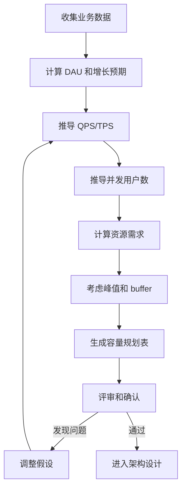

# 容量规划：QPS/TPS 估算方法

系统上线三个月后，数据库被打满，应用开始大量超时。复盘时发现：设计时估算的 QPS 只有 5000，实际峰值达到了 50000。

这不是运气不好，是**容量规划没做好**。

容量规划是系统设计中最容易被忽视、但影响最大的环节之一。它回答的是：系统需要多少资源？这些资源够不够？

## 为什么要做容量规划

很多工程师觉得容量规划是「拍脑袋」——反正也估不准，不如先做了再说。这种想法的代价是：

- **资源浪费**：预估过高，买了一堆用不上的机器
- **资源不足**：预估过低，系统在流量高峰时崩溃
- **架构失衡**：某些组件预估过高，有些预估过低，整体效率低下

容量规划不是预测未来，而是**基于已知信息和合理假设，对未来需求做出估算**。即使估算不精确，至少有一个方向性的判断，避免犯低级错误。

## 核心概念

### DAU（日活跃用户数）

DAU 是最基础的用户规模指标。获取方式：

1. **历史数据**：如果产品已经上线，直接从数据库查询
2. **行业基准**：如果是新产品，参考同类产品的公开数据
3. **目标推导**：根据业务目标（如「一年内达到 X 万用户」）推导

### 在线用户数

DAU 不等于同时在线用户数。大多数产品，用户的访问是分散的：

```
在线用户数 = DAU × 在线时间占比

假设：
- DAU = 1000 万
- 用户平均在线时长 = 30 分钟 / 天
- 一天总分钟数 = 1440

在线用户数 = 1000 万 × (30 / 1440) ≈ 21 万
```

### 峰值用户数

峰值用户数是在线用户数的倍数，通常在 2~10 倍之间：

```
峰值用户数 = 平均在线用户数 × 峰值系数

峰值系数的影响因素：
- 时间段：晚高峰通常比凌晨高 5~10 倍
- 节假日：节假日通常比工作日高 2~3 倍
- 热点事件：大V发微博、促销活动等，峰值系数可能达到 50~100 倍
```

## QPS 估算

### 基础公式

```
QPS = DAU × 人均日请求次数 ÷ 86400 秒
```

### 完整公式

```
峰值 QPS = DAU × 人均日请求次数 × 集中系数 ÷ 86400 × 峰值系数
```

| 参数 | 说明 | 示例值 |
| --- | --- | --- |
| DAU | 日活跃用户数 | 1000 万 |
| 人均日请求次数 | 每个用户每天发起的请求数 | 20 次 |
| 集中系数 | 用户访问在时间上的集中程度 | 0.2（20%） |
| 峰值系数 | 峰值流量与平均流量的比值 | 5 |

### 计算示例

```
假设设计一个新闻资讯 App：

- DAU：1000 万
- 人均日使用次数：10 次（早晚通勤、午休、晚上各看几次）
- 每使用一次产生的请求数：5 次（首页刷新、内容详情、评论等）
- 集中系数：0.15（早 7-9 点、午 12-14 点、晚 18-22 点）
- 峰值系数：3（晚高峰是均值的 3 倍）

人均日总请求数 = 10 × 5 = 50 次
平均 QPS = 1000 万 × 50 × 0.15 ÷ 86400 ≈ 868 QPS
峰值 QPS = 868 × 3 ≈ 2600 QPS
```

### 考虑业务特性的 QPS 估算

不同业务场景的 QPS 特征差异很大：

| 业务类型 | 典型 DAU | 人均请求/天 | 峰值系数 | 峰值 QPS |
| --- | --- | --- | --- | --- |
| 短视频 | 1 亿 | 50 次 | 5 | 29000 |
| 电商 | 5000 万 | 20 次 | 8 | 46000 |
| 社交 | 3 亿 | 30 次 | 4 | 16600 |
| 工具类 | 1000 万 | 5 次 | 2 | 580 |

## TPS 估算

### TPS 与 QPS 的关系

TPS（Transactions Per Second）是**事务数/秒**，QPS（Queries Per Second）是**请求数/秒**。

```
TPS = QPS ÷ 平均单次事务包含的请求数
```

一个用户操作可能产生多个请求：

| 操作 | 产生的请求数 |
| --- | --- |
| 打开首页 | 1（页面请求） |
| 搜索商品 | 2（搜索请求 + 建议请求） |
| 查看商品详情 | 3（商品信息 + 图片 + 推荐） |
| 下单支付 | 5（查库存 + 锁库存 + 创建订单 + 支付 + 减库存） |

### 计算示例

```
电商场景：
- 峰值 QPS = 10000
- 平均一个「购买」操作包含 5 个后端请求
- 但 QPS 中只有 10% 是购买请求

购买相关 QPS = 10000 × 10% = 1000 QPS
购买 TPS = 1000 ÷ 5 = 200 TPS

搜索相关 QPS = 10000 × 50% = 5000 QPS
搜索每次 1 个请求，TPS = 5000
```

## 并发用户数估算

### 并发与 QPS 的关系

```
并发用户数 = QPS × 平均响应时间
```

| QPS | 平均响应时间 | 并发用户数 |
| --- | --- | --- |
| 1000 | 100ms | 100 |
| 1000 | 500ms | 500 |
| 1000 | 1000ms | 1000 |

注意：这里的「并发用户数」是业务层面的并发，不是 TCP 连接数（一个用户可能建立多个连接）。

### 长连接 vs 短连接

| 连接类型 | 并发估算方式 | 示例 |
| --- | --- | --- |
| 短连接（HTTP） | QPS × 平均响应时间 | REST API |
| 长连接（WebSocket） | 在线用户数 × 连接保持率 | 即时通讯、推送 |
| gRPC 流 | 会话数 × 平均流时长 | 直播、监控 |

```
长连接场景（在线聊天室）：
- DAU：100 万
- 同时在线率：30%
- 同时在线用户：30 万
- 每个用户保持 1 个长连接
- 需要的 WebSocket 连接数：30 万
```

## 资源需求估算

### CPU 需求

```
需要的 CPU 核数 = 峰值 QPS × 平均响应时间 ÷ 1000 × CPU 利用率目标

假设：
- 峰值 QPS = 10000
- 平均响应时间 = 100ms = 0.1s
- 单核 QPS = 500（简单查询）
- 目标 CPU 利用率 = 70%

需要的核数 = 10000 ÷ 500 ÷ 0.7 ≈ 29 核
```

### 内存需求

```
内存需求 = 服务占用 + 缓存占用 + JVM 堆内存（Java 服务）

假设：
- 服务占用：2 GB
- 缓存占用：8 GB（热点数据）
- JVM 堆：4 GB
- 非堆：1 GB

总需求 ≈ 15 GB / 台服务器
```

### 连接数需求

| 组件 | 单连接内存 | 10 万连接的内存 |
| --- | --- | --- |
| Tomcat（HTTP） | 2~4 KB | 200~400 MB |
| MySQL | 1~2 MB | 100~200 GB（不可行） |
| Redis | 10~50 KB | 1~5 GB |

:::warning
MySQL 的连接数是稀有资源。每个连接占用约 1~2 MB 内存，10 万并发需要 100~200 GB 内存专门用于连接。因此必须使用连接池，并严格控制连接数。
:::

### 线程池估算

```
线程池大小 = 并发任务数 × (1 + 等待时间 ÷ 执行时间)

假设：
- 并发任务数 = 1000
- 平均 IO 等待时间 = 50ms
- 平均 CPU 执行时间 = 10ms

线程池大小 = 1000 × (1 + 50 ÷ 10) = 6000 线程
```

## 容量规划实例：设计一个秒杀系统

### 业务背景

设计一个电商秒杀系统：

- 日常 DAU：500 万
- 秒杀活动参与用户：50 万（10% DAU）
- 活动持续时间：1 小时
- 商品数量：1000 件
- 目标：所有秒杀请求在 2 秒内得到响应

### 第一步：计算 QPS

```
秒杀高峰集中在开始的几秒到几分钟：
- 假设 50% 用户在前 30 秒下单
- 人均下单请求数：2 次（一次抢，一次确认）

峰值秒级 QPS = 50 万 × 50% ÷ 30 秒 × 2 ≈ 16666 QPS

考虑重试、刷单等，实际峰值 QPS ≈ 50000 QPS
```

### 第二步：计算存储需求

```
订单数据：
- 每笔订单：1 KB
- 峰值订单数：1000 件商品 × 每件 1000 人抢 = 100 万订单
- 订单存储：100 万 × 1 KB = 1 GB
- 3 年保留期：1 GB × 365 × 3 = 1 TB
```

### 第三步：计算带宽需求

```
单次请求大小：500 字节
单次响应大小：1 KB

峰值带宽 = 50000 QPS × 1.5 KB × 8 ÷ 1000 = 600 Mbps
```

### 第四步：生成容量规划表

| 资源类型 | 日常容量 | 秒杀峰值容量 | 规划值 | 备注 |
| --- | --- | --- | --- | --- |
| QPS | 1000 | 50000 | 100000 | 预留 2 倍 buffer |
| 并发用户 | 5000 | 10000 | 20000 | |
| 带宽 | 100 Mbps | 600 Mbps | 1200 Mbps | 万兆网卡 |
| CPU | 8 核 | 32 核 | 64 核 | |
| 内存 | 16 GB | 32 GB | 64 GB | |
| 订单存储 | 100 GB | - | 500 GB | 留足扩展空间 |

## 容量规划的常见错误

### 错误一：只算平均值

很多工程师只算平均 QPS，不考虑峰值。但线上问题往往发生在峰值，而不是平均值。

**正确做法**：必须计算峰值容量，峰值通常比均值高 3~10 倍。

### 错误二：忽略增长

只考虑当前容量，不考虑未来增长。

**正确做法**：容量规划要覆盖 6 个月到 1 年的增长，通常取 1.5~2 倍的增长系数。

### 错误三：缺乏 buffer

按照刚好够用来规划，没有预留任何 buffer。

**正确做法**：关键资源预留 30%~50% 的 buffer，应对突发流量和估算误差。

### 错误四：忽略依赖组件

只算了应用服务器的容量，忽略了数据库、缓存、消息队列的容量。

**正确做法**：容量规划要覆盖整条数据链路，每个环节都要算。

## 容量规划的流程



## 总结

容量规划回答的是：**系统需要多少资源？**

核心公式：

```
峰值 QPS = DAU × 人均请求数 × 集中系数 ÷ 86400 × 峰值系数
TPS = QPS ÷ 单事务请求数
并发用户数 = QPS × 平均响应时间
```

容量规划不是一次性的工作，而是**持续迭代**的过程。随着业务增长，需要定期复盘容量规划是否还适用。

做好容量规划，不是为了节省成本，而是为了**避免在关键时刻掉链子**。
