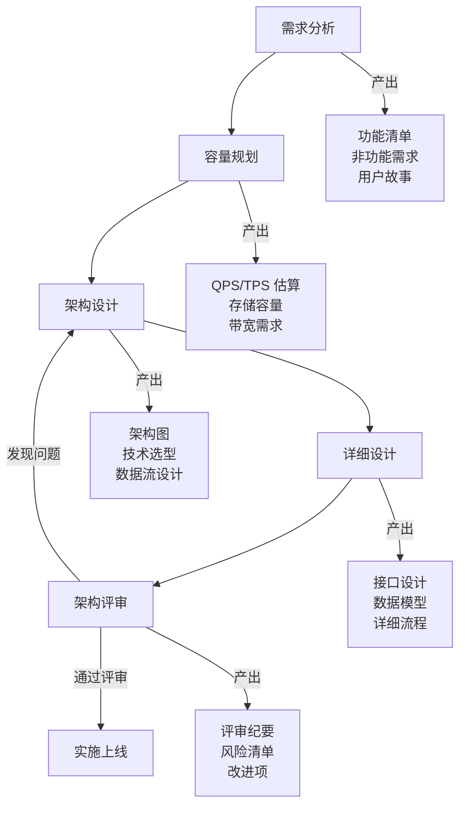

# 系统设计方法论

面试官问：「如何设计 Twitter 的搜索功能？」你愣住了，脑子里一片空白。大脑中飞速闪过各种关键词——Redis、MySQL、分库分表、Elasticsearch——但完全不知道该怎么组织。明明看过很多系统设计的文章，为什么真正被问到的时候，还是无法开口？

这不是你不够聪明，而是缺少一套**结构化的思考框架**。

同样的场景也出现在架构评审会上。团队花了两周设计了一套「高可用、高性能、高扩展」的系统架构，PPT 画得精美，数据预估写得漂亮。上线三个月后，系统在双十一零点流量高峰时直接崩溃，数据库被打满，缓存雪崩，紧急回滚。

事后复盘发现：没有人真正算过系统的容量瓶颈在哪里，没有人问过「如果 Redis 挂了怎么办」，没有人考虑过数据膨胀的速度。评审会上大家都说好，但好在哪里、坏在哪里，没人说得清楚。

这两个场景暴露了同一个问题：**缺乏系统化的设计方法**。

## 为什么需要设计方法论

很多工程师习惯了「想到哪做到哪」的编码方式，写代码可以靠直觉，但设计系统不行。系统设计的复杂度在于：任何一个决策都会影响后续的所有选择，而且很多问题只在规模变大后才会暴露。

自由发挥式设计的典型特征是：先画架构图，再补充细节，遇到问题再打补丁。这种方式的代价是：架构越来越乱，技术债越堆越高，最终维护成本超过开发成本。

结构化思考的核心是：**先想清楚问题，再设计方案**。不是「我想用 Redis」，而是「为了解决什么问题？Redis 是否是最优解？代价是什么？」

方法论不是限制你的创造力，而是让你在创造力之外，有一套**兜底的思考路径**。就像学开车要先学交通规则，不是为了让你开得无聊，而是让你知道什么时候该踩刹车。

### 设计方法论的历史演进

架构设计方法论并不是凭空出现的，它经历了漫长的演化过程：

**TOGAF（The Open Group Architecture Framework）**诞生于 1995 年，是企业级架构的事实标准。它提出了完整的架构开发方法（ADM），覆盖业务、数据、应用、技术四个领域。但 TOGAF 太重、太全，对于互联网系统的快速迭代来说，过于笨拙。

**AWS Well-Architected Framework** 提出了六大 pillars：卓越运营、安全性、可靠性、性能效率、成本优化、可持续性。这套框架更贴近云原生场景，但更多是评估现有系统，而非指导从头设计。

**系统设计面试（System Design Interview）**是这套方法论最实用的来源。Google、Meta、Amazon 的面试官们把 decades 的工程经验浓缩成了一套可以在 45 分钟内覆盖核心问题的框架。这套框架不是纸上谈兵，而是无数真实踩坑后的经验总结。

本章的内容，就是从这套面试框架出发，结合真实项目中的架构评审经验，整理出一套**既能在面试中应对问题、也能在工作中指导设计**的方法论。

## 设计流程概览

完整的系统设计流程分为五个阶段，每个阶段都有明确的目标和产出物：



这五个阶段不是线性一次完成的，而是**迭代收敛**的过程。架构评审中发现的问题，会倒退回前面的阶段重新设计，直到所有关键风险都被识别和应对。

## 各阶段核心任务

### 需求分析：从问题出发

需求分析是整个设计流程的起点，也是最容易出问题的环节。太多架构设计的失败，根源在于没有真正理解要解决的问题。

**功能需求**回答的是「系统要做什么」：用户能发微博、能关注他人、能搜索内容、能收到通知。这些是显性的、写在 PRD 里的需求。

**非功能需求**回答的是「系统要做到什么程度」，这是拉开差距的地方：

| 维度 | 核心问题 | 示例 |
| --- | --- | --- |
| **性能** | 多快算快？ | 搜索接口 p99 延迟 `<` 200ms |
| **可用性** | 多少个 9？ | 年度可用性 `>=` 99.95% |
| **可扩展性** | 怎么应对增长？ | 支持未来 3 年 10 倍流量 |
| **安全性** | 如何保护数据？ | 用户数据加密存储，传输 TLS 1.3 |
| **一致性** | 能接受多大延迟？ | 核心数据强一致，feed 流最终一致 |

非功能需求必须**量化**，不能写「系统要快」「系统要稳定」。因为没有量化就没有验收标准，没有验收标准就无法判断设计是否满足需求。

### 容量规划：让数字说话

容量规划是连接需求和架构的桥梁。没有容量规划的设计，就像没有预算的装修——做到一半发现钱不够，要么缩水要么超支。

**QPS/TPS 估算**是最基础的计算：

```
峰值 QPS = 日活用户数 × 人均日访问次数 × 集中系数 ÷ 86400秒
```

假设日活 1000 万，用户每天平均访问 10 次，高峰时段集中系数为 20%（即 20% 的访问发生在 20% 的时间内）：

```
峰值 QPS = 10000000 × 10 × 0.2 ÷ 86400 ≈ 2300 QPS
```

但这只是均值。真实场景中要考虑**集中式流量**——热点事件、促销活动、大 V 发声——峰值可能是均值的 10~100 倍。

**Jeff Dean 的经典数字速算表**是快速估算延迟的参考：

| 操作 | 延迟 |
| --- | --- |
| L1 缓存读取 | 1 ns |
| L2 缓存读取 | 4 ns |
| 内存读取 | 100 ns |
| SSD 顺序读取 1MB | 1 ms |
| 内存顺序读取 1MB | 0.25 ms |
| 跨机房往返 | 0.5~2 ms |
| 跨洲际往返 | 100~200 ms |
| 顺序读取 1GB 从磁盘 | 30 ms |

记住这些数字不是让你背诵，而是培养一种**数量级的直觉**。当你估算「用户搜索请求需要 500ms」时，应该立刻反应过来：500ms 可以从内存读 5GB 数据，或者跨机房往返 250 次，或者从 SSD 读 500MB。这个时间到底花在哪里了？

### 用户故事驱动：从场景到设计

用户故事（User Story）是连接业务和技术的桥梁。一个好的用户故事格式是：

```
作为 [角色]，我想要 [功能]，以便 [收益]
```

例如，设计消息通知系统时：

```
作为 用户，我想要 在有新消息时收到推送通知，以便 不错过重要信息
作为 用户，我想要 设置免打扰时间段，以便 在休息时不被打扰
作为 系统，我需要在 消息量突增时 缓存通知，以便 保护下游服务不被压垮
```

用户故事帮助我们从**用户的视角**思考系统边界，而不是从技术组件的角度。当我们讨论「要不要做本地缓存」时，不是讨论「Redis 好还是 Caffeine 好」，而是讨论「用户等待 200ms 是否能接受」「缓存不一致导致的消息丢失用户是否能感知」。

### 系统设计文档：SDD 的规范

系统设计文档（System Design Document，SDD）是设计的最终产出物，也是团队协作和知识传承的载体。一份好的 SDD 应该包含：

1. **背景与目标**：解决什么问题，为什么现在要做，成功的标准是什么
2. **非功能需求**：性能、可用性、扩展性、安全性、可维护性的量化指标
3. **整体架构**：架构图、数据流向、外部依赖
4. **详细设计**：各模块的职责、接口定义、数据模型、流程图
5. **技术选型**：为什么选 A 不选 B，trade-off 分析
6. **容量规划**：QPS、存储、带宽的详细计算
7. **风险评估**：已知风险、应对策略、监控指标
8. **迭代计划**：分阶段实施的路径

SDD 不是写给领导看的汇报材料，而是写给**未来的自己**看的。当系统出问题需要排查、当新人需要接手、当需要做架构演进时，SDD 就是最重要的参考资料。

## 架构评审 checklist

架构评审是设计的最后一道防线。评审的目的不是挑刺，而是**把问题暴露在上线前**，而不是在线上。

### 常见评审维度

**完整性检查**：功能需求是否都覆盖了？边界条件是否考虑了？异常流程是否有处理？

**技术选型检查**：为什么选这个方案？有没有对比其他方案？trade-off 是否合理？

**扩展性检查**：如果流量增长 10 倍，现有设计能撑住吗？100 倍呢？扩展的路径是什么？

**容错性检查**：单点故障在哪里？任何一个组件挂了，系统会怎样？有没有熔断、限流、降级？

**一致性检查**：分布式环境下的数据一致性如何保证？能否接受最终一致？

**可观测性检查**：关键路径是否有埋点？异常是否有告警？是否方便排查问题？

### 红线问题（不能容忍的设计缺陷）

架构评审中如果发现以下问题，应该**一票否决**，直到问题被解决：

1. **没有容量规划**：设计文档中找不到 QPS、存储、带宽的计算过程
2. **单点故障**：某个关键组件没有备份，且无降级方案
3. **缺少监控告警**：上线后无法感知系统是否正常
4. **数据无备份**：核心数据没有灾备方案
5. **安全漏洞**：明文存储密码、SQL 注入风险、未授权访问漏洞
6. **无回滚方案**：没有灰度发布和快速回滚能力

这些问题不是「后面再优化」，而是「现在就必须解决」。因为一旦上线，这些问题会变成故障，而故障的代价往往是营收损失、品牌受损、甚至法律风险。

## 本章文章导读

本章按照系统设计的流程，依次展开各个关键环节的深入讨论：

**系统设计面试流程与框架** 从面试官的角度，解析 45 分钟内如何拆解一个系统设计问题，如何展示你的思考过程而非背答案。

**需求分析：功能需求 vs 非功能需求** 深入讲解如何挖掘真实的业务需求，如何量化非功能指标，如何区分「真需求」和「伪需求」。

**用户故事与用例驱动设计** 从用户故事出发，如何把业务语言翻译成系统设计语言，如何用场景驱动而非技术驱动做决策。

**容量规划：QPS/TPS 估算方法** 提供一套完整的容量估算方法论，包括如何推导峰值流量、如何计算资源需求、如何留足 buffer。

**延迟估算：数字速算表** 详解 Jeff Dean 的经典数字速算表，培养数量级直觉，让你在设计时就能预判性能瓶颈。

**存储容量估算** 覆盖数据量估算、索引膨胀、备份冗余、冷热分离等存储相关计算，帮助你避免「存着存着硬盘满了」的尴尬。

**带宽与网络规划** 解析网络带宽的计算方法，如何估算 CDN 命中率，如何设计多级缓存减少带宽压力。

**系统设计文档（SDD）编写规范** 提供一份完整的 SDD 模板和编写指南，让设计文档真正成为团队协作的工具而非形式主义。

**架构评审 Checklist** 整理一份可操作的评审清单，帮助你在评审前做好准备，在评审中发现问题，在评审后跟踪改进。

---

读完本章，你会拥有一套**从需求到评审的完整设计框架**。下次遇到系统设计问题时，不再是「脑子里一片空白」，而是「从需求分析开始，一步一步推导出最终方案」。这套框架不仅能帮你通过面试，更重要的是，能帮你设计出真正经得起线上考验的系统。