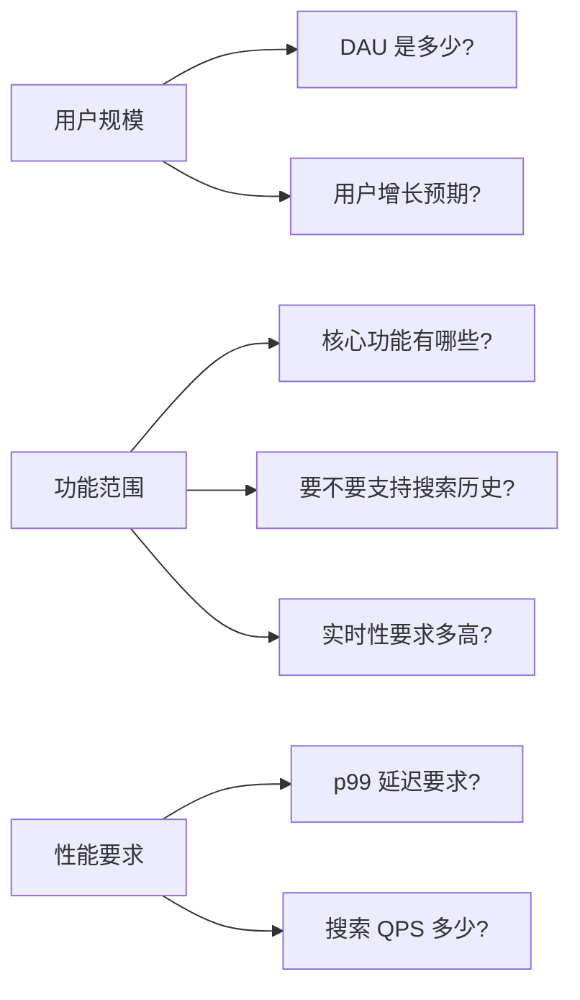
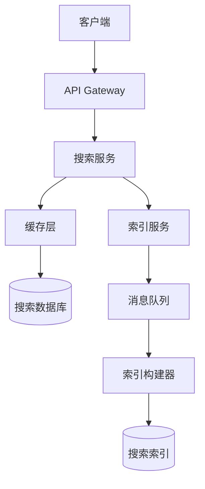

# 系统设计面试流程与框架

面试官问：「设计一个 Twitter 的搜索功能。」你愣住了。脑子里飞速闪过各种关键词——倒排索引、分词器、分布式缓存——但完全不知道该怎么组织。明明看过很多系统设计的文章，为什么真正被问到的时候，还是无法开口？

这不是你不够聪明，而是缺少一套**结构化的思考框架**。

## 为什么需要框架

很多工程师面试失败，不是因为知识不够，而是因为**缺乏表达的结构**。面对一个开放性问题，他们要么陷入细节无法自拔，要么东一榔头西一棒槌缺乏主线。

系统设计面试考察的不是你背了多少答案，而是你**如何思考问题**。面试官想看到的是：

- 你能不能理解问题的本质
- 你能不能做出合理的假设和权衡
- 你能不能在压力下保持条理清晰
- 你能不能识别并应对关键风险

一个好的框架，就像一张地图。它不会告诉你目的地在哪，但能确保你不会迷路。

## 四步法框架

### 第一步：需求澄清（5 分钟）

面试的第一步不是开始画图，而是**问问题**。

很多人以为系统设计面试是「面试官出题，候选人作答」。实际上，更好的模式是「候选人提问，面试官回答，候选人推导」。

需求澄清的核心是确认**范围和约束**：



**必须澄清的问题清单**：

| 问题类别 | 具体问题 | 为什么重要 |
| --- | --- | --- |
| 用户规模 | DAU、在线用户数、增长预期 | 决定架构的扩展性要求 |
| 功能范围 | 核心功能、扩展功能、边界情况 | 避免过度设计或遗漏关键功能 |
| 性能要求 | 延迟要求、吞吐量要求 | 决定缓存、异步等优化策略 |
| 可用性要求 | 多少个 9、容错要求 | 决定是否需要多活、熔断等机制 |
| 数据约束 | 数据量、保留期、一致性要求 | 决定存储方案选型 |

:::tip
好的提问展示的是**工程判断力**。面试官不是在刁难你，而是在给你机会展示你考虑问题的全面性。
:::

### 第二步：概要设计（10 分钟）

澄清需求后，进入概要设计阶段。这个阶段的核心是**画出骨架**。

#### 2.1 高层架构图

首先画出系统的整体轮廓，不需要细节，但要覆盖主要组件：



#### 2.2 数据流设计

明确数据从哪里来、到哪里去：

- **写入路径**：用户发推 → API → 消息队列 → 索引构建器 → 搜索索引
- **读取路径**：用户搜索 → API → 缓存（命中则返回）→ 搜索索引 → 返回结果

#### 2.3 容量估算（back-of-the-envelope）

在继续深入之前，先做一个快速的容量估算，确认设计方向是否合理：

```
假设条件：
- DAU：3 亿
- 日发推数：5 亿
- 搜索 QPS：日搜索量 10 亿 ÷ 86400 ≈ 12000 QPS
- 峰值系数：5 倍
- 峰值 QPS：60000 QPS

存储估算：
- 每条推文 500 字节
- 总存储：5 亿 × 500 字节 = 250 GB（原始数据）
- 索引开销：3~5 倍
- 3 年数据：250 GB × 5 × 365 × 3 / 1000 = 1.4 TB
```

这个数字在单机 MySQL 显然撑不住，自然引出分布式搜索方案。

### 第三步：详细设计（20 分钟）

概要设计确认了大方向后，进入详细设计。这个阶段要深入关键模块，展示深度。

#### 3.1 核心组件设计

每个核心组件需要回答：

1. **职责是什么**？不要什么？
2. **如何扩展**？单实例还是集群？
3. **数据如何存储**？选型依据？
4. **故障了怎么办**？有没有降级方案？

以搜索索引为例：

```
问题：索引服务如何设计？

候选方案 A：MySQL 全文索引
- 优点：简单、成熟、支持事务
- 缺点：全文搜索性能差、无法支撑海量数据
- 结论：不适用

候选方案 B：Elasticsearch
- 优点：分布式、支持倒排索引、扩展性好
- 缺点：运维复杂、延迟略高
- 结论：适合

候选方案 C：自己实现倒排索引
- 优点：可控
- 缺点：开发量大、踩坑成本高
- 结论：成本收益不匹配
```

#### 3.2 关键算法设计

对于核心算法，需要展示具体实现思路：

```java
// 一致性哈希环实现
public class ConsistentHashRing<T> {
    private final TreeMap<Long, T> ring = new TreeMap<>();
    private final HashFunction hashFunction;
    private final int virtualNodes;

    public ConsistentHashRing(HashFunction hashFunction, int virtualNodes) {
        this.hashFunction = hashFunction;
        this.virtualNodes = virtualNodes;
    }

    // 添加节点，自动创建虚拟节点实现负载均衡
    public void addNode(T node) {
        for (int i = 0; i < virtualNodes; i++) {
            long hash = hashFunction.hash(node.toString() + i);
            ring.put(hash, node);
        }
    }

    // 根据 key 找到负责的节点
    public T getNode(String key) {
        if (ring.isEmpty()) {
            throw new IllegalStateException("No nodes in ring");
        }
        long hash = hashFunction.hash(key);
        // 找到第一个大于等于 hash 的节点
        Map.Entry<Long, T> entry = ring.ceilingEntry(hash);
        // 如果没有，则回到环的开头
        return entry != null ? entry.getValue() : ring.firstEntry().getValue();
    }
}
```

### 第四步：权衡与优化（10 分钟）

最后一个环节是展示你的**权衡思维**。

#### 4.1 Trade-off 分析

每个设计决策都有代价，你需要展示你知道代价是什么：

| 设计决策 | 收益 | 代价 | 适用场景 |
| --- | --- | --- | --- |
| 强一致性 vs 最终一致 | 数据准确 | 延迟增加、复杂度上升 | 金融场景 vs 社交场景 |
| 同步写入 vs 异步写入 | 实时性高 | 吞吐量受限 | 小规模 vs 大规模 |
| 本地缓存 vs 分布式缓存 | 延迟低 | 一致性难保证 | 变化少 vs 变化多 |
| 读写分离 vs 分库分表 | 扩展性好 | 一致性成本高 | 读多写少 vs 写多读少 |

#### 4.2 可扩展性讨论

展示你的设计对未来增长的应对能力：

```
当前设计：3 亿 DAU，峰值 QPS 60000

扩展路径：
1. 缓存层扩容：当前命中率 80%，扩容后目标 95%
2. 搜索服务水平扩展：无状态服务，加机器即可
3. 索引分片：根据用户 ID 哈希分片，支持数据量线性扩展
4. 读写分离：搜索走从库，写入走主库

如果流量增长 10 倍：
- 缓存：内存扩容 10 倍，或引入多级缓存
- 搜索服务：机器扩容 10 倍
- 索引：分片数扩容，但需要数据迁移

如果流量增长 100 倍：
- 需要引入更激进的降级策略
- 考虑搜索结果的「降级」方案（如只搜索近 N 天数据）
```

## 估算计算

系统设计面试中，估算计算是展示你工程素养的重要环节。

### QPS 估算

```
基础公式：
QPS = DAU × 人均日访问次数 ÷ 86400

假设设计 Twitter 搜索：
- DAU：3 亿
- 日搜索次数：10 亿（平均每人每天搜索 3~4 次）
- 峰值系数：5（晚高峰约为平均的 5 倍）

平均 QPS = 10 亿 ÷ 86400 ≈ 12000 QPS
峰值 QPS = 12000 × 5 ≈ 60000 QPS
```

### 存储容量估算

```
核心数据：
- 推文数：5 亿条 / 天 × 365 天 = 1800 亿条
- 每条推文平均大小：500 字节（含 metadata）
- 原始数据存储：1800 亿 × 500 字节 ≈ 900 TB

索引存储：
- 倒排索引开销：3~5 倍原始数据
- 索引存储：900 TB × 4 = 3.6 PB

副本存储（3 副本）：
- 总存储：3.6 PB × 3 = 10.8 PB
```

### 带宽估算

```
单次搜索请求大小：500 字节
单次响应大小：平均 10 条结果 × 1KB = 10 KB

峰值带宽需求：
60000 QPS × (500 + 10000) 字节 ≈ 600 MB/s ≈ 5 Gbps

出口带宽：需要万兆网卡，考虑冗余至少 20 Gbps
```

## 设计评估维度

面试官评估你的设计时，通常会从以下几个维度打分：

### 扩展性

系统能否通过增加资源来应对更大规模？扩展是水平扩展还是垂直扩展？

### 可用性

系统能容忍哪些故障？单点故障在哪里？有没有降级方案？

### 一致性

对数据一致性的要求是什么？强一致还是最终一致？代价是什么？

### 延迟

p50/p95/p99 延迟分别是多少？哪些是关键路径？如何优化？

### 成本

开发成本、运维成本、资源成本是否合理？投入产出比如何？

## 常见陷阱

### 陷阱一：过度设计

面试不是选技术最炫的方案，而是选最合适的方案。

**错误示范**：为了展示知识，一上来就引入 Kafka、Elasticsearch、Kubernetes，结果系统只需要 MySQL + Redis 就够了。

**正确做法**：先从最简单的方案开始，根据约束逐步引入复杂度。

### 陷阱二：设计太简单

与过度设计相反，有些候选人过于保守，忽略了关键的非功能需求。

**错误示范**：设计搜索系统时说「用 MySQL 的 LIKE 查询就行」，完全忽略了性能问题。

**正确做法**：在需求澄清阶段确认性能要求，然后设计满足这些要求的方案。

### 陷阱三：忽视约束

忘记问清楚约束就开始设计，结果做了半天才发现方向错了。

**错误示范**：花 20 分钟设计了完整的分布式搜索架构，结果面试官说「DAU 只有 1 万」。

**正确做法**：需求澄清阶段就确认规模和约束，有疑问随时提问。

### 陷阱四：无法回答「为什么」

只说「用什么」，不说「为什么用、为什么不用其他的」。

**错误示范**：「我选择用 Redis 做缓存。」「为什么不用本地缓存？」「因为...」

**正确做法**：每个决策都要有对比、有 trade-off 分析。

## 练习方法

系统设计能力需要刻意练习，而不是看几篇文章就能掌握。

### 方法一：画图

每次练习时，先在纸上或白板上画出架构图，再开始口头描述。画图能强迫你理清组件之间的关系。

### 方法二：多说

系统设计是**口头表达**的艺术，不是写作。可以对着镜子练习，或者录音回听，找出不清晰的地方。

### 方法三：计时

面试时间有限（通常是 45 分钟），需要在限定时间内覆盖所有关键点。练习时要掐表，确保节奏合理。

### 方法四：复盘

每次练习后复盘：哪些地方表达不清？哪些 trade-off 没有分析到位？哪些边界情况遗漏了？

### 方法五：模拟

找同学或面试伙伴做模拟面试。真实的压力和互动是最好的练习。

## 总结

系统设计面试的核心不是「背答案」，而是「展示思考过程」。一个好的框架能帮你：

1. **不遗漏关键点**：从需求到权衡，每一步都有章可循
2. **保持条理清晰**：即使紧张，也能沿着主线推进
3. **展示工程判断力**：通过 trade-off 分析，证明你能做真正的架构决策

框架是起点，不是终点。真正的高手，是在掌握框架之后，能灵活应变、举重若轻的人。

下次面试时，不要再背答案了。带上你的框架，开始真正的对话吧。
