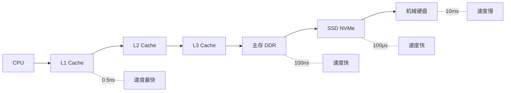
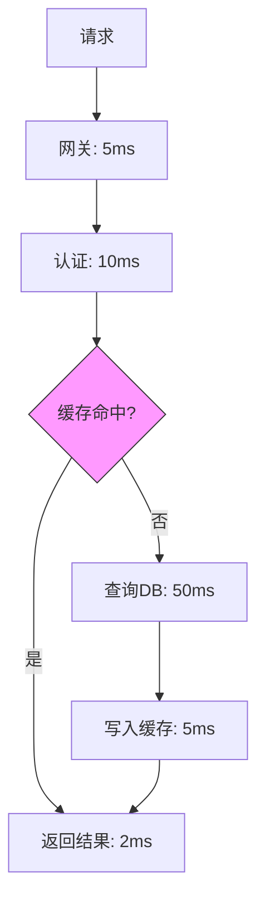

# 延迟估算：数字速算表（Back-of-the-envelope）

假设你设计一个接口，目标是 p99 延迟 `<` 100ms。代码写完后，一测试发现延迟达到了 500ms。你开始怀疑：代码有问题？数据库慢？网络抖动？

但你没有意识到，500ms 足够做这些事情：

- 从内存读取 5GB 数据
- 跨机房往返 250 次
- 从 SSD 顺序读取 500MB 数据
- 从机械硬盘读取 16GB 数据

问题往往不是「代码慢」，而是**不知道瓶颈在哪里**。

数字速算表（Back-of-the-envelope estimation）培养的是**数量级直觉**。当你估算某个操作需要 100ms 时，应该立刻反应过来：100ms 能做什么、不能做什么。

## Jeff Dean 的经典数字速算表

Google 传奇工程师 Jeff Dean 在一次演讲中分享了这张表，成为系统性能估算的经典参考：

| 操作 | 延迟 | 相对速度 |
| --- | --- | --- |
| L1 缓存读取 | 1 ns | 1x |
| L2 缓存读取 | 4 ns | 4x 慢 |
| L3 缓存读取 | 14 ns | 14x 慢 |
| 主存读取 | 100 ns | 100x 慢 |
| SSD 顺序读取 1MB | 1 ms | 10,000x 慢 |
| 内存顺序读取 1MB | 0.25 ms | 2,500x 慢 |
| 机械硬盘顺序读取 1MB | 30 ms | 300,000x 慢 |
| 跨机房往返（同城） | 0.5 ms | 5,000,000x 慢 |
| 跨机房往返（异地） | 30 ms | 300,000,000x 慢 |
| 跨洲际往返 | 150 ms | 1,500,000,000x 慢 |

:::info
1 ns = 10^-9 秒，1 ms = 10^-3 秒。一秒内可以完成 10 亿次 L1 缓存读取，但只能完成 7 次跨洲际往返。
:::

### 数量级对比

把数字转换成更直观的形式：

```
1 秒 = 10^9 纳秒

如果 L1 缓存读取是 1 秒：
- L2 缓存读取 = 4 秒
- L3 缓存读取 = 14 秒
- 主存读取 = 1.6 分钟
- SSD 读取 1MB = 11.5 天
- 机械硬盘读取 1MB = 1 年
- 跨机房往返 = 5.8 年
- 跨洲际往返 = 150 年
```

## 为什么延迟差异如此之大

延迟的差异，本质上是**存储介质的速度差异**和**物理距离**。

### 存储介质速度对比



每一级存储之间，都有 10~100 倍的延迟差距。这就是为什么现代计算机系统要尽可能利用缓存的原因。

### 物理距离的影响

```
光速 = 299,792 km/s ≈ 30 万 km/s

跨机房往返（100km）：
- 距离 = 100km × 2 = 200km（往返）
- 光速时间 = 200 ÷ 300000 ≈ 0.67ms
- 实际延迟 = 0.5~1ms（包含网络设备开销）

跨洲际往返（10000km）：
- 距离 = 10000km × 2 = 20000km
- 光速时间 = 20000 ÷ 300000 ≈ 67ms
- 实际延迟 = 100~200ms（包含光缆路由、网络设备）
```

:::warning
跨机房、跨地域的网络延迟是无法优化的，它由物理距离决定。你的架构设计必须考虑这个约束：跨地域调用的延迟是本地调用的 100~1000 倍。
:::

## 延迟估算公式

### 串行操作延迟

```
总延迟 = 操作1延迟 + 操作2延迟 + 操作3延迟 + ...
```

串行操作的总延迟是各操作延迟之和。如果每步延迟都是 10ms，10 步串行就是 100ms。

### 并行操作延迟

```
总延迟 = max(操作1延迟, 操作2延迟, 操作3延迟, ...)
```

并行操作的总延迟取决于最慢的那一步。5 个并行操作，延迟分别是 10ms、20ms、30ms、40ms、50ms，总延迟就是 50ms。

### 混合场景

```java
// 场景：用户搜索请求
// 1. 解析请求：2ms（CPU）
// 2. 查询缓存：5ms（Redis）
// 3. 缓存未命中，查询数据库：50ms（并行查询 3 个表）
// 4. 组装结果：5ms（CPU）

// 如果步骤 3 并行：
总延迟 = 2 + 5 + max(50, 50, 50) + 5 = 62ms

// 如果步骤 3 串行（查询 3 个表）：
总延迟 = 2 + 5 + 50 + 50 + 50 + 5 = 162ms
```

### 概率场景

```
总延迟 = 命中概率1 × 延迟1 + 命中概率2 × 延迟2 + ...

示例：缓存命中率 90%
- 缓存命中延迟：5ms
- 缓存未命中延迟：100ms
- 平均延迟 = 0.9 × 5 + 0.1 × 100 = 14.5ms
```

## 快速估算技巧

### 技巧一：记住基准数字

不需要记住所有数字，但需要记住几个基准：

```
1 ms = 1,000,000 ns
1 秒 = 1000 ms = 1,000,000 μs

关键基准：
- 内存读取：100 ns ≈ 0.1 μs
- SSD 读取 1MB：1 ms = 1000 μs
- 机械硬盘读取 1MB：30 ms
- 跨机房往返：500 μs ~ 1 ms
```

### 技巧二：用比例估算

如果知道某个操作的延迟，可以推算其他操作：

```
如果内存读取 1GB 需要 250ms，那么：
- 读取 1MB = 250ms ÷ 1000 = 0.25ms
- 读取 1KB = 250ms ÷ 1,000,000 = 0.25μs

如果跨机房往返需要 1ms，那么：
- 往返 10 次 = 10ms
- 往返 100 次 = 100ms
- 1 秒内最多往返 1000 次
```

### 技巧三：识别关键路径



分析关键路径（最长的那条）：
- 命中路径：5 + 10 + 2 = 17ms
- 未命中路径：5 + 10 + 50 + 5 + 2 = 72ms
- **总延迟由未命中路径决定**，因为缓存命中率影响整体平均

## 常见场景的延迟估算

### 场景一：一次 HTTP 请求

```
假设请求一个返回 JSON 的 API：

组件延迟：
- DNS 解析：5ms
- TCP 连接：10ms
- SSL 握手：15ms（首次）
- 请求传输：5ms
- 服务端处理：30ms
- 响应传输：5ms
- TCP 挥手：5ms

首次请求总延迟 ≈ 75ms
后续请求总延迟 ≈ 55ms（复用连接，跳过 SSL）

结论：一次简单的 HTTP 请求，延迟至少 50ms。
```

### 场景二：一次数据库查询

```
假设查询一张有索引的表：

组件延迟：
- 应用层处理：2ms
- 网络传输（应用→DB）：1ms
- DB 连接处理：1ms
- 查询解析：2ms
- 索引查找：5ms
- 数据读取：10ms
- 结果返回：1ms
- 网络传输（DB→应用）：1ms

单次查询延迟 ≈ 23ms

如果需要 JOIN 3 张表（假设可并行）：
- 查表 A：20ms
- 查表 B：15ms
- 查表 C：25ms
- JOIN 处理：10ms

总延迟 ≈ max(20, 15, 25) + 10 = 35ms
```

### 场景三：一次缓存查询

```java
// 模拟一个典型的缓存 + 数据库查询场景
public class CacheQueryExample {

    // 缓存命中
    public String getFromCache(String key) {
        // L1/L2/L3 缓存查找：~10ns
        // 如果命中，直接返回
        return cache.get(key); // 约 1~10μs
    }

    // 缓存未命中，查询数据库
    public String getFromDb(String key) {
        // Redis 网络往返：~1ms
        // MySQL 查询：~20ms
        String value = redis.get(key);
        if (value == null) {
            value = db.query(key); // ~20ms
            redis.setex(key, 3600, value); // ~1ms
        }
        return value;
    }
}
```

### 场景四：一次分布式事务

```
假设需要跨 3 个服务完成一次业务操作：

服务 A（主服务）：
- 本地处理：10ms
- 发送消息：5ms

服务 B（异步处理）：
- 消费消息：5ms
- 处理业务：20ms
- 发送回调：5ms

服务 C（异步处理）：
- 消费消息：5ms
- 处理业务：15ms
- 发送回调：5ms

如果 A→B→C 串行：
总延迟 = 10 + 5 + 20 + 5 + 15 + 5 = 60ms

如果 B 和 C 并行：
总延迟 = 10 + 5 + max(20, 15) + 5 = 40ms
```

## 延迟优化策略

理解了延迟的来源，优化就有了方向。

### 策略一：减少串行

```java
// 优化前：串行查询 3 个表
User user = userDao.getById(id);           // 20ms
List<Order> orders = orderDao.getByUserId(id); // 30ms
List<Address> addresses = addressDao.getByUserId(id); // 20ms

// 总延迟 = 20 + 30 + 20 = 70ms

// 优化后：并行查询（CompletableFuture）
CompletableFuture<User> userFuture = CompletableFuture.supplyAsync(() -> userDao.getById(id));
CompletableFuture<List<Order>> ordersFuture = CompletableFuture.supplyAsync(() -> orderDao.getByUserId(id));
CompletableFuture<List<Address>> addressesFuture = CompletableFuture.supplyAsync(() -> addressDao.getByUserId(id));

CompletableFuture.allOf(userFuture, ordersFuture, addressesFuture).join();

// 总延迟 = max(20, 30, 20) = 30ms
```

### 策略二：用缓存换延迟

```
缓存命中率对平均延迟的影响：

命中率    | 缓存延迟 | DB 延迟 | 平均延迟
----------|----------|---------|----------
0%        | -        | 50ms    | 50ms
80%       | 5ms      | 50ms    | 0.8×5 + 0.2×50 = 14ms
95%       | 5ms      | 50ms    | 0.95×5 + 0.05×50 = 7.25ms
99%       | 5ms      | 50ms    | 0.99×5 + 0.01×50 = 5.45ms
```

### 策略三：异步化

```
同步模式：
请求 → 处理(100ms) → 返回
总延迟 = 100ms

异步模式：
请求 → 立即返回(10ms)
           ↓
        处理(100ms)
           ↓
        回调通知

用户感知的延迟 = 10ms
实际处理时间 = 100ms
```

### 策略四：读写分离

```
读操作延迟：
- 主库：50ms（写入压力下可能更慢）
- 从库：20ms（无写入压力）
- 缓存：5ms

写操作延迟：必须主库（50ms）
读操作延迟：优先缓存（5ms）→ 从库（20ms）→ 主库（50ms）
```

## 延迟与服务等级

不同的延迟对用户体验的影响：

| 延迟范围 | 用户感知 | 示例 |
| --- | --- | --- |
| `<` 100ms | 即时响应 | 缓存命中、静态资源 |
| 100~300ms | 正常响应 | 普通 API 调用 |
| 300ms~1s | 能感知延迟 | 复杂查询 |
| 1~5s | 明显等待 | 大数据量导出 |
| `>` 5s | 用户流失风险 | 超时、失败 |

## 总结

数字速算表的核心价值是培养**数量级直觉**：

- **L1 缓存读取**：~1ns
- **内存读取**：~100ns
- **SSD 读取 1MB**：~1ms
- **跨机房往返**：~1ms
- **跨洲际往返**：~150ms

记住这些数字不是为了背诵，而是为了在设计时快速判断方案的可行性。当你说「某个操作需要 500ms」时，应该立刻反应过来：这个时间足够从内存读 5GB 数据，方案可能有问题。

延迟估算的公式：

```
串行延迟 = sum(各步骤延迟)
并行延迟 = max(各步骤延迟)
混合延迟 = 命中概率 × 命中延迟 + 未命中概率 × 未命中延迟
```

优化延迟的核心策略：减少串行、用缓存、异步化、读写分离。
