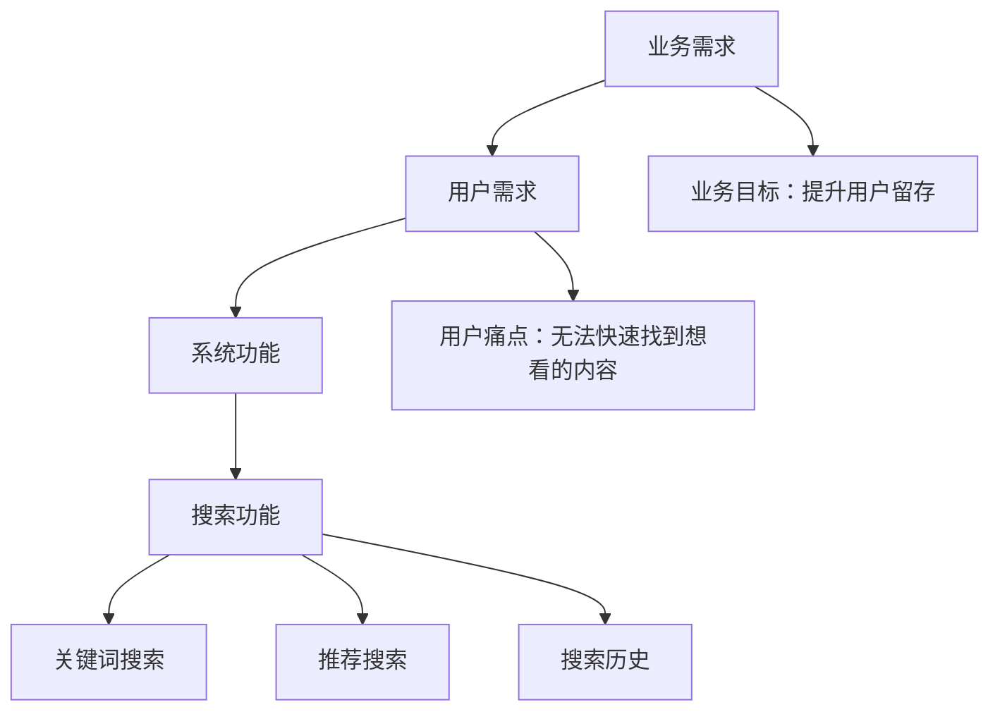
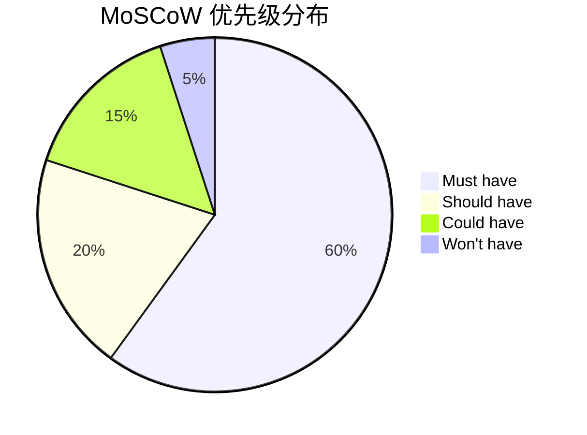

# 需求分析：功能需求 vs 非功能需求

很多人以为系统设计是从画架构图开始的。但实际上，真正的起点是**需求分析**。

我见过太多架构评审会，团队花了两周画出了精美的架构图，结果上线后发现：性能不达标、扩展性不足、安全漏洞频出。事后复盘，根源往往是一个问题——**需求没有分析清楚**。

需求分析是整个系统设计流程中最重要、也是最容易被跳过的一步。因为需求分析是「软」的，不像代码那样能产出可见的东西。但恰恰是这一步，决定了后续所有工作的方向。

## 什么是需求

需求是对系统应该「做什么」和「做到什么程度」的描述。但「做什么」和「做到什么程度」是两个完全不同的维度：

- **功能需求**：系统要做什么（What）—— 用户能发消息、能搜索、能支付
- **非功能需求**：系统要做到什么程度（How Well）—— 消息要在 1 秒内送达、搜索要在 100ms 内返回

功能需求回答的是「有没有」，非功能需求回答的是「好不好」。只满足功能需求的系统可能是「能用」，同时满足两者才是「好用」。

## 功能需求分析

### 功能需求的来源

功能需求不是架构师拍脑袋想出来的，它来源于：

1. **用户调研**：用户告诉你他们需要什么
2. **业务方需求**：产品经理、业务负责人提出的业务目标
3. **竞品分析**：别人有，我们也要有
4. **监管要求**：合规、法律、安全强制要求
5. **技术驱动**：技术团队发现某些功能能带来显著的业务价值

### 功能需求的三层结构



**业务需求**是最高层，描述的是业务目标（如「提升用户留存率」）。**用户需求**是中间层，描述的是用户的痛点和期望（如「快速找到想看的内容」）。**系统功能**是最底层，描述的是具体的技术实现（如「关键词搜索」「推荐搜索」）。

### 功能需求的陷阱

#### 陷阱一：堆砌功能清单

拿到 100 条功能需求，就设计 100 个功能。这种做法的问题在于：没有优先级、无法聚焦核心价值。

**正确做法**：先理解业务目标，再推导核心功能，区分「必须有」和「可以有」。

#### 陷阱二：忽略边界条件

「用户可以登录」—— 这句话听起来很简单，但要真正设计好，需要考虑：

- 用户名密码错误怎么办？
- 账号被锁定怎么办？
- 异地登录怎么检测？
- 登录超时怎么处理？
- 并发登录怎么处理？

边界条件往往比正常流程更重要，因为线上问题往往出在边界。

#### 陷阱三：功能需求和非功能需求混淆

「系统要支持 100 万用户」是功能需求还是非功能需求？

很多人会把它当作功能需求，但实际上是**非功能需求**——它描述的是系统的承载能力，而非具体功能。

## 非功能需求分析

非功能需求通常用「-ilities」来表示，也叫「系统品质属性」：

- **Scalability**：可扩展性
- **Availability**：可用性
- **Reliability**：可靠性
- **Performance**：性能
- **Security**：安全性
- **Maintainability**：可维护性

非功能需求是架构设计的**约束条件**。它们决定了技术选型的边界，决定了哪些方案可选、哪些方案不可选。

### 性能（Performance）

性能需求通常关注以下几个方面：

| 指标 | 说明 | 典型要求 |
| --- | --- | --- |
| 响应时间 | 单次请求的耗时 | p99 `<` 200ms |
| 吞吐量 | 单位时间处理的请求数 | 10000 QPS |
| 并发数 | 同时处理的请求数 | 支持 5000 并发连接 |
| 资源利用率 | CPU、内存、IO 的使用率 | CPU `<` 70% |

性能需求必须**量化**。「系统要快」不是需求，「p99 延迟 `<` 100ms」才是需求。量化才能验收，验收才能确认设计是否满足。

### 可用性（Availability）

可用性通常用「几个 9」来表示：

| 可用性 | 年故障时长 | 典型场景 |
| --- | --- | --- |
| 99% | 3.65 天 | 内部系统 |
| 99.9% | 8.76 小时 | 消费级应用 |
| 99.99% | 52.6 分钟 | 金融支付 |
| 99.999% | 5.26 分钟 | 电信级系统 |

可用性每提升一个 9，成本可能增加 5~10 倍。选择多少个 9，要根据业务的实际需求和代价来决定。

:::warning
不是所有系统都需要 99.999% 的可用性。一个内部工具宕机 1 小时，可能损失不大；但支付系统宕机 1 分钟，就是重大事故。要根据业务价值来确定可用性目标。
:::

### 可扩展性（Scalability）

可扩展性描述的是系统应对增长的能力：

- **水平扩展**：通过增加节点来提升容量（如增加服务器）
- **垂直扩展**：通过升级单节点的配置来提升容量（如升级 CPU）

| 扩展方式 | 优点 | 缺点 |
| --- | --- | --- |
| 水平扩展 | 理论上无上限 | 复杂度高、分布式问题 |
| 垂直扩展 | 简单、无分布式问题 | 有硬件上限、成本非线性增长 |

现代系统通常采用水平扩展架构，因为业务增长往往超预期，垂直扩展很快就会碰到天花板。

### 安全性（Security）

安全性需求覆盖多个层面：

| 层面 | 关注点 | 典型要求 |
| --- | --- | --- |
| 认证 | 谁可以访问 | 支持 OAuth2、JWT 等 |
| 授权 | 能做什么操作 | RBAC 权限控制 |
| 传输安全 | 数据如何传输 | TLS 1.3 |
| 存储安全 | 数据如何存储 | 敏感数据加密 |
| 审计 | 谁做了什么 | 操作日志记录 |

安全性需求往往被忽视，直到出事才后悔。安全应该是**设计时考虑**，而不是「后面再加」。

### 一致性（Consistency）

分布式系统中，一致性和可用性往往不可兼得（CAP 理论）。根据业务场景选择合适的一致性级别：

| 一致性级别 | 说明 | 适用场景 |
| --- | --- | --- |
| 强一致性 | 写入后立即可读 | 金融交易、库存扣减 |
| 最终一致性 | 短暂延迟后一致 | 社交feed、评论系统 |
| 因果一致性 | 有关联的操作顺序一致 | 协同编辑 |

### 可维护性（Maintainability）

可维护性描述的是系统被维护、修改、扩展的难易程度：

- **模块化**：修改一个模块不影响其他模块
- **可测试性**：能否方便地写单元测试和集成测试
- **可观测性**：出了问题能否快速定位
- **部署频率**：一次部署能否快速完成

## 需求优先级：MoSCoW 方法

当需求太多、时间有限时，需要对需求进行优先级排序。MoSCoW 是最常用的方法：

| 优先级 | 含义 | 说明 |
| --- | --- | --- |
| **M**ust have | 必须有 | 没有就无法上线，核心功能 |
| **S**hould have | 应该有 | 重要但不是致命，缺失会影响体验 |
| **C**ould have | 可以有 | 锦上添花，有则更好 |
| **W**on't have | 这次不会有 | 推迟到下一版 |

典型的分配比例是：Must have 60%，Should have 20%，Could have 20%。注意 Won't have 不是「不要做」，而是「这次不做」。



## 从用户故事推导功能需求

用户故事（User Story）是从用户视角描述需求的格式：

```
作为 [角色]，我想要 [功能]，以便 [收益]
```

例如，设计一个电商搜索功能：

```
作为 买家，我想要 按价格筛选商品，以便 找到符合预算的选项
作为 买家，我想要 按销量排序商品，以便 找到热门商品
作为 买家，我想要 搜索历史记录，以便 快速找到之前搜索的内容
作为 系统，我需要在 搜索高峰期缓存结果，以便 减少数据库压力
```

从用户故事可以推导出功能需求清单：

| 用户故事 | 功能需求 | 优先级 | 备注 |
| --- | --- | --- | --- |
| 按价格筛选 | 价格区间筛选器 | Must | |
| 按销量排序 | 销量排序能力 | Should | 需要维护销量数据 |
| 搜索历史 | 历史记录存储与展示 | Should | 考虑隐私问题 |
| 高峰期缓存 | 缓存策略设计 | Must | 缓存过期时间？一致性？ |

## 量化非功能需求

非功能需求必须量化，否则无法验收。以下是一些常见场景的量化标准：

### 性能量化

```
目标：搜索接口 p99 延迟 <= 100ms

分解：
- DNS 解析：5ms
- TCP 连接：10ms
- SSL握手：15ms
- 请求传输：5ms
- 服务端处理：30ms
- 响应传输：5ms
- 客户端渲染：30ms

总计：100ms

结论：服务端处理时间需要控制在 30ms 以内，这要求缓存命中率 >= 95%
```

### 可用性量化

```
目标：年度可用性 >= 99.95%

允许故障时长：
= (1 - 0.9995) × 365 × 24 × 60
= 26.28 分钟 / 年

故障场景分析：
- 单机房断电：2 小时恢复 → 需要同城多活
- 单数据库故障：30 分钟恢复 → 需要主从切换
- 单服务实例故障：5 分钟恢复 → 需要自动 failover

结论：仅靠单点备份无法满足 99.95%，需要完整的容灾架构
```

### 可扩展性量化

```
目标：支持未来 3 年 10 倍增长

当前容量：
- DAU：1000 万
- 峰值 QPS：5000
- 存储：1 TB

3 年后容量（10 倍）：
- DAU：1 亿
- 峰值 QPS：50000
- 存储：10 TB

扩展方案：
- 应用层：无状态服务，水平扩展即可
- 缓存层：需要从 8G 扩展到 80G 内存，或增加节点
- 数据库层：需要分库分表，从单实例升级到集群
```

## 需求文档模板

一个完整的 PRD（产品需求文档）应该包含：

```markdown
# 搜索功能 PRD

## 1. 背景与目标

### 业务背景
- 用户反馈搜索体验差，60% 的搜索无法在 3 次内找到目标
- 竞品搜索转化率比我们高 20%

### 项目目标
- 搜索 p99 延迟从 800ms 降低到 200ms
- 搜索转化率提升 15%

## 2. 功能需求

### 核心功能
- [ ] 关键词全文搜索
- [ ] 价格区间筛选
- [ ] 销量/好评排序
- [ ] 搜索历史

### 扩展功能
- [ ] 搜索建议（auto-complete）
- [ ] 相关搜索
- [ ] 语音搜索

## 3. 非功能需求

| 指标 | 当前值 | 目标值 |
| --- | --- | --- |
| p99 延迟 | 800ms | `<` 200ms |
| 可用性 | 99.9% | `>=` 99.95% |
| QPS 峰值 | 2000 | 支持 10000 |
| 数据新鲜度 | 24h | 1h |

## 4. 约束条件

- 技术栈限制：必须使用公司现有的 Java 技术栈
- 时间限制：3 个月内完成
- 成本限制：月度云资源成本不超过 50 万

## 5. 风险与应对

| 风险 | 影响 | 应对策略 |
| --- | --- | --- |
| 搜索质量不达预期 | 高 | AB 测试、逐步灰度 |
| 索引更新延迟 | 中 | 降级到旧索引 |
| 成本超支 | 中 | 缓存优化、资源复用 |
```

## 总结

需求分析是系统设计的第一步，也是最重要的一步。

**功能需求**回答的是「做什么」，需要从业务目标出发，区分核心功能和扩展功能。

**非功能需求**回答的是「做到什么程度」，需要量化每个指标，让验收有标准。

两者缺一不可。没有功能需求，系统不知道做什么；没有非功能需求，系统不知道做到什么程度。

下次开始系统设计之前，先问问自己：**需求真的清楚了吗？**
