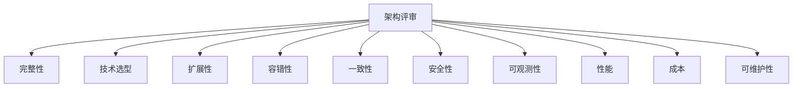
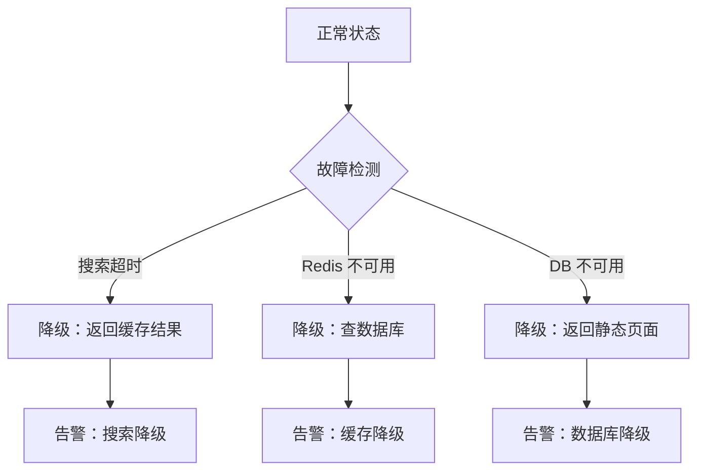
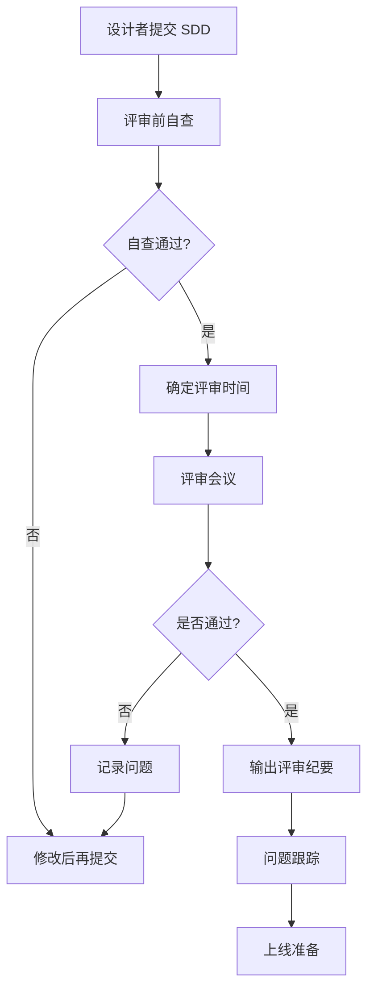

# 架构评审 Checklist

架构评审会上，评审专家问了一个问题：「如果 Redis 挂了，系统会怎样？」

团队沉默了。没有人能回答这个问题。

这不是评审太严格，而是设计时根本没有考虑这个场景。上线后，这样的遗漏往往就是线上故障的根源。

架构评审的目的，是**在上线前发现设计中的问题**，而不是在线上事故中暴露问题。

## 评审的核心原则

### 原则一：评审是协助，不是挑刺

评审专家的职责是帮助设计者发现问题，不是证明自己比设计者更聪明。好的评审应该是建设性的。

### 原则二：红线和黄线分开

- **红线（Must Fix）**：必须解决，否则不能上线
- **黄线（Should Fix）**：建议解决，但可以接受延期

### 原则三：区分问题优先级

不是所有问题都同等重要。评审时要把精力放在真正影响系统稳定性的问题上。

## 评审维度总览



## 一、完整性检查

### 功能覆盖检查

- [ ] 核心功能是否全部覆盖？
- [ ] 边界条件是否考虑了？
- [ ] 异常流程是否有处理？
- [ ] 是否有降级方案？

**评审问题示例**：

```
Q：搜索结果为空时，系统如何处理？
A：显示空结果页面。

Q：用户的搜索历史保留多久？
A：保留 30 天。

Q：如果搜索服务完全不可用，系统如何降级？
A：返回静态推荐列表。
```

### 数据完整性检查

- [ ] 数据是否有备份？
- [ ] 数据是否定期校验？
- [ ] 数据迁移是否有方案？
- [ ] 历史数据是否需要保留？

## 二、技术选型检查

### 选型依据

- [ ] 是否对比了多个方案？
- [ ] 是否有明确的选型依据？
- [ ] trade-off 分析是否充分？
- [ ] 团队是否有能力驾驭该技术？

**评审问题示例**：

```
Q：为什么选 Elasticsearch 而不是 MySQL 全文索引？
A：MySQL 全文索引性能无法支撑亿级数据，Elasticsearch 
   可以水平扩展，满足未来 3 年增长需求。

Q：团队是否有 Elasticsearch 运维经验？
A：已有 2 年使用经验，踩过一些坑，有信心。
```

### 技术债务

- [ ] 是否引入了新的技术债务？
- [ ] 技术债务的代价是什么？
- [ ] 是否有偿还计划？

## 三、扩展性检查

### 水平扩展

- [ ] 服务是否无状态？
- [ ] 增加实例后能否自动分担流量？
- [ ] 数据库是否支持分库分表？

**扩展性评估表**：

| 组件 | 当前容量 | 扩展方式 | 扩展上限 | 扩展成本 |
| --- | --- | --- | --- | --- |
| API 服务 | 10000 QPS | 加机器 | 无上限 | 低 |
| Redis | 16 GB | 加节点 | 取决于内存 | 中 |
| MySQL | 2 TB | 分库分表 | 高 | 高 |
| Elasticsearch | 10 TB | 加节点 | 无上限 | 中 |

### 增长预估

- [ ] 是否考虑了未来 6 个月~1 年的增长？
- [ ] 现有设计能否支撑这个增长？
- [ ] 如果无法支撑，扩展路径是什么？

## 四、容错性检查

### 单点故障

- [ ] 是否有单点故障？
- [ ] 单点故障的影响范围？
- [ ] 是否有冗余方案？

**单点故障检查清单**：

| 组件 | 单点？ | 影响 | 冗余方案 |
| --- | --- | --- | --- |
| API Gateway | 否 | - | 多实例 + 负载均衡 |
| Redis | 是 | 缓存失效 | 主从 + 自动切换 |
| MySQL | 是 | 数据不可用 | 主从 + 自动切换 |
| 消息队列 | 是 | 消息丢失 | 集群模式 |

### 降级策略

- [ ] 核心功能是否可降级？
- [ ] 降级后的用户体验如何？
- [ ] 如何触发降级？



### 限流与熔断

- [ ] 是否有限流策略？
- [ ] 是否有熔断机制？
- [ ] 流量超过预期时如何处理？

## 五、一致性检查

### 数据一致性

- [ ] 是否是强一致性需求？
- [ ] 如果可以接受最终一致，是否明确？
- [ ] 如何保证最终一致性？

**一致性需求评估**：

| 业务场景 | 一致性要求 | 解决方案 |
| --- | --- | --- |
| 支付扣款 | 强一致 | 分布式事务 |
| 订单状态 | 最终一致（< 1s） | 消息队列 |
| 点赞数 | 最终一致（< 10s） | 异步更新 |
| 推荐列表 | 最终一致（< 1min） | 定时任务 |

### 缓存一致性

- [ ] 缓存和数据的一致性如何保证？
- [ ] 先更新数据库还是先删缓存？
- [ ] 缓存过期策略是什么？

## 六、安全性检查

### 认证与授权

- [ ] 用户身份如何验证？
- [ ] 权限如何控制？
- [ ] 是否有越权风险？

### 数据安全

- [ ] 敏感数据是否加密存储？
- [ ] 数据传输是否加密？
- [ ] 是否有审计日志？

**安全检查清单**：

| 检查项 | 要求 |
| --- | --- |
| 密码存储 | BCrypt 或 Argon2 哈希 |
| 敏感信息 | 脱敏或加密存储 |
| SQL 注入 | 使用参数化查询 |
| XSS | 输入输出过滤 |
| CSRF | Token 验证 |
| 敏感接口 | IP 白名单或频率限制 |

## 七、可观测性检查

### 监控指标

- [ ] 核心业务指标是否监控？
- [ ] 基础设施指标是否监控？
- [ ] 指标是否有仪表盘展示？

**核心监控指标**：

| 类别 | 指标 | 告警阈值 |
| --- | --- | --- |
| 可用性 | 错误率 | > 1% |
| 性能 | p99 延迟 | > 200ms |
| 容量 | 磁盘使用率 | > 80% |
| 流量 | QPS | 低于预期的 50% |

### 日志

- [ ] 关键操作是否记录日志？
- [ ] 日志格式是否规范？
- [ ] 日志保留期是否满足审计要求？
- [ ] 日志是否支持查询？

### 链路追踪

- [ ] 是否有分布式追踪？
- [ ] 能否通过 trace ID 串联所有日志？
- [ ] 追踪性能开销是否可接受？

## 八、性能检查

### 容量规划

- [ ] QPS 估算是否正确？
- [ ] 存储规划是否合理？
- [ ] 带宽规划是否足够？
- [ ] 峰值流量是否有 buffer？

### 性能测试

- [ ] 是否进行过性能测试？
- [ ] 测试环境与生产环境的差异是否评估？
- [ ] 性能瓶颈在哪里？

## 九、成本检查

### 资源成本

- [ ] 服务器成本是否估算？
- [ ] 云服务成本是否估算？
- [ ] 人力成本是否考虑？

**成本估算表**：

| 资源 | 数量 | 单价/月 | 总价/月 |
| --- | --- | --- | --- |
| 应用服务器 | 10 台 | 500 元 | 5000 元 |
| 数据库 | 2 台 | 2000 元 | 4000 元 |
| Redis | 3 节点 | 800 元 | 2400 元 |
| CDN | 按流量 | - | 3000 元 |
| **合计** | | | **14400 元** |

### ROI 分析

- [ ] 投入产出比是否合理？
- [ ] 是否有更经济的替代方案？

## 十、可维护性检查

### 文档

- [ ] SDD 是否完整？
- [ ] 关键决策是否有 ADR？
- [ ] 是否有人负责维护文档？

### 部署

- [ ] 部署是否自动化？
- [ ] 部署是否支持回滚？
- [ ] 部署过程是否记录？

### Onboarding

- [ ] 新成员能否快速上手？
- [ ] 是否有 runbook？
- [ ] 是否有人可以随时 support？

## 红线问题（Must Fix）

以下问题如果存在，**不能上线**：

### 1. 没有容量规划

设计文档中找不到 QPS、存储、带宽的计算过程。

### 2. 单点故障无冗余

关键组件（如数据库）没有备份，且无自动切换方案。

### 3. 缺少监控告警

上线后无法感知系统是否正常，无任何告警机制。

### 4. 数据无备份

核心数据没有灾备方案，一旦数据丢失无法恢复。

### 5. 安全漏洞

明文存储密码、SQL 注入风险、未授权访问漏洞等。

### 6. 无回滚方案

没有灰度发布和快速回滚能力，一旦出问题只能硬回滚。

## 评审流程



## 评审纪要模板

```markdown
# 架构评审纪要

## 基本信息
- 项目：XXX 系统
- 评审时间：2024-03-01
- 评审人：张三、李四、王五
- 设计人：赵六

## 评审结论
**通过** / **不通过** / **有条件通过**

## 发现的问题

### 红线问题（Must Fix）
| 问题 | 严重程度 | 负责人 | 截止日期 |
| --- | --- | --- | --- |
| 数据库无备份 | 严重 | 张三 | 2024-03-05 |

### 黄线问题（Should Fix）
| 问题 | 严重程度 | 建议 | 负责人 |
| --- | --- | --- | --- |
| 监控指标不够完善 | 中 | 增加业务指标监控 | 李四 |

## 后续行动
- [ ] 2024-03-05：完成数据库备份方案
- [ ] 2024-03-10：补充业务指标监控

## 下次评审时间
2024-03-15
```

## 总结

架构评审是系统上线前的最后一道防线。一个好的评审 checklist 能帮助我们系统性地检查设计中的问题。

评审的核心维度：

1. **完整性**：功能是否全覆盖？
2. **技术选型**：选型依据是否充分？
3. **扩展性**：能否应对未来增长？
4. **容错性**：单点故障在哪里？
5. **一致性**：数据一致性如何保证？
6. **安全性**：有没有安全漏洞？
7. **可观测性**：能否快速发现问题？
8. **性能**：容量规划是否合理？
9. **成本**：投入产出比如何？
10. **可维护性**：未来能否持续迭代？

评审不是挑刺，而是**协助**。好的评审应该帮助设计者发现盲点，共同打造更可靠的系统。
