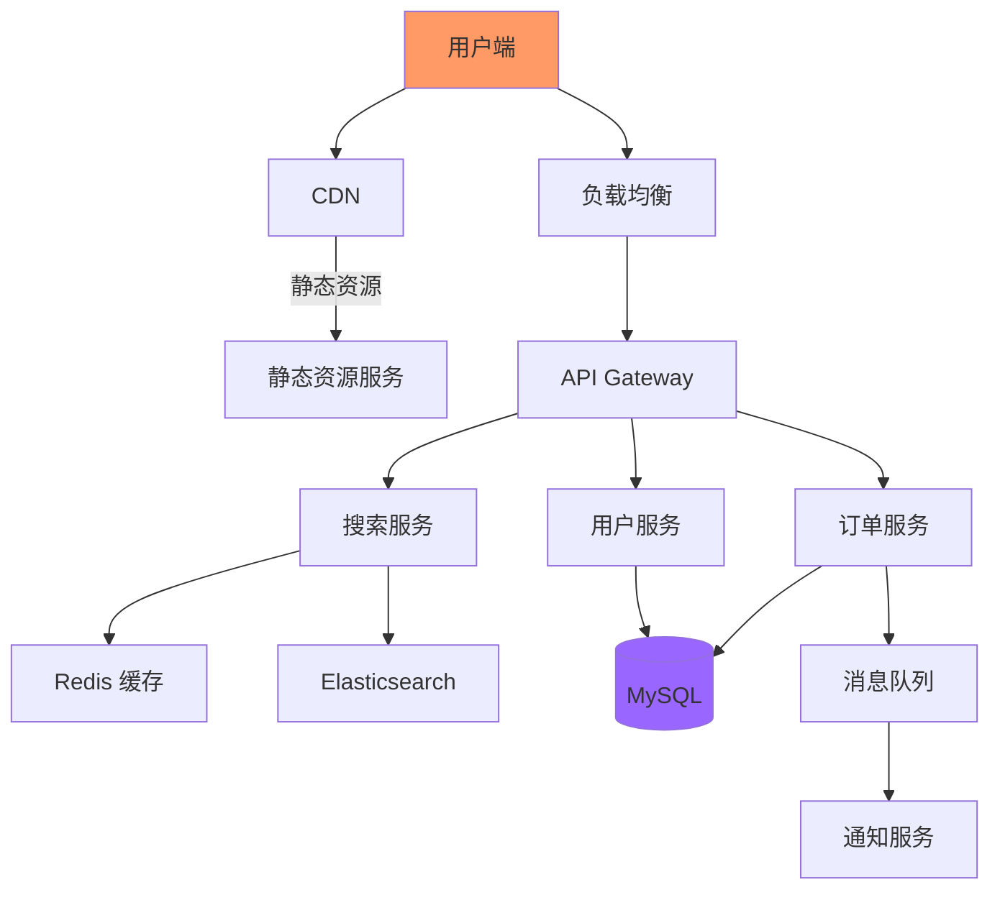

# 系统设计文档（SDD）编写规范

项目上线三个月后，系统出现了一个诡异的 bug：特定条件下，用户的订单金额会变成负数。团队开始排查，但没有人记得当初为什么要这样设计——代码注释只写了「优化性能」，没有任何业务背景说明。

架构评审时，大家对着 PPT 讨论了 2 小时。PPT 画得很漂亮，但没有一个人能说清楚：为什么要用这个消息队列而不是那个？为什么缓存过期时间设为 5 分钟而不是 10 分钟？这些决策的依据是什么？

两年后，系统需要重构。新来的同事看着这份文档，满脸问号——很多设计已经过时了，但没人敢改，因为不知道当初为什么这样做。

这些场景暴露了同一个问题：**缺乏有效的系统设计文档**。

## 为什么需要 SDD

系统设计文档（System Design Document，SDD）不是给领导看的汇报材料，而是**团队协作的工具**和**知识传承的载体**。

SDD 的核心价值：

1. **记录决策**：为什么选 A 不选 B？trade-off 是什么？
2. **团队对齐**：让所有人对系统设计有一致的理解
3. **知识传承**：新成员 onboarding 时的重要参考
4. **问题排查**：出问题时，能理解系统的设计意图
5. **架构演进**：记录系统的演化历程，为未来重构提供参考

## SDD 的结构

### 标准模板

```markdown
# 系统设计文档：XXX 系统

## 1. 概述

### 1.1 背景与问题
- 为什么要做这个系统？
- 解决什么问题？
- 不做的代价是什么？

### 1.2 项目目标
- 业务目标
- 技术目标
- 成功标准

### 1.3 范围与约束
- 包含哪些功能？
- 不包含哪些功能？
- 有什么技术约束？

## 2. 非功能需求

### 2.1 性能需求
| 指标 | 目标值 | 说明 |
| --- | --- | --- |
| QPS | 10000 | 峰值 QPS |
| p99 延迟 | < 200ms | |
| 可用性 | >= 99.95% | |

### 2.2 扩展性需求
- 支持未来 3 年 10 倍增长
- 水平扩展架构

### 2.3 安全性需求
- 数据加密传输
- 用户数据脱敏
- 操作审计

## 3. 系统架构

### 3.1 整体架构图
[架构图]

### 3.2 核心组件
| 组件 | 职责 | 部署方式 |
| --- | --- | --- |
| API Gateway | 请求路由、限流 | 3 实例 |
| 用户服务 | 用户管理 | 5 实例 |
| 订单服务 | 订单处理 | 5 实例 |

### 3.3 数据流设计
[数据流图]

## 4. 详细设计

### 4.1 模块 A 设计
#### 职责
#### 接口设计
#### 数据模型
#### 流程图

### 4.2 模块 B 设计
...

## 5. 技术选型

### 5.1 选型对比

| 方案 | 优点 | 缺点 | 选择 |
| --- | --- | --- | --- |
| 方案 A | ... | ... | 是 |
| 方案 B | ... | ... | 否 |

### 5.2 Trade-off 分析
[详细的 trade-off 分析]

## 6. 容量规划

### 6.1 QPS 估算
[计算过程]

### 6.2 存储规划
[计算过程]

### 6.3 资源需求
| 资源 | 数量 | 配置 |
| --- | --- | --- |
| 应用服务器 | 10 台 | 8C16G |
| 数据库 | 2 台 | 16C64G |

## 7. 部署方案

### 7.1 部署架构
[部署图]

### 7.2 灰度策略
- 1% → 10% → 50% → 100%

### 7.3 回滚方案
[回滚步骤]

## 8. 监控与告警

### 8.1 关键指标
| 指标 | 告警阈值 |
| --- | --- |
| 错误率 | > 1% |
| p99 延迟 | > 300ms |

### 8.2 告警策略
[告警配置]

## 9. 风险评估

| 风险 | 影响 | 概率 | 应对策略 |
| --- | --- | --- | --- |
| 数据库成为瓶颈 | 高 | 中 | 分库分表 |
| 缓存穿透 | 中 | 中 | 布隆过滤器 |

## 10. 迭代计划

| 阶段 | 内容 | 目标日期 |
| --- | --- | --- |
| P0 | MVP，上线核心功能 | 2024-Q1 |
| P1 | 完善监控，高可用 | 2024-Q2 |
| P2 | 性能优化 | 2024-Q3 |

## 11. 附录

### 11.1 术语表
### 11.2 参考资料
### 11.3 版本历史
```

## 关键章节详解

### 背景与目标

这一章回答的是**为什么**的问题。

很多人写 SDD 只写「我们要做一个 XX 系统」，却不解释为什么要做。两年后看这份文档，完全不知道当初的背景。

```markdown
## 1. 背景与问题

### 问题描述
当前用户投诉集中在以下方面：
1. 搜索结果不准确（30% 投诉）
2. 搜索响应太慢（45% 投诉）
3. 无法找到想要的内容（25% 投诉）

### 不做的代价
如果继续维持现状，预计：
- 6 个月后用户留存率下降 10%
- 1 年后 GMV 下降 15%（基于竞品分析）

### 目标
- 搜索准确率提升至 85%（当前 60%）
- 搜索 p99 延迟降至 200ms（当前 800ms）
- 用户搜索转化率提升 20%
```

### 系统架构图

架构图是 SDD 中最重要的视觉元素。一个好的架构图应该：

1. **展示整体轮廓**：让读者一眼看出系统由哪些组件组成
2. **明确数据流向**：数据从哪里来、到哪里去
3. **标注关键依赖**：外部系统、存储、中间件



### 容量规划

容量规划必须包含**计算过程**，而不是只写结论。

```markdown
## 6. 容量规划

### 6.1 QPS 估算

基础参数：
- DAU：1000 万
- 日 PV：5 亿
- 集中系数：0.2（20% 流量在 20% 时间）
- 峰值系数：5

计算：
```
峰值 QPS = 5 亿 × 0.2 × 5 ÷ 86400
        ≈ 57870 QPS
```

预留 50% buffer，设计的容量目标为 100000 QPS。

### 6.2 存储规划

用户数据：
- 用户数：3000 万
- 每用户数据：10 KB
- 存储需求：300 GB

订单数据：
- 日订单量：100 万
- 每订单数据：2 KB
- 保留期：3 年
- 存储需求：2 TB

总存储需求：约 3 TB，预留 5 TB 存储空间。
```

### Trade-off 分析

Trade-off 是展示工程判断力的地方。很多 SDD 只写「选择了 X 方案」，却不写「为什么选 X 而不是 Y」。

```markdown
## 5.2 Trade-off 分析

### 消息队列选型

候选方案：

| 维度 | Kafka | RabbitMQ | RocketMQ |
| --- | --- | --- | --- |
| 吞吐量 | 百万级 | 万级 | 十万级 |
| 延迟 | 低 | 中 | 低 |
| 顺序消息 | 支持 | 支持 | 支持 |
| 事务消息 | 支持 | 不支持 | 支持 |
| 运维复杂度 | 高 | 低 | 中 |
| 社区活跃度 | 活跃 | 一般 | 阿里主导 |

**选择 Kafka 的原因**：
1. 我们的场景需要高吞吐量（峰值百万级消息/秒）
2. 需要支持消息回溯（Kafka 基于 offset）
3. 团队有 Kafka 运维经验

**不选 RocketMQ 的原因**：
1. 阿里主导，开源社区相对小
2. 生态不如 Kafka 完善

**代价**：
1. Kafka 运维复杂度高，需要专门的 Kafka 团队
2. 延迟略高于 RocketMQ（但满足 < 10ms 的需求）
```

## 决策记录（ADR）

架构决策记录（Architecture Decision Records，ADR）是一种记录重要架构决策的方法。

### ADR 格式

```markdown
# ADR-001: 采用 Kafka 作为消息队列

## 状态
已接受

## 背景
系统需要处理高吞吐量的异步消息，日峰值达到百万级。

## 决策
采用 Apache Kafka 作为消息队列。

## 理由
1. Kafka 吞吐量可达百万级/秒，满足需求
2. 支持消息回溯，方便排查问题
3. 生态完善，有丰富的监控和运维工具
4. 团队有 Kafka 使用经验

## 后果
### 正面
- 高吞吐量满足业务需求
- 消息持久化支持故障恢复

### 负面
- 运维复杂度增加
- 需要专门的 Kafka 集群维护

## 相关决策
- ADR-002: 采用 Confluent Schema Registry 管理消息 schema
```

### ADR 的价值

ADR 的价值在于：

1. **可追溯**：知道什么时候、为什么做了某个决策
2. **可复审**：新成员可以质疑旧的决策
3. **可维护**：重构时知道哪些决策不能轻易改变

## SDD 评审 Checklist

写完 SDD 后，在提交评审前，先自查以下问题：

### 完整性检查

- [ ] 背景与目标是否清晰？
- [ ] 功能范围是否明确？
- [ ] 非功能需求是否量化？
- [ ] 架构图是否清晰？
- [ ] 数据流是否完整？

### 正确性检查

- [ ] 容量规划的计算过程是否正确？
- [ ] 技术选型是否有依据？
- [ ] trade-off 分析是否全面？
- [ ] 风险评估是否覆盖主要风险？

### 可操作性检查

- [ ] 部署方案是否可执行？
- [ ] 灰度策略是否清晰？
- [ ] 回滚方案是否可行？
- [ ] 监控告警是否覆盖关键指标？

## SDD 版本管理

SDD 是活的文档，需要持续维护。

### 版本命名

```
v1.0.0 - 重大版本（功能里程碑）
v1.1.0 - 次要版本（新增功能）
v1.0.1 - 补丁版本（文档修正）
```

### 版本历史记录

```markdown
## 版本历史

| 版本 | 日期 | 作者 | 变更内容 |
| --- | --- | --- | --- |
| v1.2.0 | 2024-03-01 | 张三 | 新增缓存策略章节 |
| v1.1.0 | 2024-02-01 | 李四 | 新增监控告警章节 |
| v1.0.0 | 2024-01-01 | 张三 | 初版发布 |
| v0.1.0 | 2023-12-01 | 张三 | 评审后修订 |
| v0.0.1 | 2023-11-15 | 张三 | 初稿 |
```

### SDD 与代码同步

SDD 必须与代码保持同步。以下情况需要更新 SDD：

- 新增核心功能
- 架构调整
- 技术栈变更
- 重大决策变更

## 工具推荐

### 文档协作

| 工具 | 适用场景 | 优点 |
| --- | --- | --- |
| Notion | 团队协作 | 体验好，支持多种块 |
| Confluence | 企业级 | 权限管理完善 |
| GitHub Wiki | 开源项目 | 代码化，可版本控制 |
| 语雀 | 中文团队 | 本地化好 |

### 架构图绘制

| 工具 | 说明 |
| --- | --- |
| draw.io | 免费，导出 PNG/SVG |
| Mermaid | 代码绘图，集成文档 |
| PlantUML | 类图、时序图 |
| Excalidraw | 手绘风格，简洁直观 |

## 总结

一份好的 SDD 应该回答以下问题：

1. **为什么做**：背景、问题、目标
2. **做什么**：功能范围、非功能需求
3. **怎么做**：架构设计、详细设计
4. **为什么这样做**：技术选型、trade-off
5. **能撑住吗**：容量规划、性能分析
6. **出了问题怎么办**：监控、告警、容灾

SDD 不是一次性工作，而是**持续维护**的过程。做好版本管理，让 SDD 成为团队知识传承的载体。

下次写 SDD 时，问问自己：**这份文档，半年后还有人能看懂吗？**
