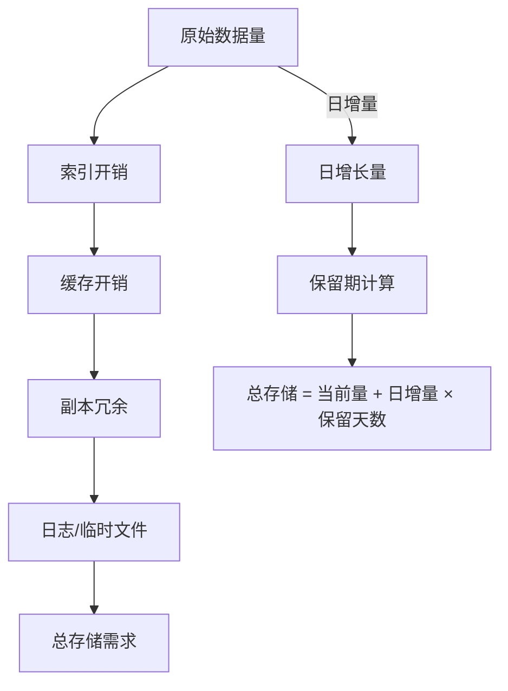

# 存储容量估算

系统上线一年后，硬盘红了。数据库只剩 10GB 空间，但每天增长 50GB。紧急扩容花了 3 天，期间系统限流，损失惨重。

这是典型的**存储规划没做好**。

存储容量估算是容量规划中最复杂的部分，因为存储增长往往是非线性的：数据量小时增长慢，数据量大时索引膨胀、碎片累积，增长反而更快。

## 存储估算的基本框架



存储估算的核心公式：

```
总存储需求 = (原始数据量 + 索引开销 + 缓存开销) × 副本系数 × 安全系数
```

## 原始数据量估算

### 用户数据估算

```
总数据量 = 用户数 × 每用户数据量
```

| 数据类型 | 每用户大小 | 说明 |
| --- | --- | --- |
| 用户基本信息 | 1~2 KB | 昵称、头像、注册时间等 |
| 用户资料 | 5~10 KB | 扩展信息、偏好设置 |
| 用户行为日志 | 100~500 字节/次 | 点击、浏览、搜索等 |
| 用户内容 | 不固定 | 动态、帖子、图片等 |

```
示例：设计一个社交平台

用户规模：
- DAU：1 亿
- 留存率（30日）：30%
- 月活用户：1 亿 × 30% × 30 ≈ 900 万

每用户存储：
- 基本信息：2 KB
- 关系链（平均 200 个好友）：100 KB
- 历史动态（平均 500 条）：5 MB（假设平均每条 10 KB）

总用户存储：
= 900 万 × (2 KB + 100 KB + 5 MB)
= 900 万 × 5.1 MB
≈ 45 TB
```

### 业务数据估算

```
总数据量 = 日增量 × 保留期 + 历史积累
```

```
示例：电商订单数据

- 日订单量：100 万单
- 每单数据大小：2 KB（含商品明细）
- 日增量：100 万 × 2 KB = 2 GB
- 保留期：3 年
- 历史积累：2 GB × 365 × 3 = 2.19 TB

考虑订单明细历史查询需求，保留 3 年订单：
总订单存储 ≈ 2.2 TB
```

### 日志数据估算

```
总日志量 = 日志产生速率 × 保留期 × 压缩比
```

```
示例：应用日志

- 每请求产生日志：1 KB
- 日请求量：1 亿
- 日志量：1 亿 × 1 KB = 100 GB
- 压缩比：5:1（Gzip）
- 压缩后日增量：20 GB
- 保留期：30 天
- 总存储：20 GB × 30 = 600 GB
```

## 索引开销估算

索引是存储增长的主要来源之一。很多时候，索引占用的空间比原始数据还大。

### MySQL 索引开销

| 索引类型 | 开销倍数 | 适用场景 |
| --- | --- | --- |
| B-Tree 主键索引 | 1~1.5x | 默认 |
| B-Tree 普通索引 | 0.3~0.5x 每索引 | 范围查询 |
| 唯一索引 | 0.5~1x | 唯一约束 |
| 全文索引 | 2~3x | 文本搜索 |
| 联合索引 | 取决于列数 | 多条件查询 |

```
示例：MySQL 用户表

原始数据：
- 行数：1 亿
- 每行大小：200 字节
- 原始数据：1 亿 × 200 B = 20 GB

索引：
- 主键索引（bigint）：1 亿 × 8 B × 1.3 ≈ 1 GB
- 用户名索引（varchar 50）：1 亿 × 50 B × 0.5 ≈ 2.5 GB
- 邮箱索引（varchar 100）：1 亿 × 100 B × 0.5 ≈ 5 GB
- 创建时间索引：1 亿 × 8 B × 0.5 ≈ 400 MB

总索引开销 ≈ 9 GB

总存储（数据 + 索引）≈ 29 GB
索引开销占比 ≈ 31%
```

### Elasticsearch 索引开销

Elasticsearch 的索引开销通常比 MySQL 大，因为它需要支持复杂的全文搜索：

| 组成部分 | 开销倍数 | 说明 |
| --- | --- | --- |
| 原始数据 | 1x | 存储的 JSON |
| 倒排索引 | 2~4x | 词项到文档的映射 |
| 正排索引 | 0.5~1x | 文档到字段的映射 |
| 字段数据 | 0.3~0.5x | 分词后的数据结构 |
| 评分数据 | 0.2~0.3x | 相关性计算 |

```
示例：Elasticsearch 商品索引

原始数据：
- 商品数：1 亿
- 平均文档大小：2 KB
- 原始数据：1 亿 × 2 KB = 200 GB

索引开销：
- 倒排索引：200 GB × 3 = 600 GB
- 正排索引：200 GB × 0.8 = 160 GB
- 其他开销：200 GB × 0.5 = 100 GB

总索引存储 ≈ 200 + 600 + 160 + 100 = 1060 GB ≈ 1 TB

索引开销是原始数据的 4~5 倍
```

### 索引膨胀因子

索引膨胀因子是存储规划中最重要的经验值：

```
MySQL：B-Tree 索引膨胀因子 = 1.3~1.8x
PostgreSQL：B-Tree 索引膨胀因子 = 1.5~2.5x
Elasticsearch：索引膨胀因子 = 3~5x
MongoDB：索引膨胀因子 = 1.5~2x
```

## 副本冗余估算

生产环境的存储必须考虑副本，以应对硬件故障和数据恢复需求。

### 副本系数

| 副本策略 | 存储倍数 | 适用场景 |
| --- | --- | --- |
| 无副本 | 1x | 测试环境 |
| 单副本 | 1x | 可接受短暂数据丢失 |
| 双副本 | 2x | 普通业务 |
| 三副本 | 3x | 核心业务、金融 |
| 纠删码 | 1.2~1.5x | 大规模冷存储 |

```
示例：电商核心库

原始数据：10 TB
索引开销：10 TB × 1.5 = 15 TB
副本策略：三副本

总存储 = (10 + 15) TB × 3 = 75 TB
```

### RAID 与副本的区别

RAID 提供的是**单盘故障保护**，副本提供的是**节点故障保护**。两者可以叠加：

```
数据保护策略：
- RAID 10（三副本）：数据安全级别最高，但存储效率 50%
- RAID 5 + 主从副本：存储效率较高，可靠性好
- 纠删码 + 跨机房复制：存储效率高，跨地域保护

实际生产推荐：
- 热数据：RAID 10 + 三副本
- 温数据：RAID 5 + 双副本
- 冷数据：纠删码 + 跨机房复制
```

## 数据库存储详细估算

### MySQL 行存储开销

MySQL InnoDB 引擎的行存储有固定开销：

```
每行存储 = 行数据 + 行头开销 + 变长字段开销

行头开销：6 字节（标记位）
主键开销：bigint = 8 字节 + 索引指针
NULL 字段：每字段 1 字节
变长字段：2 字节长度前缀 + 实际数据
```

```
示例：用户表

CREATE TABLE user (
    id BIGINT PRIMARY KEY,          -- 8 字节
    username VARCHAR(50),            -- 最多 50×3+2=152 字节
    email VARCHAR(100),              -- 最多 100×3+2=302 字节
    phone VARCHAR(20),               -- 最多 20×3+2=62 字节
    created_at DATETIME,             -- 8 字节
    status TINYINT,                  -- 1 字节
    INDEX idx_username (username),
    INDEX idx_email (email)
);

平均行大小估算：
- 固定字段：8 + 8 + 1 = 17 字节
- 变长字段平均值：50 + 80 + 20 = 150 字节
- NULL 标记：3 字节
- 行头：6 字节

平均行大小 ≈ 176 字节

1 亿行总存储 ≈ 17.6 GB（原始数据）
```

### PostgreSQL 行存储开销

PostgreSQL 的存储模型与 MySQL 不同：

```
PostgreSQL 存储特点：
- 行头：23 字节固定 + 每列 4 字节
- 变长字段：Toast 存储，超过 2KB 的字段自动压缩
- MVCC：更新不覆盖，保留旧版本
- 碎片：随机更新会产生碎片
```

### NoSQL 存储估算

```
Redis：
- 每对 Key-Value：约 50 字节额外开销
- String：SDS 头 3~9 字节 + 数据
- Hash：每个 field 多 20~30 字节
- 建议：实际使用量 × 2 作为规划值

MongoDB：
- 文档存储，无固定 schema
- 索引开销约 1.5~2x
- WiredTiger 引擎：压缩比 2:1

Cassandra：
- LSM-Tree 结构：写放大 3~10x
- 压缩后：原始数据 × 1.5~2x
```

## 缓存存储估算

缓存是存储规划中最容易被低估的部分。

### Redis 内存估算

```
Redis 内存 = key 数量 × (key 大小 + value 大小 + 哈希桶 + 元数据)

估算公式：
单个 key 平均大小 = 50 字节（key）+ 1 KB（value）+ 8 字节（指针）
1 亿 key 总内存 ≈ 100,000,000 × 1.1 KB ≈ 110 GB
```

| 数据结构 | 内存开销 | 适用场景 |
| --- | --- | --- |
| String | value 大小 + 50B | 简单缓存 |
| Hash | field 数 × 20B + value | 对象缓存 |
| List | 每元素 50B | 队列、最新 N 条 |
| Set | 每元素 50B | 去重、标签 |
| Sorted Set | 每元素 100B | 排行榜、延迟队列 |

```
示例：热点数据缓存

- 热点商品：10 万个
- 每商品信息：2 KB（JSON）
- 商品关联用户（购买过的用户）：平均 1000 个 user_id × 8 = 8 KB

Hash 结构存储：
- field：商品属性（2 KB）
- members：购买用户（8 KB）

单商品内存 ≈ 10 KB + 10 KB（哈希表开销）= 20 KB
总内存 = 10 万 × 20 KB = 2 GB
```

### 多级缓存内存规划

```
典型缓存架构：
L1（本地缓存）：10 GB（热点数据）
L2（Redis）：100 GB（热点 + 温点数据）
L3（数据库）：TB 级（全部数据）

内存规划：
- L1：CPU 缓存命中率 90% → 减少 L2 请求 90%
- L2：Redis 命中率 80% → 减少数据库请求 80%
- 最终数据库 QPS = 原始 QPS × 10% × 20%
```

## 存储规划完整示例

### 社交平台存储规划

```
业务参数：
- DAU：1 亿
- 月活用户：3 亿
- 每用户平均 500 条动态
- 每条动态平均 500 字节
- 动态保留期：永久
- 评论数：动态的 5 倍
- 用户关系：平均 200 个好友

Step 1：原始数据量

动态数据：
- 3 亿用户 × 500 条 = 1.5 万亿条
- 1.5 万亿 × 500 B = 7.5 PB

评论数据：
- 1.5 万亿 × 5 = 7.5 万亿条
- 7.5 万亿 × 200 B = 15 PB

关系数据：
- 3 亿用户 × 200 个关系 × 16 B ≈ 100 GB

用户数据：
- 3 亿 × 2 KB ≈ 600 GB

原始数据合计：约 22.6 PB

Step 2：索引开销

MySQL 索引：1.5x
Elasticsearch 索引：4x

- MySQL 索引：22.6 PB × 0.5（纯关系数据）× 1.5 ≈ 17 PB 中 30% 需索引 ≈ 5 PB
- ES 索引（搜索用）：动态 × 4 = 7.5 PB × 4 = 30 PB

索引合计：约 35 PB

Step 3：副本冗余

核心数据：3 副本
非核心数据：2 副本

加权副本系数：2.5x

Step 4：总存储规划

总存储 = (原始数据 + 索引) × 副本系数 × 安全系数
= (22.6 + 35) PB × 2.5 × 1.2
≈ 172 PB

Step 5：分摊到组件

- MySQL 集群：50 PB（3 副本）
- Elasticsearch：80 PB（3 副本）
- Redis：2 PB
- 对象存储（图片/视频）：40 PB
- 日志/备份：动态预留 20%

结论：存储规划约 200 PB，需要分布式存储架构
```

## 存储规划常见错误

### 错误一：只算原始数据

原始数据只是冰山一角，索引和副本往往更大。

**正确做法**：原始数据 × 3~5 作为存储规划基数。

### 错误二：忽略数据增长

只算当前数据量，不考虑增长率。

**正确做法**：计算 6 个月、1 年、3 年的数据量，预留扩展空间。

### 错误三：忽略冷热分层

把所有数据都放在高性能存储中。

**正确做法**：热数据放 SSD，温数据放普通硬盘，冷数据放对象存储或归档。

### 错误四：忽略碎片和膨胀

数据库运行一段时间后，碎片会增加实际存储。

**正确做法**：预留 20~30% 的空间余量，并定期清理碎片。

## 总结

存储容量估算的核心框架：

```
总存储 = (原始数据 × 索引系数 + 缓存开销) × 副本系数 × 安全系数

关键系数：
- MySQL 索引系数：1.3~1.8x
- ES 索引系数：3~5x
- 副本系数：2~3x
- 安全系数：1.2~1.3x
```

存储规划不是一次性工作，需要**定期复盘**：

- 监控实际存储增长率
- 预测未来存储需求
- 提前规划扩容
- 考虑冷热分层降低存储成本
