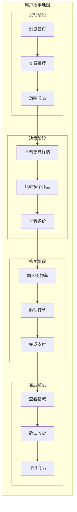
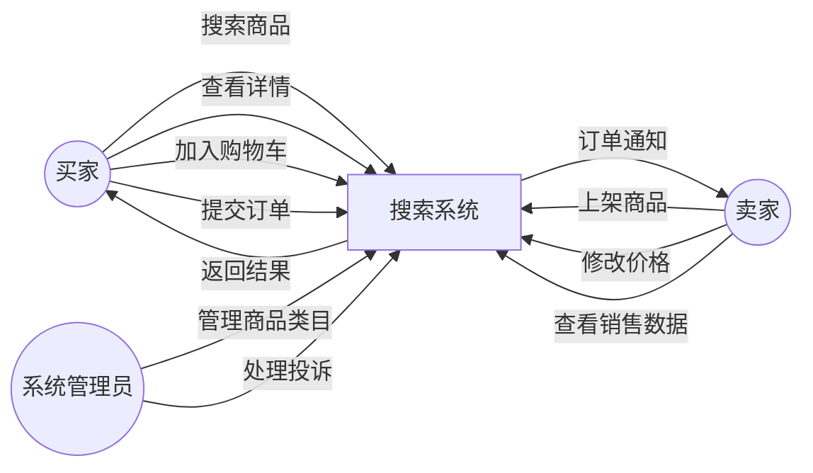

# 用户故事与用例驱动设计

「用户可以搜索商品」——这句话听起来很清晰，但当你开始设计时，问题就来了：

- 搜索需要多快？1 秒还是 100 毫秒？
- 搜索结果要多少条？10 条还是 100 条？
- 搜索不到结果怎么办？显示空页面还是推荐其他商品？
- 历史搜索记录要不要保存？保存多久？

如果一开始就陷入技术细节，这些问题可能被忽略。但正是这些细节，决定了系统的最终用户体验。

用户故事（User Story）正是解决这个问题的工具。它从**用户的视角**出发，描述用户想要什么、以及为什么想要。

## 用户故事的格式

用户故事有一个标准格式：

```
作为 [角色]，我想要 [功能]，以便 [收益]
```

三个部分缺一不可：

- **角色**：谁要这个功能？
- **功能**：具体要什么？
- **收益**：解决了什么问题？

### 好用户故事的特质：INVEST

一个好的用户故事应该满足 INVEST 原则：

| 字母 | 含义 | 说明 |
| --- | --- | --- |
| **I**ndependent | 独立的 | 故事之间尽量减少依赖 |
| **N**egotiable | 可协商的 | 不是固定规格，可以讨论调整 |
| **V**aluable | 有价值的 | 对用户或业务有价值 |
| **E**stimable | 可估算的 | 能估算开发工作量 |
| **S**mall | 小的 | 一个迭代能完成 |
| **T**estable | 可测试的 | 能定义验收标准 |

### 用户故事示例

以电商搜索功能为例：

```
作为 买家，我希望 搜索商品时能看到价格区间筛选，以便 快速找到符合预算的商品

作为 买家，我希望 搜索结果按销量排序，以便 了解哪些是热门选择

作为 卖家，我希望 搜索结果中自己的商品排名靠前，以便 获得更多曝光

作为 系统，我希望 在搜索高峰时缓存热门结果，以便 减少数据库压力
```

注意最后一个故事——它是从**系统**的视角出发的。这说明用户故事不一定是「人」，也可以是「系统」「平台」「业务方」等。

## 用户故事地图

单个用户故事描述的是碎片化的需求。把它们串起来，才能看到用户的完整旅程。

### 用户故事地图的绘制

用户故事地图（User Story Mapping）是一种将用户故事按用户旅程组织的方法：



在每个阶段，横向上是**用户故事**，纵向上是**验收标准**和**技术约束**。

### 从地图到迭代

用户故事地图帮助我们理解全局，但开发是分迭代的。通过地图，我们可以确定：

- **MVP（最小可行产品）**：只实现核心路径上的故事
- **第一迭代**：覆盖核心路径 + 最重要的扩展功能
- **后续迭代**：逐步完善非核心路径

```
迭代规划示例：

迭代 1（MVP）：
- 搜索商品（基础版）
- 查看商品详情
- 加入购物车
- 提交订单
- 完成支付

迭代 2：
- 价格筛选
- 销量排序
- 搜索历史

迭代 3：
- 商品比较
- 收藏功能
- 推荐功能
```

## 用例图

用例图（Use Case Diagram）是另一种从用户视角描述需求的方法。它展示的是**系统与参与者的交互**。



用例图的核心元素：

| 元素 | 说明 | 图示 |
| --- | --- | --- |
| 参与者（Actor） | 与系统交互的人或系统 | 小人图标 |
| 用例（Use Case） | 系统提供的功能 | 椭圆 |
| 关系 | 参与者和用例的交互 | 实线 |
| 包含（Include） | 用例 A 包含用例 B | 虚线箭头 |
| 扩展（Extend） | 用例 A 在特定条件下扩展 B | 虚线箭头 |

### 用例描述

用例图展示的是系统边界和主要交互，更详细的描述需要用例文档：

```markdown
# 用例：搜索商品

## 基本信息
- **用例编号**：UC-001
- **参与者**：买家
- **前置条件**：用户已登录
- **后置条件**：显示搜索结果

## 基本流程
1. 用户输入搜索关键词
2. 系统校验关键词合法性
3. 系统查询商品数据库
4. 系统返回匹配结果
5. 用户浏览结果

## 扩展流程
1.1. 关键词为空 → 提示用户输入关键词
3.1. 数据库查询超时 → 显示搜索失败，请稍后重试
3.2. 无匹配结果 → 显示空结果页面 + 推荐商品
3.3. 结果超过 1000 条 → 分页返回

## 验收标准
- 搜索响应时间 p99 `<` 200ms
- 支持模糊匹配
- 支持按价格、销量、好评排序
```

## 从用户故事到系统组件映射

用户故事描述的是业务需求，接下来需要把它们映射为技术实现。这个过程需要回答：

1. **谁来实现这个故事？** 哪个服务/模块负责？
2. **需要什么数据？** 数据从哪里来？
3. **依赖什么外部系统？** 如何交互？

### 映射示例

```
用户故事：作为买家，我希望搜索商品时能看到价格区间筛选

映射分析：
┌─────────────────────────────────────────────────────────┐
│ 用户故事：价格区间筛选                                    │
├─────────────────────────────────────────────────────────┤
│ 负责模块：搜索服务                                        │
│ 数据来源：商品服务（价格字段）                             │
│ 外部依赖：缓存服务（价格聚合缓存）                         │
│ 接口要求：搜索 API 支持 price_min、price_max 参数         │
│ 性能要求：筛选响应时间 p99 < 100ms                        │
└─────────────────────────────────────────────────────────┘
```

### 映射表模板

| 用户故事 | 负责模块 | 数据依赖 | 外部依赖 | 接口要求 |
| --- | --- | --- | --- | --- |
| 搜索商品 | 搜索服务 | 商品数据 | 缓存服务 | search API |
| 价格筛选 | 搜索服务 | 价格索引 | 无 | price_min/max 参数 |
| 销量排序 | 搜索服务 | 销量数据 | 无 | sort=sales 参数 |
| 搜索历史 | 用户服务 | 历史记录 | 无 | history API |

## 用户故事与功能需求的区别

很多人把用户故事和功能需求混为一谈，它们其实有本质区别：

| 维度 | 用户故事 | 功能需求 |
| --- | --- | --- |
| **视角** | 用户视角 | 系统视角 |
| **格式** | 固定格式（As a / I want / So that） | 自由描述 |
| **粒度** | 较小，适合一个迭代 | 可大可小 |
| **重点** | 价值（为什么） | 功能（做什么） |
| **可测试性** | 天然可测试（从收益推导验收标准） | 需要额外定义验收标准 |

用户故事是**需求收集阶段**的工具，功能需求是**需求描述阶段**的产出。实践中，两者往往配合使用：先用用户故事收集需求（捕捉用户真正想要什么），再转化为功能需求（明确系统要实现什么）。

## 用户故事的切分

一个大的用户故事往往无法在一个迭代内完成，需要切分成更小的故事。

### 切分原则

**按验收条件切分**：

```
原始故事：用户可以搜索商品

切分后：
- 用户可以搜索商品（关键词匹配）
- 用户可以按价格筛选搜索结果
- 用户可以按销量排序搜索结果
- 用户可以分页浏览搜索结果
```

**按数据切分**：

```
原始故事：用户可以管理商品

切分后：
- 商家可以上架商品
- 商家可以修改商品信息
- 商家可以下架商品
- 管理员可以删除违规商品
```

**按用户体验切分**：

```
原始故事：用户可以实时追踪物流

切分后：
- 用户可以在订单页查看物流进度
- 用户可以设置物流提醒
- 系统可以在物流状态变化时推送通知
```

### 切分反例

**切得太碎**：

```
原始故事：用户可以登录

切分后（太碎）：
- 用户可以输入用户名
- 用户可以输入密码
- 用户可以点击登录按钮
- 系统可以验证用户名
- 系统可以验证密码
```

这不是用户故事，这是技术实现步骤。

## 验收标准与 DoD

用户故事必须有明确的**验收标准（Acceptance Criteria）**，否则无法判断故事是否完成。

### 验收标准的格式

验收标准应该描述的是**行为**和**结果**，而不是**实现**：

| 格式 | 示例 |
| --- | --- |
| 当 [条件] 时，[期望结果] | 当搜索关键词为空时，显示「请输入搜索词」 |
| 给定 [初始状态]，当 [事件] 时，[期望结果] | 给定用户已登录，当用户点击搜索时，显示历史搜索记录 |
| 系统应该 [行为] | 系统应该在 200ms 内返回搜索结果 |

### 验收标准示例

```
用户故事：作为买家，我希望搜索结果按销量排序，以便找到热门商品

验收标准：

1. 搜索结果默认按相关性排序
2. 用户可以选择按销量排序，销量高的在前
3. 销量为 0 的商品排在销量大于 0 的商品之后
4. 销量排序时，系统应在 100ms 内返回结果
5. 如果用户未登录，排序选项应保留
```

### DoD（完成的定义）

DoD（Definition of Done）是一组适用于所有故事的通用标准：

```
完成的定义：

[ ] 代码已完成并通过 Code Review
[ ] 单元测试覆盖率达到 80%
[ ] 集成测试通过
[ ] 功能测试通过
[ ] 性能测试通过（p99 < 200ms）
[ ] 文档已更新
[ ] 产品经理已验收
```

## 用户故事驱动的设计会议

用户故事不仅是需求描述工具，也是**团队沟通的桥梁**。一场好的用户故事工作坊，可以让整个团队对齐目标。

### 工作坊流程

1. **产品经理讲解业务背景**：为什么要做这个功能？目标是什么？

2. **一起编写用户故事**：从用户视角出发，描述他们想要什么

3. **讨论验收标准**：明确「Done」是什么样的

4. **技术团队估算**：估算每个故事的工作量

5. **排列优先级**：根据业务价值和开发成本确定顺序

6. **识别依赖和风险**：哪些故事之间有依赖？有哪些技术风险？

### 工作坊产出物

```
工作坊产出物：

1. 用户故事列表（带验收标准）
2. 迭代计划（MVP + 后续迭代）
3. 依赖关系图
4. 风险清单
5. 技术约束和决策
```

## 总结

用户故事是从**用户视角**描述需求的工具。它帮助我们回答：

- **谁**需要这个功能？（角色）
- **需要什么**？（功能）
- **为什么需要**？（收益）

用户故事地图把单个故事串成用户旅程，帮助我们理解全局。

用例图展示系统边界和主要交互，是另一种补充工具。

从用户故事到系统组件，需要明确：谁负责、数据从哪来、依赖什么、如何接口交互。

用户故事不是终点，而是起点。它们是沟通的工具，帮助团队对齐目标；它们是设计的输入，决定了系统要实现什么；它们是验收的标准，判断功能是否完成。

下次开始设计之前，先问：**用户真正想要什么？**
