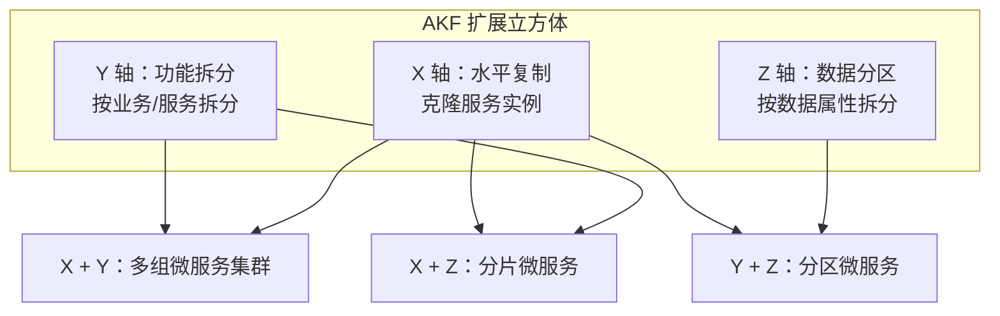
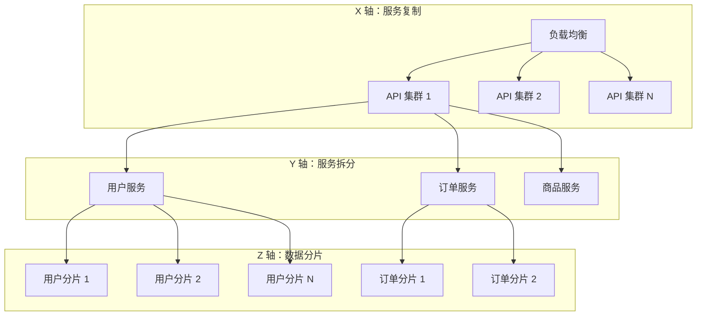

# AKF 扩展立方体

业务增长总会遇到扩展瓶颈。有人会问：加了机器还是扛不住怎么办？答案是，你需要从更多维度思考扩展问题。

AKF 扩展立方体（AKF Scale Cube）提供了一个系统化的思考框架。它把扩展问题分解为三个正交的维度——X 轴、Y 轴、Z 轴。每个维度解决不同类型的扩展问题，三个维度组合使用，可以应对几乎所有扩展挑战。

## 三维扩展模型

## X 轴扩展：水平复制

X 轴扩展是最直觉的扩展方式——复制整个服务实例，通过负载均衡分发请求。

**原理**：部署 N 个完全相同的实例，每个实例处理 1/N 的请求。

**优点**：

- 实现简单，不需要修改应用代码
- 故障隔离，一个实例挂了不影响其他实例
- 扩容迅速，增加实例即可

**缺点**：

- 所有实例共享完整数据集，内存中缓存重复
- 无法解决「数据量增长」的扩展问题
- 适合无状态、读多写少的场景

**适用场景**：Web 前端服务、API 网关、静态资源服务、缓存代理。

X 轴扩展是扩展的起点，也是最容易实施的扩展方式。大多数系统在遇到瓶颈时，第一步都是 X 轴扩展。

## Y 轴扩展：功能拆分

X 轴扩展能扛住更多请求，但如果业务本身很复杂，单个服务可能成为瓶颈——不是因为请求多，而是因为功能太多、相互耦合。

Y 轴扩展通过「按功能拆分」来解决问题。把一个巨大的单体应用拆成多个独立的服务，每个服务只负责一部分业务功能。

**拆分维度**：

- **业务能力拆分**：订单服务、用户服务、商品服务、支付服务
- **用例拆分**：读服务、写服务、管理后台
- **变更频率拆分**：稳定的底层服务、频繁迭代的上层服务

**优点**：

- 独立扩展，每个服务按需扩容
- 独立部署，发布风险隔离
- 技术异构，不同服务可用不同技术栈
- 团队自治，每个团队负责自己的服务

**缺点**：

- 分布式系统复杂性：服务间通信、事务一致性问题
- 数据共享困难：跨服务查询需要额外设计
- 运维复杂度增加：需要服务治理、链路追踪

**适用场景**：业务复杂度高的系统、微服务架构、大型团队协作开发。

Y 轴扩展是微服务架构的理论基础。正确的 Y 轴拆分能让系统具备长期可维护性，错误的拆分则会把系统变成「分布式 monolith」——所有微服务的耦合问题，单体应用全都有，还多了一堆网络问题。

## Z 轴扩展：数据分区

X 轴复制了服务实例，但所有实例访问相同的数据集。当数据量增长到单机无法存储时，X 轴扩展就失效了。

Z 轴扩展通过「按数据属性分区」来解决数据量问题。把数据按某个维度（如用户 ID、地区）拆分到不同的数据库或分片，每个分片只存储一部分数据。

**拆分维度**：

- **用户 ID 哈希**：用户 1-1000 万在分片 A，1000 万-2000 万在分片 B
- **地区**：华东用户在华东库，华南用户在华南库
- **数据类型**：活跃用户和历史用户分离
- **时间**：按年或按月分区

**优点**：

- 突破单机存储限制
- 降低单个数据库的负载
- 可以按业务属性就近访问

**缺点**：

- 跨分区查询复杂
- 数据分布不均匀时产生热点
- 分片键选择困难

**适用场景**：数据量巨大（如十亿级记录）、单用户数据独立访问、数据有天然分区属性（如地区）。

## 三轴组合策略

单一维度的扩展能力有限。实际系统通常需要三轴组合使用。

### 经典组合：微服务 + 分片

这个架构是大型互联网公司的常见模式：

- **X 轴**：API 层水平扩展，无状态服务
- **Y 轴**：业务服务按领域拆分
- **Z 轴**：数据层按用户或业务维度分片

### 扩展优先级

三个维度扩展的优先级建议：

1. **先做 X 轴**：最容易，成本最低。先通过水平扩展把当前瓶颈扛住。
2. **再做 Y 轴**：当服务成为瓶颈（代码耦合、发布困难、团队冲突），考虑按业务能力拆分。
3. **最后做 Z 轴**：当数据量成为瓶颈，再考虑数据分片。Z 轴复杂度最高，引入后患无穷。

### 扩展顺序的考量

为什么不是先做 Y 轴？因为微服务拆分需要大量前期工作（服务边界划分、接口设计、事务方案），周期长、风险高。如果只是流量增长，X 轴扩展能快速解决问题。

为什么不是先做 Z 轴？因为数据分片一旦确定，分片键很难修改。应该在业务相对稳定、数据规模明确后再考虑分片。

## 与扩展立方体的对应关系

| 维度 | 解决什么问题 | 技术手段 | 复杂度 |
| --- | --- | --- | --- |
| X 轴 | 请求量增长 | 水平扩展、负载均衡 | 低 |
| Y 轴 | 业务复杂度增长 | 微服务拆分 | 中 |
| Z 轴 | 数据量增长 | 数据分片 | 高 |

## 常见误区

**误区一：同时做三轴扩展**

三个维度同时推进是灾难。应该按优先级逐个突破，每个维度稳定后再进入下一个维度。

**误区二：过早拆分微服务**

Y 轴扩展不是银弹。拆分过早会导致服务间通信复杂、事务难以处理、运维成本飙升。很多公司重构成微服务后发现：单体应用没那么糟糕，微服务的坑一个没少踩。

**误区三：分片键随意选择**

Z 轴扩展的分片键一旦确定，修改代价极高。应该充分调研业务访问模式，选择能均匀分布数据的分片键。

**误区四：把 X 轴当万能药**

X 轴扩展能扛更多请求，但不能扛更大数据量。如果瓶颈是数据库 CPU 打满，加 API 实例只会让数据库更忙。

## 延伸思考

AKF 扩展立方体的价值，不在于提供了多少扩展技术，而在于提供了一个结构化的思考框架。面对扩展问题，先问自己三个问题：

1. 瓶颈是「请求太多」还是「数据太多」还是「业务太复杂」？
2. 当前最需要解决的是哪个维度的问题？
3. 这个维度的扩展方案，是否会为下一个维度留下扩展空间？

好的架构设计，不是解决今天的问题，而是为明天的问题预留解决方案。X 轴扩展简单，但可能为 Y 轴拆分增加难度（因为单体拆微服务比重构分布式系统更难）；Z 轴分片强大，但分片键选择会长期影响系统演化路径。

理解每个维度的代价和收益，才能做出可持续的架构决策。
