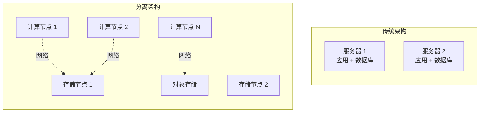
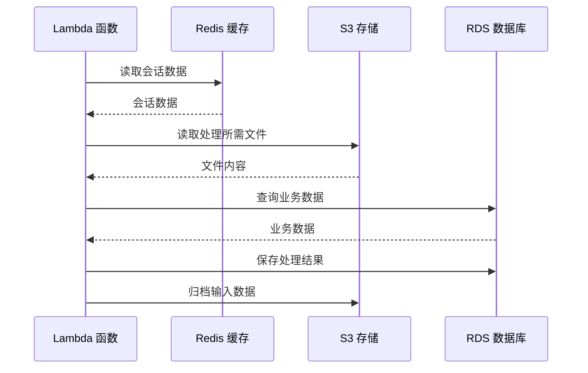

# 计算与存储分离

传统架构中，计算资源和存储资源是耦合的——一台服务器既跑应用，也存数据。这种架构简单，但不够灵活。计算与存储分离，则是现代云原生架构的核心特征之一。

## 什么是计算存储分离

计算与存储分离是指将计算节点（运行应用代码）和存储节点（保存数据）分开部署，之间通过网络通信。



## Serverless 架构

Serverless 是计算与存储分离的极致形态。在 Serverless 架构中，开发者不需要关心服务器的存在，只关注业务代码和数据存储。

### 函数即服务（FaaS）

函数被触发时自动启动，执行完毕后自动销毁。按实际执行时间计费，不执行不收费。

```javascript title="AWS Lambda 示例"
const AWS = require('aws-sdk');
const s3 = new AWS.S3();

exports.handler = async (event) => {
    // 获取 S3 事件
    const bucket = event.Records[0].s3.bucket.name;
    const key = decodeURIComponent(event.Records[0].s3.object.key.replace(/\+/g, ' '));

    // 从对象存储读取数据
    const params = { Bucket: bucket, Key: key };
    const data = await s3.getObject(params).promise();

    // 处理数据（纯计算）
    const result = processData(data.Body);

    // 写入结果到另一个存储桶
    await s3.putObject({
        Bucket: 'output-bucket',
        Key: 'result-' + key,
        Body: JSON.stringify(result)
    }).promise();

    return { statusCode: 200 };
};
```

### 容器即服务（CaaS）

比 FaaS 更灵活的计算形态。每个容器有独立的资源，但不需要管理底层服务器。

```yaml title="Kubernetes Pod 资源配置"
apiVersion: v1
kind: Pod
metadata:
  name: compute-pod
spec:
  containers:
  - name: compute
    image: compute-service:latest
    resources:
      requests:
        memory: "256Mi"
        cpu: "250m"
      limits:
        memory: "512Mi"
        cpu: "500m"
    env:
    - name: STORAGE_ENDPOINT
      value: "http://minio-service:9000"
```

## 对象存储作为数据湖

对象存储（如 AWS S3、阿里云 OSS、MinIO）是分离架构的核心存储组件。

### 对象存储的特点

**无限容量**：理论上无限扩展，不需要预先规划存储容量。

**高持久性**：数据自动多副本存储，持久性通常 99.999999999%（11 个 9）。

**成本低廉**：相比块存储和文件存储，单位容量成本更低。

**RESTful 访问**：通过 HTTP API 访问，任何语言、任何平台都可以对接。

### 使用场景

**数据湖**：原始数据、日志、分析结果都可以存入对象存储，作为数据湖的底层存储。

**静态资源**：图片、视频、文档等静态文件天然适合对象存储，配合 CDN 实现高效分发。

**备份归档**：冷数据、备份数据可以使用对象存储的归档类型，成本更低。

```java title="对象存储操作示例"
@Service
public class FileStorageService {

    private final OSSClient ossClient;
    private final String bucketName = "app-data";

    // 上传文件
    public String uploadFile(String key, InputStream data, long size) {
        ossClient.putObject(bucketName, key, data, size);
        return key;
    }

    // 下载文件
    public InputStream downloadFile(String key) {
        OSSObject object = ossClient.getObject(bucketName, key);
        return object.getObjectContent();
    }

    // 生成预签名 URL（临时访问权限）
    public String generatePresignedUrl(String key, Duration ttl) {
        Date expiration = new Date(System.currentTimeMillis() + ttl.toMillis());
        return ossClient.generatePresignedUrl(bucketName, key, expiration);
    }
}
```

## 计算无状态化

计算与存储分离后，计算节点必须是完全无状态的——每次执行都从外部存储获取所需数据。

### 无状态函数设计

```java title="无状态处理函数"
@Service
public class OrderProcessService {

    @Autowired
    private RedisTemplate<String, Order> orderCache;

    @Autowired
    private ProductRepository productRepository;

    public ProcessResult processOrder(Long orderId) {
        // 从缓存获取订单数据
        Order order = orderCache.opsForValue().get("order:" + orderId);

        if (order == null) {
            // 缓存未命中，从对象存储加载
            order = loadOrderFromStorage(orderId);
            orderCache.opsForValue().set("order:" + orderId, order, 1, TimeUnit.HOURS);
        }

        // 业务处理（纯计算）
        ProcessResult result = doProcess(order);

        // 处理结果写入对象存储
        saveResultToStorage(orderId, result);

        return result;
    }
}
```

### 状态外置

应用不再维护本地状态，所有状态存储在外部服务（Redis、数据库、对象存储）。



## 适用场景

计算与存储分离适合特定的工作负载和业务场景。

### 适合的场景

**大数据分析**：ETL、批处理、流处理等计算密集型任务。这类任务通常是计算瓶颈，存储带宽不是问题。

**无状态微服务**：业务逻辑可以完全无状态的服务。所有状态存储在外部，适合微服务架构。

**弹性波动大**：流量峰谷明显的业务（如电商大促、在线教育）。Serverless 按需扩容，成本最优。

**事件驱动处理**：图片处理、消息推送、日志分析等由事件触发的任务。

### 不适合的场景

**低延迟敏感**：网络 I/O 增加延迟，对延迟要求苛刻的场景（如高频交易）不适合。

**高带宽任务**：需要极高存储带宽的任务（如实时数据分析）。网络可能成为瓶颈。

**状态密集型**：游戏服务器、实时通信等需要大量本地状态的服务。

## 分离架构的优势

### 独立扩展

计算资源和存储资源可以独立扩展。计算密集型任务增加计算节点，数据密集型任务增加存储节点。

### 成本优化

Serverless 模式下，按实际使用计费。不需要为峰值预留资源，也不需要为空闲时间付费。

### 可靠性提升

计算节点无状态，故障后可以快速重建。存储服务通常提供高持久性保证。

### 运维简化

不需要管理服务器，只需关注应用代码和存储配置。云服务商负责底层运维。

## 分离架构的挑战

### 网络延迟

计算节点和存储节点通过网络通信，增加延迟。需要通过缓存、批量操作等方式优化。

```java title="批量操作优化"
@Service
public class BatchProcessingService {

    public void processBatch(List<Long> ids) {
        // 批量从存储读取，减少网络往返
        List<Order> orders = batchLoadOrders(ids);

        // 批量处理
        List<Result> results = orders.parallelStream()
                .map(this::doProcess)
                .collect(Collectors.toList());

        // 批量写入
        batchSaveResults(results);
    }
}
```

### 数据一致性

网络分区可能导致数据不一致。需要明确业务能接受的一致性级别（强一致、最终一致）。

### 成本控制

Serverless 按调用计费，如果请求量巨大，成本可能高于预留实例。需要评估实际成本。

### 调试困难

无状态函数的调试比本地应用困难。需要完善的日志、监控和分布式追踪能力。

## 常见误区

**误区一：分离就是不用关心服务器**

计算与存储分离后，服务器换成了存储服务，但存储服务的配置、权限、生命周期管理仍然是开发者的责任。

**误区二：Serverless 最便宜**

Serverless 按使用计费，适合间歇性工作负载。如果函数持续运行，预留实例可能更便宜。

**误区三：分离架构不需要优化**

分离架构增加了网络层，网络带宽和延迟可能成为瓶颈。需要针对性优化（缓存、批量、压缩）。

**误区四：无状态等于无性能**

状态外置增加了数据获取延迟。合理的本地缓存策略可以兼顾无状态和高性能。

## 延伸思考

计算与存储分离是云原生架构的核心特征，但它不是唯一正确的架构。很多传统架构（计算和存储耦合）依然运行良好，特别是在性能敏感的场景。

选择计算与存储分离，需要评估：

- 工作负载是否适合无状态化
- 能否接受网络延迟增加
- Serverless 成本是否可接受
- 团队是否有配套的监控和调试能力

分离架构的优势在于弹性和成本优化，但需要配套的基础设施和工程能力。在没有准备好之前，冒然分离可能导致性能和运维问题。
