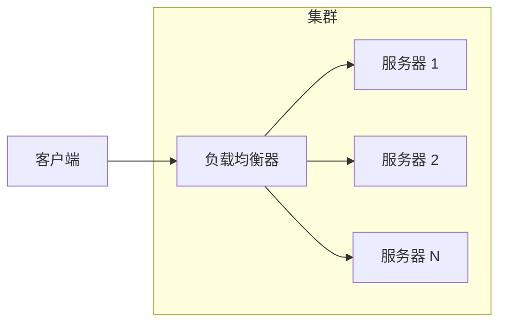

# 水平扩展（Scale Out）

垂直扩展有上限，水平扩展则是打破这个上限的方式。当你的业务从 1 万用户增长到 1000 万用户，没有哪台单机能扛住。水平扩展，就是答案。

但这个答案本身，也带来了新的问题。

## 什么是水平扩展

水平扩展（Scale Out）是指通过增加机器数量来提升系统处理能力。与垂直扩展「打造更强的单机」不同，水平扩展的思路是「用更多的普通机器协同工作」。



这个模型看起来简单，但要真正做好，需要解决一系列问题：请求如何分发、数据如何同步、状态如何管理。

## 增加节点数量

水平扩展的第一步，是让系统能够运行多个实例。现代 Web 应用通常是无状态的，多个实例部署在负载均衡器后面，接收的请求数量由负载均衡算法决定。

**部署方式演进**：

- 物理机时代：手动在多台机器上部署，配置 Nginx 或 HAProxy 做负载均衡
- 虚拟机时代：虚拟机模板 + 自动化工具（Ansible/Puppet），一键部署多个实例
- 容器时代：Docker 镜像 + Kubernetes，一个配置文件声明需要的副本数

容器和 Kubernetes 的出现极大降低了水平扩展的门槛。你不再需要关心机器的 IP、依赖、环境，只需要声明「我需要 10 个副本」，剩下的由编排系统完成。

## 无状态服务设计

水平扩展的核心前提是服务无状态。如果每个请求都依赖本地存储的数据，多个实例之间就无法协作，系统行为会变得不可预测。

无状态服务意味着：

- 请求之间无依赖：每个请求都是独立的，不依赖前一个请求的结果
- 数据存储外部化：状态不保存在进程内存中，而是存到 Redis、数据库等外部存储
- 会话信息不本地化：用户登录状态通过 Token 或 Session ID 从外部存储获取

这听起来是限制，但对于大多数业务来说，这个约束是合理的。把状态外置之后，你的服务实例变成了「纯计算单元」——接收请求、处理逻辑、读写外部存储、返回响应。这种设计让扩展变得简单：实例挂了，负载均衡器自动把流量切到其他实例；流量高峰，加几个实例，秒级生效。

## 负载均衡配合

水平扩展需要负载均衡器把流量均匀地分发到各个实例。但「均匀」的定义有多种，不同算法适用于不同场景。

| 算法 | 原理 | 优点 | 缺点 |
| --- | --- | --- | --- |
| 轮询 | 依次分配给每个实例 | 简单、均匀 | 不考虑实例性能差异 |
| 加权轮询 | 按权重比例分配 | 适配不同规格机器 | 需要手动配置权重 |
| 最少连接 | 分配给当前连接数最少的 | 动态均衡 | 需要维护连接状态 |
| IP 哈希 | 同一 IP 始终路由到同一实例 | 会话粘性 | 热点 IP 导致不均 |
| 一致性哈希 | 哈希环上顺时针查找 | 最小化迁移 | 实现复杂 |

实际生产中，最常用的是加权轮询配合健康检查。Nginx、HAProxy、AWS ALB 都支持这种组合。配置示例：

```nginx title="nginx.conf"
upstream backend {
    server 192.168.1.10:8080 weight=3;
    server 192.168.1.11:8080 weight=2;
    server 192.168.1.12:8080 weight=1;
}

server {
    listen 80;
    location / {
        proxy_pass http://backend;
        health_check interval=5s fails=2 passes=2;
    }
}
```

## 水平扩展的代价

水平扩展解决了容量问题，但引入了新的复杂性。这些代价不是「副作用」，而是必须认真对待的「固有成本」。

### 数据一致性

垂直扩展的单机系统，数据天然是强一致的。水平扩展后，数据分布在多个节点上（或者多个副本之间），如何保证一致性就成了问题。

**主从复制的一致性延迟**：异步复制场景下，主库写入成功，从库可能还没同步完成。如果立刻从从库读取，可能读到旧数据。这就是著名的「读写分离延迟」问题。

**分布式事务的性能损耗**：如果业务要求强一致性，需要引入两阶段提交（2PC）或 Paxos/Raft 协议。这些协议需要多次网络通信，性能损耗通常在 2-3 倍。

**最终一致性作为替代**：很多场景下，不需要实时强一致，最终一致即可。DNS 传播、CDN 缓存、消息队列都是最终一致性的例子。接受这个Trade-off，能换来更好的性能和可用性。

### 运维复杂度

两个实例的运维和二十个实例的运维，完全不是一个量级。

**部署与配置管理**：每个实例都需要相同的配置，但版本可能不同。使用配置管理工具（Ansible、Chef）或配置中心（Nacos、Apollo）集中管理，避免「配置漂移」。

**监控与告警**：实例多了，问题定位变难。需要分布式追踪（Jaeger、Zipkin）把请求在多个实例之间的流转串联起来。需要聚合监控（Grafana + Prometheus）汇总所有实例的指标。

**日志收集**：每个实例都产生日志。需要 ELK（Elasticsearch + Logstash + Kibana）或 EFK 栈集中收集和检索日志。单机时代 `grep` 能搞定的事，集群时代必须靠全文检索。

**网络开销**：实例间通信需要网络，引入延迟和带宽消耗。如果数据量很大，跨机房的网络开销可能成为瓶颈。

### 分布式系统固有挑战

水平扩展让你获得了扩展能力，但也背上了分布式系统的「原罪」。

**CAP 定理**：分布式系统无法同时满足一致性（Consistency）、可用性（Availability）和分区容错性（Partition Tolerance）。水平扩展的系统必须接受这个约束，在一致性和可用性之间做权衡。

**故障定位困难**：单机时代，问题要么发生要么不发生。分布式系统中，部分失败（some failures）成了常态——部分节点成功、部分节点失败。定位问题需要综合分析多个节点的日志和指标。

**时钟不同步**：每个机器的本地时钟可能有微小偏差。依赖时间戳做排序或判断的业务，需要引入逻辑时钟或中心授时服务。

## 什么时候该水平扩展

水平扩展不是银弹，引入它需要付出真实成本。在决定水平扩展之前，先问自己几个问题：

**垂直扩展是否真的不够用？**

很多团队过早引入水平扩展，结果背上了分布式系统的复杂度，却没有获得相应收益。如果单机配置还没到上限，先把单机用足。

**业务是否适合拆分？**

如果业务强依赖本地状态（如复杂事务、游戏服务器），强行拆分会引入大量复杂性。这种场景下，垂直扩展可能更合适。

**团队是否有运维分布式系统的能力？**

水平扩展需要监控、日志、部署等一系列配套能力。如果团队只有一个人运维，20 个实例可能就是极限了。

**预期增长是否值得投入？**

如果业务增速明确，现在投入基础设施建设，未来能省大量成本。如果业务已经平稳，增长有限，水平扩展可能不值得。

## 常见误区

**误区一：加了实例就能扛住流量**

水平扩展能扛住无状态请求，但如果瓶颈在数据库，加应用实例是没用的。流量打进来，数据库先扛不住。扩容前先确认瓶颈在哪。

**误区二：忽视实例间的差异**

云环境中的实例不是完全相同的——网络延迟、CPU 性能、负载情况都有差异。负载均衡器需要定期剔除异常实例。

**误区三：实例挂了才想起健康检查**

健康检查应该在流量高峰期测试。高负载时某些实例可能 OOM 或死锁，但低负载时看起来完全正常。

**误区四：把所有服务都水平扩展**

有状态服务（如 ZooKeeper、Kafka）不适合简单的水平扩展。它们的扩展有专门的设计（如分区、副本），需要单独处理。

## 延伸思考

水平扩展的本质是用「数量」换「容量」。但数量带来的是非线性复杂度——2 个实例不是 1 个实例的 2 倍复杂度，可能是 3 倍；10 个实例可能是 5 个实例的 5 倍复杂度。

所以真正好的架构，往往是在「扩展性」和「简单性」之间找到平衡点。无状态服务优先水平扩展，有状态服务优先垂直扩展（或者用专门设计的分布式存储）。这个原则看似简单，但很多团队在业务压力下会忘记，做出「连数据库都水平扩展」的决定，然后花大量时间处理分布式事务问题。

理解代价，才能做出正确的选择。
