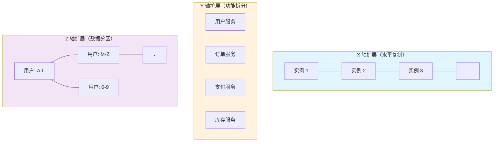
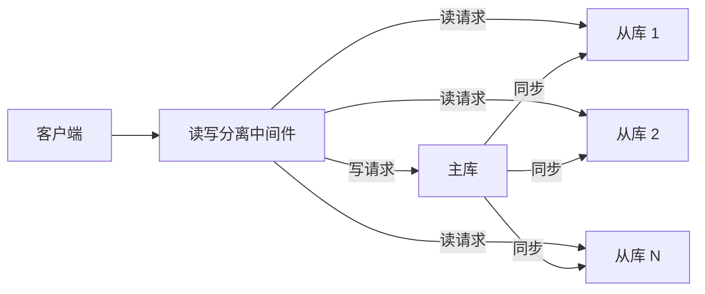
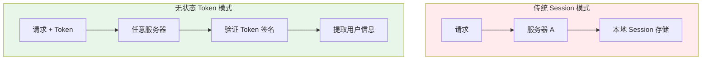

# 扩展策略总览

凌晨 3 点，一阵急促的告警铃声打破了平静。监控系统显示数据库 CPU 使用率飙升至 98%，大量请求超时，用户开始集中反馈页面无法加载。团队紧急排查后发现：不是 SQL 慢、不是网络问题，而是单表数据量突破了 5000 万行，索引维护成本开始显著上升。

你第一反应是加机器、加内存。但当你准备扩容时，突然意识到一个更棘手的问题：数据库连接池已经占满了所有可用连接，应用层的线程池也已经打到上限，所有计算资源都在「吃撑」状态。这个系统，从一开始就没有为增长预留扩展空间。

三年后，这家公司的用户量从 10 万增长到 5000 万，业务复杂度翻了几番，而那套「能跑就行」的架构，成了所有技术迭代的枷锁。每次大促前的扩容都像走钢丝，团队疲于应付而不是真正解决问题。

这个故事每天都在不同的公司上演。扩展性不是锦上添花，而是系统设计的根基能力。本章将系统性地拆解扩展策略的完整知识体系，帮助你在设计阶段就为系统增长预留好空间。

## 扩展的本质：两个方向的抉择

当系统面临性能瓶颈时，扩展只有两个方向：**垂直扩展**和**水平扩展**。

**垂直扩展（Scale Up）** 意味着为现有机器增加更多资源——更大的 CPU、更大的内存、更快的磁盘。这是最直接的解决方式，像给汽车换一台更大马力的发动机。

**水平扩展（Scale Out）** 则是通过增加机器数量来分担负载，像从一辆车扩展为一个车队。

这两种方向并非非此即彼，而是要根据场景组合使用。先看垂直扩展的边界：单机的 CPU 插槽数量有限，目前主流服务器最多支持 8 路 CPU；内存插槽同样有限，最大可配置内存通常在 6TB 以内；磁盘 I/O 瓶颈即使使用 NVMe SSD，单机 IOPS 也有物理极限。当业务增长突破单机极限时，无论投入多少硬件成本，都无法继续垂直扩展。

水平扩展虽然突破了单机天花板，但引入了分布式系统的固有复杂度：数据一致性、服务发现、负载均衡、故障转移……每增加一台机器，这些问题就需要重新考虑。

真正成熟的架构师不是在「垂直」和「水平」之间选一个，而是理解两者的适用边界，在不同阶段选择最合适的组合。

## AKF 扩展立方体：三维度的扩展哲学

2009 年，AKF 咨询公司提出了一个经典的扩展模型——AKF 扩展立方体（AKF Scale Cube）。这个模型将扩展分解为三个维度，帮助我们系统性地思考扩展策略。

**X 轴扩展**：克隆相同的实例，所有实例运行相同的代码、存储相同的数据。这是扩展的起点，通过负载均衡将请求分发到多个副本。优点是实现简单、见效快；缺点是只能扩展无状态服务，且无法解决数据增长问题。

**Y 轴扩展**：按功能或业务边界拆分服务。每个服务独立部署、独立扩展。比如将单体应用拆分为用户服务、订单服务、支付服务等。Y 轴扩展解决了业务复杂性问题，但也带来了服务间通信、数据一致性等新挑战。

**Z 轴扩展**：按数据维度对服务或数据进行分区。比如按用户 ID 分片，每个分片只负责一部分用户的数据。Z 轴扩展解决了数据量增长问题，但跨分片查询、分布式事务等问题随之而来。

一个健康的扩展路径通常是：先用 X 轴扩展扛住初期流量 → 业务复杂度上升后用 Y 轴拆分治理混乱 → 数据量突破瓶颈后用 Z 轴扩展解决存储问题。三者组合使用，才能应对业务的持续增长。

## 扩展策略全景图

理解了 AKF 立方体之后，我们来看具体的扩展策略实现。

### 垂直扩展：硬件升级的艺术

垂直扩展看似简单，但有几个关键考量。首先是**资源配比**：CPU 和内存的比例要匹配业务特征。CPU 密集型任务需要更多计算核心，内存密集型任务需要更大内存。其次是**资源池化**：通过虚拟机或容器技术，将物理资源池化，按需分配给不同服务，避免资源浪费。

垂直扩展适合什么场景？业务早期、增长可预期、团队规模较小。在单机 MySQL 处理 1000 万数据量之前，垂直扩展的性价比最高。一旦数据量突破单机处理能力上限，或者业务对可用性要求极高（单机故障即服务中断），就需要考虑水平扩展。

### 水平扩展：无状态化的前提

水平扩展的核心前提是**无状态化设计**。如果每个请求都依赖本地存储的状态（如本地 Session），那么水平扩展只会把问题复杂化——用户的一次会话可能被路由到不同实例，本地存储的状态无法共享。

无状态化的关键是将状态外置：Session 存储到 Redis、文件存储到分布式文件系统、计算结果存储到缓存层。应用层只负责计算逻辑，不存储任何业务状态。

无状态化的代价是什么？每次请求都可能涉及额外的网络开销（读写外部状态存储）。当状态存储成为瓶颈时，需要对状态存储本身做扩展。所以无状态化不是银弹，而是将复杂度转移——从应用层转移到状态存储层。

### 弹性伸缩：基于指标的自动化

传统的人工扩容方式有几个明显问题：扩容决策依赖经验，响应速度慢，扩容后需要手动验证。弹性伸缩通过监控系统指标，自动触发扩缩容动作。

触发条件通常包括：**CPU 使用率**超过 70%、**内存使用率**超过 80%、**网络带宽**接近上限、**请求队列长度**持续增长。更高级的弹性策略还会基于**业务指标**，如订单量、活跃用户数等。

弹性伸缩的核心挑战是**振荡问题**：当扩容阈值设置不合理时，系统可能在扩容和缩容之间反复横跳。典型的教训是：扩容阈值太低（稍有压力就扩容）、缩容阈值太高（压力消失后迟迟不缩容）、冷却时间太短（还没稳定就又开始扩容）。

容量规划决定了弹性伸缩的上限。即使弹性策略配置得再完美，如果集群最大容量无法承载峰值流量，系统依然会崩溃。所以弹性伸缩不是「有了弹性就不用规划容量」，而是「在合理规划的框架内实现自动调节」。

### 读写分离扩展：读多写少场景的利器

很多业务场景呈现出明显的读写比例差异：读请求可能是写请求的 10 倍甚至 100 倍。读写分离通过主从复制架构，将读请求分发到从库，写请求路由到主库。

读写分离的核心约束是**数据一致性延迟**：主从同步存在毫秒到秒级的延迟。在主库写入后立刻读取同一数据，可能读到旧值。这要求业务层在设计时明确区分「强一致性需求」和「最终一致性可接受」的场景。

此外，读写分离只能扩展读能力，无法突破写的单机瓶颈。当写请求成为瓶颈时，必须考虑分库分表或其他写扩展方案。

### 计算与存储分离：Serverless 的基础

传统架构中，计算资源和存储资源紧耦合——每个服务实例既处理计算又管理数据。计算与存储分离将两者解耦：计算层无状态，数据全部委托给独立的存储服务。

这种设计带来了极致弹性：计算资源可以根据负载动态扩缩，不受存储限制。Serverless 架构（FaaS）就是这一理念的极致体现——开发者只编写函数，平台自动管理计算资源的分配和释放。

但计算与存储分离也有代价：网络延迟增加（每次数据访问都是跨网络的）、成本模型变化（按调用次数计费而非按资源时长）、冷启动延迟（Serverless 函数的首次调用可能较慢）。

## 无状态化设计：扩展的根基

无状态化是水平扩展的先决条件。理解无状态化，需要先区分两个概念：**服务无状态**和**应用无状态**。

服务无状态指服务实例不存储请求上下文，任何实例都可以处理任何请求。这是通过负载均衡实现的——请求被路由到任意健康实例，结果相同。

应用无状态指业务逻辑不依赖本地存储的状态。Session、缓存、文件等状态信息全部外置到独立存储层。

Session 外置是最常见的无状态化改造。传统的 Session 存储在应用服务器内存中，用户会话绑定到特定服务器。引入 Session 外置后，所有应用服务器从 Redis 等外部存储读写 Session，用户请求可以被路由到任意实例。

Token 相比 Session 有一个重要优势：**无状态 Token**（如 JWT）不需要服务端存储。Token 本身包含用户身份信息，由客户端保存，每次请求携带到服务端验证。这进一步减少了状态存储的依赖。

无状态架构的优势显而易见：实例可以随时增减，故障实例可以立即替换，负载均衡器可以自由调度。但挑战同样存在：Token 一旦签发就无法撤销（除非引入黑名单机制）、状态信息膨胀导致 Token 过大、敏感信息不能直接放入 Token。

## 弹性伸缩原理：自动化背后的逻辑

弹性伸缩的自动决策依赖监控系统采集的指标。常见指标包括：

| 指标类型 | 具体指标 | 典型阈值建议 |
| --- | --- | --- |
| 计算资源 | CPU 使用率、内存使用率 | 70%~80% 扩容 |
| 网络资源 | 带宽使用率、连接数 | 80% 扩容 |
| 应用指标 | 请求队列长度、错误率、延迟 | 队列 > 100 或错误率 > 1% 扩容 |
| 业务指标 | 订单量、DAU、并发用户数 | 触发特定业务规则时扩容 |

冷却时间是弹性伸缩的核心参数。当扩容触发后，需要等待一段时间（冷却时间，通常 3~5 分钟），让新实例完全启动并加入负载均衡，再决定是否继续扩容。冷却时间太短会导致「震荡」——新实例刚启动就触发缩容，反复折腾。

振荡问题是弹性伸缩最常见的故障模式。典型症状包括：业务高峰时频繁扩容，业务高峰后迟迟不缩容；或者扩容后立刻缩容，资源在不断折腾中消耗殆尽。解决振荡需要在扩容阈值、缩容阈值、冷却时间之间找到平衡，并通过压力测试验证。

容量规划决定了弹性伸缩的天花板。即使弹性策略完美配置，如果集群最大容量无法覆盖峰值流量，系统依然会崩溃。弹性不是「不用规划容量」，而是在「合理规划容量框架内实现自动调节」。

## 扩展策略选型矩阵

不同的业务场景、团队能力和技术储备，适合不同的扩展策略。以下矩阵提供选型参考：

| 场景特征 | 初期推荐 | 增长期推荐 | 成熟期推荐 |
| --- | --- | --- | --- |
| 用户量 `<` 10 万 | 垂直扩展 + 基础缓存 | X 轴水平扩展 | 读写分离 |
| 用户量 10 万 ~ 500 万 | 垂直扩展 + 读写分离 | Y 轴服务拆分 | Z 轴分库分表 |
| 用户量 `>` 500 万 | 垂直扩展 + 多级缓存 | 微服务 + X 轴 | Z 轴 + 全球多活 |
| 数据量 `<` 1000 万 | 单机数据库 + 索引优化 | 读写分离 | 分库分表 |
| 数据量 `>` 1 亿 | 分库分表 | 分片键优化 | 冷热分离 + 归档 |

| 团队能力 | 优先策略 | 避免策略 |
| --- | --- | --- |
| 小团队（3~5 人） | 垂直扩展 + SaaS 服务 | 过早微服务化 |
| 中等团队（10~20 人） | 读写分离 + X 轴扩展 | 过度设计 |
| 大团队（50+ 人） | Y 轴微服务 + Z 轴分片 | 单体架构 |

选型的核心原则是：**让扩展策略匹配业务增长速度，而不是业务峰值**。过早引入复杂的扩展架构，会增加不必要的运维负担；过晚引入扩展设计，会在增长来临时措手不及。

## 本章文章导读

扩展策略是一个完整的知识体系，从基础的垂直/水平扩展理念，到 AKF 立方体的系统化思维，再到具体的无状态化设计和弹性伸缩实现。本章将逐一展开讲解。

如果你关注**垂直扩展的边界和最佳实践**，建议从[《垂直扩展（Scale Up）》](vertical)开始，了解单机硬件极限、资源配比和升级策略。

如果你关心**如何突破单机瓶颈、实现服务水平扩展**，建议从[《水平扩展（Scale Out）》](horizontal)开始，理解无状态设计和服务发现机制。

如果你的业务面临**流量波动、需要自动化的扩缩容能力**，[《弹性伸缩（Auto-scaling）原理》](auto-scaling)将帮助你理解指标采集、阈值设定和振荡问题的解决方案。

如果系统已经**存储了状态、阻碍了水平扩展**，[《无状态化设计（Stateless Design）》](stateless)将指导你完成 Session 外置、Token 化改造。

如果想**系统化理解扩展的三维度**，推荐阅读[《AKF 扩展立方体》](akf-cube)，这是贯穿整个扩展策略的核心框架。

在此基础上，X 轴、Y 轴、Z 轴扩展各有专门文章深入讲解：[《X 轴扩展：水平复制》](x-axis)、[《Y 轴扩展：功能拆分（微服务）》](y-axis)、[《Z 轴扩展：数据分区（分片）》](z-axis)。

对于**读多写少**的业务场景，[《读写分离扩展》](read-write-split)提供了主从复制架构的完整实践指南。

如果你的系统正在向**云原生和 Serverless 演进**，[《计算与存储分离》](compute-storage-separation)将帮助你理解这一趋势的本质和权衡。

扩展性设计不是一蹴而就，而是随业务增长持续演进的。选择正确的扩展策略组合，才能让系统从容应对增长，而不是被增长反噬。
