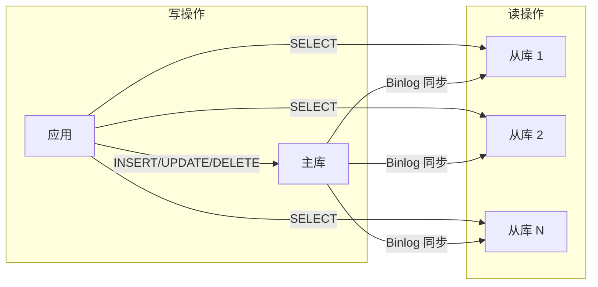
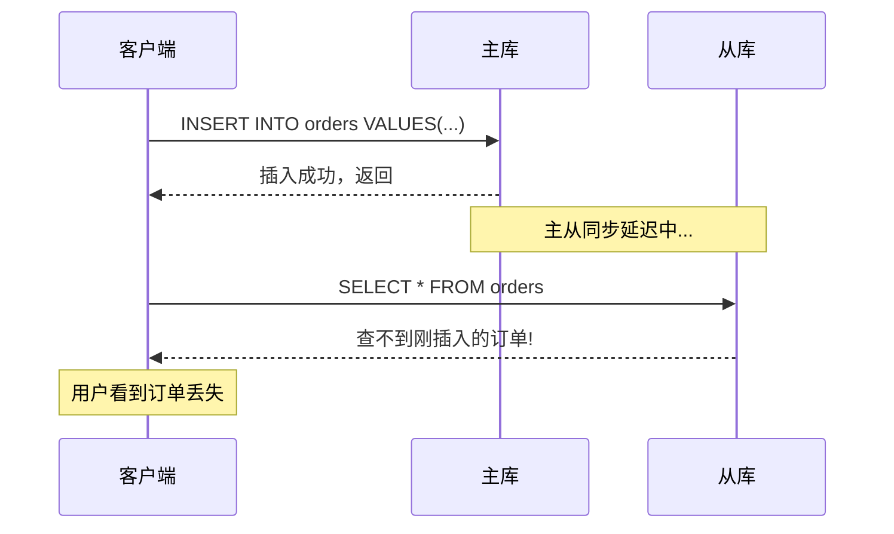

# 读写分离扩展

互联网应用有一个显著特点：读请求远多于写请求。新闻网站、视频平台、电商商品页——都是读的天下。读写分离，就是针对这个特点的扩展方案。

## 主从复制架构

读写分离的基础是主从复制——一个主库（Master）处理写请求，多个从库（Slave）处理读请求。



MySQL 的主从复制原理：

1. 主库记录数据变更到 Binlog（二进制日志）
2. 从库的 IO 线程连接主库，请求 Binlog 内容
3. 主库推送 Binlog 到从库
4. 从库的 IO 线程接收 Binlog，写入 Relay Log（中继日志）
5. 从库的 SQL 线程读取 Relay Log，执行 SQL 语句

### MySQL 主从配置

```ini title="my.cnf 主库配置"
[mysqld]
server-id = 1
log-bin = mysql-bin
binlog_format = ROW
sync_binlog = 1
```

```ini title="my.cnf 从库配置"
[mysqld]
server-id = 2
relay-log = relay-bin
read_only = ON
```

```sql title="从库连接主库"
CHANGE MASTER TO
    MASTER_HOST = 'master.example.com',
    MASTER_USER = 'replication_user',
    MASTER_PASSWORD = 'password',
    MASTER_LOG_FILE = 'mysql-bin.000001',
    MASTER_LOG_POS = 120;

START SLAVE;
```

## 读写分离路由

应用层需要根据请求类型，把读写分离到不同节点。

### 方案一：配置路由（简单场景）

应用层配置主库和多个从库，根据 SQL 类型选择目标库。

```java title="简单路由实现"
@Service
public class DataSourceRouter {

    private final DataSource master;
    private final List<DataSource> slaves;

    public Connection getConnection(boolean isReadOnly) {
        if (isReadOnly) {
            // 负载均衡选择从库
            DataSource slave = selectSlave();
            return slave.getConnection();
        } else {
            return master.getConnection();
        }
    }

    private DataSource selectSlave() {
        // 轮询选择从库
        int index = (int) (System.currentTimeMillis() % slaves.size());
        return slaves.get(index);
    }
}
```

### 方案二：ShardingSphere 读写分离

生产环境推荐使用成熟框架，如 ShardingSphere。

```yaml title="shardingsphere.yaml"
schemaName: app_db

dataSources:
  ds_master:
    dataSourceClassName: com.zaxxer.hikari.HikariDataSource
    driverClassName: com.mysql.cj.jdbc.Driver
    jdbcUrl: jdbc:mysql://master:3306/app_db
    username: root
    password: password

  ds_slave_0:
    dataSourceClassName: com.zaxxer.hikari.HikariDataSource
    driverClassName: com.mysql.cj.jdbc.Driver
    jdbcUrl: jdbc:mysql://slave0:3306/app_db
    username: root
    password: password

  ds_slave_1:
    dataSourceClassName: com.zaxxer.hikari.HikariDataSource
    driverClassName: com.mysql.cj.jdbc.Driver
    jdbcUrl: jdbc:mysql://slave1:3306/app_db
    username: root
    password: password

rules:
- !readwrite_splitting:
    dataSources:
      readwrite_ds:
        writeDataSourceName: ds_master
        readDataSourceNames:
          - ds_slave_0
          - ds_slave_1
        loadBalancerName: round_robin
```

### 方案三：Spring 注解路由

业务层面通过注解声明读写类型。

```java title="读写分离注解"
@Target(ElementType.METHOD)
@Retention(RetentionPolicy.RUNTIME)
public @interface ReadOnly {
}
```

```java title="Service 层使用"
@Service
public class UserService {

    // 写操作，走主库
    @Transactional
    public void createUser(User user) {
        userRepository.save(user);
    }

    // 读操作，走从库
    @ReadOnly
    public User getUser(Long userId) {
        return userRepository.findById(userId);
    }

    // 读操作，走从库
    @ReadOnly
    public List<User> listUsers() {
        return userRepository.findAll();
    }
}
```

## 主从延迟问题

主从延迟是读写分离的核心问题。写入主库后，如果立刻从从库读取，可能读到旧数据。

### 延迟原因

**SQL 执行时间差**：主库执行完 SQL 到 Binlog 记录有时间差，通常是毫秒级。

**网络传输延迟**：Binlog 从主库传输到从库有网络延迟。

**从库重放延迟**：从库接收 Binlog 后需要重放执行，繁忙时可能积压。

### 延迟影响



### 延迟解决方案

**方案一：强制读主库**

对一致性要求高的读请求（如支付结果查询），强制走主库。

```java title="强制主库读取"
@Service
public class OrderService {

    public Order getOrderForPayment(Long orderId) {
        // 支付结果必须强一致性，读主库
        return jdbcTemplate.queryForObject(
            "SELECT * FROM orders WHERE id = ?",
            orderId
        );
    }

    @ReadOnly
    public Order getOrderForDisplay(Long orderId) {
        // 展示可以接受最终一致，读从库
        return orderRepository.findById(orderId);
    }
}
```

**方案二：半同步复制**

主库等待至少一个从库确认收到 Binlog 后，再返回客户端。

```sql
-- 安装半同步插件
INSTALL PLUGIN rpl_semi_sync_master SONAME 'semisync_master.so';
INSTALL PLUGIN rpl_semi_sync_slave SONAME 'semisync_slave.so';

-- 启用半同步
SET GLOBAL rpl_semi_sync_master_enabled = ON;
SET GLOBAL rpl_semi_sync_slave_enabled = ON;
```

**方案三：延迟感知**

应用层感知主从延迟，如果延迟超过阈值，主动切换到主库。

```java title="延迟检测与切换"
@Service
public class ReadWriteRouter {

    private final MeterRegistry meterRegistry;

    public DataSource route(Long userId, boolean isReadOnly) {
        if (!isReadOnly) {
            return master;
        }

        // 检测主从延迟
        long replicationLag = monitor.getReplicationLag();

        // 延迟超过阈值，读主库
        if (replicationLag > 100) { // 100ms
            log.warn("Replication lag {}ms exceeds threshold, reading from master", replicationLag);
            return master;
        }

        return selectSlave();
    }
}
```

## 读写分离的局限

读写分离不是万能的，它有明确的适用条件和限制。

### 能解决的问题

- 读请求量大，降低主库压力
- 读写比例严重失调（如 100:1）
- 异地多活场景，就近读取

### 不能解决的问题

**写请求瓶颈**：读写分离只能扩展读能力，写请求仍然由主库处理。如果写请求成为瓶颈，需要其他方案（如分库分表）。

**强一致性要求**：主从延迟导致无法保证实时一致性。对一致性要求高的场景，读写分离不适用。

**跨分片查询**：如果数据库已经分片，读写分离只能扩展单分片的读能力，无法解决跨分片查询问题。

**从库故障**：从库故障时，流量切回主库。如果有多个从库，可以减少影响；如果只有一主一从，单从库故障会导致所有读请求打到主库。

### 适用场景

| 场景 | 是否适合 |
| --- | --- |
| 电商商品展示 | 适合，读多写少 |
| 用户中心 | 视情况，登录查询适合，权限校验可能需要主库 |
| 社交 Feed | 适合，Timeline 可以接受最终一致 |
| 金融交易 | 不适合，需要强一致性 |
| 秒杀库存 | 不适合，库存扣减需要主库 |

## 常见误区

**误区一：读写分离能解决所有性能问题**

如果瓶颈在写请求，读写分离无效。先用 Profiling 确认瓶颈在读操作，再考虑读写分离。

**误区二：忽视主从延迟**

很多开发者以为主从复制是实时的，忽视延迟导致线上问题。应该在代码层面明确区分「强一致读」和「最终一致读」。

**误区三：所有读都走从库**

为了性能牺牲一致性是错误的策略。涉及资金、订单状态等关键数据的读取，应该走主库。

**误区四：从库数量越多越好**

从库增加会增加主库复制压力和运维复杂度。应该根据读请求量和主从延迟选择合适的从库数量。

**误区五：不做延迟监控**

主从延迟是动态变化的。应该在监控系统中配置延迟告警，及时发现异常。

## 延伸思考

读写分离是扩展读能力的有效手段，但它是一个起点，不是终点。当从库延迟持续增加、当读请求量继续增长，你需要考虑：

- 垂直扩展主库（升级硬件）
- 增加更多从库（但要控制主库复制压力）
- 引入缓存层（Redis）
- 数据分片（按业务维度拆分）

每一步都解决一类问题，同时引入新的复杂性。理解每个方案的边界，才能做出正确的架构决策。
