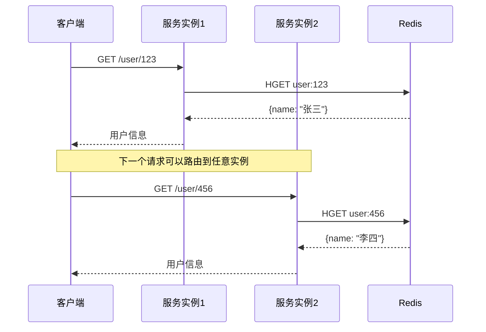

# 无状态化设计

水平扩展的前提是服务无状态。但「无状态」这个词容易产生误解——它不是说服务不存储任何数据，而是说服务不存储「与请求相关」的上下文数据。

理解这个区别，是无状态化设计的第一步。

## 什么是无状态

一个无状态服务，接收请求、处理逻辑、返回响应，整个过程不依赖任何「上一次请求」留下的信息。每个请求都是独立的，交换位置完全不会影响结果。



对比有状态服务：假设服务实例 1 保存了用户 A 的会话数据，当用户 A 的下一个请求被路由到服务实例 2 时，会话数据不存在，用户需要重新登录。这就是「有状态」带来的问题。

## Session 外置：Redis 存储

传统 Web 应用使用 Session 跟踪用户状态。登录成功后，用户信息保存在服务进程的内存中，后续请求通过 Session ID 查找。这个设计在单机时代没问题，但水平扩展后就遇到了麻烦。

### Session 粘性问题

负载均衡器把请求分发到不同实例。如果用户 A 的第一个请求到了实例 1，第二个请求到了实例 2，而两个实例的 Session 存储是独立的，那么实例 2 看不到用户 A 的登录状态。

解决方案是 Session 外置——不把 Session 存在进程内存里，而是存到共享存储（Redis、MongoDB、数据库）。

```java title="Spring Session + Redis 配置"
@Configuration
@EnableRedisHttpSession(maxInactiveIntervalInSeconds = 3600)
public class SessionConfig {

    @Bean
    public LettuceConnectionFactory connectionFactory() {
        return new LettuceConnectionFactory();
    }
}
```

```java title="用户登录服务"
@Service
public class AuthService {

    @Autowired
    private HttpSession session;

    public User login(String username, String password) {
        // 验证逻辑...
        User user = userRepository.findByUsername(username);

        // 不再存入本地 Session，而是 Spring Session 自动存到 Redis
        session.setAttribute("currentUser", user);

        return user;
    }
}
```

Session 存入 Redis 后，任何服务实例都可以通过 Session ID 访问到相同的用户数据。负载均衡器可以自由选择任意实例处理请求。

### Session 存储策略

**内存模式**：`spring.session.store-type=redis`，Session 数据完全存储在 Redis。

**Redis + 本地缓存**：热点 Session 数据在 Redis 存储一份，同时在本地缓存一份，减少 Redis 访问次数。需要注意缓存一致性问题。

**独立 Session 服务**：独立部署 Session 服务集群，所有业务服务通过 RPC 调用 Session 服务。这种方式解耦更彻底，但引入了额外的网络开销和服务依赖。

## JWT vs Session

除了 Session，另一常见的用户认证方案是 JWT（JSON Web Token）。两者各有优劣。

### JWT 原理

JWT 是自包含的令牌，包含用户信息和签名，无需服务端存储。

```java title="JWT 生成与验证"
@Service
public class JwtService {

    private final SecretKey secretKey = Keys.secretKeyFor(SignatureAlgorithm.HS256);

    public String generateToken(User user) {
        return Jwts.builder()
                .setSubject(user.getId().toString())
                .claim("username", user.getUsername())
                .claim("role", user.getRole())
                .setIssuedAt(new Date())
                .setExpiration(new Date(System.currentTimeMillis() + 3600000))
                .signWith(secretKey)
                .compact();
    }

    public Claims validateToken(String token) {
        return Jwts.parserBuilder()
                .setSigningKey(secretKey)
                .build()
                .parseClaimsJws(token)
                .getBody();
    }
}
```

### JWT vs Session 对比

| 维度 | JWT | Session |
| --- | --- | --- |
| 存储位置 | 客户端 | 服务端（Redis） |
| 扩展性 | 好，无状态 | 需要外部存储 |
| 安全性 | 难以主动失效 | 可立即失效 |
| 数据量 | 受限于 Token 大小 | 无限制 |
| 性能 | 无需查询 | 需要查询 Redis |
| 适用场景 | API 服务、微服务 | 传统 Web 应用 |

### JWT 的陷阱

**Token 泄露无解**：一旦 Token 泄露，攻击者可以在 Token 过期前冒充用户。无法主动失效，只能等 Token 过期。解决方案是维护一个「Token 黑名单」，但这就又引入了服务端存储。

**敏感数据不宜放 Token**：Token 是 Base64 编码的，任何人都能解码。密码、银行卡号等敏感数据绝对不能放入 Token。

**Token 刷新问题**：Access Token 过期后如何处理？Refresh Token 需要单独实现。生产环境通常设置较短的 Access Token 有效期（如 15 分钟）和较长的 Refresh Token 有效期（如 7 天）。

## 无状态架构的优势与挑战

### 优势

**横向扩展简单**：实例之间无差异，任意增删实例都不影响服务可用性。Kubernetes 的ReplicaSet 就是基于这个原理。

**故障隔离好**：某个实例挂了，负载均衡器自动把流量切到健康实例。用户无感知。

**部署灵活**：可以在任何环境（物理机、虚拟机、容器）部署相同的服务镜像，配置差异由外部注入。

**适合云原生**：Serverless、FaaS 的基础就是无状态。只要函数是幂等的，云平台可以自由调度和扩缩容。

### 挑战

**外部存储依赖**：无状态不等于没有状态，只是状态外置了。Redis、数据库变成了关键依赖，一旦它们出问题，所有服务都受影响。

**网络延迟增加**：每次请求都需要访问外部存储，比本地内存访问慢几个数量级。需要通过缓存、本地优化等手段降低影响。

**调试困难**：本地开发时，IDE 调试只能看到服务代码，外部状态（Redis、数据库）是黑盒。出问题需要关联分析多个系统。

**安全考量**：状态外置后，Session/JWT 等凭证在网络中传输，需要 HTTPS 保护。敏感数据需要加密存储。

## 无状态化改造实践

### 步骤一：识别状态

首先梳理服务中的所有状态类型：

- **请求上下文**：请求参数、请求头、业务计算中间结果
- **会话状态**：用户登录信息、权限、购物车
- **缓存状态**：本地缓存的数据

**请求上下文**天然是无状态的，不涉及改造。

**会话状态**需要外置到 Redis 或其他共享存储。

**本地缓存**需要评估：缓存命中率是否够高？是否需要跨实例一致？通常本地缓存保留热点数据，共享存储保存全量数据。

### 步骤二：改造会话存储

把本地 Session 存储迁移到 Redis：

```java title="会话数据迁移"
@Service
public class UserContext {

    @Autowired
    private StringRedisTemplate redisTemplate;

    private static final String SESSION_PREFIX = "session:";

    public void setCurrentUser(Long userId, User user) {
        String key = SESSION_PREFIX + userId;
        redisTemplate.opsForValue().set(key, JSON.toJSONString(user));
        redisTemplate.expire(key, 1, TimeUnit.HOURS);
    }

    public User getCurrentUser(Long userId) {
        String key = SESSION_PREFIX + userId;
        String json = redisTemplate.opsForValue().get(key);
        return JSON.parseObject(json, User.class);
    }
}
```

### 步骤三：消除实例本地状态

检查代码中是否有实例级别的静态变量、成员变量保存业务状态：

```java title="错误示例：本地缓存用户数据"
@Service
public class UserService {

    // 危险！这是实例级别的状态
    private Map<Long, User> localCache = new ConcurrentHashMap<>();

    public User getUser(Long userId) {
        User user = localCache.get(userId);
        if (user == null) {
            user = userRepository.findById(userId);
            localCache.put(userId, user);
        }
        return user;
    }
}
```

```java title="正确示例：分布式缓存"
@Service
public class UserService {

    @Autowired
    private RedisTemplate<String, User> redisTemplate;

    private static final String USER_CACHE_PREFIX = "user:";

    public User getUser(Long userId) {
        String key = USER_CACHE_PREFIX + userId;
        User user = redisTemplate.opsForValue().get(key);

        if (user == null) {
            user = userRepository.findById(userId);
            if (user != null) {
                redisTemplate.opsForValue().set(key, user, 1, TimeUnit.HOURS);
            }
        }
        return user;
    }
}
```

### 步骤四：处理文件上传

文件上传通常需要本地存储。无状态化改造后，需要把文件存到对象存储（OSS、S3），服务实例只保存文件 ID。

```java title="文件上传改造"
@Service
public class FileService {

    @Autowired
    private OSSClient ossClient;

    @Autowired
    private RedisTemplate<String, String> redisTemplate;

    public String uploadFile(MultipartFile file) {
        // 生成唯一文件名
        String fileId = UUID.randomUUID().toString();
        String objectName = "files/" + fileId;

        // 上传到 OSS
        ossClient.putObject("bucket", objectName, file.getInputStream());

        // 文件 ID 存入 Redis
        redisTemplate.opsForValue().set("file:" + fileId, objectName);

        return fileId;
    }
}
```

## 常见误区

**误区一：无状态就是不用存储任何数据**

无状态服务也需要存储数据，只是存储位置从进程内存移到了外部。无状态化改造不是「删除数据」，而是「重新组织数据」。

**误区二：本地缓存完全不能用**

本地缓存可以提升性能，关键是区分哪些数据适合本地缓存、哪些需要共享。高频访问且更新不敏感的数据（如商品分类、配置字典）适合本地缓存；用户相关数据、热点变化的数据需要集中存储。

**误区三：JWT 比 Session 更好**

两者没有绝对优劣，只有场景适配。传统 Web 应用 Session 更简单；微服务架构中 JWT 的无状态特性更有优势。

**误区四：把所有数据都放 Redis**

Redis 是内存数据库，容量受限于内存大小。冷数据、大文件不适合放 Redis，应该存到数据库或对象存储。

## 延伸思考

无状态化是云原生的基础，但「无状态」本身不是目的。真正的目的是让系统具备弹性扩展能力、故障隔离能力和灵活部署能力。

过度追求「完全无状态」可能导致过度设计——把所有数据都存到 Redis，引入不必要的网络开销；或者为了无状态而破坏业务逻辑的完整性。

好的无状态化设计，应该让状态存在于「最合适的地方」。会话状态适合 Redis、文件适合对象存储、热点数据适合本地缓存、持久化数据适合数据库。每个存储都有它的使命。
