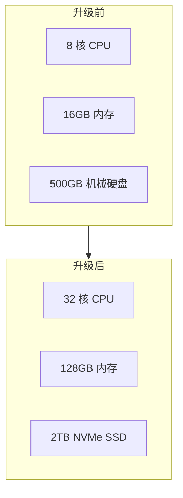

# 垂直扩展（Scale Up）

凌晨发布高峰期，服务器 CPU 打满，接口响应时间从 20ms 飙升到 2s。你看了一眼监控，发现罪魁祸首是一个「简单」的查询——单表 5000 万行，全表扫描。面对这种情况，很多人的第一反应是：加机器。

但加机器，也分加什么机器。

## 什么是垂直扩展

垂直扩展（Scale Up）是指通过提升单机硬件配置来增强系统处理能力的过程。简单来说，就是把服务器从 8 核 16GB 升级到 32 核 64GB，或者把机械硬盘换成 NVMe SSD。

## 硬件升级的三个方向

### CPU 升级

CPU 升级能直接提升计算密集型任务的处理能力。但这里有个关键问题：你的程序能充分利用多核吗？

如果是一个单线程的 Java 应用，16 核和 8 核的差别可能微乎其微。如果是一个能充分并行化的批处理任务，CPU 升级的效果则立竿见影。

升级 CPU 时需要考虑：

- **核心数 vs 主频**：核心数多适合并行任务，主频高适合单线程性能
- **架构兼容性**：新 CPU 需要主板支持，升级前确认插槽类型
- **软件授权**：部分商业软件按核心数收费

### 内存升级

内存升级的效果最直观。数据库、Spark、Flink 这些内存密集型应用，内存大小直接决定了它们能缓存多少数据、避免多少次磁盘 I/O。

对于 Java 应用，内存升级还需要注意：

- GC 压力：堆内存越大，FGC 停顿时间越长，需要选择合适的垃圾收集器
- 内存带宽：核心数增加后，内存带宽可能成为瓶颈
- NUMA 架构：多插槽服务器上，本地内存访问和远程内存访问性能差异巨大

### 存储升级

存储升级往往被忽视，但它对 I/O 密集型应用的影响巨大。

| 存储类型 | 顺序读 | 随机读 | 延迟 | 适用场景 |
| --- | --- | --- | --- | --- |
| 机械硬盘 | 150 MB/s | 1 MB/s | 10ms | 冷数据、归档 |
| SATA SSD | 550 MB/s | 50 MB/s | 0.1ms | 通用场景 |
| NVMe SSD | 3500 MB/s | 500 MB/s | 0.02ms | 高 I/O、低延迟 |

## 垂直扩展的物理极限

垂直扩展听起来简单，但存在明确的物理边界。

**单机硬件上限**：目前消费级服务器最高配置大约是 256 核 CPU、2TB 内存。即使是大型机，核心数也有上限。当你的需求超过单机上限，垂直扩展就走不通了。

**性价比曲线**：硬件性能不是线性增长的。一台 64 核机器的价格不是 8 核机器的 8 倍，而是 15-20 倍。越大越贵，性价比越低。

**单点故障**：把所有资源堆在一台机器上，这台机器就成了单点。一旦宕机，整个系统不可用。垂直扩展无法提供高可用保障。

**软件上限**：有些软件本身不支持更高配置。例如 32 位程序最大只能使用 4GB 内存，某些数据库对 CPU 核心数有许可证限制。

## 垂直扩展 vs 水平扩展

这是系统设计中永恒的话题。两者不是非此即彼的关系，而是各有适用场景。

| 维度 | 垂直扩展 | 水平扩展 |
| --- | --- | --- |
| 扩展方式 | 升级单机硬件 | 增加机器数量 |
| 上限 | 单机硬件极限 | 受限于集群规模 |
| 成本曲线 | 非线性，越大越贵 | 基本线性 |
| 复杂度 | 低 | 高（分布式问题） |
| 故障影响 | 单机故障 = 全量故障 | 单机故障 = 部分影响 |
| 数据一致性 | 天然保证 | 需要额外机制 |
| 适用场景 | 早期、业务简单 | 成熟业务、规模大 |

**什么时候该优先垂直扩展？**

- 业务初期，负载不确定，垂直扩展成本低、见效快
- 单机就能满足性能要求，没必要引入分布式复杂度
- 业务是状态密集型的（如复杂事务、强一致性要求），垂直扩展更简单
- 团队缺乏分布式系统运维经验

**什么时候该考虑水平扩展？**

- 单机配置已经接近上限，但业务还在增长
- 对可用性要求高，需要故障隔离
- 业务可以拆分为无状态服务
- 数据量巨大，单机存储不下

## 什么时候该垂直扩展

这个问题的答案取决于三个因素：当前瓶颈、成本收益比、预期增长。

**分析当前瓶颈**：先用 Profiling 工具定位真正的瓶颈。是 CPU 算力不足？还是内存太小导致频繁 GC？还是 I/O 拖慢了整体速度？对症下药才是关键。

**计算成本收益**：假设当前 8 核 16GB 服务器 CPU 打满，升级到 32 核 64GB 需要 5 万元，能支撑 6 个月。换成 4 台 8 核 16GB 的集群需要 8 万元，但能支撑 2 年。哪个更划算？

**考虑预期增长**：如果业务增速明确，且即将突破单机上限，应该优先做水平扩展的架构准备，而不是一味垂直扩展。很多团队踩过的坑是：垂直扩展能撑一天是一天，等到必须水平扩展时，代码已经来不及改了。

**现实中的选择**：大多数成熟系统采用混合策略。底层数据库为了强一致性，优先垂直扩展到高配机器；上层无状态应用则通过水平扩展应对流量峰谷。这也是云厂商提供各种规格实例的原因——给你足够细粒度的选择空间。

## 常见误区

**误区一：CPU 打满就要加 CPU**

CPU 打满可能是程序本身的问题——死循环、低效算法、锁竞争。升级硬件前，先用火焰图（Flame Graph）确认 CPU 时间花在哪里。我见过太多案例，程序里藏着一个 O(n²) 的查询，升级到 128 核机器依然卡死。

**误区二：内存越大越好**

Java 堆内存过大会导致 Full GC 停顿时间变长。对于 G1 GC，建议将停顿时间目标设置在可接受范围内（如 200ms），然后让 GC 自己决定合适的堆大小，而不是盲目设置 `-Xmx64g`。

**误区三：忽视 I/O 瓶颈**

很多性能问题其实是 I/O 瓶颈。数据库查询慢，CPU 却很低，大概率是等待磁盘 I/O。换一块 NVMe SSD，效果可能比升级 CPU 明显得多。

**误区四：把所有鸡蛋放一个篮子**

垂直扩展的机器是单点。一旦这台机器宕机，整个系统不可用。如果对可用性有要求，至少准备一台备用机器，或者考虑水平扩展作为兜底。

## 延伸思考

垂直扩展和水平扩展的选择，本质上是在「简单」和「可扩展性」之间做权衡。垂直扩展保留了单机系统的简单性，但放弃了弹性；水平扩展获得了弹性，但引入了分布式系统的所有复杂性。

没有最好的选择，只有最适合当前阶段的选择。关键是要意识到这个选择是有代价的，并且这个代价会随着业务发展而变化。当你在做垂直扩展的决策时，不妨问自己一个问题：这次升级能撑多久？撑到什么时候，我就不得不面对水平扩展了？
