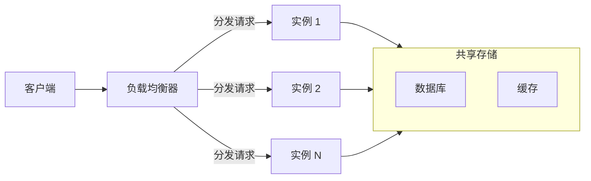

# X 轴扩展：水平复制

AKF 扩展立方体的 X 轴，是扩展的起点和基石。当业务流量增长，第一反应通常是「多加几台机器」。这个直觉背后的原理，就是水平复制。

## 什么是水平复制

水平复制（Horizontal Replication）是在 X 轴维度上的扩展——部署多个完全相同的服务实例，通过负载均衡器分发请求，每个实例处理总请求量的 1/N。



关键特征是「完全相同」——每个实例运行相同的代码，访问相同的数据源。它们之间没有任何区别，可以随时增减，不影响服务可用性。

## 克隆服务实例

水平复制的第一步，是让服务能够运行多个实例。

### 容器化部署

容器化是现代水平复制的事实标准。通过 Docker 镜像打包应用，Kubernetes 或 Docker Swarm 自动管理副本数。

```dockerfile title="Dockerfile"
FROM openjdk:17-slim
WORKDIR /app
COPY target/app.jar /app/
EXPOSE 8080
ENTRYPOINT ["java", "-jar", "/app/app.jar"]
```

```yaml title="Kubernetes Deployment"
apiVersion: apps/v1
kind: Deployment
metadata:
  name: api-server
spec:
  replicas: 3
  selector:
    matchLabels:
      app: api-server
  template:
    metadata:
      labels:
        app: api-server
    spec:
      containers:
      - name: api-server
        image: registry.example.com/api-server:latest
        ports:
        - containerPort: 8080
        resources:
          requests:
            memory: "512Mi"
            cpu: "250m"
          limits:
            memory: "1Gi"
            cpu: "500m"
        livenessProbe:
          httpGet:
            path: /health
            port: 8080
          initialDelaySeconds: 30
          periodSeconds: 10
        readinessProbe:
          httpGet:
            path: /ready
            port: 8080
          initialDelaySeconds: 5
          periodSeconds: 5
```

### 健康检查

每个实例需要健康检查机制，让负载均衡器知道哪些实例是健康的、可以接收流量。

**存活探针（Liveness Probe）**：判断容器是否存活。如果探针失败，Kubernetes 会重启容器。

**就绪探针（Readiness Probe）**：判断容器是否准备好接收流量。如果探针失败，Kubernetes 会把实例从服务中摘除，但不重启。

```java title="Spring Boot 健康检查端点"
@RestController
public class HealthController {

    @Autowired
    private DatabaseService databaseService;

    @GetMapping("/health")
    public ResponseEntity<String> health() {
        return ResponseEntity.ok("OK");
    }

    @GetMapping("/ready")
    public ResponseEntity<Map<String, Object>> ready() {
        Map<String, Object> status = new HashMap<>();
        status.put("database", databaseService.isHealthy() ? "up" : "down");
        status.put("timestamp", System.currentTimeMillis());

        boolean ready = databaseService.isHealthy();
        return ready
            ? ResponseEntity.ok(status)
            : ResponseEntity.status(503).body(status);
    }
}
```

## 负载均衡分发

负载均衡器是水平复制的关键组件。它负责把请求均匀（或者按策略）分发到各个实例。

### 负载均衡算法

**轮询（Round Robin）**：按顺序依次分发。最简单，但如果实例性能差异大，可能导致负载不均。

**加权轮询（Weighted Round Robin）**：按权重比例分发。适合不同规格的实例。

**最少连接（Least Connections）**：分发到当前连接数最少的实例。适合处理时间差异大的场景。

**IP 哈希（IP Hash）**：同一 IP 的请求始终路由到同一实例。适合需要会话粘性的场景。

### Nginx 配置示例

```nginx title="nginx.conf"
upstream backend {
    least_conn;  # 最少连接算法

    server 192.168.1.10:8080 weight=3;
    server 192.168.1.11:8080 weight=2;
    server 192.168.1.12:8080 weight=1;
}

server {
    listen 80;

    location / {
        proxy_pass http://backend;
        proxy_set_header Host $host;
        proxy_set_header X-Real-IP $remote_addr;
        proxy_set_header X-Forwarded-For $proxy_add_x_forwarded_for;

        # 健康检查配置
        health_check interval=5s fails=2 passes=2;
    }
}
```

### 分布式 Session 问题

水平复制后，同一用户的请求可能被分发到不同实例。如果使用本地 Session，会出现「登录状态丢失」的问题。

解决方案是 Session 外置到 Redis：

```java title="Spring Session + Redis"
@Configuration
@EnableRedisHttpSession(maxInactiveIntervalInSeconds = 3600)
public class SessionConfig {
    // Spring Session 自动将会话存储到 Redis
    // 所有实例通过 Redis 共享会话数据
}
```

## 缓存复制

水平复制的另一个问题是缓存。每个实例都有自己的本地缓存，这些缓存无法共享。

### 缓存不一致问题

假设用户更新了个人信息。实例 A 更新了数据库，但实例 B 的本地缓存还是旧数据。下一个请求被路由到实例 B，用户看到的是过期数据。

### 解决方案

**方案一：分布式缓存**

不用本地缓存，统一使用 Redis 等分布式缓存。所有实例共享一份缓存数据。

```java title="分布式缓存访问"
@Service
public class UserService {

    @Autowired
    private RedisTemplate<String, User> redisTemplate;

    private static final String USER_CACHE_PREFIX = "user:";

    public User getUser(Long userId) {
        String key = USER_CACHE_PREFIX + userId;
        User user = redisTemplate.opsForValue().get(key);

        if (user == null) {
            user = userRepository.findById(userId);
            if (user != null) {
                redisTemplate.opsForValue().set(key, user, 1, TimeUnit.HOURS);
            }
        }
        return user;
    }
}
```

**方案二：缓存失效广播**

更新数据时，主动失效所有实例的本地缓存。通过 Redis Pub/Sub 或消息队列广播失效消息。

```java title="缓存失效广播"
@Service
public class CacheInvalidationService {

    @Autowired
    private RedisMessageSubscriber subscriber;

    public void invalidateUserCache(Long userId) {
        String pattern = "user:" + userId + ":*";
        // 本地缓存失效
        localCache.invalidate(pattern);
        // 广播给其他实例
        redisTemplate.convertAndSend("cache:invalidate", pattern);
    }
}
```

**方案三：设置较短的缓存过期时间**

让缓存自然过期，降低不一致窗口。简单但不够优雅。

## 适用场景

X 轴扩展不是万能的，它只解决「请求量增长」的问题。

### 适合 X 轴扩展的场景

- **无状态服务**：请求之间无依赖，不依赖本地数据
- **读多写少**：读请求可以分散到多个实例，写请求通过分布式存储聚合
- **请求处理时间均匀**：不会因为某个实例处理慢导致负载不均
- **无强一致性要求**：可以接受最终一致

### 不适合 X 轴扩展的场景

- **有状态服务**：服务依赖本地状态，如游戏服务器、实时通信
- **数据量巨大**：数据本身无法存储在单机
- **强一致性要求**：跨实例的分布式事务复杂
- **计算密集型**：CPU 打满时，增加实例反而增加资源竞争

## X 轴扩展的局限性

X 轴扩展能扛更多请求，但不能扛更大数据量。所有实例共享同一个数据库，数据库可能成为新的瓶颈。

**数据库 CPU 打满**：10 个 API 实例同时访问一个数据库，数据库 CPU 打满，增加实例只会让数据库更忙。解决方案是 Y 轴拆分（读写分离）或 Z 轴分片。

**连接池耗尽**：每个实例维护自己的数据库连接池。10 个实例 × 50 连接 = 500 连接。连接数超过数据库限制，新的请求只能等待。

**网络带宽饱和**：10 个实例同时访问数据库，网络带宽可能成为瓶颈。

## 常见误区

**误区一：实例越多越好**

实例增加意味着更高的运维成本、更复杂的问题定位、更大的资源消耗。应该找到「足够」的实例数，而不是「尽可能多」。

**误区二：忽视数据库瓶颈**

X 轴扩展的前提是后端存储不是瓶颈。如果数据库已经饱和，应该先优化数据库（索引、SQL、架构），而不是盲目增加应用实例。

**误区三：不做容量规划**

X 轴扩展应该有明确的目标。例如：「当前峰值 5000 QPS，单实例处理 500 QPS，需要 10 个实例」。

**误区四：实例配置不同**

所有实例应该是相同的。不应该让某些实例处理更复杂的请求，否则负载不均。

## 延伸思考

X 轴扩展是水平扩展的起点，但绝不是终点。理解 X 轴的边界，才能知道什么时候需要 Y 轴（服务拆分）或 Z 轴（数据分片）。

好的 X 轴扩展实践，应该让系统「随时可以扩展」。无状态化、配置外置、健康检查、优雅关闭——这些基础设施做好之后，扩展就是改一个数字的事。

当 X 轴扩展到达极限（通常是数据库瓶颈），就到了考虑 Y 轴和 Z 轴的时候。但那是另一个维度的问题。
