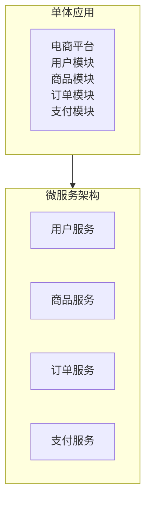
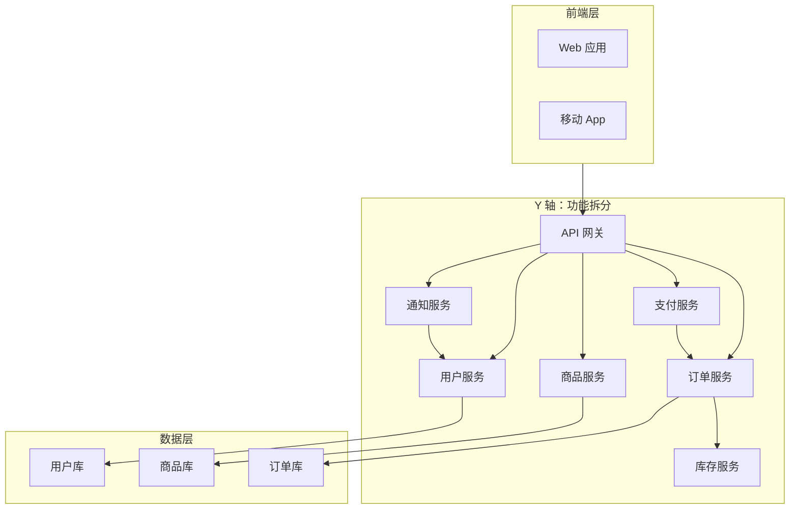
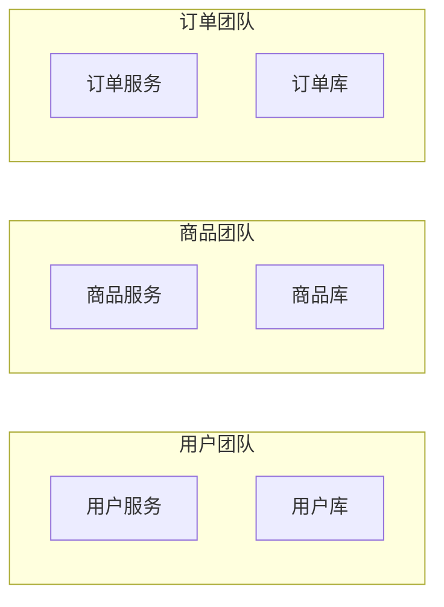
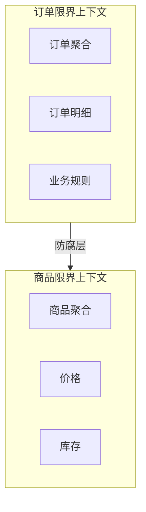

# Y 轴扩展：功能拆分

X 轴扩展能扛更多请求，但如果业务本身是一团乱麻，10 个乱麻的实例还是乱麻。Y 轴扩展通过「分而治之」，把复杂的业务拆分成独立的服务，每个服务解决一个问题。

## 什么是 Y 轴扩展

Y 轴扩展是 AKF 扩展立方体的第二维度——按业务功能或用例拆分系统。每个拆分出来的服务独立部署、独立扩展、独立演进。

拆分的目的是让每个服务具备以下特性：

- **单一职责**：每个服务只负责一个业务领域
- **独立部署**：每个服务可以独立发布，不影响其他服务
- **独立扩展**：每个服务按需扩展，不需要全员扩容
- **技术异构**：每个服务可以选择最适合的技术栈

## 按业务功能拆分

Y 轴拆分的核心是找到正确的「业务边界」。边界画错了，拆出来的服务比单体还难维护。

### 拆分的常见维度

**按业务领域拆分**：最常见的拆分方式。每个领域（如用户、商品、订单）对应一个服务。

**按用例拆分**：读操作和写操作拆成不同服务。读服务优化查询性能，写服务处理业务逻辑。

**按访问模式拆分**：高频访问的功能和低频访问的功能分离。前者可以部署更多实例、享受更好的优化。

**按团队划分**：康威定律指出，系统结构往往反映团队结构。按团队划分服务边界，可以让团队自治更顺畅。

### 电商系统拆分示例

## 微服务架构

Y 轴扩展的落地形式就是微服务架构。但「微服务」不是目标，「解决业务复杂度」才是目标。

### 微服务的特征

**独立进程**：每个服务运行在独立的进程/容器中，拥有独立的内存空间。不存在进程内的方法调用，只有网络通信。

**轻量级通信**：服务间通过 HTTP REST、gRPC 或消息队列通信。协议要简单、跨语言友好。

**明确接口**：服务提供明确的 API（同步 REST/gRPC 或异步消息），不暴露内部实现细节。

**独立数据存储**：每个服务拥有自己的数据库，外部服务不能直接访问。跨服务数据共享通过 API 调用实现。

### 团队组织

微服务架构通常伴随着团队的组织变革。按业务领域划分服务后，对应的团队也负责这些服务的全生命周期——开发、测试、部署、运维。

## 服务边界划分原则

服务边界是 Y 轴拆分中最重要、也最容易出错的决策。边界划错了，后续改造成本极高。

### 高内聚、低耦合

**高内聚**：相关的功能应该放在同一个服务里。如果两个功能总是同时变化，应该考虑合并。

**低耦合**：服务之间的依赖应该尽量少、尽量稳定。如果两个服务经常需要同时修改，说明它们的边界可能不合理。

### 领域驱动设计（DDD）

DDD 提供了系统化的边界划分方法：

**限界上下文（Bounded Context）**：每个限界上下文代表一个完整的业务领域，有自己明确的边界和职责。上下文之间通过「防腐层」隔离。

**聚合（Aggregate）**：聚合是一组相关对象的集合，作为数据变更的单元。聚合的边界通常就是服务的边界。

### 识别业务能力

划分边界前，先梳理系统的业务能力清单：

1. 列出系统支持的所有业务能力
2. 按相关性分组，识别核心领域
3. 识别领域之间的依赖关系
4. 确定哪些能力属于核心域、哪些属于支撑域
5. 核心域优先拆分，支撑域可以延后

### 常见错误

**拆分过细**：每个小功能一个服务，服务数量爆炸。服务间调用链路过深，延迟增加，问题定位困难。「分布式 monolith」比单体应用更难维护。

**拆分粒度**：一个服务太大（服务内耦合严重）或太小（服务间协作成本高）。建议初期粒度粗一些，后续按需进一步拆分。

**数据边界不清**：服务拆分后，数据还在共享数据库。跨服务的数据查询变成噩梦，事务一致性无法保证。

## 适用场景

Y 轴扩展适合特定的问题域，不是所有场景都适合。

### 适合 Y 轴扩展的场景

**业务复杂度高**：系统包含多个相对独立的业务领域，每个领域有自己的业务规则和数据模型。

**团队规模大**：多个团队并行开发，单体应用导致代码合并冲突多、发布协调成本高。

**技术异构需求**：不同业务领域需要不同的技术栈（如推荐系统用 Python，支付系统用 Java）。

**独立部署诉求强**：不同业务域的变更频率差异大，希望解耦发布风险。

### 不适合 Y 轴扩展的场景

**业务初期**：业务模型还在快速演进，拆分过早会导致边界反复调整，改造成本高。

**小团队**：没有足够的 DevOps 能力管理大量服务。3 个人的团队维护 20 个微服务是不现实的。

**低延迟场景**：微服务间网络调用增加延迟，高性能要求的场景可能不适合。

**强一致性要求**：跨服务的分布式事务比单体内事务复杂得多。

## Y 轴 vs X 轴

Y 轴和 X 轴不是替代关系，而是互补关系。

| 维度 | X 轴 | Y 轴 |
| --- | --- | --- |
| 问题域 | 请求量增长 | 业务复杂度增长 |
| 扩展方式 | 同类实例增加 | 不同服务拆分 |
| 前提条件 | 无状态 | 服务边界清晰 |
| 复杂度 | 低 | 高 |
| 实施顺序 | 优先 | 次优 |

实际架构通常是 X + Y 组合：先把服务按 Y 轴拆开，每个服务内部按 X 轴扩展实例。

## 常见误区

**误区一：微服务是银弹**

微服务解决不了代码烂、架构差的问题。如果单体都写不好，微服务只会让问题更分散、更难定位。

**误区二：拆分越细越好**

服务的数量不是目标，可维护性才是。拆分是为了让团队自治、技术异构、独立扩展，而不是为了「看起来很酷」。

**误区三：忽视分布式复杂性**

微服务引入了服务发现、负载均衡、熔断降级、分布式追踪、分布式事务等一系列问题。在拆分前，应该评估团队是否有能力应对这些复杂性。

**误区四：服务边界一次到位**

业务在发展，边界也在演进。初期粒度粗一些，随着业务清晰再逐步拆分，比一开始就设计完美边界更务实。

## 延伸思考

Y 轴扩展的本质是把「复杂性」从「代码层面」转移到「架构层面」。单体应用的复杂性体现在代码内部的耦合，微服务的复杂性体现在服务之间的协作。

选择 Y 轴扩展，就是选择了一种不同的复杂性。没有哪个更好，只有哪个更合适——取决于业务阶段、团队规模、技术能力。

一个实用的建议是：先用单体跑通核心业务，等业务模式稳定、团队规模扩大后，再按需拆分。不要在还没搞清楚业务是什么的时候就开始「微服务架构设计」。
