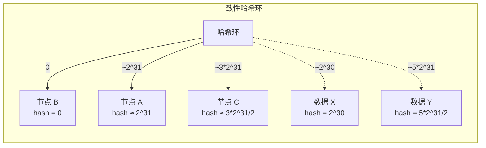
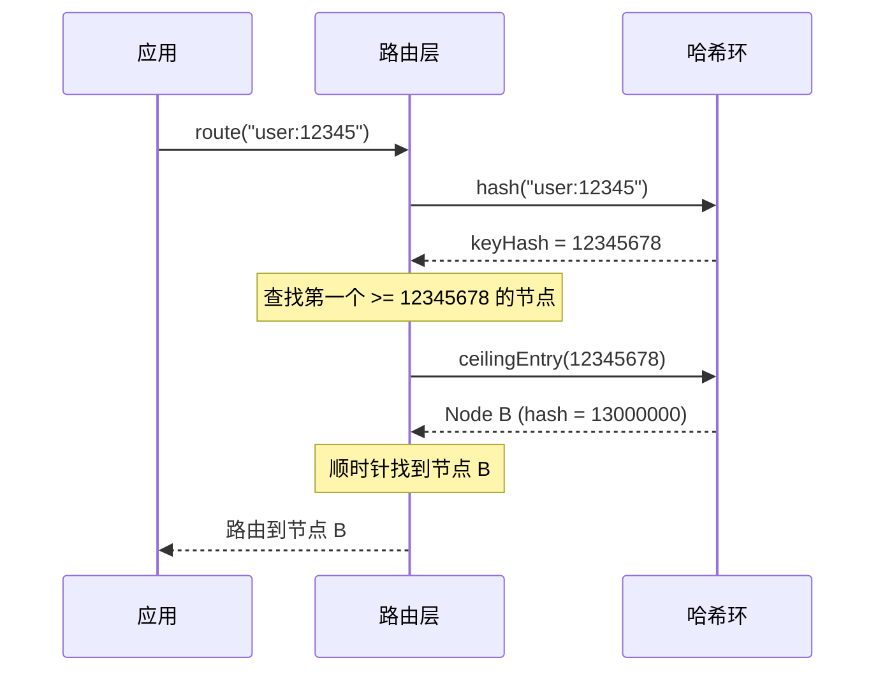

# 一致性哈希原理与实现

取模哈希分片简单直接，但有个致命问题：扩容时需要迁移大量数据。一致性哈希（Consistent Hashing）就是为了解决这个问题而设计的。

## 环结构哈希空间

一致性哈希把哈希空间组织成一个环，范围是 0 到 2^32（对于使用 32 位哈希的场景）。



环的特点：

- 顺时针方向遍历时，哈希值单调递增
- 超过最大值后会绕回起点
- 数据存储在顺时针方向第一个节点上

## 节点映射到环

每个物理节点通过哈希函数映射到环上的一个位置。

```java title="节点注册到哈希环"
@Service
public class ConsistentHashRing {

    private final TreeMap<Long, String> ring = new TreeMap<>();

    public void addNode(String nodeName) {
        long hash = hash(nodeName);
        ring.put(hash, nodeName);
        System.out.println("节点 " + nodeName + " 加入，hash = " + hash);
    }

    public void removeNode(String nodeName) {
        long hash = hash(nodeName);
        ring.remove(hash);
        System.out.println("节点 " + nodeName + " 移除，hash = " + hash);
    }

    private long hash(String key) {
        // MurmurHash3 64位实现
        return MurmurHash.hash64(key);
    }
}
```

## 数据路由

数据路由时，先计算数据的哈希值，然后在环上顺时针找到第一个节点。

```java title="一致性哈希路由"
@Service
public class ConsistentHashRouter {

    private final TreeMap<Long, String> ring = new TreeMap<>();

    public void addNode(String nodeName) {
        long hash = hash(nodeName);
        ring.put(hash, nodeName);
    }

    public void removeNode(String nodeName) {
        long hash = hash(nodeName);
        ring.remove(hash);
    }

    public String route(String key) {
        if (ring.isEmpty()) {
            throw new IllegalStateException("哈希环为空");
        }

        long keyHash = hash(key);

        // 找到顺时针方向第一个 >= keyHash 的节点
        Map.Entry<Long, String> entry = ring.ceilingEntry(keyHash);

        // 如果找不到（keyHash 大于所有节点哈希），取第一个节点（绕回环起点）
        if (entry == null) {
            entry = ring.firstEntry();
        }

        return entry.getValue();
    }

    private long hash(String key) {
        return MurmurHash.hash64(key);
    }
}
```



## 扩容迁移

一致性哈希的核心优势是扩容时只迁移部分数据。

**扩容前**：3 个节点，数据均匀分布。

**扩容时**：新增节点 D。只需迁移 D 到 C 之间的一小部分数据（大约 1/4）。

**迁移量**：N 个节点变成 N+1 个节点时，理论上只迁移 1/(N+1) 的数据。

```java title="扩容迁移示例"
public class扩容迁移分析 {

    public static void main(String[] args) {
        // 3 个节点扩容到 4 个节点
        int oldNodes = 3;
        int newNodes = 4;

        double migrationRatio = 1.0 / newNodes;
        System.out.println("迁移比例: " + (migrationRatio * 100) + "%");
        // 输出: 迁移比例: 25%

        // 扩容到 10 个节点
        int oldNodes2 = 9;
        int newNodes2 = 10;
        double migrationRatio2 = 1.0 / newNodes2;
        System.out.println("从 9 节点扩容到 10 节点: " + (migrationRatio2 * 100) + "%");
        // 输出: 从 9 节点扩容到 10 节点: 10%
    }
}
```

## Java 完整实现

```java title="一致性哈希环完整实现"
public class ConsistentHashRing<T> {

    private final TreeMap<Long, T> ring = new TreeMap<>();
    private final HashFunction hashFunction;

    public ConsistentHashRing() {
        this(new MurmurHashFunction());
    }

    public ConsistentHashRing(HashFunction hashFunction) {
        this.hashFunction = hashFunction;
    }

    public void addNode(T node) {
        long hash = hashFunction.hash(node.toString());
        ring.put(hash, node);
    }

    public void removeNode(T node) {
        long hash = hashFunction.hash(node.toString());
        ring.remove(hash);
    }

    public T route(String key) {
        if (ring.isEmpty()) {
            throw new IllegalStateException("哈希环为空");
        }

        long keyHash = hashFunction.hash(key);
        Map.Entry<Long, T> entry = ring.ceilingEntry(keyHash);

        if (entry == null) {
            entry = ring.firstEntry();
        }

        return entry.getValue();
    }

    public T route(Long key) {
        return route(key.toString());
    }

    public int getNodeCount() {
        return ring.size();
    }

    public Set<T> getAllNodes() {
        return new HashSet<>(ring.values());
    }

    public interface HashFunction {
        long hash(String key);
    }

    /**
     * MurmurHash3 实现
     */
    public static class MurmurHashFunction implements HashFunction {
        private static final long SEED = 0x1234ABCDL;

        @Override
        public long hash(String key) {
            byte[] data = key.getBytes(StandardCharsets.UTF_8);
            return murmurhash3(data, SEED);
        }

        private long murmurhash3(byte[] data, long seed) {
            final long m = 0xc6a4a7935bd1e995L;
            final int r = 47;

            long h = seed ^ (data.length * m);

            int length = data.length;
            int len = length >> 3;

            for (int i = 0; i < len; i++) {
                int i8 = i << 3;
                long k = ((long) data[i8] & 0xff)
                        | ((long) data[i8 + 1] & 0xff) << 8
                        | ((long) data[i8 + 2] & 0xff) << 16
                        | ((long) data[i8 + 3] & 0xff) << 24
                        | ((long) data[i8 + 4] & 0xff) << 32
                        | ((long) data[i8 + 5] & 0xff) << 40
                        | ((long) data[i8 + 6] & 0xff) << 48
                        | ((long) data[i8 + 7] & 0xff) << 56;

                k *= m;
                k ^= k >>> r;
                k *= m;

                h ^= k;
                h *= m;
            }

            if ((length & 7) != 0) {
                int i7 = len << 3;
                long k = 0;
                for (int j = length - 1; j >= i7; j--) {
                    k <<= 8;
                    k |= data[j];
                }
                k *= m;
                h ^= k;
            }

            h ^= h >>> r;
            h *= m;
            h ^= h >>> r;

            return h;
        }
    }
}
```

```java title="使用示例"
public class ConsistentHashDemo {

    public static void main(String[] args) {
        ConsistentHashRing<String> ring = new ConsistentHashRing<>();

        // 添加节点
        ring.addNode("192.168.1.10:3306");
        ring.addNode("192.168.1.11:3306");
        ring.addNode("192.168.1.12:3306");

        // 测试路由
        String[] keys = {"user:1001", "user:1002", "user:1003"};
        for (String key : keys) {
            String node = ring.route(key);
            System.out.println(key + " -> " + node);
        }

        // 模拟扩容
        System.out.println("\n--- 扩容后 ---");
        ring.addNode("192.168.1.13:3306");

        for (String key : keys) {
            String node = ring.route(key);
            System.out.println(key + " -> " + node);
        }
    }
}
```

## 哈希不均匀问题

一致性哈希有个问题：当节点数量较少时，数据分布可能不均匀。

**问题原因**：哈希环被节点分割成不均匀的区间。节点 A 和 B 之间的区间，可能比节点 B 和 C 之间的区间大很多。

**解决方案**：引入虚拟节点（Virtual Nodes），让每个物理节点在环上有多个「分身」，从而平滑分布。

## 常见误区

**误区一：一致性哈希不需要迁移**

一致性哈希只保证「大部分数据不迁移」，不是「完全不迁移」。扩容时，仍有 1/(N+1) 的数据需要迁移。

**误区二：哈希环越大越好**

哈希环大小（2^32）是固定的，不存在「大小」问题。关键在于节点的分布。

**误区三：分片数必须固定**

一致性哈希支持动态增减节点，但频繁变动会导致数据迁移。建议预留足够的初始分片数。

## 延伸思考

一致性哈希是分布式系统中的经典算法。它解决了两个核心问题：

1. **扩容迁移**：从需要迁移 100% 数据降低到只需要迁移 1/(N+1) 数据
2. **负载均衡**：通过虚拟节点实现更均匀的负载分布

理解一致性哈希的原理和应用场景，是分布式系统设计的基础能力。
