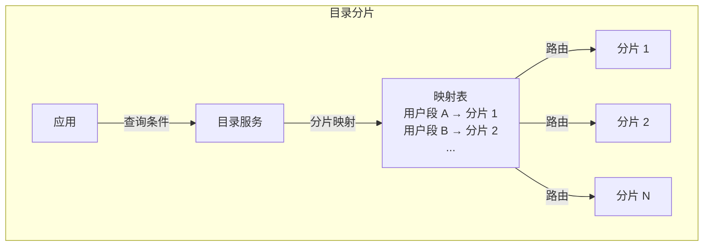

# 目录分片

目录分片是一种灵活的路由策略：通过维护一个分片映射表，根据业务规则动态决定数据归属。这种方式给了开发者最大的自由度，但也有自己的代价。

## 分片映射表

目录分片的核心是维护一张分片映射表，记录每个分片键值对应的分片位置。



```sql title="分片映射表结构"
CREATE TABLE shard_directory (
    shard_key VARCHAR(64) PRIMARY KEY,     -- 分片键
    shard_id INT NOT NULL,                  -- 分片 ID
    shard_name VARCHAR(128),               -- 分片名称
    created_at TIMESTAMP DEFAULT NOW(),
    updated_at TIMESTAMP DEFAULT NOW() ON UPDATE NOW()
);

-- 示例数据
INSERT INTO shard_directory VALUES
    ('user:china:north', 1, 'shard_cn_north'),
    ('user:china:south', 2, 'shard_cn_south'),
    ('user:usa:east', 3, 'shard_us_east'),
    ('user:usa:west', 4, 'shard_us_west');
```

## 路由查找

查询时，先查映射表获取分片 ID，再访问对应分片。

```java title="目录分片路由实现"
@Service
public class DirectoryShardRouter {

    private final JdbcTemplate jdbcTemplate;
    private final LoadingCache<String, Integer> cache; // 本地缓存

    public DirectoryShardRouter(DataSource dataSource) {
        this.jdbcTemplate = new JdbcTemplate(dataSource);
        this.cache = Caffeine.newBuilder()
                .maximumSize(10_000)
                .expireAfterWrite(Duration.ofMinutes(5))
                .build();
    }

    public int getShardId(String shardKey) {
        // 先查本地缓存
        Integer cached = cache.getIfPresent(shardKey);
        if (cached != null) {
            return cached;
        }

        // 缓存未命中，查数据库
        Integer shardId = jdbcTemplate.queryForObject(
            "SELECT shard_id FROM shard_directory WHERE shard_key = ?",
            Integer.class,
            shardKey
        );

        if (shardId == null) {
            throw new IllegalArgumentException("未找到分片: " + shardKey);
        }

        // 写入缓存
        cache.put(shardKey, shardId);
        return shardId;
    }

    public String getShardName(String shardKey) {
        int shardId = getShardId(shardKey);
        return jdbcTemplate.queryForObject(
            "SELECT shard_name FROM shard_directory WHERE shard_id = ?",
            String.class,
            shardId
        );
    }
}
```

## 复杂路由规则

目录分片的优势是支持复杂的路由规则。

### 按地区路由

```java title="地区路由规则"
@Service
public class GeoShardRouter {

    private final DirectoryShardRouter directoryRouter;

    public String routeForUser(Long userId, String region) {
        // 构造分片键：地区_用户段
        String shardKey = region + ":" + (userId / 1_000_000);
        return directoryRouter.getShardName(shardKey);
    }

    public String routeForOrder(String orderId, String region) {
        // 订单按用户所属地区路由
        // 需要先查订单关联的用户
        Long userId = orderService.getUserIdByOrderId(orderId);
        return routeForUser(userId, region);
    }
}
```

### 按业务属性路由

```java title="业务属性路由"
@Service
public class BusinessShardRouter {

    public String routeForUser(User user) {
        // 根据用户等级决定分片
        // 高等级用户放高性能分片
        if (user.getLevel() >= 10) {
            return "shard_premium";
        } else if (user.getLevel() >= 5) {
            return "shard_standard";
        } else {
            return "shard_basic";
        }
    }

    public String routeForOrder(Order order) {
        // 根据订单金额决定分片
        if (order.getAmount().compareTo(new BigDecimal("10000")) > 0) {
            return "shard_high_value";
        }
        return "shard_normal";
    }
}
```

### 动态路由

```java title="动态路由策略"
@Service
public class DynamicShardRouter {

    private final Map<String, String> routingRules = new ConcurrentHashMap<>();

    public void updateRoutingRule(String shardKey, String shardName) {
        routingRules.put(shardKey, shardName);
        // 清除缓存或通知所有节点
        clearCache();
    }

    public String route(String shardKey) {
        String shardName = routingRules.get(shardKey);
        if (shardName == null) {
            throw new IllegalArgumentException("未配置路由规则: " + shardKey);
        }
        return shardName;
    }

    private void clearCache() {
        // 实现缓存清除逻辑
    }
}
```

## 目录分片的优势

### 灵活的分片规则

支持任意复杂的分片规则，不受哈希函数或范围限制。

```java title="复杂分片规则示例"
@Service
public class ComplexShardRouter {

    public String getShard(User user, Order order, QueryContext context) {
        // 多维度分片策略

        // 1. VIP 用户独立分片
        if (user.isVip()) {
            return "shard_vip_" + user.getVipLevel();
        }

        // 2. 高价值订单独立分片
        if (order != null && order.getAmount().compareTo(new BigDecimal("50000")) > 0) {
            return "shard_high_value";
        }

        // 3. 按地区路由
        String region = context.getRegion();
        if (region != null) {
            return "shard_" + region;
        }

        // 4. 默认按用户 ID 哈希
        return "shard_default_" + (user.getId() % 4);
    }
}
```

### 运行时调整

可以在运行时调整分片规则，无需迁移数据。

```java title="运行时调整分片"
@Service
public class ShardManager {

    public void migrateToNewShard(String shardKey, String newShardName) {
        // 1. 更新路由表
        updateDirectory(shardKey, newShardName);

        // 2. 启动数据迁移
        migrateData(shardKey);

        // 3. 验证迁移完成
        verifyDataIntegrity(shardKey);
    }

    public void splitShard(String shardName) {
        // 分片拆分：将一个大分片分成多个小分片
        List<String> oldKeys = getShardKeys(shardName);
        int splitCount = 2;

        for (int i = 0; i < oldKeys.size(); i++) {
            String newShardName = shardName + "_" + i;
            String shardKey = oldKeys.get(i);

            updateDirectory(shardKey, newShardName);
            moveData(shardKey, newShardName);
        }

        // 删除旧分片
        removeShard(shardName);
    }
}
```

## 目录分片的缺点

### 单点查询

每次路由都需要查询映射表，即使有缓存，也多了一次查询开销。

### 缓存一致性问题

映射表更新后，所有节点的本地缓存需要失效。如果有节点缓存未及时更新，可能路由到错误的分片。

### 单点故障

映射表存储的服务如果故障，所有路由都会失败。需要高可用方案。

```java title="高可用配置"
@Configuration
public class DirectoryHAConfig {

    @Bean
    public ShardDirectoryService shardDirectoryService() {
        return new ShardDirectoryService(
            primaryDataSource(),
            replicaDataSource(),
            redisCache()
        );
    }

    private DataSource primaryDataSource() {
        // 主数据源
    }

    private DataSource replicaDataSource() {
        // 副本数据源
    }

    private Cache redisCache() {
        // Redis 缓存
    }
}
```

## 与其他分片策略对比

| 维度 | 目录分片 | 哈希分片 | 范围分片 |
| --- | --- | --- | --- |
| 灵活性 | 高 | 中 | 低 |
| 路由开销 | 高（需查表） | 低（计算） | 低（计算） |
| 范围查询 | 取决于规则 | 不支持 | 高效 |
| 数据均匀度 | 取决于规则 | 均匀 | 可能不均匀 |
| 扩容复杂度 | 中（可运行时调整） | 高（需迁移） | 中（自动区间） |

## 常见误区

**误区一：目录分片不需要容量规划**

映射表本身也需要存储和备份。分片数量过多时，映射表也会成为性能瓶颈。

**误区二：缓存能解决所有问题**

缓存可以降低查询频率，但缓存一致性和缓存失效问题需要认真处理。

**误区三：路由规则可以随时改**

路由规则变更可能导致数据不一致。应该在变更前规划好迁移方案。

## 延伸思考

目录分片是最灵活的路由方式，但灵活性是有代价的。每次路由多一次查询、本地缓存引入一致性挑战、映射表本身成为单点。

选择目录分片前，应该评估：

- 路由规则是否真的需要这么复杂
- 能否承受额外的路由开销
- 是否有能力保证缓存一致性

很多场景下，哈希分片或范围分片就足够了。目录分片应该留给真正需要的场景。
