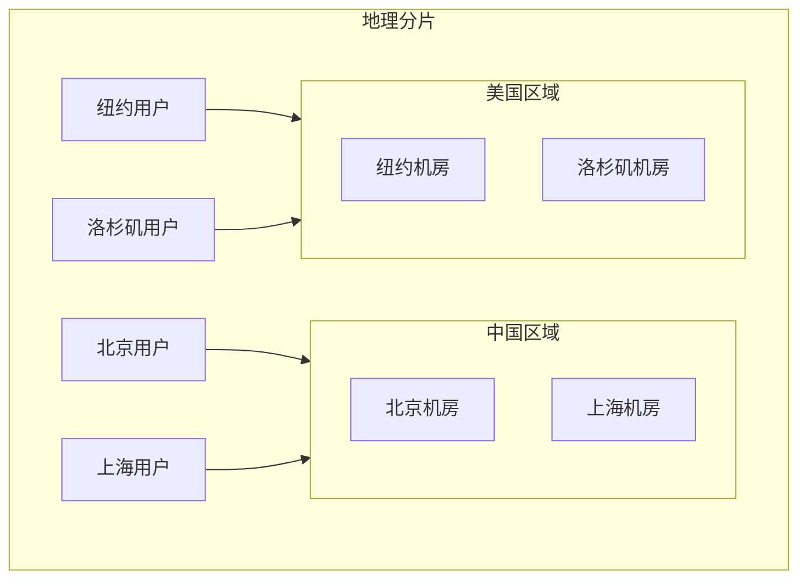
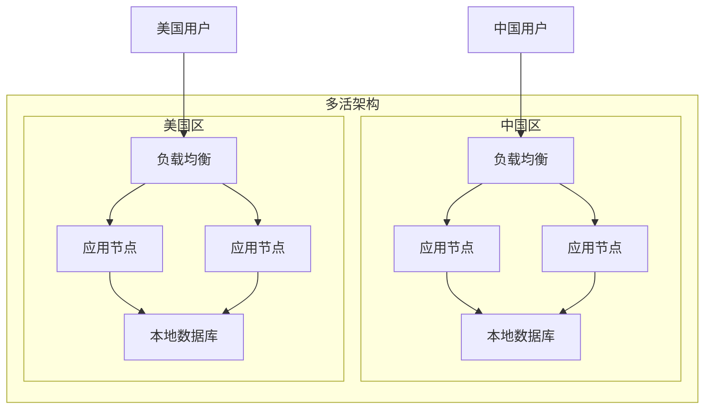

# 地理分片

数据按地理位置分区是解决访问延迟和数据合规问题的有效方案。用户访问「就近」的数据，延迟更低；数据存储在「该在」的地方，满足数据主权要求。

## 按地理位置分区

地理分片的核心是把数据按地理区域划分，每个区域的数据存储在对应区域的节点上。



## 延迟优化

地理分片的主要价值是降低访问延迟。

### 延迟数据

| 访问路径 | 延迟 |
| --- | --- |
| 同城（同机房） | 0.5-2 ms |
| 同区域（不同城市） | 5-20 ms |
| 跨区域（中美） | 150-300 ms |

### 就近访问策略

```java title="就近访问路由"
@Service
public class GeoAwareRouter {

    private final Map<String, List<String>> regionPriority;
    private final LoadBalancer loadBalancer;

    public GeoAwareRouter() {
        // 定义区域优先级：用户区域 -> 机房列表（按优先级排序）
        this.regionPriority = Map.of(
            "CN_NORTH", List.of("CN_BJ", "CN_SH", "US_EAST"), // 北京用户优先北京机房
            "CN_SOUTH", List.of("CN_SH", "CN_BJ", "US_EAST"), // 上海用户优先上海机房
            "US_EAST", List.of("US_EAST", "US_WEST", "CN_BJ"),
            "US_WEST", List.of("US_WEST", "US_EAST", "CN_SH")
        );
    }

    public String route(String userId, String userRegion) {
        List<String> priorities = regionPriority.getOrDefault(
            userRegion,
            List.of("US_EAST", "US_WEST")
        );

        // 按优先级尝试路由
        for (String region : priorities) {
            if (isRegionHealthy(region)) {
                return selectNode(region);
            }
        }

        // 所有优先级机房都不可用，降级到默认
        return selectNode("US_EAST");
    }

    private String selectNode(String region) {
        List<String> nodes = getNodesByRegion(region);
        return loadBalancer.select(nodes);
    }
}
```

## 合规要求（数据主权）

某些行业和地区对数据存储位置有强制要求。

### 典型合规场景

**GDPR（欧盟通用数据保护条例）**：欧盟用户的数据必须存储在欧盟境内。

**中国网络安全法**：关键信息基础设施的数据必须留在中国境内。

**金融行业监管**：客户数据不能出境，需在境内数据中心存储。

### 合规分片实现

```java title="合规分片实现"
@Service
public class ComplianceShardRouter {

    private final Map<String, String> dataResidencyRules;

    public ComplianceShardRouter() {
        // 定义数据主权规则
        this.dataResidencyRules = Map.of(
            "EU", "EU_WEST",
            "CN", "CN_EAST",
            "US", "US_CENTRAL"
        );
    }

    public String routeForUserData(User user) {
        String region = determineUserRegion(user);
        String shardRegion = dataResidencyRules.getOrDefault(region, "US_CENTRAL");

        // 确保数据存储在合规区域
        return ensureDataResidency(user.getId(), shardRegion);
    }

    private String ensureDataResidency(Long userId, String targetRegion) {
        // 检查用户数据当前存储位置
        String currentRegion = getCurrentDataRegion(userId);

        if (!currentRegion.equals(targetRegion)) {
            // 触发数据迁移（异步）
            migrateDataAsync(userId, currentRegion, targetRegion);
            // 返回当前区域（迁移期间）
            return currentRegion;
        }

        return targetRegion;
    }

    private String determineUserRegion(User user) {
        // 根据用户注册地址、IP、证件归属地确定地区
        return user.getCountryCode();
    }
}
```

## 实现方案

### 多活架构



### 跨区域同步

数据变更需要在区域间同步，保持最终一致。

```java title="跨区域数据同步"
@Service
public class CrossRegionSync {

    private final Map<String, DataSource> regionDataSources;
    private final MessageQueue mq;

    public void syncDataChange(DataChange change) {
        // 1. 先写入本地库
        writeToLocal(change);

        // 2. 发送跨区域同步消息
        SyncMessage message = new SyncMessage(
            change.getTableName(),
            change.getPrimaryKey(),
            change.getOperation(),
            change.getData(),
            System.currentTimeMillis()
        );

        // 发布到消息队列
        mq.publish("data-sync", message);
    }

    @KafkaListener(topics = "data-sync")
    public void handleSyncMessage(SyncMessage message) {
        // 接收其他区域的消息
        String currentRegion = getCurrentRegion();

        if (!message.getSourceRegion().equals(currentRegion)) {
            // 应用数据变更
            applyChange(message);
        }
    }
}
```

### 路由中间件

```java title="Geo-Router 中间件"
@Component
public class GeoRoutingInterceptor implements HandlerInterceptor {

    private final GeoShardRouter router;

    @Override
    public boolean preHandle(HttpServletRequest request, HttpServletResponse response, Object handler) {
        // 从请求中获取用户信息
        String userId = getUserId(request);
        String userRegion = determineRegion(request);

        // 路由到对应分片
        String targetRegion = router.route(userId, userRegion);

        // 将路由结果存入请求上下文
        request.setAttribute("targetRegion", targetRegion);

        return true;
    }

    private String determineRegion(HttpServletRequest request) {
        // 1. 优先使用请求头中的区域标识
        String region = request.getHeader("X-User-Region");
        if (region != null) return region;

        // 2. 根据 IP 地理位置确定
        String clientIp = getClientIp(request);
        return GeoIPLookup.lookup(clientIp);
    }
}
```

## 适用场景

### 适合地理分片的场景

**全球化业务**：业务覆盖多个国家或地区，用户分布在全球各地。

**合规要求**：数据必须存储在特定区域，满足数据主权要求。

**性能敏感**：访问延迟对用户体验影响大，需要就近访问。

**多数据中心部署**：已有多个地域的数据中心，希望本地处理本地数据。

### 不适合地理分片的场景

**数据需要强一致**：跨区域复制是异步的，无法保证强一致性。

**跨区域查询多**：大部分查询需要跨区域聚合，地理分片反而增加复杂度。

**小规模业务**：数据量小，网络延迟不是主要瓶颈。

## 挑战与解决方案

### 数据一致性

跨区域数据同步带来一致性问题。

**解决方案**：接受最终一致，设计补偿机制处理冲突。

```java title="冲突处理策略"
@Service
public class ConflictResolver {

    public void resolveConflict(DataChange local, DataChange remote) {
        // 基于时间戳的 LWW（Last Write Wins）
        if (remote.getTimestamp() > local.getTimestamp()) {
            applyChange(remote);
        } else {
            // 本地更近，发送本地变更到远程
            publishToRemote(local);
        }
    }

    public void resolveConflict(Order local, Order remote) {
        // 订单状态以最新状态为准
        // 金额以首次确认的为准
        if (remote.getStatus().getTimestamp() > local.getStatus().getTimestamp()) {
            local.setStatus(remote.getStatus());
        }
        if (remote.getConfirmedAmount() != null) {
            local.setConfirmedAmount(remote.getConfirmedAmount());
        }
    }
}
```

### 跨区域事务

跨区域的事务无法使用单机事务，需要分布式事务机制。

**不建议跨区域强事务**：尽量设计成最终一致。

**必须强一致的场景**：使用分布式事务（如 Seata），但性能损耗大。

### 运维复杂度

多区域部署带来运维挑战。

**解决方案**：标准化部署、监控、故障处理流程。使用统一的管理平台。

## 常见误区

**误区一：每个用户必须路由到「正确」的区域**

实际中允许少量数据存储在不严格合规的位置。先保证功能，再优化合规。

**误区二：跨区域延迟可以忽略**

跨太平洋延迟 150-300ms 是无法忽视的。应该在架构上减少跨区域交互。

**误区三：数据同步是实时的**

跨区域复制是异步的，延迟从毫秒到秒不等。设计时应假设同步延迟存在。

## 延伸思考

地理分片是解决全球业务和数据合规问题的有效手段。但它引入了数据一致性、运维复杂度等新挑战。

选择地理分片前，应该明确：

- 真的需要分地域吗？还是一个全球统一的数据库就够用
- 业务能否接受最终一致
- 团队是否有能力运维多区域部署

地理分片应该配合完善的数据同步机制、冲突处理策略和监控告警使用。
