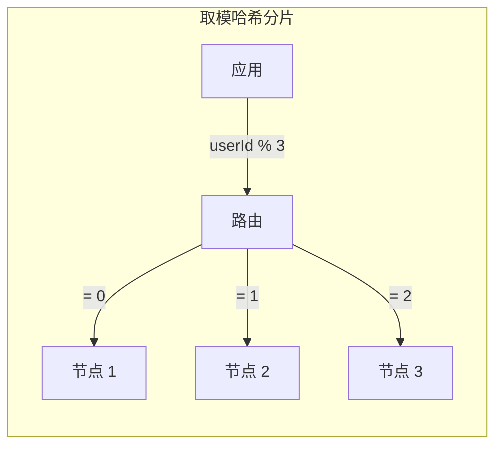
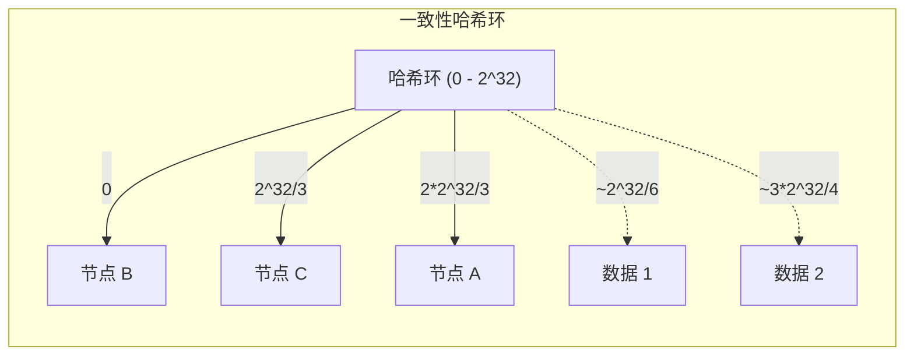

# 哈希分片

与范围分片不同，哈希分片通过哈希函数决定数据的归属。好的哈希函数能让数据均匀分布到各个分片，是最常用的分片策略之一。

## 取模哈希分片

最简单的哈希分片：对分片键取哈希后对分片数取模。

```java title="取模哈希分片"
@Service
public class ModHashShardRouter {

    private final int shardCount;

    public ModHashShardRouter(int shardCount) {
        this.shardCount = shardCount;
    }

    public int getShardIndex(Long userId) {
        return (int) (userId % shardCount);
    }

    public String getShardName(Long userId) {
        return "shard_" + getShardIndex(userId);
    }
}
```



**优点**：实现简单，数据分布均匀。

**缺点**：扩容困难。分片数从 N 变成 N+1 时，几乎所有数据都需要迁移。

## 一致性哈希分片

一致性哈希是解决取模哈希扩容问题的方案。

**核心思想**：不按数量取模，而是按哈希空间取模。节点和数据都映射到同一个哈希环上，数据找最近的节点。



**扩容优势**：当节点从 N 变成 N+1 时，只需要迁移 1/(N+1) 的数据，而不是全部。

**详细内容**请参考 [一致性哈希原理与实现](/system-design/sharding/consistent-hashing)。

## 虚拟节点

一致性哈希的另一个问题是负载不均。物理节点数量少时，数据分布不均匀。

虚拟节点（Virtual Nodes）通过在哈希环上创建多个虚拟节点来解决。

**详细内容**请参考 [虚拟节点与负载均衡](/system-design/sharding/virtual-nodes)。

## 优缺点对比

| 维度 | 取模哈希 | 一致性哈希 | 一致性哈希 + 虚拟节点 |
| --- | --- | --- | --- |
| 数据均匀度 | 均匀 | 不均匀 | 均匀 |
| 扩容迁移量 | 100% | 1/(N+1) | 1/(N+1) |
| 实现复杂度 | 低 | 中 | 中高 |
| 路由计算 | O(1) | O(log N) 或 O(1) | O(log N) 或 O(1) |
| 适用场景 | 分片数固定 | 分片数可能变化 | 分片数可能变化 |

## 哈希分片路由实现

```java title="一致性哈希分片路由"
@Service
public class ConsistentHashRouter {

    private final TreeMap<Long, String> hashRing = new TreeMap<>();
    private final Map<String, Integer> virtualNodeCount = new ConcurrentHashMap<>();

    public ConsistentHashRouter() {
        // 默认每个物理节点 150 个虚拟节点
        this(150);
    }

    public ConsistentHashRouter(int virtualNodesPerPhysical) {
        this.defaultVirtualNodes = virtualNodesPerPhysical;
    }

    public void addNode(String physicalNode) {
        addNode(physicalNode, defaultVirtualNodes);
    }

    public void addNode(String physicalNode, int virtualNodes) {
        for (int i = 0; i < virtualNodes; i++) {
            String virtualNode = physicalNode + "_VN_" + i;
            long hash = hash(virtualNode);
            hashRing.put(hash, physicalNode);
        }
        virtualNodeCount.put(physicalNode, virtualNodes);
    }

    public void removeNode(String physicalNode) {
        Integer count = virtualNodeCount.get(physicalNode);
        if (count == null) return;

        for (int i = 0; i < count; i++) {
            String virtualNode = physicalNode + "_VN_" + i;
            long hash = hash(virtualNode);
            hashRing.remove(hash);
        }
        virtualNodeCount.remove(physicalNode);
    }

    public String route(Long key) {
        if (hashRing.isEmpty()) {
            throw new IllegalStateException("No nodes in hash ring");
        }

        long hash = hash(key.toString());
        // 找到第一个 >= hash 的节点
        Map.Entry<Long, String> entry = hashRing.ceilingEntry(hash);

        // 如果找不到，绕回环起点
        if (entry == null) {
            entry = hashRing.firstEntry();
        }

        return entry.getValue();
    }

    private long hash(String key) {
        // MurmurHash3 实现
        return MurmurHash.hash64(key);
    }
}
```

## 哈希分片配置示例

```yaml title="ShardingSphere 哈希分片配置"
schemaName: app_db

dataSources:
  ds_0:
    dataSourceClassName: com.zaxxer.hikari.HikariDataSource
    driverClassName: com.mysql.cj.jdbc.Driver
    jdbcUrl: jdbc:mysql://localhost:3306/ds_0
    username: root
    password:

  ds_1:
    dataSourceClassName: com.zaxxer.hikari.HikariDataSource
    driverClassName: com.mysql.cj.jdbc.Driver
    jdbcUrl: jdbc:mysql://localhost:3306/ds_1
    username: root
    password:

rules:
- sharding:
    tables:
      users:
        actualDataNodes: ds_$->{0..1}
        tableStrategy:
          standard:
            shardingColumn: user_id
            shardingAlgorithmName: users_mod
        keyGenerateStrategy:
          column: user_id
          keyGeneratorName: snowflake

    shardingAlgorithms:
      users_mod:
        type: MOD
        props:
          sharding-count: 4

      users_consistent_hash:
        type: CONSISTENT_HASH
        props:
          sharding-count: 4
```

## 哈希函数选择

哈希分片的效果很大程度上取决于哈希函数。

**取模运算**：`hash(key) % N`。简单但对扩容不友好。

**MurmurHash**：非加密哈希，速度快、分布均匀。适合作为分片路由的哈希函数。

**Ketama**：专门为一致性哈希设计的哈希函数，分布均匀。

```java title="MurmurHash 实现"
public class MurmurHash {

    private static final long SEED = 0x1234ABCDL;

    public static long hash64(String key) {
        byte[] data = key.getBytes(StandardCharsets.UTF_8);
        return hash64(data, SEED);
    }

    public static long hash64(byte[] data, long seed) {
        int length = data.length;
        long m = 0xc6a4a7935bd1e995L;
        int r = 47;

        long h = seed ^ (length * m);

        int len = length >> 3;
        for (int i = 0; i < len; i++) {
            int i8 = i << 3;
            long k = ((long) data[i8] & 0xff)
                    | ((long) data[i8 + 1] & 0xff) << 8
                    | ((long) data[i8 + 2] & 0xff) << 16
                    | ((long) data[i8 + 3] & 0xff) << 24
                    | ((long) data[i8 + 4] & 0xff) << 32
                    | ((long) data[i8 + 5] & 0xff) << 40
                    | ((long) data[i8 + 6] & 0xff) << 48
                    | ((long) data[i8 + 7] & 0xff) << 56;

            k *= m;
            k ^= k >>> r;
            k *= m;

            h ^= k;
            h *= m;
        }

        if ((length & 7) != 0) {
            int i7 = len << 3;
            long k = 0;
            for (int j = length - 1; j >= i7; j--) {
                k <<= 8;
                k |= data[j];
            }
            k *= m;
            h ^= k;
        }

        h ^= h >>> r;
        h *= m;
        h ^= h >>> r;

        return h;
    }
}
```

## 常见误区

**误区一：分片键用字符串哈希**

直接用字符串的 Java `hashCode()` 可能分布不均。应该使用专门的哈希算法（如 MurmurHash、Ketama）。

**误区二：分片数选奇数**

一致性哈希中，分片数是否奇数不重要。分片数应该根据业务需求和数据量确定。

**误区三：哈希分片不需要容量规划**

即使数据均匀分布，每个分片仍需有容量上限。分片数应该能容纳预估数据量并留有余量。

**误区四：分片键哈希后不再冲突**

哈希冲突仍然存在（虽然概率低）。关键业务仍需考虑冲突处理。

## 延伸思考

哈希分片是数据量扩展的首选方案。它的核心价值是「让数据均匀分布」和「支持扩容」。

但哈希分片也有代价：范围查询困难、路由复杂度增加。选择哈希分片前，应该确认：

- 查询是否总是带分片键（否则跨分片查询代价高）
- 业务是否能接受一致性哈希的轻微不均匀（如果没有虚拟节点）
- 分片数是否可能变化（变化频率决定是否需要一致性哈希）

理解每个方案的权衡，才能做出正确的选择。
