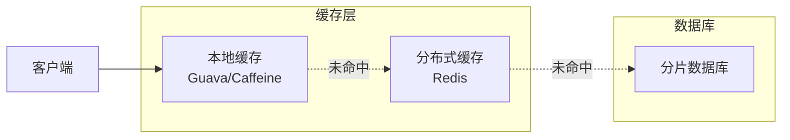

# 热点数据处理策略

分片让数据分布到多个节点，解决了数据量问题。但有一种情况会让分片的效果大打折扣：热点数据。所有请求都集中在某一个分片上，其他分片闲着没事干。

热点问题处理是分片系统必须面对的挑战。

## 热点识别：访问频率监控

处理热点的前提是识别热点。热点分为「写入热点」和「读取热点」，处理策略有所不同。

### 识别指标

```java title="热点监控指标"
@Service
public class HotspotMonitor {

    private final MeterRegistry meterRegistry;
    private final Map<String, Counter> accessCounters = new ConcurrentHashMap<>();

    public void recordAccess(String shardKey, String dataKey) {
        String counterKey = shardKey + ":" + dataKey;

        Counter counter = accessCounters.computeIfAbsent(counterKey, k ->
            Counter.builder("data.access.count")
                   .tag("shard", shardKey)
                   .tag("key", dataKey)
                   .register(meterRegistry)
        );

        counter.increment();
    }

    public HotspotReport getHotspots(Duration window) {
        // 计算窗口内的热点数据
        return accessCounters.entrySet().stream()
            .filter(e -> e.getValue().count() > HOTSPOT_THRESHOLD)
            .map(e -> {
                String[] parts = e.getKey().split(":");
                return new Hotspot(
                    parts[0], // shard
                    parts[1], // key
                    (long) e.getValue().count()
                );
            })
            .sorted(Comparator.comparingLong(Hotspot::getAccessCount).reversed())
            .collect(Collectors.toList());
    }

    private static final long HOTSPOT_THRESHOLD = 10000; // 每分钟访问超过 1 万次
}
```

### 监控告警

```yaml title="热点告警配置"
groups:
- name: hotspot-alerts
  rules:
  - alert: HighAccessHotspot
    expr: data_access_count > 100000
    for: 1m
    labels:
      severity: warning
    annotations:
      summary: "热点数据告警"
      description: "分片 {{ $labels.shard }} 的数据 {{ $labels.key }} 访问频率异常"

  - alert: WriteHotspot
    expr: data_write_count{shard=~".*"} / on(shard) data_write_capacity > 0.9
    for: 30s
    labels:
      severity: critical
    annotations:
      summary: "写入热点告警"
      description: "分片 {{ $labels.shard }} 写入负载超过 90%"
```

## 热点缓存：本地缓存 + 分布式缓存

热点读取的最佳解决方案是缓存。

### 二级缓存架构



```java title="二级缓存实现"
@Service
public class HotspotCacheService {

    private final Cache<Long, User> localCache;
    private final RedisTemplate<String, User> redisTemplate;
    private final UserRepository userRepository;

    public HotspotCacheService() {
        this.localCache = Caffeine.newBuilder()
            .maximumSize(10_000)          // 最大 1 万条
            .expireAfterWrite(Duration.ofSeconds(30)) // 30 秒过期
            .recordStats()
            .build();

        this.redisTemplate = new StringRedisTemplate();
        this.redisTemplate.setConnectionFactory(
            new LettuceConnectionFactory("localhost", 6379)
        );
    }

    public User getUser(Long userId) {
        // 1. 先查本地缓存
        User user = localCache.getIfPresent(userId);
        if (user != null) {
            return user;
        }

        // 2. 本地缓存未命中，查分布式缓存
        String cacheKey = "user:" + userId;
        user = redisTemplate.opsForValue().get(cacheKey);

        if (user != null) {
            // 写入本地缓存
            localCache.put(userId, user);
            return user;
        }

        // 3. 分布式缓存也未命中，查数据库
        user = userRepository.findById(userId);

        if (user != null) {
            // 写入分布式缓存
            redisTemplate.opsForValue().set(cacheKey, user, Duration.ofMinutes(5));

            // 写入本地缓存
            localCache.put(userId, user);
        }

        return user;
    }

    public void invalidateUser(Long userId) {
        // 删除时两级缓存都要删除
        localCache.invalidate(userId);
        redisTemplate.delete("user:" + userId);
    }
}
```

### 热点数据预热

系统启动或切换后，热点数据可能不在缓存中。需要预热。

```java title="热点预热"]
@Service
public class HotspotPreloader {

    private final HotspotCacheService cacheService;
    private final UserRepository userRepository;

    @PostConstruct
    public void preloadHotspots() {
        // 加载 Top N 热点用户
        List<Long> hotUserIds = hotspotService.getTopHotUserIds(1000);

        log.info("开始预热 {} 个热点用户", hotUserIds.size());

        for (Long userId : hotUserIds) {
            try {
                User user = userRepository.findById(userId);
                if (user != null) {
                    // 手动触发缓存加载
                    cacheService.getUser(userId);
                }
            } catch (Exception e) {
                log.warn("预热用户 {} 失败: {}", userId, e.getMessage());
            }
        }

        log.info("热点预热完成");
    }
}
```

## 热点隔离：独立分片

对于持续的热写入，可以把热点数据隔离到独立分片。

### 独立热点分片

```java title="热点隔离策略"
@Service
public class HotspotIsolationRouter {

    private final Set<Long> hotspotUserIds;
    private final ConsistentHashRouter normalRouter;
    private final String hotspotShard = "shard_hotspot";

    public HotspotIsolationRouter() {
        // 热点用户 ID（动态维护）
        this.hotspotUserIds = ConcurrentHashMap.newKeySet();

        // 普通数据使用一致性哈希
        this.normalRouter = new ConsistentHashRouter();
        normalRouter.addNode("shard_0");
        normalRouter.addNode("shard_1");
        normalRouter.addNode("shard_2");
    }

    public void markAsHotspot(Long userId) {
        hotspotUserIds.add(userId);
    }

    public String route(Long userId) {
        if (hotspotUserIds.contains(userId)) {
            // 热点用户路由到专用分片
            return hotspotShard;
        }
        return normalRouter.route(userId);
    }
}
```

### 动态热点迁移

```java title="动态热点迁移"]
@Service
public class HotspotMigrationService {

    private final HotspotIsolationRouter router;
    private final DataMigrationService migrationService;

    @Scheduled(fixedRate = 60000) // 每分钟检查一次
    public void checkAndMigrateHotspots() {
        List<Hotspot> hotspots = hotspotMonitor.getHotspots(Duration.ofMinutes(5));

        for (Hotspot hotspot : hotspots) {
            if (hotspot.getAccessCount() > HOTSPOT_THRESHOLD) {
                // 标记为热点
                router.markAsHotspot(hotspot.getKey());

                // 异步迁移数据
                migrationService.migrateAsync(
                    hotspot.getShard(),
                    router.getHotspotShard(),
                    hotspot.getKey()
                );
            }
        }
    }
}
```

## 读写分离

热点读取还可以通过读写分离来缓解。

### 读写分离配合缓存

```java title="热点读写分离策略"
@Service
public class HotspotReadWriteSplit {

    private final HotspotCacheService cacheService;
    private final JdbcTemplate masterTemplate;
    private final List<JdbcTemplate> slaveTemplates;

    public User getUser(Long userId) {
        // 热点用户优先读缓存
        if (isHotspot(userId)) {
            User cached = cacheService.getUser(userId);
            if (cached != null) {
                return cached;
            }
        }

        // 非热点用户或缓存未命中，读从库
        JdbcTemplate slave = selectSlave();
        return slave.queryForObject(
            "SELECT * FROM users WHERE id = ?",
            userMapper,
            userId
        );
    }

    public void updateUser(User user) {
        // 写入主库
        masterTemplate.update(
            "UPDATE users SET name = ? WHERE id = ?",
            user.getName(), user.getId()
        );

        // 失效缓存
        cacheService.invalidateUser(user.getId());
    }

    private boolean isHotspot(Long userId) {
        return hotspotMonitor.getAccessCount(userId) > HOTSPOT_THRESHOLD;
    }
}
```

## 分片键选择优化

热点问题的根源往往是分片键选择不当。

### 避免热点的分片键原则

**选择高基数字段**：避免低基数分片键（如性别、状态码）。

**避免单调递增字段**：如自增 ID、时间戳（会导致新数据集中在最新分片）。

**考虑业务访问模式**：热点数据通常是高频访问的数据，选择能让这些数据分散的分片键。

### 热点分片键修改

如果分片键导致热点，需要修改。修改成本很高，需要迁移数据。

```java title="分片键修改流程"]
public class ShardKeyMigration {

    public void migrateShardKey(Long userId, String oldShardKey, String newShardKey) {
        // 1. 在新分片键下创建记录
        insertWithNewKey(userId, newShardKey);

        // 2. 删除旧分片键下的记录
        deleteWithOldKey(userId, oldShardKey);

        // 3. 更新路由表
        updateRouter(userId, newShardKey);

        // 4. 验证数据一致性
        verifyConsistency(userId);
    }
}
```

## 常见误区

**误区一：缓存能解决所有热点问题**

缓存只解决读热点。对于写热点（如秒杀库存扣减），缓存反而可能带来一致性问题。

**误区二：热点是静态的**

热点是动态变化的。今天的热点明天可能变冷，今天的普通数据明天可能变热。需要动态识别和处理。

**误区三：隔离热点分片就够了**

隔离热点分片只是把热点集中到少数分片，如果热点足够热，单个分片仍然扛不住。需要配合其他策略（缓存、限流）。

## 延伸思考

热点是分片系统的顽疾。没有完美的解决方案，只有合适的权衡。

处理热点的正确思路是：

1. **识别**：建立热点监控体系，及时发现热点
2. **分类**：区分读热点和写热点，热点冷热程度
3. **分层应对**：读热点用缓存，写热点用隔离或限流
4. **预防为主**：分片键设计时考虑热点因素

理解热点的本质，才能设计出合理的应对策略。
