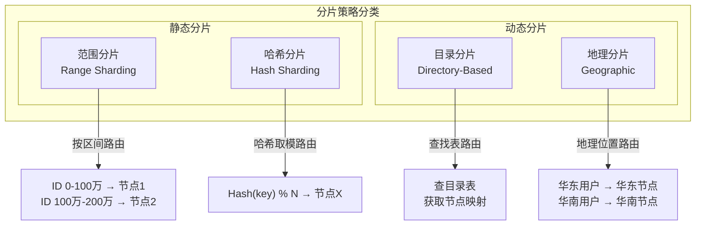
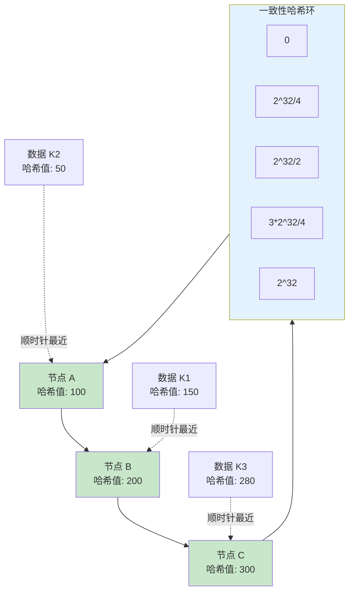
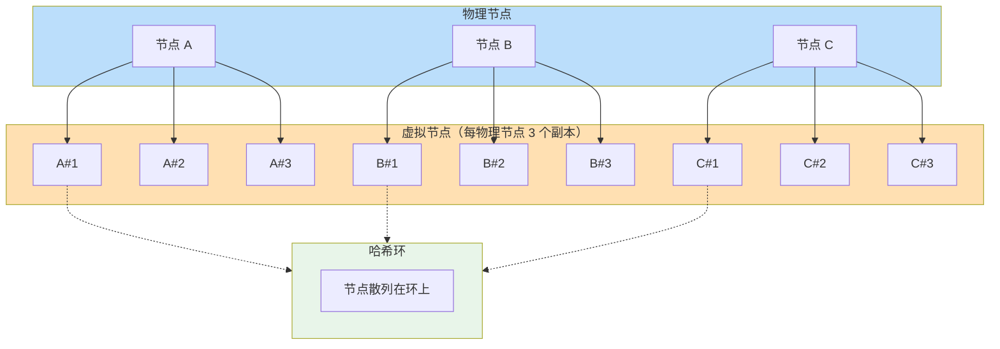
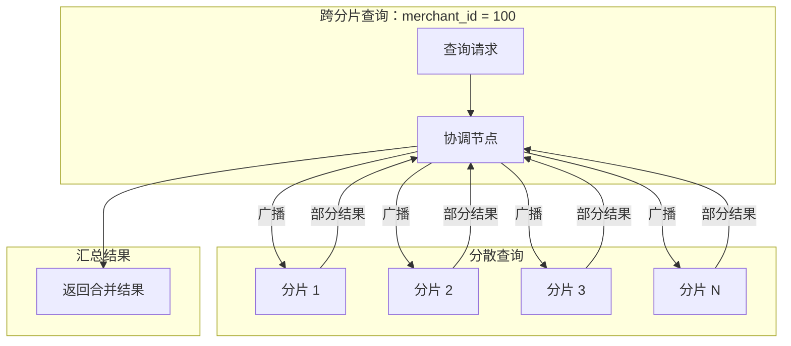
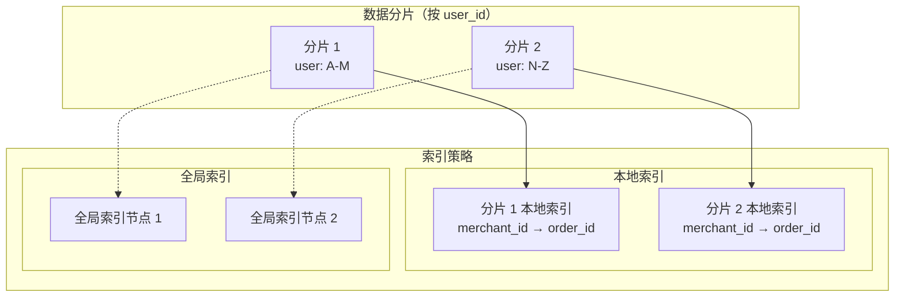

# 数据分片

某社交平台按用户 ID 做哈希分片，以为数据分布会「自然均匀」。运行半年后发现：粉丝量 Top 100 的用户，数据量占全平台的 30%；每次明星塌房，某个分片直接被打爆。一个「看起来合理」的分片键设计，最终变成了整个系统的性能瓶颈。

另一个案例：某电商系统按订单时间做范围分片，初期数据分布清晰——历史订单放冷库，近期订单放热库。但业务快速增长后发现，2024 年的订单量是 2022 年的 5 倍，某个分片的数据量是其他分片的 10 倍。更要命的是，当你想查询某个用户的全部历史订单时，发现数据散落在 5 个分片上，一次查询变成了 5 次 DB 调用 + 结果聚合。

这两个案例折射出数据分片领域的核心矛盾：**分片策略决定了数据分布，而数据分布决定了系统未来的扩展能力和查询效率**。选错了分片键，系统可能在 3 年后被迫重构；选对了分片键，数据量从 1 亿增长到 100 亿，系统只需要增加节点。

本模块系统讲解数据分片的核心知识，从分片基础概念出发，深入分析范围分片、哈希分片、一致性哈希等策略的原理与取舍，并重点阐述热点数据处理、分片键设计、动态重平衡等生产实践要点。

## 分片基础概念

### 分片 vs 分区：同一个概念吗？

很多人容易混淆「分片（Sharding）」和「分区（Partitioning）」，但两者有本质区别：

| 维度 | 分区（Partitioning） | 分片（Sharding） |
| --- | --- | --- |
| 作用域 | 单个数据库实例内 | 跨多个数据库实例 |
| 数据分布 | 逻辑划分 | 物理分布 |
| 存储位置 | 本地磁盘 | 多个节点 |
| 扩展方式 | 纵向扩展（单机升级） | 横向扩展（增加节点） |
| 典型实现 | MySQL Partition | MySQL Cluster、TiDB、Cassandra |
| 跨分片操作 | 不存在（同一实例） | 需要应用层处理 |

简单来说：**分区是单机的游戏，分片是分布式的游戏**。分区解决的是单机存储容量问题，分片解决的是单机性能瓶颈问题。两者可以叠加使用——先分区再分片，每节点内部再做分区。

### 为什么要分片

单机数据库的瓶颈来自三个方面：

**存储容量**：MySQL 单表超过 5000 万行后，B+ 树索引的深度开始增加，查询性能明显下降。即使 SSD，单盘容量也有物理上限。传统做法是升级磁盘，但这只是延缓问题，不是解决问题。

**并发能力**：单节点数据库能处理的并发连接数有限，通常在 `2000~5000` 左右。当 QPS 超过这个阈值，连接等待会成为主要瓶颈。即使你把 CPU 打满，连接池耗尽也会让系统假死。

**网络带宽**：千兆网卡的极限吞吐量是 `125MB/s`。当单次查询返回的数据量很大（如报表类查询），网络带宽会成为瓶颈，而不是 CPU 或磁盘。

**分片的本质**：将数据分散到多个节点，每个节点只负责一部分数据的读写，从而突破单机瓶颈。但分片也带来了新问题：跨分片查询、分布式事务、全局索引——这些是分片代价的来源。

## 分片策略分类

根据路由方式的不同，分片策略可分为四大类型：

### 范围分片（Range Sharding）

按分片键的值域区间划分数据。最典型的例子是按时间范围：`2020-01~2020-06` 在节点 1，`2020-07~2020-12` 在节点 2。

| 特点 | 说明 |
| --- | --- |
| 优点 | 查询友好，按分片键范围查询只需访问相关节点 |
| 优点 | 易于理解，区间划分清晰 |
| 缺点 | 容易产生热点——最新数据的写入集中在某个节点 |
| 缺点 | 数据分布不均——不同区间数据量可能差异巨大 |

### 哈希分片（Hash Sharding）

对分片键做哈希运算，取模后路由到对应节点。例如 `shard_id = hash(user_id) % node_count`。

| 特点 | 说明 |
| --- | --- |
| 优点 | 数据分布均匀，哈希的雪崩效应保证随机性 |
| 优点 | 写入分散，避免热点节点 |
| 缺点 | 范围查询效率低——需要扫描所有节点 |
| 缺点 | 节点变更时迁移量大 |

### 目录分片（Directory-Based Sharding）

维护一个独立的目录表（Lookup Table），记录每条数据对应哪个分片。查询时先查目录，再根据目录结果路由。

| 特点 | 说明 |
| --- | --- |
| 优点 | 分片映射关系灵活，可动态调整 |
| 优点 | 可以基于业务规则做复杂路由 |
| 缺点 | 目录表本身成为单点，需要高可用设计 |
| 缺点 | 多一次目录查询，增加延迟 |

### 地理分片（Geographic Sharding）

按用户地理位置划分数据，将数据存储在离用户最近的节点。常用于全球化部署场景。

| 特点 | 说明 |
| --- | --- |
| 优点 | 读取延迟低，用户就近访问 |
| 优点 | 符合数据主权法规（如 GDPR） |
| 缺点 | 跨地域用户访问延迟高 |
| 缺点 | 数据迁移复杂（用户搬家场景） |

## 一致性哈希

### 为什么普通哈希不够用

普通哈希（取模哈希）的致命问题是**节点变更时的数据迁移量**。假设原来有 3 个节点，数据按 `hash(key) % 3` 分布。如果新增第 4 个节点，路由公式变为 `hash(key) % 4`，理论上 **75%** 的数据需要迁移。

| 场景 | 传统哈希迁移率 | 一致性哈希迁移率 |
| --- | --- | --- |
| 从 N 节点扩到 N+1 节点 | `N/(N+1)` ≈ 67% | `1/(N+1)` ≈ 25% |
| 从 N 节点缩容到 N-1 节点 | `1/N` ≈ 33% | `1/N` ≈ 33% |

当节点数量变化时，一致性哈希只影响相邻节点的数据，不影响环上其他节点的数据。

### 环结构原理

一致性哈希将哈希空间组织成一个环，范围从 `0` 到 `2^32 - 1`（或 `2^128 - 1` 取决于哈希算法）。每个节点和数据都映射到环上的一个位置，数据的路由规则是：**顺时针找到的第一个节点，就是数据所属的分片**。

物理节点数量少时，环上的数据分布可能极不均匀。例如三个节点恰好哈希到相邻位置，某个节点可能承担 50% 的数据。

### 虚拟节点

**虚拟节点（Virtual Nodes）** 通过为每个物理节点创建多个虚拟副本，解决数据分布不均的问题。

虚拟节点的哈希值通常通过对「物理节点 ID + 副本序号」组合哈希得到。例如节点 A 的第 1 个虚拟节点哈希值 = `hash("A:1")`。

| 指标 | 无虚拟节点 | 有虚拟节点（150 个/物理节点） |
| --- | --- | --- |
| 数据分布均匀度 | 依赖哈希函数质量 | 实际负载偏差 `<10%` |
| 节点下线影响 | 单节点全部数据重新分布 | 影响分散到 150 个虚拟节点 |
| 内存开销 | 无 | 每节点增加 150 个路由表项 |

## 分片的核心挑战

### 热点数据问题

热点数据分为两种类型，处理策略完全不同：

**单分片热点**：某个分片上的数据分布不均，导致该分片负载远高于其他分片。典型场景是按用户 ID 哈希分片后，大 V 用户的数据集中在一个分片上。

**全局热点**：热点数据本身被分散到多个分片，但由于访问频率极高，所有分片都被打满。典型场景是秒杀系统中，所有商品的库存数据都是热点。

| 类型 | 特征 | 解决方案 |
| --- | --- | --- |
| 单分片热点 | 单分片 QPS 是其他分片的 10 倍以上 | 拆分为多个分片、读写分离 |
| 全局热点 | 所有分片 QPS 同时飙升 | 本地缓存 + 分布式锁、热点预热 |

### 跨分片查询

分片后，按分片键的查询可以直接定位到单个分片。但按非分片键查询时，需要扫描所有分片，这就是**跨分片查询（Scatter-Gather）** 问题。

典型场景：订单表按 `user_id` 分片，但需要按 `merchant_id` 查询某商家所有订单。

跨分片查询的代价是：查询延迟 = 最慢分片的响应时间 × 网络开销系数。如果有 10 个分片，单个分片响应 10ms，协调节点汇总需要额外 `2~5ms`，总延迟可能达到 `30~50ms`。

### 分片键设计

分片键的选择是分片设计的核心，直接决定系统的查询模式和扩展能力。

**选择分片键的黄金原则**：选择查询频率最高、业务上最稳定的字段作为分片键。

| 业务场景 | 推荐分片键 | 原因 |
| --- | --- | --- |
| 用户中心 | `user_id` | 用户维度的查询占 80% 以上 |
| 订单系统 | `user_id` 或 `created_at` | 按用户查订单 vs 按时间范围查订单 |
| 日志系统 | `timestamp` | 大多数查询是时间范围扫描 |
| 商品系统 | `category_id` | 按类目浏览是主要场景 |

**分片键选错的代价**：如果选了业务会频繁更新的字段做分片键，每次更新都需要迁移数据；如果选了区分度低的字段（如 `region`），会导致数据分布不均。

### 动态分片与重平衡

当数据量增长到当前分片无法承载时，需要增加分片数量或调整分片边界，这就是**重平衡（Rebalancing）**。

| 重平衡策略 | 原理 | 优点 | 缺点 |
| --- | --- | --- | --- |
| 停服迁移 | 停止写入，全量迁移数据 | 数据一致性好 | 服务不可用 |
| 双写策略 | 新旧分片同时写入，校验后切换 | 服务不中断 | 实现复杂、延迟双写逻辑 |
| 一致性哈希 | 只迁移相邻节点数据 | 迁移量小 | 范围查询需改写 |
| 虚拟节点预分配 | 预留虚拟节点，新增节点接管部分 | 迁移粒度细 | 初期复杂度高 |

## 分片与二级索引

### 全局索引 vs 本地索引

分片后，二级索引的处理是个难题。考虑订单表按 `user_id` 分片，但需要按 `merchant_id` 查询：

**本地索引**：每个分片独立维护索引。优点是索引写入不影响其他分片，缺点是跨分片查询时需要并行扫描所有分片的索引。

**全局索引**：独立的索引分片，按 `merchant_id` 路由到对应索引分片。优点是查询效率高（单次路由），缺点是索引分片和数据分片需要独立管理。

| 索引类型 | 查询延迟 | 写入吞吐 | 实现复杂度 |
| --- | --- | --- | --- |
| 本地索引 | 高（需 Scatter-Gather） | 高 | 低 |
| 全局索引 | 低（单次路由） | 低（需跨节点写索引） | 高 |

### 倒排索引的应用

某些场景下，可以用**倒排索引**替代传统的 B+ 树索引。典型应用是多属性查询：如订单系统需要同时按「商家 + 时间 + 状态」筛选。

Elasticsearch 的分片设计就是典型案例：每个分片内部维护完整的倒排索引，查询时并行搜索所有分片再汇总结果。这种设计牺牲了索引写入性能，换取了查询灵活性。

## 分片选型矩阵

| 场景 | 推荐策略 | 不推荐策略 | 理由 |
| --- | --- | --- | --- |
| 用户中心、高并发写入 | 哈希分片 | 范围分片 | 写入分散，避免热点 |
| 日志系统、时间序列 | 范围分片 | 哈希分片 | 按时间范围查询友好 |
| 全球化应用、多地域部署 | 地理分片 | 哈希分片 | 就近访问、符合法规 |
| 业务规则复杂的路由 | 目录分片 | 其他 | 灵活可控 |
| 数据量预估不准、快速迭代 | 一致性哈希 + 虚拟节点 | 固定分片数 | 扩缩容成本低 |

### 分片数与数据量估算

分片数量不是越多越好，需要综合考虑以下因素：

| 因素 | 影响 | 建议 |
| --- | --- | --- |
| 单分片容量 | 分片数 = 预估数据量 / 单分片容量 | 预留 2~3 倍余量 |
| 单分片 QPS | 分片数 = 峰值 QPS / 单分片 QPS | 考虑热点数据影响 |
| 跨分片查询频率 | 跨分片查询频繁时，减少分片数 | 尽量让查询落在单分片 |
| 运维复杂度 | 分片数越多，运维成本越高 | 小团队建议 `2~4` 个分片起步 |

## 本章文章导读

数据分片是一个涉及面极广的领域，从基础概念到生产实践都有很多细节需要掌握。以下是本模块的文章结构：

|| 文章 | 核心内容 | 建议阅读人群 |
| --- | --- | --- | --- |
| [分片策略总览](./overview) | 四大分片策略对比、选型依据 | 入门必读 |
| [范围分片](./range) | Range Sharding 原理、时序数据场景 | 时序数据开发者 |
| [哈希分片](./hash) | Hash Sharding 原理、取模与一致性哈希 | 后端开发 |
| [一致性哈希原理与实现](./consistent-hashing) | 环结构、虚拟节点、代码实现 | 分布式系统开发者 |
| [虚拟节点与负载均衡](./virtual-nodes) | 虚拟节点数量选择、负载计算 | 架构师 |
| [目录分片](./directory) | Lookup Table 设计、动态路由 | 中间件开发者 |
| [地理分片](./geo) | 多地域部署、数据主权合规 | 全球化架构设计 |
| [热点数据处理策略](./hotspot) | 单分片热点、全局热点应对方案 | 性能优化工程师 |
| [分片键设计最佳实践](./shard-key) | 分片键选择原则、常见错误 | 数据库工程师 |
| [动态分片与重平衡](./rebalancing) | 迁移策略、双写方案 | 运维/DBA |
| [分片带来的查询挑战](./query-challenges) | Scatter-Gather、结果聚合 | 后端开发 |
| [分片与二级索引](./secondary-index) | 全局索引、倒排索引、ES 分片设计 | 搜索/大数据开发者 |
| [分片 vs 分区](./sharding-vs-partitioning) | 概念辨析、两者关系与组合使用 | 入门读者 |

如果你已经有了明确的学习目标，可以直接跳转到对应文章。如果你是第一次接触数据分片，建议从[分片策略总览](./overview)开始，建立基本认知后再深入各个细分主题。

## 常见问题

**Q：分片数量一开始就定死吗？**

不一定。建议初期少分几个分片（如 2~4 个），等业务增长到接近单分片容量上限时再扩容。使用一致性哈希的话，扩容只需要迁移相邻节点的数据。

**Q：分片键选了还能改吗？**

能改，但代价很大。需要全量迁移数据，期间服务可能不可用。所以分片键的选择一定要慎重，尽量选择「业务上最稳定、查询最频繁」的字段。

**Q：分片后还需要分区吗？**

可以叠加使用。先按业务维度分片，每个分片内部再按时间分区（如按月份分区）。这样既能享受分片的横向扩展能力，又能利用分区的分区裁剪优化查询。

**Q：分片和主从复制是什么关系？**

分片解决的是数据容量和写入压力问题，主从复制解决的是读取可用性问题。两者是正交的，可以组合使用——每个分片都配置主从复制，读写分离。
