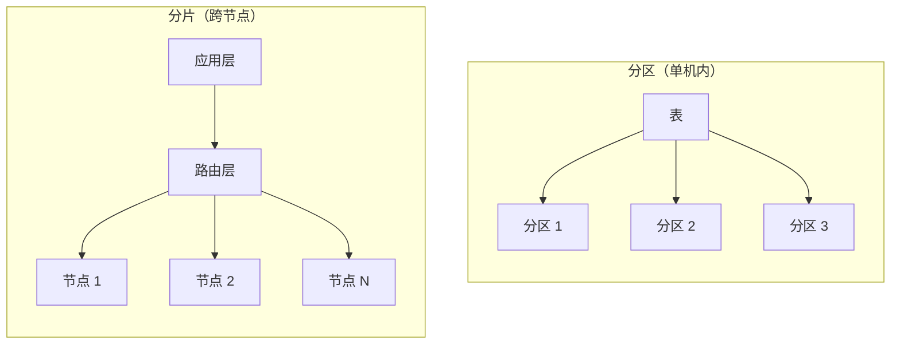
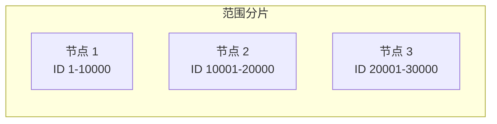

# 分片策略总览

当数据量增长到单机无法承载时，分片成为必然选择。但分片不是简单地把数据「切开」，它是一套完整的系统工程——从选择分片策略，到处理跨分片查询，再到数据迁移和重平衡，每个环节都有独特的挑战。

## 为什么需要分片

单机数据库的容量有上限。以 MySQL 为例：

- 单表超过 5000 万行后，B+ 树层级增加，查询性能下降
- 单库磁盘空间有限，数据增长到 TB 级别后备份和恢复变慢
- 单机 CPU 和内存无法应对高并发写入

当单机达到上限时，有两条路：

1. **垂直扩展**：升级单机硬件（更大磁盘、更多内存、更高配置）
2. **水平扩展**：分片，把数据分布到多个节点

垂直扩展有物理上限，且成本非线性增长。分片是持续扩展的关键手段。

## 分片 vs 分区

很多人分不清「分片」和「分区」。

**分区（Partitioning）**：在单节点内部，把一张表分成多个分区，每个分区是独立的物理存储单元。分区对应用透明，SQL 语法几乎不变。

**分片（Sharding）**：跨节点分布数据，每个分片是独立的数据库实例。分片对应用不透明，需要在应用层处理路由逻辑。



两者的关键区别：

| 维度 | 分区 | 分片 |
| --- | --- | --- |
| 范围 | 单节点内 | 跨节点 |
| 复杂度 | 低（数据库原生支持） | 高（需要路由层） |
| 扩展方式 | 单机垂直扩展 | 水平扩展 |
| 跨分区/片查询 | 支持（有限） | 需要应用层处理 |
| 事务 | 单机事务 | 分布式事务 |

## 分片策略分类

分片策略决定了数据如何分布到各个分片。根据路由维度不同，主要分为三类：

### 范围分片

按数据范围划分，如按 ID 区间、按时间范围。



**优点**：范围查询高效，如 `WHERE id BETWEEN 5000 AND 8000` 直接定位到特定分片。

**缺点**：容易产生热点，数据分布不均匀。

### 哈希分片

对分片键哈希后取模，决定数据归属。

**取模哈希**：简单直接，但扩容困难。

**一致性哈希**：扩容时只迁移部分数据，是主流方案。

```mermaid
flowchart LR
    subgraph Hash["哈希分片"]
        App["应用"]
        App -->|hash(user_id) % 3| Router["路由"]
        Router --> DB1["节点 1"]
        Router --> DB2["节点 2"]
        Router --> DB3["节点 3"]
    end
```

**优点**：数据分布均匀。

**缺点**：范围查询困难。

### 目录分片

维护一张分片映射表，根据业务属性路由。

**优点**：灵活，支持复杂路由规则。

**缺点**：多一次表查询，映射表是单点。

## 分片的代价

分片不是免费的午餐，它带来了一系列复杂性。

### 跨分片查询

单次查询可能需要访问多个分片，然后归并结果。

```java title="跨分片查询"
@Service
public class CrossShardQueryService {

    public List<Order> getOrdersByDateRange(Date start, Date end) {
        // 查询所有分片
        List<List<Order>> results = shardTemplate.executeAll(
            shard -> shard.getOrders(start, end)
        );

        // 归并排序
        return results.stream()
                .flatMap(List::stream)
                .sorted(Comparator.comparing(Order::getCreateTime))
                .collect(Collectors.toList());
    }
}
```

### 分布式事务

跨分片的写入需要分布式事务保证一致性。常见方案有 2PC、TCC、Saga。

### 分片键选择

分片键的选择直接影响数据分布和查询效率。选错分片键可能导致热点分片。

### 数据迁移

分片数量调整时，需要迁移历史数据。迁移期间服务需要继续运行。

### 运维复杂度

- 分片配置管理
- 跨分片监控和告警
- 分片间数据一致性校验
- 备份和恢复策略

## 分片策略选择指南

| 场景 | 推荐策略 | 原因 |
| --- | --- | --- |
| 数据量大、按用户隔离 | 哈希分片 | 均匀分布、用户数据独立 |
| 时间序列数据 | 范围分片 | 支持按时间范围高效查询 |
| 多租户应用 | 租户 ID 分片 | 租户数据天然隔离 |
| 查询条件复杂 | 目录分片 | 支持灵活路由规则 |

## 常见误区

**误区一：过早分片**

分片是最后手段。如果加索引、加缓存、垂直分表就能解决问题，不应该过早引入分片复杂性。

**误区二：分片键选择随意**

分片键选错后修改成本极高。应该在充分分析业务访问模式后选择。

**误区三：分片等于分布式数据库**

分片只是数据分布策略，跨分片的 JOIN、事务、聚合仍然需要额外处理。分片后仍然需要应用层配合。

**误区四：忽视运维成本**

分片后需要配套的监控、迁移、备份工具。在决定分片前，应该评估运维团队是否有能力应对。

## 延伸思考

分片是系统演进到一定规模的必然选择，但也是一把双刃剑。它解决了数据量问题，但引入了复杂性。

在做分片决策前，应该问自己几个问题：

- 数据量真的大到单机无法承载了吗？
- 业务查询模式是否适合分片？
- 团队是否有分片的运维经验？
- 是否评估过分片的代价和收益？

好的分片设计，应该是「一次规划、分步实施」。初期预留足够分片数，使用逻辑分片 + 物理分片的二层架构，延迟扩容的痛苦。
