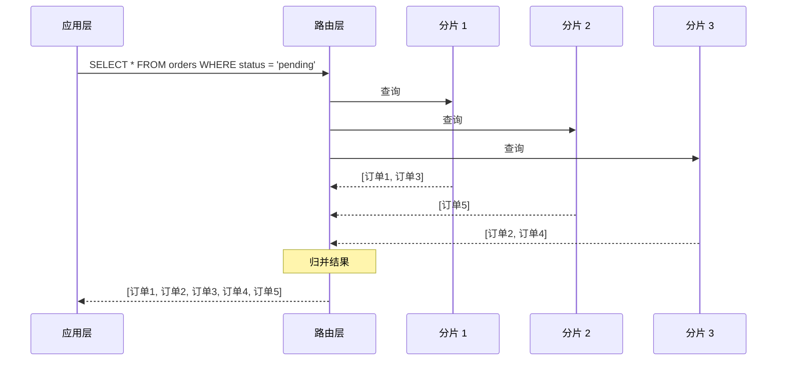

# 分片带来的查询挑战

分片解决了数据量问题，但引入了查询复杂度。在单节点时代，一个 SQL 能搞定的事，分片后可能需要访问多个节点、多次查询、归并结果。理解这些挑战，才能设计出合理的分片方案。

## 跨分片查询：scatter-gather

跨分片查询（Scatter-Gather）是最常见的挑战。一个查询需要访问多个分片，然后合并结果。

### 原理



### 实现

```java title="跨分片查询实现"]
@Service
public class CrossShardQueryService {

    private final List<ShardTemplate> shardTemplates;
    private final ShardRouter router;

    public List<Order> findOrdersByStatus(String status) {
        // 并行查询所有分片
        List<CompletableFuture<List<Order>>> futures = shardTemplates.stream()
            .map(template -> CompletableFuture.supplyAsync(() ->
                template.query("SELECT * FROM orders WHERE status = ?", status)
            ))
            .collect(Collectors.toList());

        // 等待所有查询完成
        List<Order> allOrders = futures.stream()
            .map(CompletableFuture::join)
            .flatMap(List::stream)
            .collect(Collectors.toList());

        return allOrders;
    }

    public <T> CompletableFuture<List<T>> scatterGather(
            String sql, 
            Object... params) {

        // 并行发送到所有分片
        List<CompletableFuture<List<T>>> futures = shardTemplates.stream()
            .map(template -> CompletableFuture.supplyAsync(() ->
                template.query(sql, params)
            ))
            .collect(Collectors.toList());

        // 归并结果
        return CompletableFuture.allOf(futures.toArray(new CompletableFuture[0]))
            .thenApply(v -> futures.stream()
                .map(CompletableFuture::join)
                .flatMap(List::stream)
                .collect(Collectors.toList()));
    }
}
```

## 全局排序：分片内排序 + 归并排序

跨分片查询结果的排序，不能在应用层简单 `ORDER BY`，因为每个分片返回的数据是局部的。

### 问题分析

```sql
-- 查询所有分片，期望按创建时间排序
SELECT * FROM orders ORDER BY create_time DESC LIMIT 10
```

如果每个分片返回部分数据，应用层直接排序可能得到错误结果。例如：分片 1 返回最新时间 2024-01-01 的 10 条，分片 2 返回最新时间 2023-12-01 的 10 条。直接取前 10 条会漏掉分片 2 中时间介于 2023-12-01 和 2024-01-01 之间的数据。

### 解决方案：优先级队列归并

```java title="归并排序实现"]
@Service
public class GlobalSortService {

    public List<Order> globalOrderBy(int limit, String orderField, boolean desc) {
        // 1. 每个分片查询排序后的前 N 条（N > limit，通常是 limit 的 2-3 倍）
        int fetchSize = limit * 3;

        List<ShardResult<Order>> shardResults = new ArrayList<>();

        for (ShardTemplate template : shardTemplates) {
            String sql = buildOrderBySql(orderField, desc, fetchSize);
            List<Order> orders = template.query(sql);
            shardResults.add(new ShardResult<>(orders, orderField, desc));
        }

        // 2. 使用优先级队列归并
        PriorityQueue<Order> pq = new PriorityQueue<>(
            (a, b) -> compareByField(a, b, orderField, desc)
        );

        // 初始化：每个分片取一条
        for (ShardResult<Order> sr : shardResults) {
            if (sr.hasNext()) {
                pq.offer(sr.next());
            }
        }

        // 3. 归并排序
        List<Order> result = new ArrayList<>();
        while (!pq.isEmpty() && result.size() < limit) {
            Order order = pq.poll();
            result.add(order);

            // 补充分片队列
            for (ShardResult<Order> sr : shardResults) {
                if (sr.getCurrent() == order && sr.hasNext()) {
                    pq.offer(sr.next());
                }
            }
        }

        return result;
    }

    private int compareByField(Order a, Order b, String field, boolean desc) {
        Comparable valueA = getFieldValue(a, field);
        Comparable valueB = getFieldValue(b, field);

        int cmp = valueA.compareTo(valueB);
        return desc ? -cmp : cmp;
    }

    private Comparable getFieldValue(Order order, String field) {
        // 通过反射获取字段值
        return (Comparable) ReflectUtil.getFieldValue(order, field);
    }
}
```

## 分页查询：多次查询 + 归并

分页查询比排序更复杂，因为需要跳过前面的数据。

### 问题分析

```sql
-- 分页查询：期望返回第 11-20 条
SELECT * FROM orders ORDER BY create_time LIMIT 10 OFFSET 10
```

跨分片查询时，每个分片不知道全局的偏移量，需要特殊的处理方式。

### 解决方案

**方案一：禁用跳页**

只提供上一页、下一页功能，避免大偏移量。

```java title="游标分页"]
@Service
public class CursorPaginationService {

    // 基于游标的分页
    public Page<Order> findOrders(Long lastId, int pageSize) {
        // 每个分片查询比 pageSize 多的数据
        List<Order> allOrders = new ArrayList<>();

        for (ShardTemplate template : shardTemplates) {
            // 每个分片查询多于 pageSize 的数据，用于判断是否有下一页
            String sql = "SELECT * FROM orders WHERE id > ? ORDER BY id LIMIT ?";
            List<Order> orders = template.query(sql, lastId, pageSize + 1);
            allOrders.addAll(orders);
        }

        // 按 ID 排序
        allOrders.sort(Comparator.comparing(Order::getId));

        // 取 pageSize 条
        boolean hasMore = allOrders.size() > pageSize;
        List<Order> page = allOrders.subList(0, Math.min(pageSize, allOrders.size()));

        return new Page<>(page, hasMore);
    }
}
```

**方案二：记录总数（不推荐大偏移量）**

```java title="全局分页"]
@Service
public class GlobalPaginationService {

    public Page<Order> globalPaginate(int pageNum, int pageSize) {
        // 1. 查询每个分片的总数
        Map<String, Long> shardCounts = new HashMap<>();
        long total = 0;
        for (ShardTemplate template : shardTemplates) {
            long count = template.count("SELECT COUNT(*) FROM orders");
            shardCounts.put(template.getShardId(), count);
            total += count;
        }

        // 2. 计算每页的数据分布
        Map<String, PageSlice> slices = calculateSlices(shardCounts, pageNum, pageSize);

        // 3. 并行查询每个分片
        List<List<Order>> shardResults = new ArrayList<>();
        for (Map.Entry<String, PageSlice> entry : slices.entrySet()) {
            String shardId = entry.getKey();
            PageSlice slice = entry.getValue();

            if (slice.skip == 0 && slice.limit > 0) {
                // 需要查询该分片
                List<Order> orders = queryShard(shardId, slice.offset, slice.limit);
                shardResults.add(orders);
            }
        }

        // 4. 合并结果
        List<Order> result = shardResults.stream()
            .flatMap(List::stream)
            .collect(Collectors.toList());

        return new Page<>(result, total, pageNum, pageSize);
    }

    private Map<String, PageSlice> calculateSlices(
            Map<String, Long> shardCounts, int pageNum, int pageSize) {

        long globalOffset = (long) (pageNum - 1) * pageSize;
        Map<String, PageSlice> slices = new HashMap<>();

        long currentOffset = 0;
        for (Map.Entry<String, Long> entry : shardCounts.entrySet()) {
            long shardCount = entry.getValue();
            long shardStart = currentOffset;
            long shardEnd = currentOffset + shardCount;

            // 检查这一页是否与当前分片有交集
            if (globalOffset < shardEnd && globalOffset + pageSize > shardStart) {
                long skip = Math.max(0, globalOffset - shardStart);
                long start = Math.max(0, shardStart - globalOffset);
                long end = Math.min(shardCount - start, pageSize - start + skip);

                slices.put(entry.getKey(), new PageSlice(skip, (int) end));
            }

            currentOffset = shardEnd;
        }

        return slices;
    }
}
```

## 聚合查询优化

跨分片聚合（COUNT、SUM、AVG 等）需要从每个分片获取部分结果，然后在应用层汇总。

### 常见聚合

```java title="跨分片聚合"]
@Service
public class CrossShardAggregation {

    public long sum(String field) {
        long total = 0;
        for (ShardTemplate template : shardTemplates) {
            Long sum = template.queryScalar(
                "SELECT SUM(" + field + ") FROM orders"
            );
            total += (sum != null ? sum : 0);
        }
        return total;
    }

    public double avg(String field) {
        // AVG 需要先 SUM 再 COUNT
        long sum = 0;
        long count = 0;

        for (ShardTemplate template : shardTemplates) {
            Map<String, Object> result = template.queryOne(
                "SELECT SUM(" + field + ") as s, COUNT(*) as c FROM orders"
            );
            sum += ((Number) result.get("s")).longValue();
            count += ((Number) result.get("c")).longValue();
        }

        return count > 0 ? (double) sum / count : 0;
    }

    public Map<String, Long> groupBy(String field) {
        // GROUP BY 跨分片：每个分片分别聚合，然后合并
        Map<String, Long> globalResult = new HashMap<>();

        for (ShardTemplate template : shardTemplates) {
            Map<String, Long> localResult = template.groupBy(field);

            for (Map.Entry<String, Long> entry : localResult.entrySet()) {
                globalResult.merge(entry.getKey(), entry.getValue(), Long::sum);
            }
        }

        return globalResult;
    }
}
```

## 查询设计原则

### 尽量避免跨分片查询

最好的查询是不跨分片的查询。分片键应该匹配主要查询模式。

**反面例子**：订单按时间分片，但用户总是按用户 ID 查询自己的订单。

**正面例子**：订单按买家 ID 分片，用户查询自己订单时直接路由到单个分片。

### 控制跨分片查询的数据量

如果必须跨分片查询，尽量减少分片数量和数据量。

- 使用分片过滤条件，缩小需要查询的分片范围
- 限制返回数据量，避免一次返回过多数据
- 使用游标分页，避免大偏移量

### 预聚合

对于高频聚合查询，可以提前计算好结果，存储到独立的聚合表或缓存中。

```java title="预聚合表"]
@Service
public class PreAggregationService {

    @Scheduled(fixedRate = 3600000) // 每小时更新
    public void refreshAggregations() {
        // 预计算每日订单统计
        String sql = "SELECT DATE(create_time) as day, COUNT(*) as cnt, SUM(amount) as total " +
                     "FROM orders GROUP BY DATE(create_time)";

        List<DailyStats> stats = jdbcTemplate.query(sql, dailyStatsMapper);

        // 存储到聚合表
        for (DailyStats stat : stats) {
            upsertAggregation(stat);
        }
    }

    // 查询聚合数据（不需要跨分片）
    public DailyStats getDailyStats(LocalDate day) {
        return aggregationTemplate.queryOne(
            "SELECT * FROM daily_stats WHERE stat_date = ?", day
        );
    }
}
```

## 常见误区

**误区一：忽视跨分片查询的延迟**

跨分片查询需要访问多个节点，延迟是线性叠加的。如果有 10 个分片，单个分片延迟 5ms，总延迟可能达到 50ms。

**误区二：在应用层做深度分页**

`LIMIT 10000 OFFSET 10000` 这种查询，即使在单个分片上也慢，跨分片会更慢。应该用游标分页。

**误区三：跨分片 JOIN**

跨分片的 JOIN 是最复杂的场景。应该尽量让关联数据在同一个分片。

**误区四：COUNT(*) 全局计数**

COUNT(*) 需要访问所有分片。如果不需要精确计数，可以用估算值或缓存。

## 延伸思考

分片查询的复杂性源于「数据分散」。设计分片方案时，应该首先考虑查询模式，让大部分查询落在单个分片上。

对于无法避免的跨分片查询，应该：

1. 评估查询频率和性能要求
2. 设计合适的归并策略
3. 考虑预聚合或缓存方案
4. 监控跨分片查询的性能

理解分片查询的代价，才能设计出合理的分片方案。
